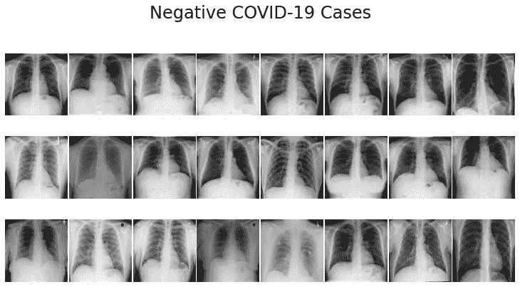
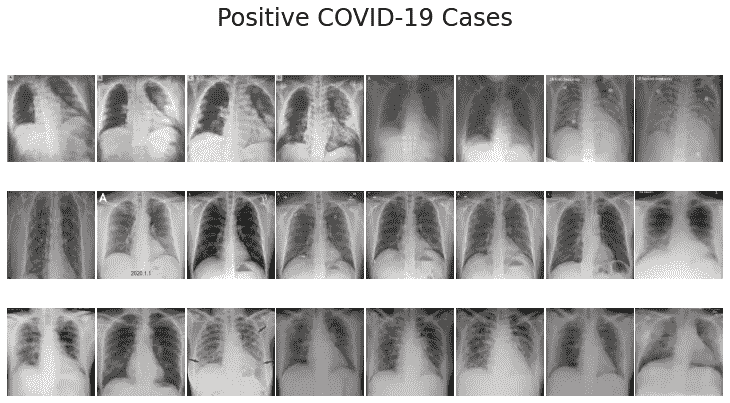
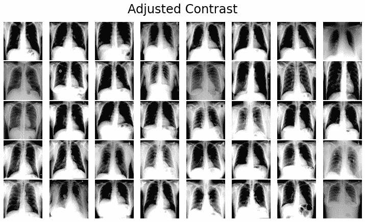
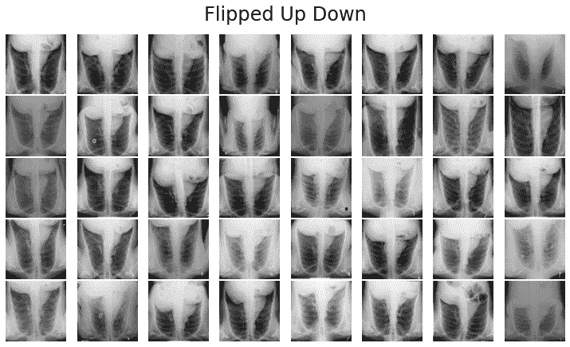
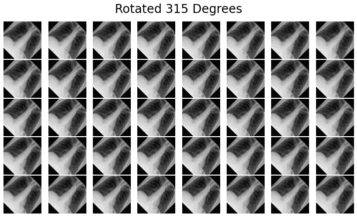
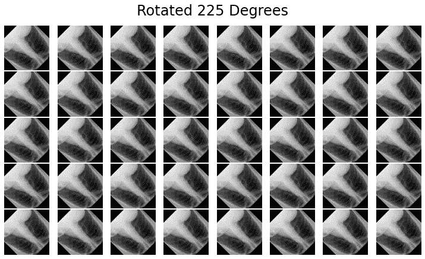
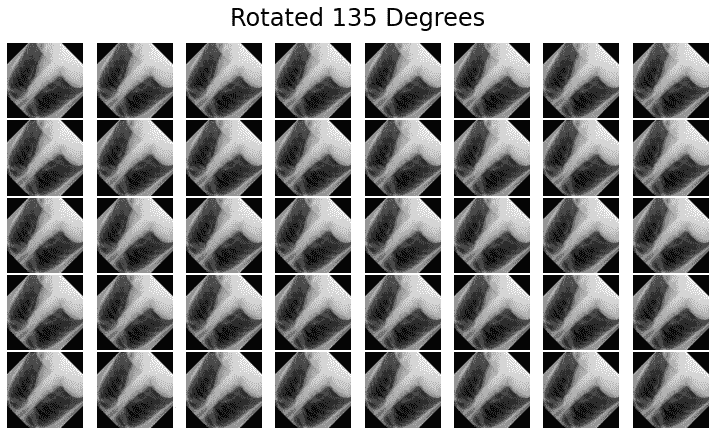
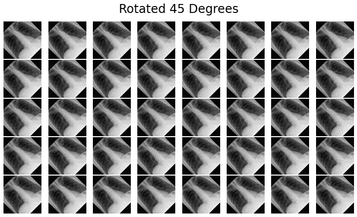

# 深入医学成像:X 射线图像增强

> 原文：<https://medium.com/mlearning-ai/dive-into-medical-imaging-image-augmentation-approach-4cfad0f306e3?source=collection_archive---------0----------------------->

在我研究生涯的早期，我必须为基于人工智能(AI)的医学成像研究做出重大贡献，从那时起，我的医学成像之旅开始了。本文将讨论医学图像增强的理论和实际实现。

**探索这篇文章后你会知道什么？**

*   用于医学成像的人工智能
*   医学图像增强背后的理论
*   新冠肺炎图像数据集上的实际实现



**Figure 1: Sample dataset for experimenting (Covid-19 based medical image data)**

> 让我们深入数据驱动的世界

有了科技的兴起，工种也在不断变化；举个例子，如果我们看的稍微好一点，就会观察到人工智能的应用越来越无处不在。

做 *你知道现在的电脑有多强大吗？*🤨 🤨 🤨

计算机现在正成为一种强有力的武器，它在医疗领域有潜在的应用。在医疗保健领域的研究中，已经发现了几种高级算法，可以读取硬图像，如 X 射线、CT 扫描等。我们不必过于依赖医生，因为人工智能的应用使我们的生活变得更加轻松。先说医学影像的 AI。

> **用于医学成像的人工智能**

人工智能(AI)在诊断医学成像中的应用正在经历彻底的考虑。例如，计算机辅助算法可以检查 x 射线和其他图像中指示肺炎的不透明迹象，然后提醒医生潜在的诊断，以便在怀疑有气胸时更快地进行治疗，人工智能可以帮助识别高风险个体，特别是在放射科医生不在场的情况下。

> 医学图像增强背后的理论

为了深入研究图像增强，需要了解我们在处理医学图像数据时可能会遇到的挑战。更简单地说，查找医学图像数据相对困难，因此在这种情况下，可访问性是一个非常值得关注的问题。其次，获取大量的数据集是相当具有挑战性的，因为这种类型的敏感数据通常不公开。机器学习需要大量数据才能工作，这当然没错；否则，创建健壮的模型变得非常困难，并且如果医学图像数据是这种情况，那么数据大小必须增加。假设你有 1000 个图像数据，但不知何故如果能成功扩展到 2000 个样本，那就更有意思了吧？

**所以，图像增强就是这样一种方法，通过它你可以增加你的数据样本；通过这种方式，你将能够有效地训练你的机器学习模型。**

要使用深度学习方法获得准确的结果，需要大量的数据。可以通过各种方式来扩充图像，以扩大数据集和样本大小。在处理关键医学图像时，这是一个非常可靠的策略，因为在大多数情况下，如果数据量不足，模型的准确性不会提高。除了减少过度拟合，增强还可以提高您提出的模型的精度。

> 新冠肺炎图像数据集上的实际实现

**步骤 01:克隆新冠肺炎图像数据集**

```
!git clone https://github.com/casperbh96/COVID-19-Detection.git dataset
```

**步骤 02:导入基本库**

```
import pandas as pdimport matplotlib.pyplot as plt%matplotlib inlineimport numpy as npimport cv2, timeimport tensorflow as tftf.__version__
```

**步骤 03:加载新冠肺炎数据集**

```
covid_path = 'dataset/covid_dataset.csv'covid_image_path = 'dataset/covid_adjusted/'normal_path = 'dataset/normal_xray_dataset.csv'normal_image_path = 'dataset/normal_dataset/'covid_df = pd.read_csv(covid_path, usecols=['filename', 'finding'])normal_df = pd.read_csv(normal_path, usecols=['filename', 'finding'])normal_df = normal_df.head(99)covid_df.head()
```

现在，我们将执行一些额外的工作

```
covid_images = []covid_labels = []for index, row in covid_df.iterrows():filename = row['filename']label = row['finding']path = covid_image_path + filenameimage = cv2.imread(path)image = cv2.cvtColor(image, cv2.COLOR_BGR2RGB)covid_images.append(image)covid_labels.append(label)normal_images = []normal_labels = []for index, row in normal_df.iterrows():filename = row['filename']label = row['finding']path = normal_image_path + filename# temporary fix while we preprocess ALL the imagesif filename == '4c268764-b5e5-4417-85a3-da52916984d8.jpg':breakimage = cv2.imread(path)image = cv2.cvtColor(image, cv2.COLOR_BGR2RGB)normal_images.append(image)normal_labels.append(label)# normalize to interval of [0,1]covid_images = np.array(covid_images) / 255# normalize to interval of [0,1]normal_images = np.array(normal_images) / 255
```

**步骤 04:我们必须创建一个可视化图像的函数**

```
def plot_images(images, title):nrows, ncols = 3, 8figsize = [10, 6]fig, ax = plt.subplots(nrows=nrows, ncols=ncols, figsize=figsize, facecolor=(1, 1, 1))for i, axi in enumerate(ax.flat):axi.imshow(images[i])axi.set_axis_off()plt.suptitle(title, fontsize=24)plt.tight_layout(pad=0.2, rect=[0, 0, 1, 0.9])plt.show()plot_images(covid_images, 'Positive COVID-19 Cases')plot_images(normal_images, 'Negative COVID-19 Cases')
```

**执行步骤 04 后，您将会看到以下图像→**


**Figure 2: Negative and Positive Covid-19 cases images**

**步骤 05:将数据集分成测试和训练**

```
from sklearn.model_selection import train_test_splitfrom sklearn.preprocessing import LabelBinarizerfrom tensorflow.keras.utils import to_categorical# split into training and testingcovid_x_train, covid_x_test, covid_y_train, covid_y_test = train_test_split(covid_images, covid_labels, test_size=0.2)normal_x_train, normal_x_test, normal_y_train, normal_y_test = train_test_split(normal_images, normal_labels, test_size=0.2)X_train = np.concatenate((normal_x_train, covid_x_train), axis=0)X_test = np.concatenate((normal_x_test, covid_x_test), axis=0)y_train = np.concatenate((normal_y_train, covid_y_train), axis=0)y_test = np.concatenate((normal_y_test, covid_y_test), axis=0)# make labels into categories - either 0 or 1y_train = LabelBinarizer().fit_transform(y_train)y_train = to_categorical(y_train)y_test = LabelBinarizer().fit_transform(y_test)y_test = to_categorical(y_test)
```

**步骤 06:** 在这个阶段，我们将创建一些函数来增强我们的新冠肺炎图像。如你所知，在图像增强方面可以找到几种传统的方法。尽管如此，在这篇文章中，对比度，饱和度，上下翻转和旋转已经被考虑，因为这些是最常用的方法。

**方法 01:对比**

```
X_train_contrast = []for x in X_train:contrast = tf.image.adjust_contrast( x, 2 ) #It takes two parameter: Images and constrast_factor.#Images:Images to adjust. At least 3-D.#Constrast_factor:A float multiplier for adjusting contrast.X_train_contrast.append(contrast.numpy())plot_images(X_train_contrast, 'Adjusted Contrast')
```

**执行方法 01 后，您将观察到以下图像→**



**Figure 3: Applying the image augmentation approach, e.g. Contrast**

方法 02:饱和度

```
X_train_saturation = []for x in X_train:saturation = tf.image.adjust_saturation( x, 3 )X_train_saturation.append(saturation.numpy())plot_images(X_train_saturation, 'Adjusted Saturation')
```

**执行方法 02 后，您将观察到以下图像→**


**Figure 4: Performing the image augmentation approach, e.g. Saturation**

**方法 03:上下翻转**

```
X_train_flipped_up_down = []for x in X_train:flipped = tf.image.flip_up_down(x)X_train_flipped_up_down.append(flipped.numpy())plot_images(X_train_flipped_up_down, 'Flipped Up Down')
```



**Figure 5: Visualizing the augmented images, e.g. Flipped up-down**

**方法 04:** 应用旋转技术。这里我考虑过 45 度，135 度，225 度，315 度。

```
import tensorflow_addons as tfafrom math import radiansX_train_rot_45_deg = []X_train_rot_135_deg = []X_train_rot_225_deg = []X_train_rot_315_deg = []for x in X_train:deg_45 = tfa.image.transform_ops.rotate(image, radians(45))deg_135 = tfa.image.transform_ops.rotate(image, radians(135))deg_225 = tfa.image.transform_ops.rotate(image, radians(225))deg_315 = tfa.image.transform_ops.rotate(image, radians(315))X_train_rot_45_deg.append(deg_45)X_train_rot_135_deg.append(deg_135)X_train_rot_225_deg.append(deg_225)X_train_rot_315_deg.append(deg_315)plot_images(X_train_rot_45_deg, 'Rotated 45 Degrees')plot_images(X_train_rot_135_deg, 'Rotated 135 Degrees')plot_images(X_train_rot_225_deg, 'Rotated 225 Degrees')plot_images(X_train_rot_315_deg, 'Rotated 315 Degrees')
```



**Figure 6: Visualizing the augmented images, e.g. Rotated 135 degrees, 45 degrees, 225 degrees and 315 degrees**

总之，本文展示了医学图像增强背后的理论和实际实现。为了进行实验，我们采用了新冠肺炎图像数据集，并解释了如何增强医学图像。我坚信这篇文章中提供的信息对那些想在医疗保健行业开始工作的人非常有帮助。

**从我的 Github 库找到源代码:**

[](https://github.com/eliashossain001/Medium/blob/main/ImageAugmentation.ipynb) [## Medium/image augmentation . ipynb at main eliashossain 001/Medium

### 生物医学成像方面的实验源代码

github.com](https://github.com/eliashossain001/Medium/blob/main/ImageAugmentation.ipynb) 

**参考文献**

1.  Shorten，c .，& Khoshgoftaar，T. M. (2019 年)。面向深度学习的图像数据增强综述。*大数据杂志*， *6* (1)，1–48。
2.  n . s . punn 和 s . Agarwal(2021 年)。使用微调深度神经网络利用有限的后前胸部 X 射线图像自动诊断新冠肺炎。*应用智能*， *51* (5)，2689–2702。

**到→** 找我

https://www.researchgate.net/profile/Elias-Hossain-2

领英:[https://www.linkedin.com/in/elias-hossain-b70678160/](https://www.linkedin.com/in/elias-hossain-b70678160/)