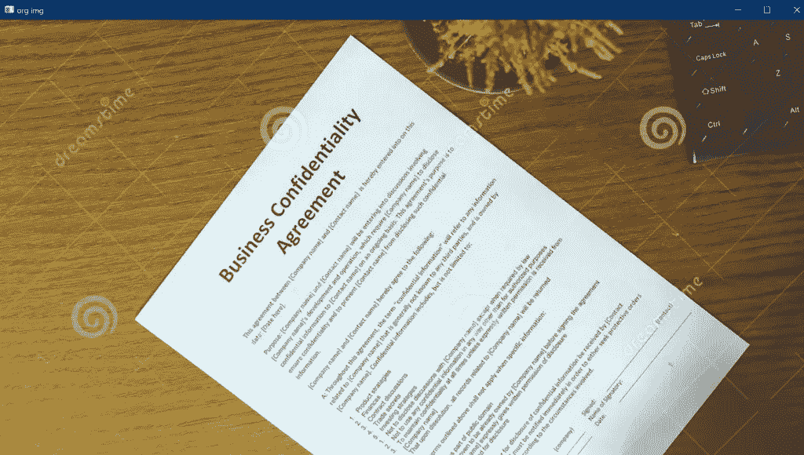
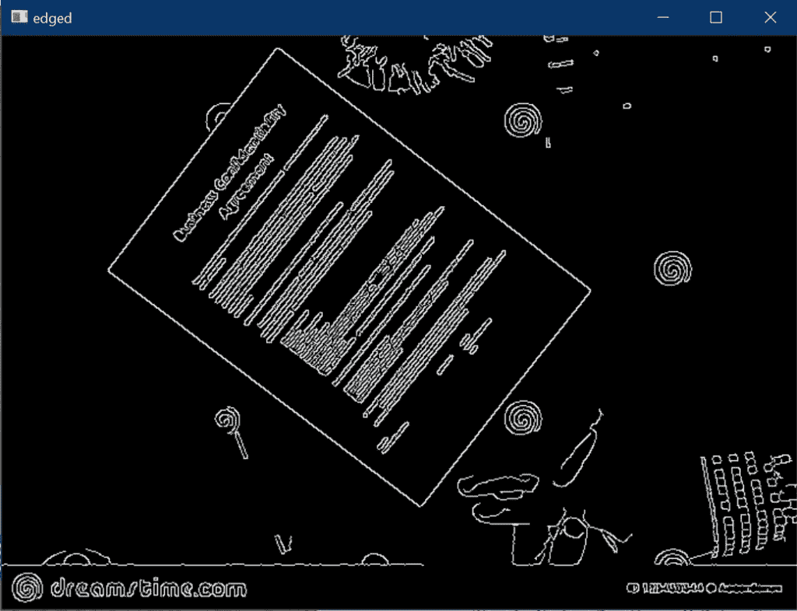
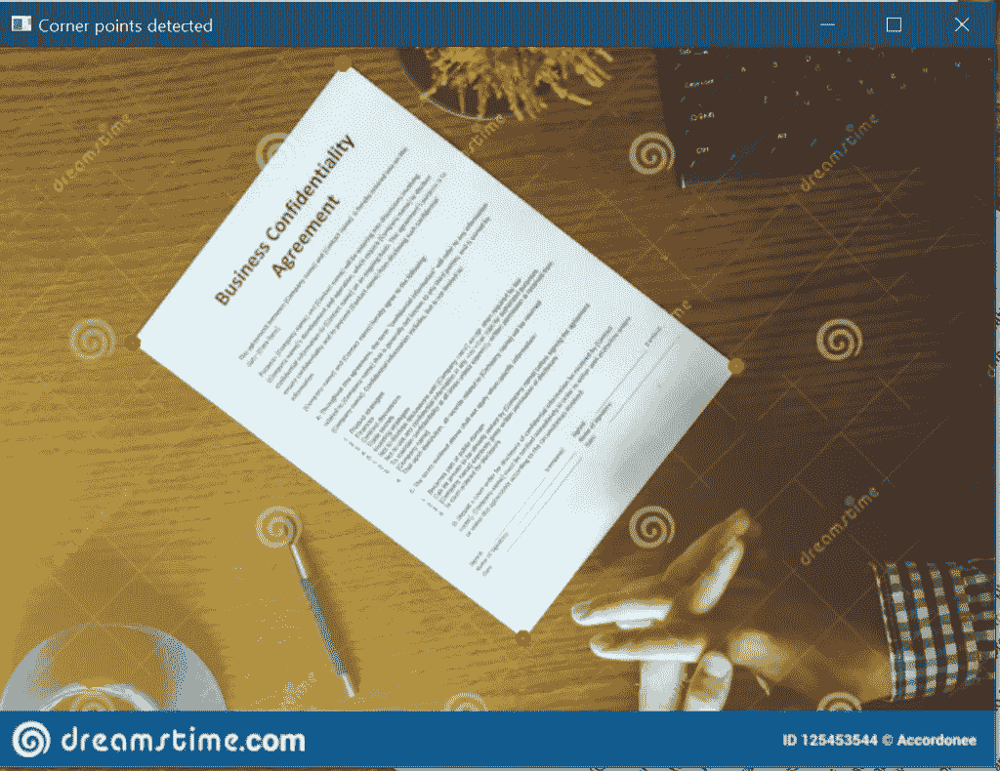
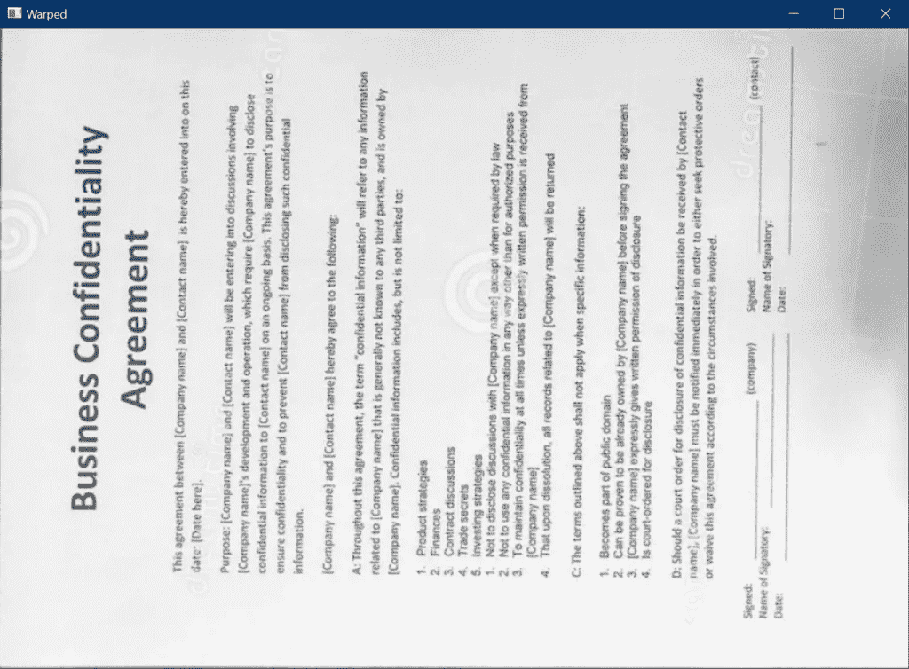

# 使用 OpenCV 的文档扫描仪——带源代码——简单易行

> 原文：<https://medium.com/mlearning-ai/document-scanner-using-opencv-with-source-code-easiest-way-e0543e1f3a72?source=collection_archive---------3----------------------->

所以，伙计们，在今天的博客中，我们将看到如何使用 OpenCV 构建一个非常简单而强大的文档扫描仪。这是我最喜欢的项目之一，因为它简单而强大。所以没有任何进一步的原因。

**在这里阅读带源代码的整篇文章—**[https://machine learning projects . net/document-scanner-using-opencv/](https://machinelearningprojects.net/document-scanner-using-opencv/)


# 让我们开始吧…

## 使用 OpenCV 的文档扫描仪的代码…

```
import cv2
import imutils
from skimage.filters import threshold_local
from pyimagesearch.transform import four_point_transform
import numpy as np

img_path = 'b.jpg'
big_img = cv2.imread(img_path)
cv2.imshow('org img',big_img)
cv2.waitKey(0)

ratio = big_img.shape[0] / 500.0
org = big_img.copy()
img = imutils.resize(big_img, height = 500)
cv2.imshow('resizing',img)
cv2.waitKey(0)

gray_img = cv2.cvtColor(img.copy(),cv2.COLOR_BGR2GRAY)
blur_img = cv2.GaussianBlur(gray_img,(5,5),0)
edged_img = cv2.Canny(blur_img,75,200)
cv2.imshow('edged',edged_img)
cv2.waitKey(0)

cnts,_ = cv2.findContours(edged_img.copy(),cv2.RETR_LIST,cv2.CHAIN_APPROX_SIMPLE)
cnts = sorted(cnts,key=cv2.contourArea,reverse=True)[:5]
for c in cnts:
    peri = cv2.arcLength(c,True)
    approx = cv2.approxPolyDP(c,0.02*peri,True)
    if len(approx)==4:
        doc = approx
        break

p=[]
for d in doc:
    tuple_point = tuple(d[0])
    cv2.circle(img,tuple_point,3,(0,0,255),4)
    p.append(tuple_point)
cv2.imshow('Corner points detected',img)
cv2.waitKey(0)

warped = four_point_transform(org, doc.reshape(4, 2) * ratio)
warped = cv2.cvtColor(warped, cv2.COLOR_BGR2GRAY)
cv2.imshow("Warped", imutils.resize(warped, height = 650))
cv2.waitKey(0)

T = threshold_local(warped, 11, offset = 10, method = "gaussian")
warped = (warped > T).astype("uint8") * 255
cv2.imshow("Scanned", imutils.resize(warped, height = 650))
cv2.waitKey(0)
cv2.destroyAllWindows()
```

*   第 1–5 行—导入所需的库。
*   第 7–10 行—读取并显示输入图像。



*   第 13 行——通过将我们的图像高度除以 500 得到比率。我们将在流程中进一步使用该比率。
*   第 14 行—制作原始图像的副本。
*   第 15–17 行—调整图像大小，高度设为 500，保持纵横比不变。


*   第 20 行——这里我们将 BGR 图像转换成灰度图像。
*   第 21 行——这里我们使用[高斯模糊](https://en.wikipedia.org/wiki/Gaussian_blur#:~:text=In%20image%20processing%2C%20a%20Gaussian,image%20noise%20and%20reduce%20detail.)来去除图像中的高斯噪声。
*   第 22 行——在这一步，我们简单地使用 [Canny 边缘检测](https://docs.opencv.org/3.4/da/d22/tutorial_py_canny.html)在图像中找到边缘。
*   第 23 -24 行—显示图像。



*   第 27 行—查找图像中的所有轮廓
*   第 28 行-根据等高线面积对等高线进行降序排序，只取前 5 行。
*   第 29–34 行—遍历轮廓并使用 [cv2.approxPolyDP()](https://docs.opencv.org/4.5.2/d3/dc0/group__imgproc__shape.html#ga0012a5fdaea70b8a9970165d98722b4c) 找到具有 4 条边的轮廓。
*   第 37–43 行—我们只是在文档的角上画点/圈。这些是我们在轮廓检测步骤中使用 [CHAIN_APPROX_SIMPLE](https://docs.opencv.org/3.4/d4/d73/tutorial_py_contours_begin.html) 方法得到的点。



*   第 46–49 行——我们正在对图像应用[四点变换](https://www.pyimagesearch.com/2014/08/25/4-point-opencv-getperspective-transform-example/)。这意味着我们将只从图像中提取文档。或者我们也可以说，我们只想提取四个点组成的矩形。



*   第 52–55 行—对图像进行阈值处理，给它一种黑白的感觉。


*   第 56 行—销毁所有打开的窗口。

如果对使用 OpenCV 的文档扫描仪有任何疑问，请通过电子邮件或 LinkedIn 联系我。

**如需进一步的代码解释和源代码，请访问此处**—[https://machine learning projects . net/document-scanner-using-opencv/](https://machinelearningprojects.net/document-scanner-using-opencv/)

*这就是我写给这个博客的全部内容，感谢你的阅读，我希望你在阅读完这篇文章后，能有所收获，直到下一次👋…*

***看我以前的帖子:*** [***人脸地标检测使用 DLIB***](https://machinelearningprojects.net/face-landmarks-detection-using-dlib/)

**查看我的其他** [**机器学习项目**](https://machinelearningprojects.net/machine-learning-projects/)**[**深度学习项目**](https://machinelearningprojects.net/deep-learning-projects/)**[**计算机视觉项目**](https://machinelearningprojects.net/opencv-projects/)**[**NLP 项目**](https://machinelearningprojects.net/nlp-projects/)**[**烧瓶项目**](https://machinelearningprojects.net/flask-projects/) **at**********

****[](/mlearning-ai/mlearning-ai-submission-suggestions-b51e2b130bfb) [## Mlearning.ai 提交建议

### 如何成为 Mlearning.ai 上的作家

medium.com](/mlearning-ai/mlearning-ai-submission-suggestions-b51e2b130bfb)****