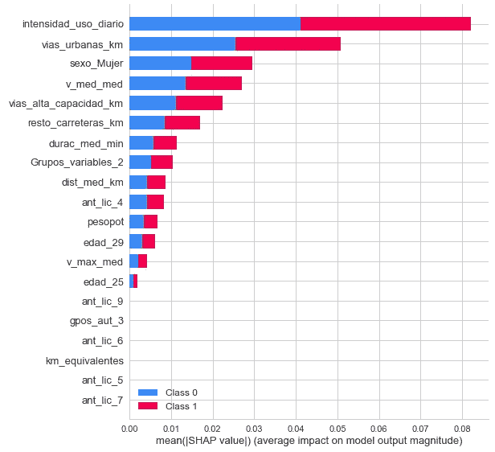
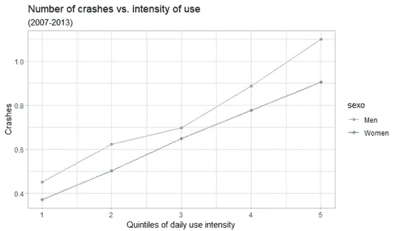
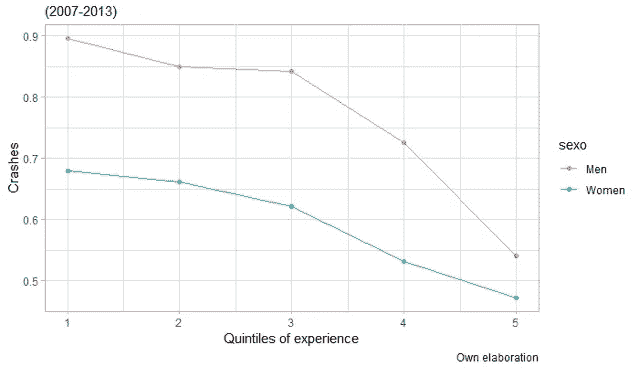
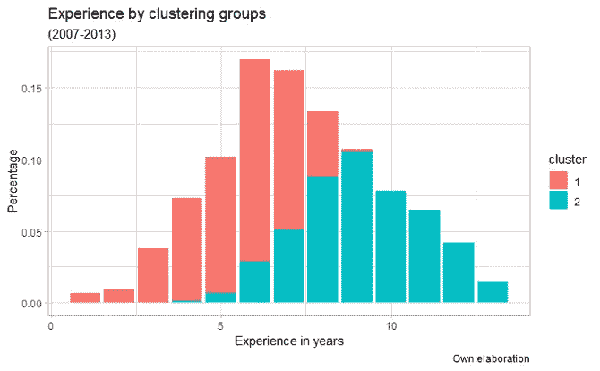
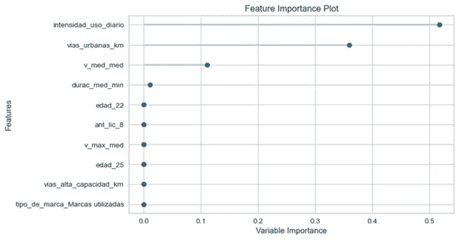

# 通过机器学习技术的驱动程序剖析

> 原文：<https://medium.com/mlearning-ai/driver-profiling-through-machine-learning-techniques-abbbde8942d5?source=collection_archive---------1----------------------->

**项目:**【https://github.com/octadelsueldo/TFM_Driver_Profiling 

**作者:**

奥克塔维奥·德尔·苏埃尔多

[何塞·洛佩兹](http://linkedin.com/in/joselopezgaldon)

**主管:**

[胡安·曼努埃尔·洛佩斯·扎弗拉博士](http://linkedin.com/in/jmlopezzafra)

**摘要:**就经济和社会而言，交通事故给保险公司和社会带来了高昂的成本，因为在所有情况下，这些成本都包括医疗和康复费用、法律和紧急服务、财产损失和生产损失。多亏了远程信息技术和数据科学的使用，我们也许能够找到解释这些说法的行为模式。在本次研究中，我们将使用包含超过 95，000 名驾驶员的数据库，其中包括 6 年来收集的信息；为此，我们进行了一项重要的变量清理和工程工作，最终通过 PAM 对驾驶员进行聚类，作为最具代表性的变量，包括车辆使用强度和驾驶体验。此外，我们还使用决策树基于他们是否遭遇过崩溃进行了预测，获得了 72.25%的准确率。

> *“在解释碰撞时，我们强调使用强度和体验是最具决定性的变量”*

**1。简介**

保险是保护个人免受风险后果的有效方法。它的基础是将风险转移给保险人，由保险人负责赔偿事故发生所造成的全部或部分损失。公平的价格将准确反映被保险人的实际风险，否则该业务可能在客户组合中出现问题，因为那些风险较小的客户最终会支持那些风险较大的客户，这会导致损失率较低的客户流失和损失率较高的客户进入。[1–4]

这直接损害了保险公司、投保人以及社会。因此，精算师使用与风险相关的信息，即他们使用那些为保险费计算建立风险模型的因素，以便他们可以根据预期损失构建排名表。

就汽车而言，确定风险状况的传统变量是个人特征、索赔历史和车辆特征。然而，由于这些因素与实际驾驶风险没有直接的因果关系，因此在实践中，保费通常是不准确的。

由于网络、连接和物联网的发展，UBI(基于使用的保险)产品在保险公司中越来越受欢迎。这种保险产品模式的基础是被称为“现收现付”(PAYD)和“现收现付”(PHYD)的计划；保险费的确定是基于由驾驶员的实际数据确定的变量，如驾驶时间、行驶距离、行驶道路类型、速度等。[5–7]

由于这些技术的使用，好处是双重的，因为被保险人获得了更符合其行为的价格，因此事故率较低的司机不会受到处罚，另一方面，保险公司可以有效地提高保险价格的准确性。此外，UBI 产品鼓励司机少开车或改善驾驶习惯，因为他们可以从动态保费的使用中受益。

这与数据科学的使用相结合，使得挖掘设备收集的信息成为可能，因此保险公司可以微调他们的风险模型。保险公司可以模拟司机的行为，因此能够根据过去发生的事情预测未来的索赔。

根据对该主题的研究，如 Ryan 等人(1998)[8–11]，年轻司机是事故发生率最高的人，这就是为什么我们将重点关注这类司机，特别是 18 至 30 岁的司机。

正如我们已经提到的，我们研究的主要目标是根据年轻驾驶员的驾驶特征、驾驶员信息，如年龄和车辆质量(功率、重量等)对其进行细分。).这种分段(无监督算法)将有助于使用决策树(有监督算法)对驾驶员进行分类，基于他们的事故率，我们将使用碰撞(减速超过 4G)的代理。

**2。项目目标**

*数据库清理

*基本变量的识别。

*识别驾驶员群体和行为模式

*通过分类树进行预测。

*记分卡提案。

**3。分析**

**3.1。探索性数据分析**

首先，我们对数据库进行探索性分析，以发现可能的数据质量问题。

**3.2。特征工程**

一旦这个阶段完成了，我们就从特征工程开始。第一件事是对空值进行插补(对每个变量进行了单独研究)。我们还进行了变量转换，改变了测量单位，例如从米到公里。同样，我们删除了我们认为与分析不相关的变量，这或者是由于对业务的了解，或者是由于与其他变量的多重共线性。此外，我们还创造了新的变量，这些变量对于解释我们的无监督聚类模型至关重要，例如车辆使用的强度。在本节中，我们还将目标变量定义为一个虚拟变量，如果没有崩溃，该变量的值为 0；如果有崩溃，该变量的值为 1。最后，考虑到工作的目标，我们过滤了我们的数据库，只保留那些 18 到 30 岁之间的年轻司机，以及那些至少有 60 次注册和 30 天使用该产品的司机。

**3.3。相关变量**

在随后的步骤中，我们对工程阶段已经过滤的数据进行了探索性分析，目的是获得对这些驱动因素行为的见解。由于这一点，我们能够确定车辆使用的强度与车祸的数量有关。作为使用强度最高的司机，也是发生车祸最多的司机。此外，驾驶经验是解释车祸数量的另一个变量，因此经验不足的司机是最容易发生车祸的人。经过这些分析，我们研究了性别变量，我们可以得出结论，男性比女性有更高的事故率。

Number of crashes vs intensity of use by sex

Crashes vs. experience quintiles by gender

**3.4。聚类**

一旦确定了最相关的变量，我们就使用欧几里德距离通过 PAM 进行聚类。为此，我们通过肘规则确定了最佳组数，结果是两个组为最佳组数。分割数据集，我们已经获得了 0.25 的轮廓和通过其特征很好地区分的两组。第一类对应于平均年龄不到 25 岁、驾驶经验接近 5 年的年轻驾驶员。这些司机每天使用车辆的次数更多，因此他们面临的风险更大，这导致这一群体的撞车率更高。另一方面，第二组由最有经验的驾驶员组成，他们的平均年龄接近 29 岁，平均经验超过 9 年。在这种情况下，由于学习因素，司机发生车祸的次数更少，每天使用车辆的次数也更少，因此他们更少受到车祸的影响。

Experience by clustering groups

**3.5。使用决策树进行预测**

这就是我们将利用车手群体和他们的素质来预测他们是否会撞车的地方。我们使用了决策树，因为对于没有算法技术知识的人来说，它是最容易解释的模型之一。一旦我们的环境在 PyCaret 中初始化，我们就已经定义了初始叶子的数量，我们应该用这种方式来处理决策树，以使我们能够获得尽可能高的精度。同样，我们已经调整了我们的模型，使我们能够更好地分类那些在我们的数据集中发生崩溃的驱动程序，因为由于类别不平衡，我们的模型可以很好地分类零，但不考虑我们模型的一，因此我们所做的是根据业务需求为每个分类器分配不同的权重。这是我们为那些真正的积极因素分配 4000 欧元利润的地方，也就是说，那些我们预测为崩溃和实际上崩溃的因素，因为如果我们能够识别它们，我们可以向这些司机收取更高的溢价。另一方面，我们将为那些被确定为没有撞车和实际上没有撞车的司机分配 2500 欧元的奖励，因为我们将奖励他们良好的驾驶，但同时我们将节省资金，因为他们不会为我们提供良好的驾驶习惯的额外费用。假阴性的成本为 3，000 欧元，因为他们是我们在他们为阳性时识别为阴性的驱动因素，也就是说，我们将对他们收取更少的费用，他们也会崩溃，所以他们是我们想要避免的驱动因素。至于误报，我们将对他们收取 1000 欧元的费用，因为我们将向他们收取比他们应该收取的更多的费用，而且他们也不会有驾驶事故，所以他们很可能会在市场上找到其他替代方案，并参加我们将停止收取这些额外费用的竞争。完成后，我们取得了比第一个模型更好的结果。我们在准确性和精确度方面降低了大约 4 个百分点，但我们提高了召回率和 F1 分数，因为现在我们在模型中捕获了更多的问题，召回率从 0.02 降至 0.219，而 F1 分数从 0.04 降至 0.2738。这使我们得出结论，通过根据业务的相对需求将成本添加到每个分类器，我们可以胜过我们的基本模型。

Feature importance plot

**4。结论**

在对 2007 年至 2013 年期间超过 5400 万次出行的 95，000 多名司机和 45 个变量进行详尽研究后，我们可以得出结论，有一些变量可以解释 18 至 30 岁司机的事故率，这些变量决定了驾驶行为、车辆特征和司机属性，如年龄、经验或性别。在这些变量中，我们强调驾驶经验或使用强度，事实是，使用强度越大，事故率越高，这是有道理的，因为被保险人更容易受到事故的影响，所以从概率上讲，他应该有更多的撞车事故，经验在解释撞车事故时也是决定性的，经验越少，撞车事故越多。在这两种情况下，性别之间的关系也被研究，男性总是比女性更容易发生事故。由于识别了这些变量，我们使用 Medoids (PAM)周围的分区对导体进行了分割。在研究了组的最佳数量后，我们确定 2 是使用肘方法最大化聚类轮廓的组。使用欧几里德距离，我们获得 0.25 的平均轮廓和相似大小的两组:

*第一组:他们是较年轻、资历较浅的司机；平均速度和最大速度略低于第一组；但是使用强度高于平均水平，差不多一天 3 趟。最后，他们的事故率高于平均水平

*第二组:这些是最有经验的老司机，平均和最大速度较高；一个可能的解释来自于这样一个事实，即他们倾向于在开阔的道路上以比在城市循环中更高的强度驾驶。使用强度(如上所述，定义为驾驶员每天使用汽车的次数)略低于另一组。最后，这一组的事故率(以碰撞来衡量)低于第二组。

使用由无监督算法提供的信息，我们对会或不会崩溃的用户进行分类预测。为此，我们使用决策树，这是因为它是没有技术知识的人最容易理解的模型之一。优化算法后，我们获得了以下指标

*精确度:72.25

* AUC: 61.64

*召回:21.9

*精确度:36.40

* F1-得分:27.38

为了实现这些结果，我们在我们的算法中为每个可能的分类器分配了不同的权重，也就是说，假阴性将不会与真阳性具有相同的权重，因为它们将是我们视为低风险驾驶员的那些人，当它们在未来崩溃时，向它们收取低溢价。除了这些结果之外，一个最重要的结论，加强了我们最初的假设，就是对这棵树来说最重要的变量是车辆使用的强度。

**参考文献**

1.张，洪，徐，李，程，陈，魏，赵，谢(2017)。基于 UBI 的驾驶行为模型和车险定价因素的大数据研究。电气工程课堂讲稿，404–411。https://doi.org/10.1007/978-981-10-7521-6_49

2.马艳玲，朱晓霞，胡晓霞，邱燕春(2018)。环境敏感保险远程信息处理数据在汽车保险费率制定中的应用。运输研究 A 部分:政策与实践，113，243–258。【https://doi.org/10.1016/j.tra.2018.04.013 

3.萨拉比亚，J. M .，彼尔托，f .，约尔达，v .，&斯珀里奇，S. (2020)。关于将机器学习与统计建模结合用于金融数据分析的注释。风险，8(2)，32。[https://doi.org/10.3390/risks8020032](https://doi.org/10.3390/risks8020032)

4.汽车保险定价的机器学习和预测建模。

5.黄，杨，孟，S. (2019)。基于车载行驶数据的车险分类费率厘定。决策支持系统。[https://doi.org/10.1016/j.dss.2019.113156](https://doi.org/10.1016/j.dss.2019.113156)

6.Bordoff 和 p . Noel(2010 年)。现收现付汽车保险。今日问题:100 篇关于气候、能源、环境、交通和公共卫生政策的评论，150。

7.Bolderdijk，j .，Knockaert，j .，Steg，e .，& Verhoef，E. (2011 年)。现收现付车辆保险对年轻驾驶员速度选择的影响:荷兰实地试验的结果。事故分析与预防，43(3)，1181–1186。[https://doi.org/10.1016/j.aap.2010.12.032](https://doi.org/10.1016/j.aap.2010.12.032)

8.瑞安，g .，莱格，m .，，罗斯曼，D. (1998)。驾驶员碰撞风险和碰撞类型的年龄相关变化。事故分析与预防，30(3)，379–387。[https://doi . org/10.1016/s 0001-4575(97)00098-5](https://doi.org/10.1016/s0001-4575(97)00098-5)

9.年轻司机的生活方式和事故。(1994 年，1 junio)。科学指导。[https://linking hub . Elsevier . com/retrieve/pii/0001457594900035](https://linkinghub.elsevier.com/retrieve/pii/0001457594900035)

10.麦金，硕士和桑基，K. S. (2008)。年轻驾驶员的个性特征、风险认知和驾驶行为之间的关系。事故分析与预防，40(2)，541–547。[https://doi.org/10.1016/j.aap.2007.08.010](https://doi.org/10.1016/j.aap.2007.08.010)

11.特伦克尔大学、格劳大学和梅特克尔大学(1990 年)。年轻驾驶员的风险认知和特定年龄事故。事故分析与预防，22(2)，119–125。[https://doi . org/10.1016/0001-4575(90)90063-q](https://doi.org/10.1016/0001-4575(90)90063-q)

12.帕蒂尔，P. (2018 年 7 月 7 日)。*什么是探索性数据分析？—走向数据科学*。中等。[https://towards data science . com/explorative-data-analysis-8 fc 1 CB 20 FD 15](https://towardsdatascience.com/exploratory-data-analysis-8fc1cb20fd15)

13.c .里德·特纳、a .富盖塔、l .拉瓦扎和 A. L .沃尔夫(1999 年 b)。特征工程的概念基础。系统与软件杂志，49(1)，3–15。[https://doi . org/10.1016/s 0164-1212(99)00062-x](https://doi.org/10.1016/s0164-1212(99)00062-x)

14.Renç beroğ lu，E. (2019，3 abril)。机器学习的特征工程基本技术。中等。[https://towards data science . com/feature-engineering-for-machine-learning-3a5e 293 a 5114](https://towardsdatascience.com/feature-engineering-for-machine-learning-3a5e293a5114)

15.卡尔苏姆和哈利姆(2013 年)。基于数据流的驾驶特征聚类。英米克。已发布。[https://doi.org/10.1109/inmic.2013.6731330](https://doi.org/10.1109/inmic.2013.6731330)

16.b .希格斯和 m .阿巴斯(2013 年 10 月)。自然驾驶风格行为聚类的两步分割算法。第 16 届国际 IEEE 智能交通系统会议(ITSC，2013)(第 857-862 页)。IEEE。

17.哈纳菲博士和明博士(2021 年)。汽车保险大数据的机器学习方法。风险，9(2)，42。

18.轮廓:聚类分析解释和验证的图形辅助。(1987 年 11 月 1 日)。科学指导。[https://www . science direct . com/science/article/pii/0377042787901257](https://www.sciencedirect.com/science/article/pii/0377042787901257)

19.聚类验证度量的基于模型的评估。(2007 年 3 月 1 日)。科学指导。[https://www . science direct . com/science/article/ABS/pii/s 0031320306003104](https://www.sciencedirect.com/science/article/abs/pii/S0031320306003104)

20.Arora，p .，Deepali 和 Varshney，S. (2016 年 1 月 1 日)。面向大数据的 K-Means 和 K-Medoids 算法分析。科学方向，78。[https://www . science direct . com/science/article/pii/s 1877050916000971](https://www.sciencedirect.com/science/article/pii/S1877050916000971)

21.Chakure，A. (2020 年 11 月 6 日)。决策树分类——创业。中等。[https://medium . com/swlh/decision-tree-class ification-de 64 fc 4d AAC](/swlh/decision-tree-classification-de64fc4d5aac)

22.Moral-García，s .，Castellano，J. G .，Mantas，C. J .，Montella，a .，& Abellán，J. (2019 年)。城市新手驾驶员交通事故分析的决策树集成方法。熵，21(4)，360。

23.m . galarnyk(2021 年 1 月)。了解分类决策树(Python)。中等。[https://towards data science . com/understanding-decision-trees-for-class ification-python-9663d 683 c 952](https://towardsdatascience.com/understanding-decision-trees-for-classification-python-9663d683c952)

24.Rane，S. (2019 年 11 月 9 日)。SHAP:分析模型可解释性的可靠方法。中等。[https://towards data science . com/shap-a-reliable-way-to-analyze-your-model-inter ability-874294d 30 af 6](https://towardsdatascience.com/shap-a-reliable-way-to-analyze-your-model-interpretability-874294d30af6)

25.数据人。(2021 年 5 月 2 日)。用 SHAP 价值观解释你的模型——走向数据科学。中等。[https://towards data science . com/explain-your-model-with-the-shap-values-BC 36 AAC 4 de 3d](https://towardsdatascience.com/explain-your-model-with-the-shap-values-bc36aac4de3d)

*原载于 2021 年 7 月 28 日 https://www.octaviods.com***。**

* [## Mlearning.ai 提交建议

### 如何成为 Mlearning.ai 上的作家

medium.com](/mlearning-ai/mlearning-ai-submission-suggestions-b51e2b130bfb)*