# Einblick:描述性、预测性和规范性分析一体化工具

> 原文：<https://medium.com/mlearning-ai/einblick-descriptive-predictive-and-prescriptive-analytics-all-in-one-tool-79e70971a115?source=collection_archive---------4----------------------->

Einblick 是一款新的趋势分析工具，可让您通过所有三种类型的分析来洞察数据:描述性、预测性和规范性。Einblick 有助于为他们的营销活动、销售策略甚至雇佣新员工提供更好的决策见解。

Einblick 是麻省理工学院和布朗大学的副产品。

他们的价值主张很大胆。

> ***Einblick*** *是世界上第一个可视化数据计算平台，通过数据提供协作和更快的方法来采取行动。*

人们对该工具的兴趣一直在稳步增长

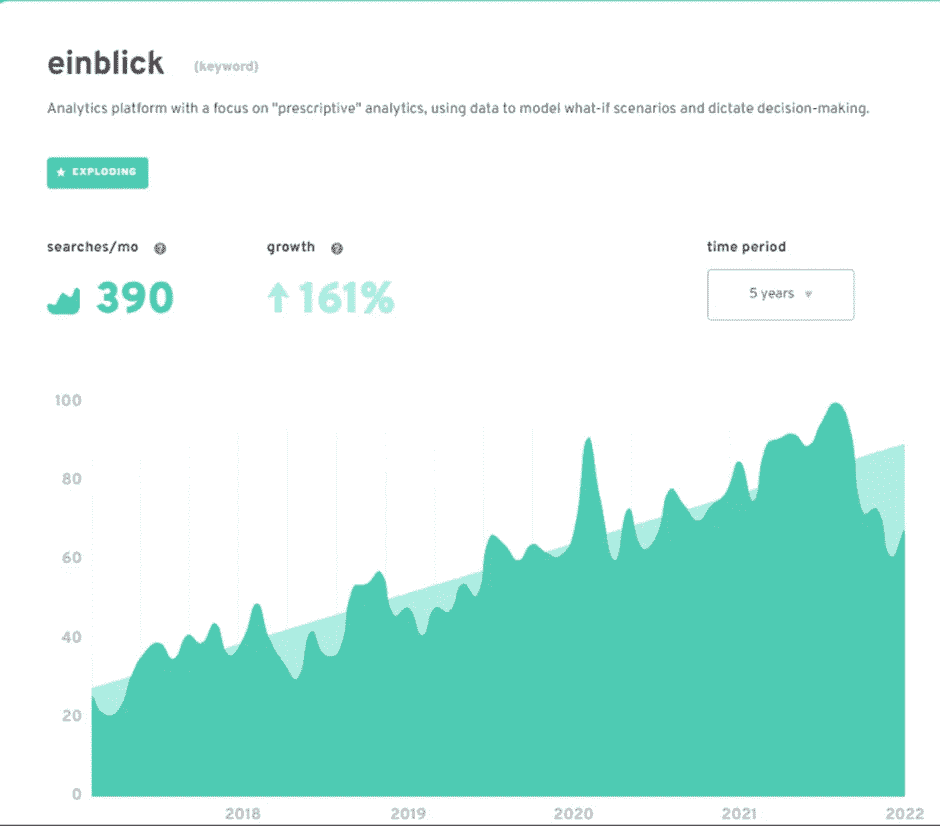

## **什么是描述性分析？**

描述性分析是指查看过去的数据并了解发生了什么的能力。这可能包括了解客户行为、销售趋势甚至网站流量。

## **什么是预测分析？**

预测分析是预测未来可能发生的事情的能力。例如，你的客户是否可能购买新产品，他们可能平均花费多少，甚至他们是否会打开你的电子邮件！

## **什么是规定性分析**

规范分析是预测分析的下一步。预测分析告诉你应该做什么。它可以为实现预期结果而采取的行动提供建议。

# **ein blick 如何将所有三种类型的分析整合到一个工具中**

Einblick 是一种数据分析工具，使用户能够将描述性、预测性和规范性分析结合到一个界面中。这使得用户可以轻松地全面了解他们的数据，并做出更好的决策。Einblick 还提供了多种功能，使专家和初学者都能轻松使用。这些功能包括拖放界面、自动数据准备和交互式可视化。Einblick 还具有快速和可伸缩性，非常适合大型数据集。

Einblick 在云中可用。这对各种规模的企业都有帮助，对专家和初学者都有好处。Einblick 提供免费试用版，这样公司可以先试用一下，然后再决定它是否适合自己。欲了解更多信息，请访问 Einblick 的网站。

# **使用高级分析工具分析贵公司历史记录和未来趋势数据的优势**

使用预测和说明性分析来分析来自公司历史记录和未来趋势的数据有几个好处。预测分析可以帮助您更好地了解客户及其行为，预测未来趋势并发现增长机会。它还可以帮助你在商业策略、产品开发和市场营销方面做出更明智的决策。

预测分析是帮助企业优化运营和提高利润的强大工具。公司需要保持领先，抓住新的机会。

# **从 Einblick 开始:视觉引导**

在写这篇文章之前，我第一次使用了 Einblick。

Einblick 提供多达 5 个工作空间和 100MB 数据的免费账户。不是很多，但足以开始。

我在创建我的帐户时遇到了一些小问题，并出现了一些错误。几天后我又试了一次，一切都很顺利。

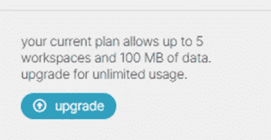

## **Einblick 接口**

用户界面简洁明了。

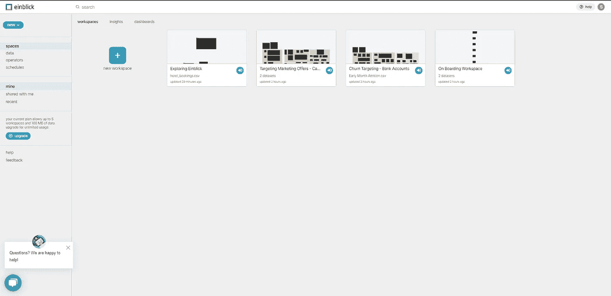

左手边是不同的项目和空间，还有数据集、操作符和时间表。

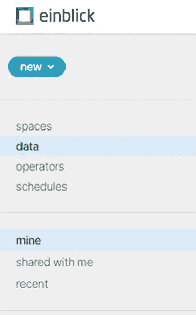

## **加载数据**

目前 Einblick 的连接器不多。然而，在上传数据界面，你会发现 CSV，SQL，亚马逊 S3 和谷歌表。

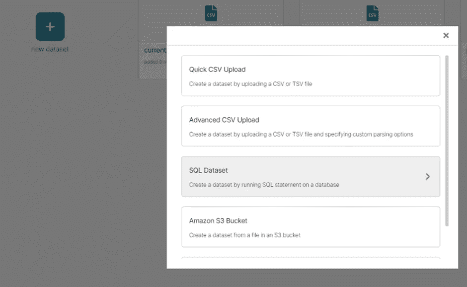

您可以使用预加载到 Einblick 中的数据集，但我上传了一个简单的酒店预订数据集，来自我的课程“[数据分析简介](https://data-analytics-strategy-school.teachable.com/p/introduction-to-business-analytics)”。

 [## 商业分析简介

### 我是一名问题解决者，在数据分析、业务战略和变革管理方面拥有丰富的经验。我有…

data-analytics-strategy-school.teachable.com](https://data-analytics-strategy-school.teachable.com/p/introduction-to-business-analytics) 

数据加载速度很快，字段解析正确。

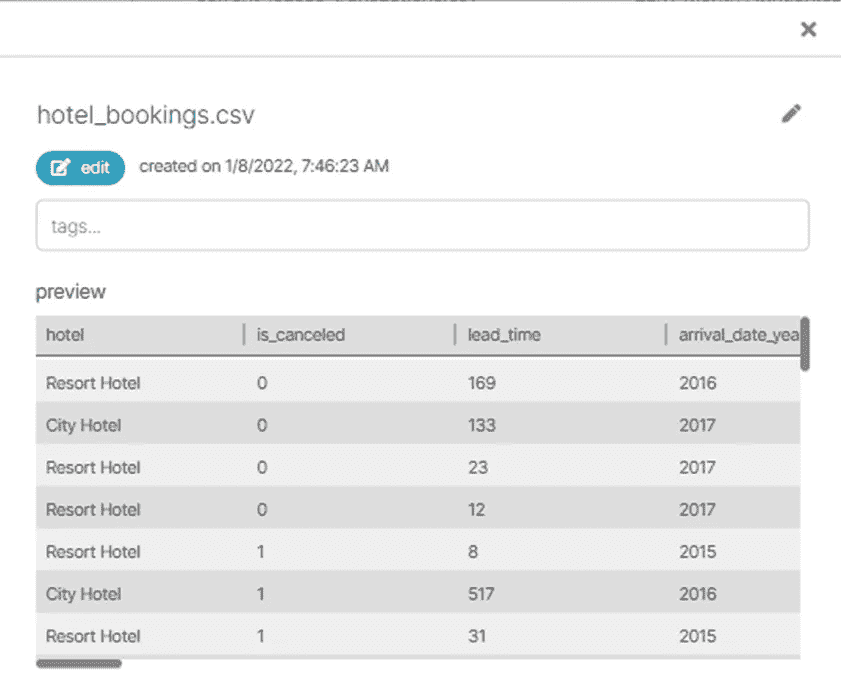

## **分析 Einblick 中的数据**

要开始探索数据，您需要创建一个工作空间。这是两次点击的问题。

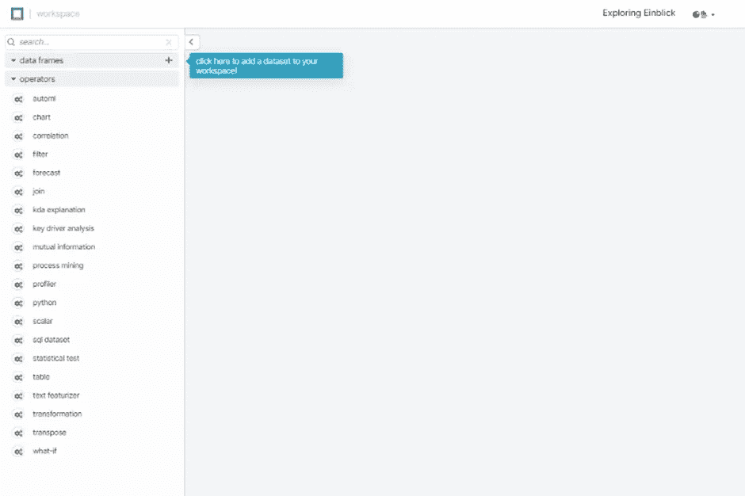

创建完成后，您将看到以下界面:

打开下拉数据框，找到您的数据集。选中后，您会看到所有字段。

## 刷新 Einblick 中的数据

菜单计划允许设置刷新数据作业。

## 用 Einblick 进行描述性分析

数据探索很简单。我把酒店拖到画布上。一张图表很快就绘制出来了。然后，我将 Y 轴改为度量“取消”并改变了聚合。

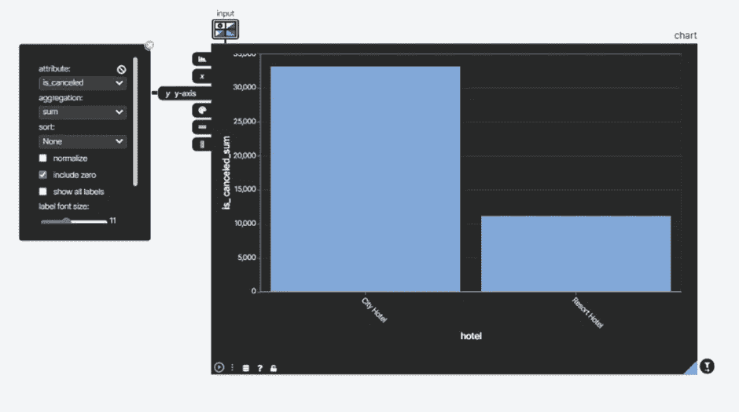

故障也很容易

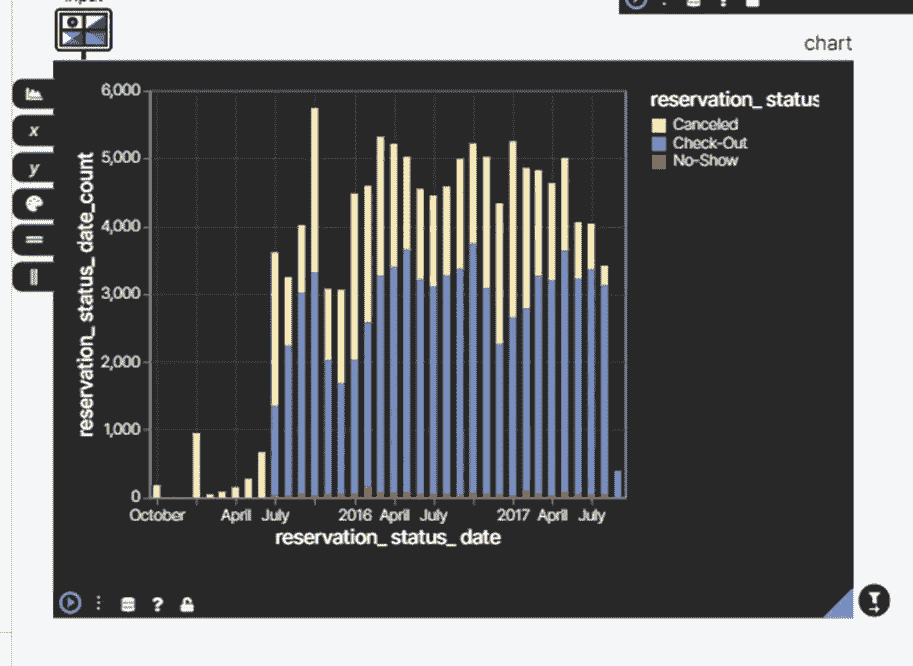

**自定义列**

我试图创建一个自定义栏，但我找不到如何做(即使在谷歌搜索后)。

## 通过 Einblick 进行高级分析

Einnblick 提供了几个有趣的工具来对数据集进行高级分析。

这些都在左侧栏中的运营商。

**加入**

连接数据集似乎很容易。选择数据集，然后选择键，并合并数据集。

**SQL**

创建 SQL 语句并从数据连接器中提取数据是可能的。

我不知道如何在当前数据集上运行 SQL 语句。

**巨蟒**

python 控制台模块使用输入数据和 Python 表达式创建自定义数据框。

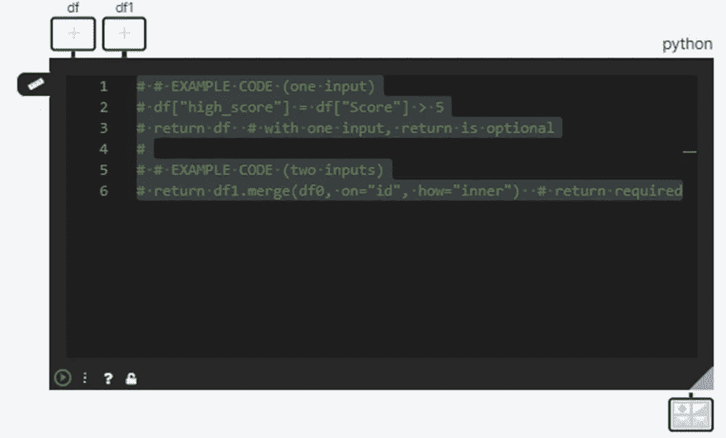

我的 Python 不是最好的，所以我将让数据科学社区来报告这一点😊

**相关性**

轻松快速地找到数据字段之间的相关性。

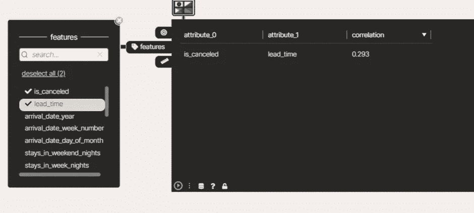

您甚至可以选择所有的字段来寻找可能的相关性。

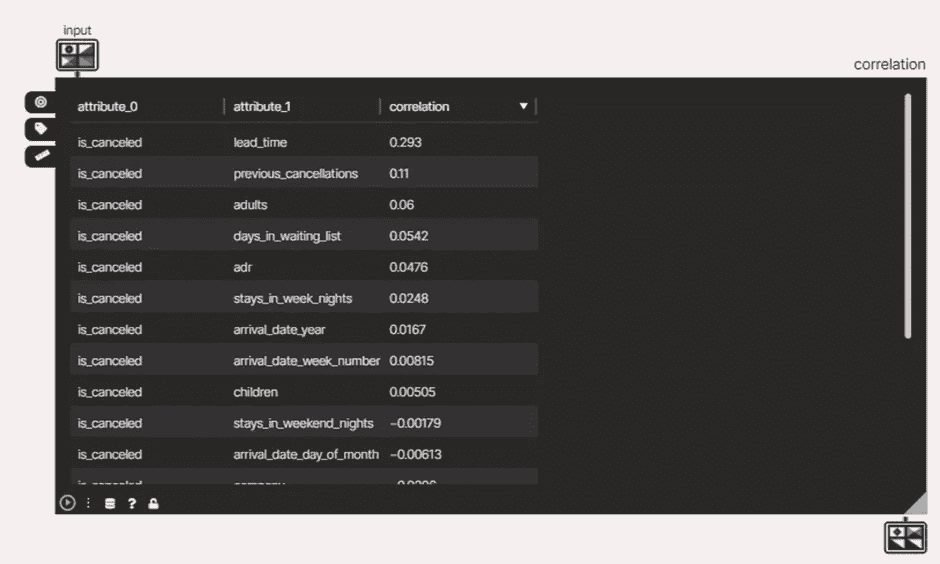

**机器学习 ML**

ML 运算符似乎很强大。根据不同的变量和不同的方法选择字段和训练模型是很简单的。

## 关于 Einblick 的合作

Einbick 中有一些令人兴奋的协作特性

**上线**

我不能完全理解这个。我以为是可以分享的录音，但似乎更多的是屏幕分享。

**分享**

您可以与其他用户共享画布。

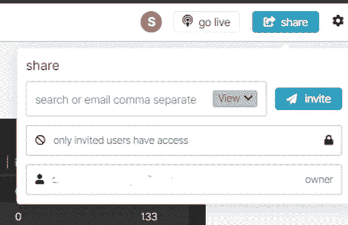

## 导航和稳定性

右下角的导航地图有助于在画布中查找图表。非常有用。

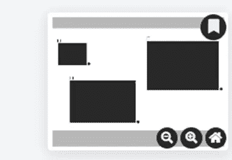

Einblick 是基于网络的，有时会出现连接中断和错误。

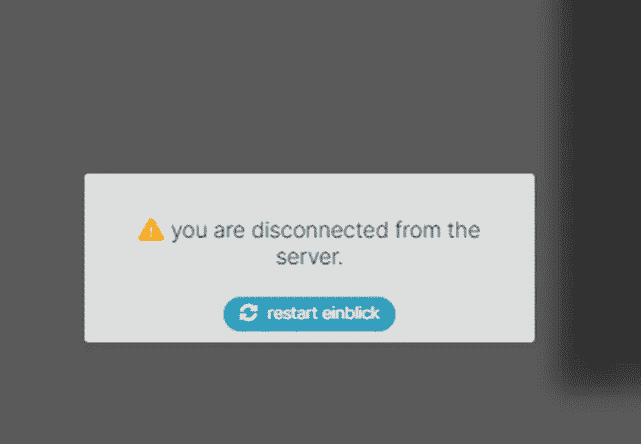

当图表靠近边栏时，它的一部分不会显示出来

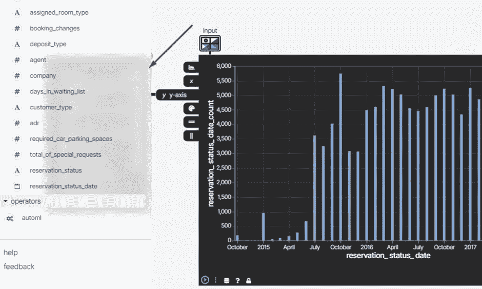

## 单一价格

Einblick 可以免费使用有限的数据和工作空间

在撰写本文时，Einblick 的推出报价是每个用户每月 45 美元，按年计费。

他们也有定制的企业软件包。

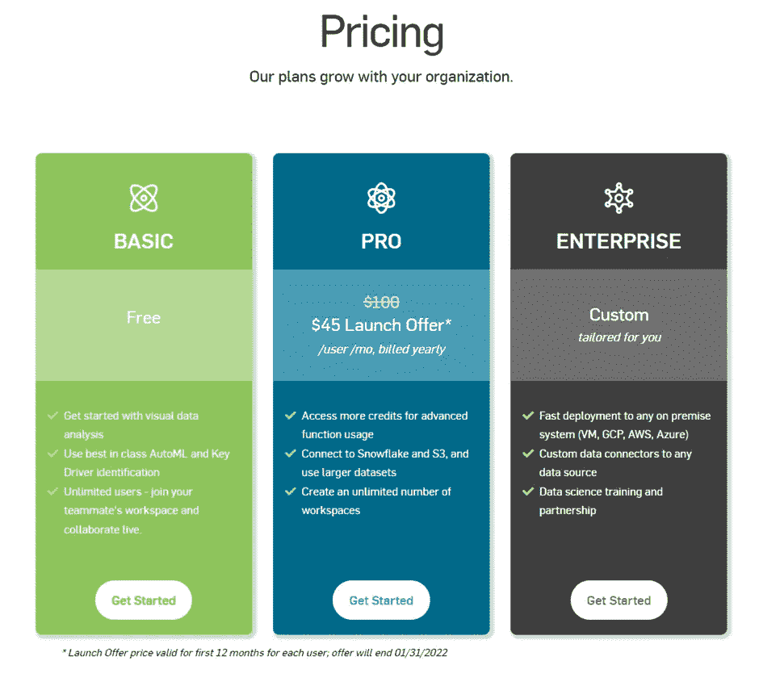

# 结论

我没有花太多时间使用 Einblick，但我设法收集了一些分析。这说明了相对容易的学习曲线。我喜欢这个工具的简单性，并且我认为探索数据和与你的团队分享发现是很好的。借助 Einblick，数据分析师、科学家和团队可以节省时间并实现快速洞察。

> 你试过 Einblick 吗？你的观点是什么？

我希望你喜欢这篇文章。请点击“鼓掌”👏图标，帮助其他人在介质上看到它

⚡️:我们在[上连接在](https://fave.co/3EKnKj3)上吗？

♟️，你想下棋吗？挑战我[她的](https://play.chess.com/wNhoS) e。

🥘你是吃货吗？我也是，看看我的[美食博客](https://gourmetian.com/)😋

 [## Mlearning.ai 提交建议

### 如何成为 Mlearning.ai 上的作家

medium.com](/mlearning-ai/mlearning-ai-submission-suggestions-b51e2b130bfb)