# 使用 Keras 的情绪检测器——带源代码——最简单的方法

> 原文：<https://medium.com/mlearning-ai/emotion-detector-using-keras-with-source-code-easiest-way-easy-implementation-6f62ad9e2528?source=collection_archive---------5----------------------->

所以在今天的博客中，我们将使用卷积神经网络在 Keras 中构建一个情绪检测器模型。这是我最喜欢的项目之一，这就是为什么我很兴奋开始它，所以没有任何进一步的原因。

**在这里阅读带源代码的整篇文章—**[https://machine learning projects . net/emotion-detector-using-keras/](https://machinelearningprojects.net/emotion-detector-using-keras/)

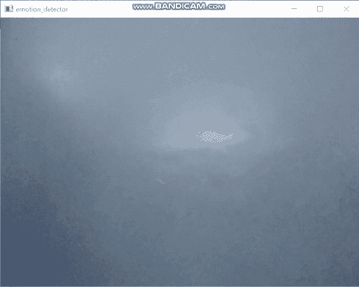

Emotion detector

# 让我们开始吧…

## 步骤 1-导入情感检测器所需的库。

```
from keras.preprocessing.image import ImageDataGenerator
from keras.layers import Dense,Dropout,Activation,Conv2D,MaxPooling2D,BatchNormalization,Flatten
from keras.models import Sequential
from keras.optimizers import rmsprop_v2
from keras.callbacks import EarlyStopping,ReduceLROnPlateau,ModelCheckpoint
from keras.models import load_model
import cv2
from PIL import Image
import numpy as np
import pandas as pd
import os
from keras.utils.np_utils import to_categorical
import seaborn as sns
```

## 步骤 2-读取所有图像，并将它们存储在数据帧中。

```
int2emotions = {0:'Angry',1:'Fear',2:'Happy',3:'Neutral',4:'Sad',5:'Surprise'}
emotions2int = {'Angry':0,'Fear':1,'Happy':2,'Neutral':3,'Sad':4,'Surprise':5}

dic = {'images':[], 'labels':[], 'purpose':[]}

for d in os.listdir('fer2013/'):
    print(d)
    for emotion in os.listdir(f'fer2013/{d}'):
        print(emotion)
        for i in os.listdir(f'fer2013/{d}/{emotion}'):
            img = cv2.imread(f'fer2013/{d}/{emotion}/{i}',0)
            img = img.reshape(48,48,1)

            dic['images'].append(img)
            dic['labels'].append(emotion)

            if d=='train':
                dic['purpose'].append('T')
            else:
                dic['purpose'].append('V')

df = pd.DataFrame(dic)
df.head()
```

*   在这里，我们只是读取我们的数据，并将其存储在一个熊猫数据帧中。
*   图像包含形状为 48X48X1 的图像。
*   标签描述了图像的情感。
*   目的有两个值 T 和 V，T 用于训练，V 用于验证。

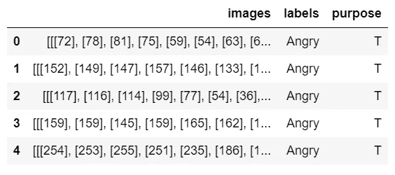

## 步骤 3 —提取训练数据和验证数据。

```
train_data = df[df['purpose']=='T']
val_data = df[df['purpose']=='V']
```

*   创建 2 个不同的数据框。
*   第一次用于训练，第二次用于验证。

检查负责人的培训数据。

```
train_data.head()
```

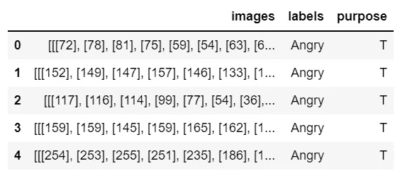

检查验证数据的标题。

```
val_data.head()
```

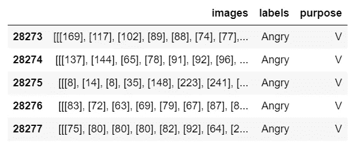

## 步骤 4-检查训练数据的标签列中的值。

```
train_data[‘labels’].value_counts()
```

*   正如我们在下图中看到的，标签在训练数据中非常不平衡，因此我们将在下一步中平衡它们。

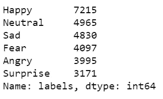

## 步骤 5——获取所有类的相同实例。

```
happy_df = train_data[train_data['labels']=='Happy'].sample(n=3171)
neutral_df = train_data[train_data['labels']=='Neutral'].sample(n=3171)
sad_df = train_data[train_data['labels']=='Sad'].sample(n=3171)
fear_df = train_data[train_data['labels']=='Fear'].sample(n=3171)
angry_df = train_data[train_data['labels']=='Angry'].sample(n=3171)
surprise_df = train_data[train_data['labels']=='Surprise'].sample(n=3171)

train_data = pd.concat([happy_df,neutral_df,sad_df,fear_df,angry_df,surprise_df])

train_data = train_data.sample(frac=1)
train_data.reset_index(inplace=True)
train_data.drop('index',inplace=True,axis=1)

train_data.head()
```

*   在这里，我们选取了 3171 个每种情感广告的实例，并与它们联系起来，形成一个最终的数据框架。

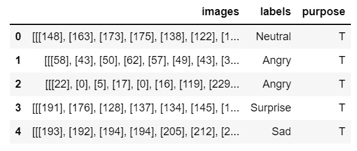

## 步骤 6-再次检查列车数据标签列中的值。

```
train_data[‘labels’].value_counts()
```

*   现在再次检查计数，现在我们可以看到所有的类都是平衡的。

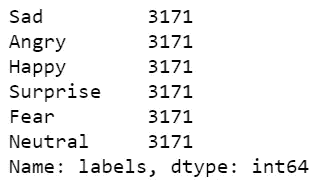

绘制列。

```
sns.countplot(train_data[‘labels’])
```

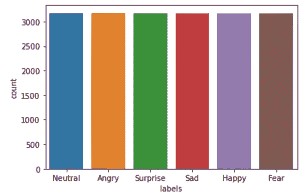

## 步骤 7-声明一些常量。

```
batch_size= 32
classes = 6
rows,columns=48,48
```

## 第 8 步——以正确的形式获取情绪检测器模型的数据。

```
train_labels = list(train_data['labels'].replace(emotions2int))
train_labels = to_categorical(train_labels)

val_labels = list(val_data['labels'].replace(emotions2int))
val_labels = to_categorical(val_labels)

train_data = list(train_data['images'])
train_data = np.array(train_data)

val_data = list(val_data['images'])
val_data = np.array(val_data)
```

*   第 1–2 行—将情绪转换为整数，如愤怒转换为 0，恐惧转换为 1，等等，然后使用 to _ categorical 将这些数字转换为 one-hot 编码。这是用于训练数据的。
*   第 4–5 行—对验证数据执行与上述相同的操作。
*   第 7–8 行—出于训练目的，将图像列转换为列表，然后转换为 NumPy 数组，因为我们不会将 dataframe 列用于训练目的，因此我们将它们转换为数组。
*   第 10–11 行—对验证数据执行与上述相同的操作。

检查训练数据形状。

```
train_data.shape
```

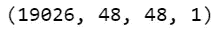

检查验证数据形状。

```
val_data.shape
```

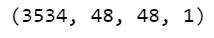

## 步骤 9——创建情绪检测器模型。

```
model = Sequential()

# First Block
model.add(Conv2D(64,(3,3),activation='elu',input_shape=(rows,columns,1),kernel_initializer='he_normal',padding='same'))
model.add(BatchNormalization())
model.add(Conv2D(64,(3,3),activation='elu',input_shape=(rows,columns,1),kernel_initializer='he_normal',padding='same'))
model.add(BatchNormalization())
model.add(MaxPooling2D(pool_size=(2,2)))
model.add(Dropout(0.2))

# Second Block
model.add(Conv2D(128,(3,3),activation='elu',kernel_initializer='he_normal',padding='same'))
model.add(BatchNormalization())
model.add(Conv2D(128,(3,3),activation='elu',kernel_initializer='he_normal',padding='same'))
model.add(BatchNormalization())
model.add(MaxPooling2D(pool_size=(2,2)))
model.add(Dropout(0.2))

# Third Block
model.add(Conv2D(256,(3,3),activation='elu',kernel_initializer='he_normal',padding='same'))
model.add(BatchNormalization())
model.add(Conv2D(256,(3,3),activation='elu',kernel_initializer='he_normal',padding='same'))
model.add(BatchNormalization())
model.add(MaxPooling2D(pool_size=(2,2)))
model.add(Dropout(0.2))

# Fourth Block
model.add(Conv2D(512,(3,3),activation='elu',kernel_initializer='he_normal',padding='same'))
model.add(BatchNormalization())
model.add(Conv2D(512,(3,3),activation='elu',kernel_initializer='he_normal',padding='same'))
model.add(BatchNormalization())
model.add(MaxPooling2D(pool_size=(2,2)))
model.add(Dropout(0.2))

# Fifth Block
model.add(Flatten())
model.add(Dense(256,activation='elu',kernel_initializer='he_normal'))
model.add(BatchNormalization())
model.add(Dropout(0.5))

# Sixth Block
model.add(Dense(128,activation='elu',kernel_initializer='he_normal'))
model.add(BatchNormalization())
model.add(Dropout(0.5))

# Seventh Block
model.add(Dense(64,activation='elu',kernel_initializer='he_normal'))
model.add(BatchNormalization())
model.add(Dropout(0.5))

# Eighth Block
model.add(Dense(classes,activation='softmax',kernel_initializer='he_normal'))

print(model.summary())
```

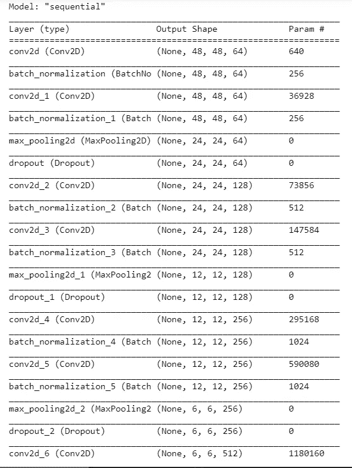

*   创建我们的卷积神经网络模型。
*   创建 4 块[【Conv2D】](https://keras.io/api/layers/convolution_layers/convolution2d/)—[—](https://keras.io/api/layers/normalization_layers/batch_normalization/)—[Conv2D](https://keras.io/api/layers/convolution_layers/convolution2d/)—[batch normalization](https://keras.io/api/layers/normalization_layers/batch_normalization/)—[maxpooli2d](https://keras.io/api/layers/pooling_layers/max_pooling2d/)—[Dropout](https://keras.io/api/layers/regularization_layers/dropout/)层。
*   创建 3 块[密集](https://keras.io/api/layers/core_layers/dense/)——批量——剔除层，最终创建 1 个具有 6 个神经元/节点的密集层。

## 步骤 10-声明回调。

```
checkpoint = ModelCheckpoint('model\\6_class_emotion_detector_V2.h5',
                             save_best_only=True,
                             mode='min',
                             monitor='val_loss',
                             verbose=1)

earlystopping = EarlyStopping(patience=10,
                             verbose=1,
                             min_delta=0,
                             monitor='val_loss',
                             restore_best_weights=True)

callbacks = [checkpoint, earlystopping]

model.compile(metrics=['accuracy'],
             optimizer='rmsprop',
             loss='categorical_crossentropy')
```

*   创建[提前停止](https://keras.io/api/callbacks/early_stopping/)和[检查点](https://keras.io/api/callbacks/model_checkpoint/)回调。

## 步骤 11 —训练模型。

```
train_samples = 28273
validation_samples = 3534
batch_size = 64
epochs=30

history = model.fit(train_data,
                    train_labels,
                    epochs=epochs,
                    steps_per_epoch=train_samples//batch_size,
                    validation_data=(val_data,val_labels),
                    validation_steps=validation_samples//batch_size,
                    callbacks=callbacks)
```

*   最后训练模型。

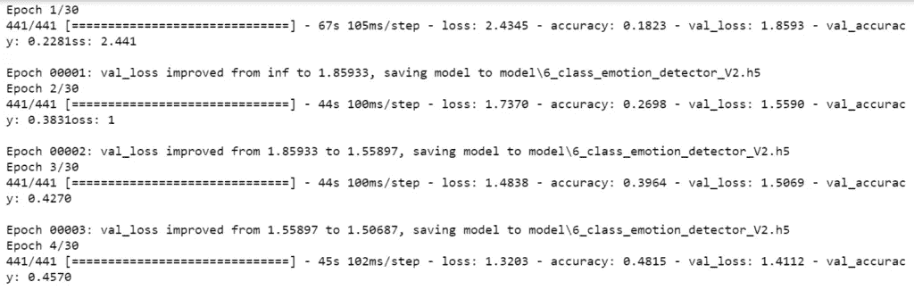

## 第 12 步—实时预测。

```
import cv2
from keras.models import load_model
import numpy as np

int2emotions = {0:'Angry',1:'Fear',2:'Happy',3:'Neutral',4:'Sad',5:'Surprise'}
model = load_model('model\\6_class_emotion_detector_V2.h5')
cap = cv2.VideoCapture(0)

classifier = cv2.CascadeClassifier('Haarcascades\\haarcascade_frontalface_default.xml')

def detect_face(frame):
    faces=classifier.detectMultiScale(frame,1.3,4)
    if faces==():
        return frame
    for x,y,w,h in faces:
        cv2.rectangle(frame,(x,y),(x+w,y+h),(172,42,251),2)
        face = frame[y:y+h,x:x+w]
        face = cv2.cvtColor(face,cv2.COLOR_BGR2GRAY)
        face = cv2.resize(face,(48,48))
        face = face.reshape(1,48,48,1)
        cv2.putText(frame,text=int2emotions[np.argmax(model.predict(face))],
                    org=(x,y-15),fontFace=cv2.FONT_HERSHEY_SIMPLEX,fontScale=1,color=(106,40,243),thickness=2)
    return frame

while 1:
    ret,frame= cap.read()
    if ret==True:
        cv2.imshow('emotion_detector',detect_face(frame))
        if cv2.waitKey(1)==27:
            break
cap.release()
cv2.destroyAllWindows()
```


Emotion detector

如果对情绪检测器有任何疑问，请通过电子邮件或 LinkedIn 联系我。

***探索更多机器学习、深度学习、计算机视觉、NLP、Flask 项目访问我的博客—*** [***机器学习项目***](https://machinelearningprojects.net/)

**如需进一步的代码解释和源代码，请访问此处—**[https://machine learning projects . net/emotion-detector-using-keras/](https://machinelearningprojects.net/emotion-detector-using-keras/)

这就是我写给这个博客的所有内容，感谢你的阅读，我希望你在阅读完这篇文章后，能有所收获，直到下次👋…

***看我以前的帖子:*** [***猴子品种分类利用迁移学习***](https://machinelearningprojects.net/monkey-breed-classification/)

[](/mlearning-ai/mlearning-ai-submission-suggestions-b51e2b130bfb) [## Mlearning.ai 提交建议

### 如何成为 Mlearning.ai 上的作家

medium.com](/mlearning-ai/mlearning-ai-submission-suggestions-b51e2b130bfb)