# 用 DDPMs 生成图像:PyTorch 实现

> 原文：<https://medium.com/mlearning-ai/enerating-images-with-ddpms-a-pytorch-implementation-cef5a2ba8cb1?source=collection_archive---------0----------------------->

# 介绍

去噪扩散概率模型( **DDPM** )是深度生成模型，由于其令人印象深刻的性能，最近受到了很多关注。像 OpenAI 的 [**DALL-E 2**](https://cdn.openai.com/papers/dall-e-2.pdf) 和 Google 的 [**Imagen**](https://arxiv.org/pdf/2205.11487.pdf) 发电机等全新型号都是基于 DDPMs。他们以文本作为生成器的条件，这样就有可能在给定任意文本字符串的情况下生成照片般逼真的图像。

比如输入“*一只背着背包的柴犬骑自行车的照片。这是戴着太阳镜和沙滩帽的"*到新的 **Imagen** 模型和"*一个被描绘成星云爆炸的柯基犬的头*"到 **DALL-E 2** 模型产生了以下图像:

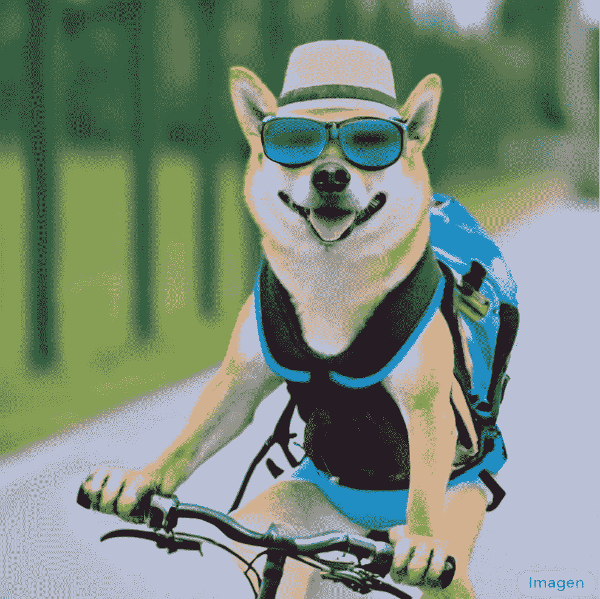

Image generated by Imagen (left) and DALL-E 2 (right)

这些模型简直令人瞠目结舌，但要理解它们是如何工作的，就需要理解 Ho et 的原著。艾尔。*《去噪扩散概率模型》。*

在这篇简短的文章中，我将着重于从头开始(在 PyTorch 中)创建一个简单版本的 DDPM。特别是，我将重新执行何的[原文。等人](https://arxiv.org/abs/2006.11239)。我们将使用传统的、不需要大量资源的 MNIST 和时尚 MNIST 数据集，并尝试凭空生成图像。先说一点理论。

# 去噪扩散概率模型

去噪扩散概率模型(DDPMs)最早出现在[这篇论文](https://arxiv.org/pdf/2006.11239.pdf)中。

这个想法很简单:给定一组图像，我们一步一步地添加一点噪声。每走一步，图像就变得越来越不清晰，直到只剩下噪声。这被称为“前进过程”。然后，我们学习一个机器学习模型，可以撤销这样的每一个步骤，我们称之为“逆向过程”。如果我们可以成功地学习一个反向过程，我们就有了一个可以从纯随机噪声中生成图像的模型。

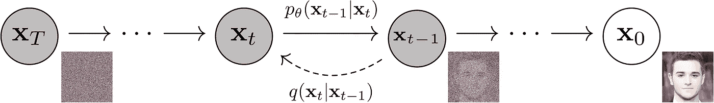

The main idea of DDPM: Map images x0 to more and more noisy images with probability distribution q. Then, learn the inverse function p parametrized by parameters theta. The image is taken from “Denoising DIffusion Probabilistic Models” by Ho et. al.

正向过程中的一个步骤在于通过从多元高斯分布中采样来使输入图像噪声更大(步骤 t 中的 x ),该多元高斯分布的平均值是先前图像的缩小版本(步骤 t-1 中的 x ),并且该协方差矩阵是对角的和固定的。换句话说，我们通过添加一些正态分布的值来独立地扰动图像中的每个像素。

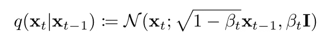

Forward process: we sample from a normal distribution which mean is a scaled version of the current image and which covariance matrix simply has all equal variance terms beta t.

对于每一步，都有一个不同的系数β，它告诉我们在这一步中图像失真的程度。beta 越高，图像中添加的噪声越多。我们可以自由选择系数β，但是我们应该尽量不要一次添加太多噪声，并且整个正向过程应该是“平滑”的。在何等人的原著中。艾尔。β被放置在从 0.0001 到 0.02 的线性空间中。

高斯分布的一个很好的特性是，我们可以通过向平均向量添加一个由标准偏差缩放的正态分布噪声向量来对其进行采样。这导致:

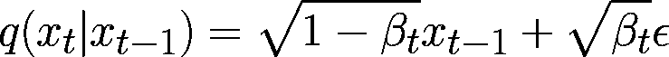

Forward process but sampling is done by just adding the mean and scaling a normally distributed noise (epsilon) by the standard deviation.

我们现在知道如何在正向过程中获取下一个样本，只需缩放现有样本并添加一些缩放噪声。如果我们现在认为这个公式是递归的，我们可以写出:

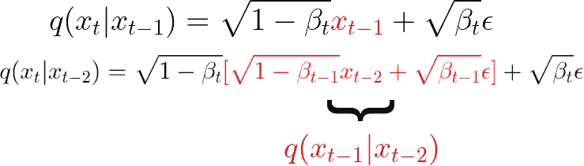

The formula of the forward process is recursive, so we can start expanding it.

如果我们继续这样做并做一些简化，我们可以一路返回并获得一个公式，用于从原始无噪声图像 x0 开始在步骤 t 获得噪声样本:

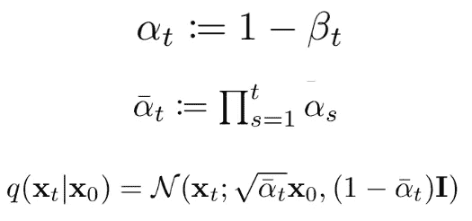

The equation for the forward process that allows to directly get a desired noisy level starting from the original non-noisy image.

太好了。现在不管我们的正向过程会有多少步，我们总会有办法直接从原始图像中直接得到第 t 步的含噪图像。

对于后向过程，我们知道我们的模型也应该作为高斯分布工作，所以我们只需要模型来预测给定噪声图像和时间步长的分布平均值和标准偏差。实际上，在关于 DDPMs 的第一篇论文中，协方差矩阵保持固定，因此我们只想预测高斯的平均值(给定噪声图像和我们当前所处的时间步长):

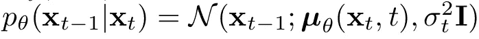

Backward process: we try to go back to a less noisy image (x at timestep t-1) using a gaussian distribution which mean is predicted by a model

现在，事实证明，要预测的最佳平均值只是我们已经熟悉的项的函数:

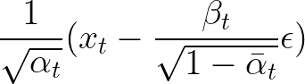

The optimal mean value to be predicted to reverse the noising process. Given the more noisy image at step t, we can make it less noisy by subtracting a scale of the added noise and applying a scaling afterwards.

因此，我们可以进一步简化我们的模型，仅用噪声图像和时间步长的函数来预测噪声ε。

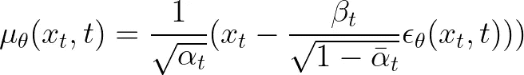

Our model just predicts the noise that was added, and we use this to recover a less noisy image using the information for the particular time step.

我们的损失函数将是添加的真实噪声和模型预测的噪声之间的均方误差(MSE)的缩放版本

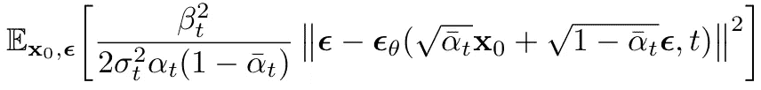

Final loss function. We minimize the MSE between the noises actually added to the images and the one predicted by the model. We do so for all images in our dataset and all time steps.

一旦模型被训练(算法 1)，我们可以使用去噪模型来采样新图像(算法 2)。

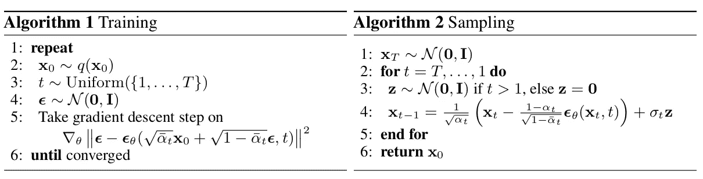

Training and sampling algorithms. Once the model is trained, we can use it to generate brand new samples starting from gaussian noise.

# 让我们开始编码吧

既然我们对扩散模型的工作原理有了大致的了解，是时候实现我们自己的东西了。你可以自己在这个 [Google Colab 笔记本](https://colab.research.google.com/drive/1AZ2_BAwXrU8InE_qAE9cFZ0lsIO5a_xp?usp=sharing)中或者用这个 [GitHub 库](https://github.com/BrianPulfer/PapersReimplementations/tree/master/ddpm)运行下面的代码。

和往常一样，进口只是我们的第一步。

```
# Import of libraries
import random
import imageio
import numpy as np
from argparse import ArgumentParser

from tqdm.auto import tqdm
import matplotlib.pyplot as plt

import einops
import torch
import torch.nn as nn
from torch.optim import Adam
from torch.utils.data import DataLoader

from torchvision.transforms import Compose, ToTensor, Lambda
from torchvision.datasets.mnist import MNIST, FashionMNIST

# Setting reproducibility
SEED = 0
random.seed(SEED)
np.random.seed(SEED)
torch.manual_seed(SEED)

# Definitions
STORE_PATH_MNIST = f"ddpm_model_mnist.pt"
STORE_PATH_FASHION = f"ddpm_model_fashion.pt"
```

接下来，我们为实验定义几个参数。具体来说，我们决定是否要运行训练循环，是否要使用时尚-MNIST 数据集和一些训练超参数

```
no_train = False
fashion = True
batch_size = 128
n_epochs = 20
lr = 0.001
store_path = "ddpm_fashion.pt" if fashion else "ddpm_mnist.pt"
```

接下来，我们真的想展示图像。我们对训练图像和模型生成的图像都感兴趣。我们编写一个效用函数，给定一些图像，将显示一个正方形(或尽可能接近)的子图形网格:

```
def show_images(images, title=""):
    """Shows the provided images as sub-pictures in a square"""

    # Converting images to CPU numpy arrays
    if type(images) is torch.Tensor:
        images = images.detach().cpu().numpy()

    # Defining number of rows and columns
    fig = plt.figure(figsize=(8, 8))
    rows = int(len(images) ** (1 / 2))
    cols = round(len(images) / rows)

    # Populating figure with sub-plots
    idx = 0
    for r in range(rows):
        for c in range(cols):
            fig.add_subplot(rows, cols, idx + 1)

            if idx < len(images):
                plt.imshow(images[idx][0], cmap="gray")
                idx += 1
    fig.suptitle(title, fontsize=30)

    # Showing the figure
    plt.show()
```

为了测试这个效用函数，我们加载数据集并显示第一批。**重要提示:**图像必须在[-1，1]范围内归一化，因为我们的网络必须预测正态分布的噪声值:

```
# Shows the first batch of images
def show_first_batch(loader):
    for batch in loader:
        show_images(batch[0], "Images in the first batch")
        break
```

```
# Loading the data (converting each image into a tensor and normalizing between [-1, 1])
transform = Compose([
    ToTensor(),
    Lambda(lambda x: (x - 0.5) * 2)]
)
ds_fn = FashionMNIST if fashion else MNIST
dataset = ds_fn("./datasets", download=True, train=True, transform=transform)
loader = DataLoader(dataset, batch_size, shuffle=True)
```

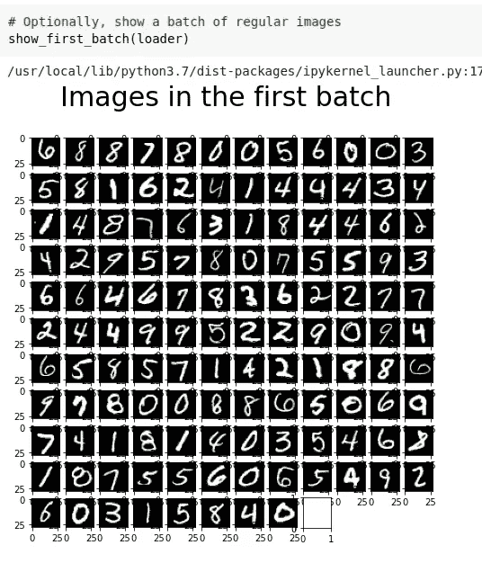

Images in our first batch. If you kept the same randomizing seed, you should get the exact same batch.

太好了！现在我们有了这个很好的效用函数，我们稍后也将把它用于我们的模型生成的图像。在我们真正开始处理 DDPM 模型之前，我们将从 colab 获得一个 GPU 设备(通常是非 colab-pro 用户的*特斯拉 T4* ):

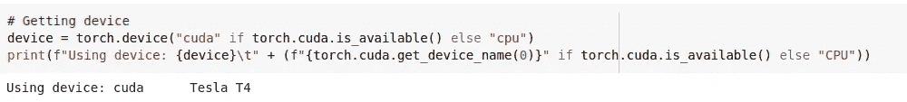

Getting a device and, if it is a GPU, printing its name

# DDPM 模式

既然我们已经解决了琐碎的事情，现在是时候研究 DDPM 了。我们将创建一个 *MyDDPM* PyTorch 模块，它将负责存储 betas 和 alphas 值并应用转发过程。相反，对于后向过程， *MyDDPM* 模块将简单地依赖于用于构建 DDPM 的网络:

```
# DDPM class
class MyDDPM(nn.Module):
    def __init__(self, network, n_steps=200, min_beta=10 ** -4, max_beta=0.02, device=None, image_chw=(1, 28, 28)):
        super(MyDDPM, self).__init__()
        self.n_steps = n_steps
        self.device = device
        self.image_chw = image_chw
        self.network = network.to(device)
        self.betas = torch.linspace(min_beta, max_beta, n_steps).to(
            device)  # Number of steps is typically in the order of thousands
        self.alphas = 1 - self.betas
        self.alpha_bars = torch.tensor([torch.prod(self.alphas[:i + 1]) for i in range(len(self.alphas))]).to(device)

    def forward(self, x0, t, eta=None):
        # Make input image more noisy (we can directly skip to the desired step)
        n, c, h, w = x0.shape
        a_bar = self.alpha_bars[t]

        if eta is None:
            eta = torch.randn(n, c, h, w).to(self.device)

        noisy = a_bar.sqrt().reshape(n, 1, 1, 1) * x0 + (1 - a_bar).sqrt().reshape(n, 1, 1, 1) * eta
        return noisy

    def backward(self, x, t):
        # Run each image through the network for each timestep t in the vector t.
        # The network returns its estimation of the noise that was added.
        return self.network(x, t)
```

注意，正向过程独立于用于去噪的网络，所以从技术上来说，我们已经可以看到它的效果。同时，我们还可以创建一个应用**算法 2** (采样过程)生成新图像的效用函数。我们通过两个 DDPM 的特定效用函数来实现:

```
def show_forward(ddpm, loader, device):
    # Showing the forward process
    for batch in loader:
        imgs = batch[0]

        show_images(imgs, "Original images")

        for percent in [0.25, 0.5, 0.75, 1]:
            show_images(
                ddpm(imgs.to(device),
                     [int(percent * ddpm.n_steps) - 1 for _ in range(len(imgs))]),
                f"DDPM Noisy images {int(percent * 100)}%"
            )
        break
```

为了生成图像，我们从随机噪声开始，让 T 从 T 回到 0。在每一步，我们将噪声估计为 **eta_theta** 并应用去噪函数。最后，像朗之万动力学一样，增加了额外的噪声。

```
def generate_new_images(ddpm, n_samples=16, device=None, frames_per_gif=100, gif_name="sampling.gif", c=1, h=28, w=28):
    """Given a DDPM model, a number of samples to be generated and a device, returns some newly generated samples"""
    frame_idxs = np.linspace(0, ddpm.n_steps, frames_per_gif).astype(np.uint)
    frames = []

    with torch.no_grad():
        if device is None:
            device = ddpm.device

        # Starting from random noise
        x = torch.randn(n_samples, c, h, w).to(device)

        for idx, t in enumerate(list(range(ddpm.n_steps))[::-1]):
            # Estimating noise to be removed
            time_tensor = (torch.ones(n_samples, 1) * t).to(device).long()
            eta_theta = ddpm.backward(x, time_tensor)

            alpha_t = ddpm.alphas[t]
            alpha_t_bar = ddpm.alpha_bars[t]

            # Partially denoising the image
            x = (1 / alpha_t.sqrt()) * (x - (1 - alpha_t) / (1 - alpha_t_bar).sqrt() * eta_theta)

            if t > 0:
                z = torch.randn(n_samples, c, h, w).to(device)

                # Option 1: sigma_t squared = beta_t
                beta_t = ddpm.betas[t]
                sigma_t = beta_t.sqrt()

                # Option 2: sigma_t squared = beta_tilda_t
                # prev_alpha_t_bar = ddpm.alpha_bars[t-1] if t > 0 else ddpm.alphas[0]
                # beta_tilda_t = ((1 - prev_alpha_t_bar)/(1 - alpha_t_bar)) * beta_t
                # sigma_t = beta_tilda_t.sqrt()

                # Adding some more noise like in Langevin Dynamics fashion
                x = x + sigma_t * z

            # Adding frames to the GIF
            if idx in frame_idxs or t == 0:
                # Putting digits in range [0, 255]
                normalized = x.clone()
                for i in range(len(normalized)):
                    normalized[i] -= torch.min(normalized[i])
                    normalized[i] *= 255 / torch.max(normalized[i])

                # Reshaping batch (n, c, h, w) to be a (as much as it gets) square frame
                frame = einops.rearrange(normalized, "(b1 b2) c h w -> (b1 h) (b2 w) c", b1=int(n_samples ** 0.5))
                frame = frame.cpu().numpy().astype(np.uint8)

                # Rendering frame
                frames.append(frame)

    # Storing the gif
    with imageio.get_writer(gif_name, mode="I") as writer:
        for idx, frame in enumerate(frames):
            writer.append_data(frame)
            if idx == len(frames) - 1:
                for _ in range(frames_per_gif // 3):
                    writer.append_data(frames[-1])
    return x
```

所有与 DDPM 有关的事情现在都摆在桌面上。我们只需要定义一个模型，在给定图像和当前时间步长的情况下，该模型将实际完成预测图像中噪声的工作。为此，我们将创建一个定制的 U-Net 模型。不言而喻，您可以自由选择使用任何其他模型。

# 优信网

我们通过创建一个保持空间维度不变的块来开始创建我们的 U-Net。这个块将用于我们 U-Net 的每个级别。

```
class MyBlock(nn.Module):
    def __init__(self, shape, in_c, out_c, kernel_size=3, stride=1, padding=1, activation=None, normalize=True):
        super(MyBlock, self).__init__()
        self.ln = nn.LayerNorm(shape)
        self.conv1 = nn.Conv2d(in_c, out_c, kernel_size, stride, padding)
        self.conv2 = nn.Conv2d(out_c, out_c, kernel_size, stride, padding)
        self.activation = nn.SiLU() if activation is None else activation
        self.normalize = normalize

    def forward(self, x):
        out = self.ln(x) if self.normalize else x
        out = self.conv1(out)
        out = self.activation(out)
        out = self.conv2(out)
        out = self.activation(out)
        return out
```

DDPMs 中的棘手之处在于，我们的图像到图像模型必须以当前时间步长为条件。为了在实践中做到这一点，我们使用正弦嵌入和一层 MLPs。由此产生的张量将通过 U-Net 的每一级按信道添加到网络的输入中。

```
def sinusoidal_embedding(n, d):
    # Returns the standard positional embedding
    embedding = torch.zeros(n, d)
    wk = torch.tensor([1 / 10_000 ** (2 * j / d) for j in range(d)])
    wk = wk.reshape((1, d))
    t = torch.arange(n).reshape((n, 1))
    embedding[:,::2] = torch.sin(t * wk[:,::2])
    embedding[:,1::2] = torch.cos(t * wk[:,::2])

    return embedding
```

我们创建了一个小的效用函数，该函数创建了一个用于绘制位置嵌入地图的一层 MLP。

```
def _make_te(self, dim_in, dim_out):
  return nn.Sequential(
    nn.Linear(dim_in, dim_out),
    nn.SiLU(),
    nn.Linear(dim_out, dim_out)
  )
```

现在我们知道了如何处理时间信息，我们可以创建一个自定义的 U-Net 网络。我们将有 3 个下采样部分，一个网络中间的瓶颈，和 3 个带有通常的 U-Net 剩余连接(连接)的上采样步骤。

```
class MyUNet(nn.Module):
    def __init__(self, n_steps=1000, time_emb_dim=100):
        super(MyUNet, self).__init__()

        # Sinusoidal embedding
        self.time_embed = nn.Embedding(n_steps, time_emb_dim)
        self.time_embed.weight.data = sinusoidal_embedding(n_steps, time_emb_dim)
        self.time_embed.requires_grad_(False)

        # First half
        self.te1 = self._make_te(time_emb_dim, 1)
        self.b1 = nn.Sequential(
            MyBlock((1, 28, 28), 1, 10),
            MyBlock((10, 28, 28), 10, 10),
            MyBlock((10, 28, 28), 10, 10)
        )
        self.down1 = nn.Conv2d(10, 10, 4, 2, 1)

        self.te2 = self._make_te(time_emb_dim, 10)
        self.b2 = nn.Sequential(
            MyBlock((10, 14, 14), 10, 20),
            MyBlock((20, 14, 14), 20, 20),
            MyBlock((20, 14, 14), 20, 20)
        )
        self.down2 = nn.Conv2d(20, 20, 4, 2, 1)

        self.te3 = self._make_te(time_emb_dim, 20)
        self.b3 = nn.Sequential(
            MyBlock((20, 7, 7), 20, 40),
            MyBlock((40, 7, 7), 40, 40),
            MyBlock((40, 7, 7), 40, 40)
        )
        self.down3 = nn.Sequential(
            nn.Conv2d(40, 40, 2, 1),
            nn.SiLU(),
            nn.Conv2d(40, 40, 4, 2, 1)
        )

        # Bottleneck
        self.te_mid = self._make_te(time_emb_dim, 40)
        self.b_mid = nn.Sequential(
            MyBlock((40, 3, 3), 40, 20),
            MyBlock((20, 3, 3), 20, 20),
            MyBlock((20, 3, 3), 20, 40)
        )

        # Second half
        self.up1 = nn.Sequential(
            nn.ConvTranspose2d(40, 40, 4, 2, 1),
            nn.SiLU(),
            nn.ConvTranspose2d(40, 40, 2, 1)
        )

        self.te4 = self._make_te(time_emb_dim, 80)
        self.b4 = nn.Sequential(
            MyBlock((80, 7, 7), 80, 40),
            MyBlock((40, 7, 7), 40, 20),
            MyBlock((20, 7, 7), 20, 20)
        )

        self.up2 = nn.ConvTranspose2d(20, 20, 4, 2, 1)
        self.te5 = self._make_te(time_emb_dim, 40)
        self.b5 = nn.Sequential(
            MyBlock((40, 14, 14), 40, 20),
            MyBlock((20, 14, 14), 20, 10),
            MyBlock((10, 14, 14), 10, 10)
        )

        self.up3 = nn.ConvTranspose2d(10, 10, 4, 2, 1)
        self.te_out = self._make_te(time_emb_dim, 20)
        self.b_out = nn.Sequential(
            MyBlock((20, 28, 28), 20, 10),
            MyBlock((10, 28, 28), 10, 10),
            MyBlock((10, 28, 28), 10, 10, normalize=False)
        )

        self.conv_out = nn.Conv2d(10, 1, 3, 1, 1)

    def forward(self, x, t):
        # x is (N, 2, 28, 28) (image with positional embedding stacked on channel dimension)
        t = self.time_embed(t)
        n = len(x)
        out1 = self.b1(x + self.te1(t).reshape(n, -1, 1, 1))  # (N, 10, 28, 28)
        out2 = self.b2(self.down1(out1) + self.te2(t).reshape(n, -1, 1, 1))  # (N, 20, 14, 14)
        out3 = self.b3(self.down2(out2) + self.te3(t).reshape(n, -1, 1, 1))  # (N, 40, 7, 7)

        out_mid = self.b_mid(self.down3(out3) + self.te_mid(t).reshape(n, -1, 1, 1))  # (N, 40, 3, 3)

        out4 = torch.cat((out3, self.up1(out_mid)), dim=1)  # (N, 80, 7, 7)
        out4 = self.b4(out4 + self.te4(t).reshape(n, -1, 1, 1))  # (N, 20, 7, 7)

        out5 = torch.cat((out2, self.up2(out4)), dim=1)  # (N, 40, 14, 14)
        out5 = self.b5(out5 + self.te5(t).reshape(n, -1, 1, 1))  # (N, 10, 14, 14)

        out = torch.cat((out1, self.up3(out5)), dim=1)  # (N, 20, 28, 28)
        out = self.b_out(out + self.te_out(t).reshape(n, -1, 1, 1))  # (N, 1, 28, 28)

        out = self.conv_out(out)

        return out

    def _make_te(self, dim_in, dim_out):
        return nn.Sequential(
            nn.Linear(dim_in, dim_out),
            nn.SiLU(),
            nn.Linear(dim_out, dim_out)
        )
```

现在我们已经定义了去噪网络，我们可以实例化一个 DDPM 模型，并进行一些可视化处理。

# 一些可视化

我们使用自定义的 U-Net 实例化 DDPM 模型，如下所示。

```
# Defining model
n_steps, min_beta, max_beta = 1000, 10 ** -4, 0.02  # Originally used by the authors
ddpm = MyDDPM(MyUNet(n_steps), n_steps=n_steps, min_beta=min_beta, max_beta=max_beta, device=device)
```

让我们看看转发过程是什么样子的:

```
# Optionally, show the diffusion (forward) process
show_forward(ddpm, loader, device)
```

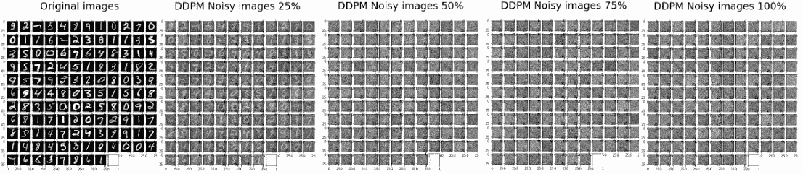

Result of running the forward process. Images get noisier and noisier with each step until just noise is left.

我们还没有训练模型，但我们已经可以使用允许我们生成新图像的函数，看看会发生什么:

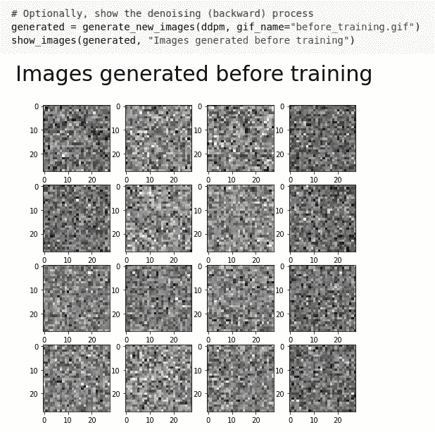

Generating new images with a non-trained model. Noise is produced.

毫不奇怪，当我们这样做时，什么也没发生。但是，当模型完成训练后，我们将再次使用相同的方法。

# 训练循环

我们现在实现算法 1 来学习将知道如何对图像去噪的模型。这对应于我们的训练循环。

```
def training_loop(ddpm, loader, n_epochs, optim, device, display=False, store_path="ddpm_model.pt"):
    mse = nn.MSELoss()
    best_loss = float("inf")
    n_steps = ddpm.n_steps

    for epoch in tqdm(range(n_epochs), desc=f"Training progress", colour="#00ff00"):
        epoch_loss = 0.0
        for step, batch in enumerate(tqdm(loader, leave=False, desc=f"Epoch {epoch + 1}/{n_epochs}", colour="#005500")):
            # Loading data
            x0 = batch[0].to(device)
            n = len(x0)

            # Picking some noise for each of the images in the batch, a timestep and the respective alpha_bars
            eta = torch.randn_like(x0).to(device)
            t = torch.randint(0, n_steps, (n,)).to(device)

            # Computing the noisy image based on x0 and the time-step (forward process)
            noisy_imgs = ddpm(x0, t, eta)

            # Getting model estimation of noise based on the images and the time-step
            eta_theta = ddpm.backward(noisy_imgs, t.reshape(n, -1))

            # Optimizing the MSE between the noise plugged and the predicted noise
            loss = mse(eta_theta, eta)
            optim.zero_grad()
            loss.backward()
            optim.step()

            epoch_loss += loss.item() * len(x0) / len(loader.dataset)

        # Display images generated at this epoch
        if display:
            show_images(generate_new_images(ddpm, device=device), f"Images generated at epoch {epoch + 1}")

        log_string = f"Loss at epoch {epoch + 1}: {epoch_loss:.3f}"

        # Storing the model
        if best_loss > epoch_loss:
            best_loss = epoch_loss
            torch.save(ddpm.state_dict(), store_path)
            log_string += " --> Best model ever (stored)"

        print(log_string)
```

正如你所看到的，在我们的训练循环中，我们只是简单地对一些图像进行采样，并对每个图像进行随机的时间步长。然后，我们用正向过程使它们有噪声，并对这些有噪声的图像运行反向过程。实际添加的噪声和模型预测的噪声之间的 MSE 被优化。

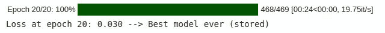

Training takes roughly 24 seconds per epoch. With 20 epochs, it takes roughly 8 minutes to train a DDPM model.

默认情况下，我将训练周期设置为 20，因为每个周期需要 24 秒(训练总共大约需要 8 分钟)。请注意，有可能通过更多的纪元、更好的 U-Net 和其他技巧获得更好的性能。在这篇文章中，为了简单起见，我省略了这些。

# 测试模型

既然工作已经完成，我们就可以享受成果了。我们根据 MSE 损失函数加载训练期间获得的最佳模型，将其设置为评估模式，并使用它来生成新样本

```
# Loading the trained model
best_model = MyDDPM(MyUNet(), n_steps=n_steps, device=device)
best_model.load_state_dict(torch.load(store_path, map_location=device))
best_model.eval()
print("Model loaded")
```

```
print("Generating new images")
generated = generate_new_images(
        best_model,
        n_samples=100,
        device=device,
        gif_name="fashion.gif" if fashion else "mnist.gif"
    )
show_images(generated, "Final result")
```

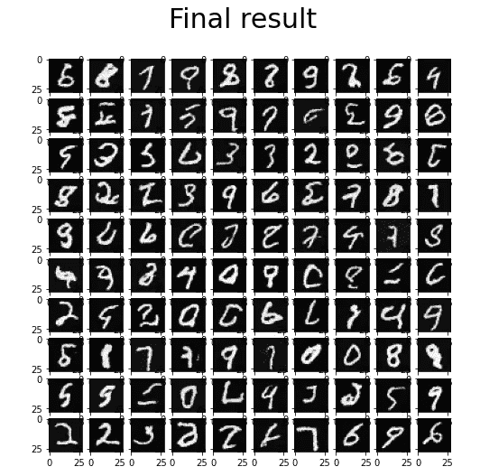

Final result on the MNIST dataset

蛋糕上的樱桃是我们的生成函数自动创建扩散过程的漂亮 gif 的事实。我们使用以下命令在 Colab 中可视化 gif:

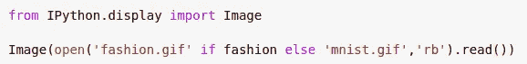

Showing the generated gif image

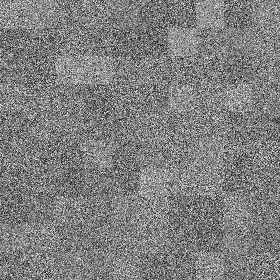

Obtained GIFs for Fashion-MNIST and MNIST datasets.

我们完了。我们终于让我们的 DDPM 模型工作了！

# 进一步的改进

已经做了进一步的改进，以允许[生成更高分辨率的图像](https://arxiv.org/pdf/2006.09011.pdf)，[加速采样](https://arxiv.org/pdf/2010.02502.pdf)或获得[更好的样本质量和可能性](https://arxiv.org/abs/2102.09672)。Imagen 和 DALL-E 2 型号基于原始 DDPMs 的改进版本。

# 更多参考

关于 DDPMs 的更多参考，我强烈推荐阅读 Lilian Weng 和 Niels Rogge 的[杰出文章](https://lilianweng.github.io/posts/2021-07-11-diffusion-models/)和 Kashif Rasul 的惊人[拥抱脸博客](https://huggingface.co/blog/annotated-diffusion)。Colab 笔记本的最后还提到了其他作者。

# 结论

扩散模型是学习迭代去噪图像的生成模型。从一些噪声开始，然后可以要求模型对样本去噪声，直到获得一些真实的图像。

我们在 PyTorch 中从头创建了一个 DDPM，并让它学习去噪 MNIST /时尚 MNIST 的图像。经过训练后，这个模型最终能够从随机噪声中生成新的图像。很神奇，对吧？

带有所示实现的 Colab 笔记本可以在[这个链接](https://colab.research.google.com/drive/1AZ2_BAwXrU8InE_qAE9cFZ0lsIO5a_xp?usp=sharing)免费访问，而 [GitHub 库](https://github.com/BrianPulfer/PapersReimplementations/tree/master/ddpm)包含。py 文件。如果你觉得这个故事有用，可以考虑为它鼓掌**👏**。如果你觉得有什么不清楚的地方，不要犹豫，直接联系我！我很高兴与你讨论它。

[](/mlearning-ai/mlearning-ai-submission-suggestions-b51e2b130bfb) [## Mlearning.ai 提交建议

### 如何成为 Mlearning.ai 上的作家

medium.com](/mlearning-ai/mlearning-ai-submission-suggestions-b51e2b130bfb)