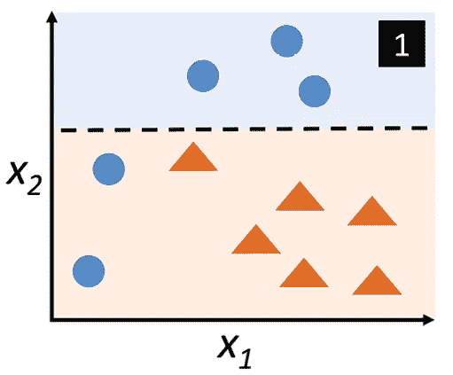
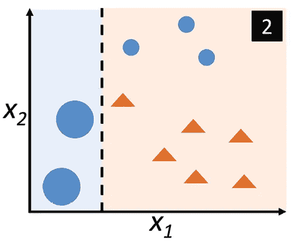
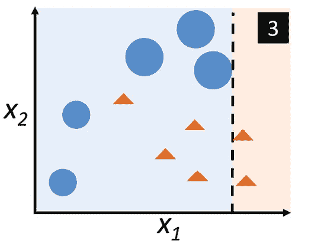
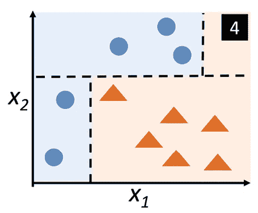
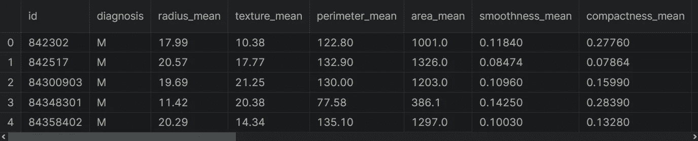

# 集成学习—使用 Python 的 AdaBoost

> 原文：<https://medium.com/mlearning-ai/ensemble-learning-adaboost-with-python-8332778fbb61?source=collection_archive---------1----------------------->

关于如何用 scikit-learn 实现自适应增强(AdaBoost)算法的指南。


Photo by [Steven Libralon](https://unsplash.com/@libs?utm_source=medium&utm_medium=referral) on [Unsplash](https://unsplash.com?utm_source=medium&utm_medium=referral)

AdaBoost 是一种 boosting 方法，使用完整的训练数据集来训练弱学习者。是理解助推的最好起点。在这篇文章中，我将讨论以下主题:

*   什么是 AdaBoost？
*   AdaBoost 如何工作？
*   用 scikit-learn 实现 AdaBoost
*   数据预处理
*   构建决策树模型
*   建立 AdaBoost 模型
*   AdaBoost 模型与决策树模型的比较

在开始之前，我们创建与数据科学、人工智能、机器学习和深度学习相关的内容。请不要忘记关注我们的 YouTube 频道。

让我们开始吧！

# 什么是 AdaBoost

AdaBoost 是一种 boosting 方法，使用完整的训练数据集来训练弱学习者。这是一个连续的过程，每个后续模型都试图纠正前一个模型的错误。因此，后续模型依赖于前一个模型。

每个模型都在同一个数据集上训练，但是每个样本在前一个模型的成功中处于不同的权重下。权重在每次迭代中被重新分配以构建强分类器，该强分类器从集合中先前弱学习器的错误中学习。注意，错误预测样本的权重通常会增加，以强调它们的预测难度。

# 如何使用 AdaBoost

为了展示如何使用 AdaBoost，让我一步一步地看一个例子。

1.  首先，从原始数据集中选择一个子集。



[Figure 1](https://www.packtpub.com/product/machine-learning-with-pytorch-and-scikit-learn/9781801819312)

2.最初，所有训练示例都被赋予相同的权重。

3.在这个子集上训练基本模型。

4.该模型用于对所有数据进行预测。

5.使用实际值和预测值计算误差。

6.对于下一轮，错误分类的例子被分配更高的权重。在图 1 中，两个错误分类的蓝圈点将被赋予更高的权重。此外，正确分类的例子被分配较低的权重。



[Figure 2](https://www.packtpub.com/product/machine-learning-with-pytorch-and-scikit-learn/9781801819312)

7.下一轮将更加关注具有最大权重的训练示例。

8.构建另一个模型，并对数据集进行预测。这个模型试图纠正前一个模型的错误。

在图 2 中，该模型将 circle 类中的三个不同示例进行了错误分类。



[Figure 3](https://www.packtpub.com/product/machine-learning-with-pytorch-and-scikit-learn/9781801819312)

9.类似地，建立多个模型，每个模型修正前一个模型的误差。



[Figure 4](https://www.packtpub.com/product/machine-learning-with-pytorch-and-scikit-learn/9781801819312)

10.最终模型是所有模型的加权平均值。

因此，AdaBoost 算法结合了许多弱学习者。因此，每个模型都提高了整体的性能。我希望你明白如何使用 AdaBoost。现在，我们来看看如何用 scikit-learn 实现 AdaBoost。

# 使用 Scikit-Learn 实现 AdaBoost

在加载数据集之前，让我导入熊猫。

```
import pandas as pd
```

为了展示如何实现 bagging 分类器，我将使用乳腺癌威斯康星州数据集。让我们加载数据集。

```
df = pd.read_csv("wdbc.data", header = None)
```

酷毙了。我们的数据集已加载。你可以在这里找到这个数据集。让我们看一下数据集的前五行。

```
df.head()
```



给你。该数据集由恶性和良性肿瘤细胞的例子组成。数据集中的第一列显示唯一的 ID 号，第二列显示诊断，假设 M 表示恶性，B 表示良性。其余栏目是我们的特色。让我们来看看数据集的形状。

```
df.shape#Output:
(569,33)
```

# 数据预处理

您可以看到行数和列数。让我删除不必要的列。

```
df= df.drop(["id","Unnamed: 32"], axis = 1)
```

现在，让我们创建目标和输出变量。为此，我将使用 loc 方法并将这些变量转换为 numpy 数组。

```
y = df["diagnosis"].values
X = df.drop(["diagnosis"], axis = 1).values
```

太美了。我们创造了变量。我们的目标变量有两类，M 和 b，让我们用 label encoder 对目标变量进行编码。首先，我要导入这个类。

```
from sklearn.preprocessing import LabelEncoder
```

现在，我要从这个类创建一个对象。

```
le = LabelEncoder()
```

让我们拟合并转换我们的目标变量。

```
y = le.fit_transform(y)
```

太棒了，我们编码了目标标签。在构建模型之前，让我们将数据集分成训练集和测试集。为此，我将使用 train_test_split 函数。首先，让我导入这个函数。

```
from sklearn.model_selection import train_test_split
```

让我们使用这个函数分割数据集。

```
X_train, X_test, y_train, y_test = train_test_split(
                            X, y,
                            # To split in balanced, let me set
                            stratify=y,
                            # For reproducible output
                            random_state=0)
```

酷毙了。我们的数据集已经可以分析了。我的计划是这样的:首先，我要用决策树分类器建立模型。之后，我将使用 bagging 来建立模型。最后，我将比较这些模型。

# 构建决策树模型

让我们建立一个基于决策树分类器的模型。

```
from sklearn.tree import DecisionTreeClassifier
```

好吧。让我们从 DecisionTreeClassifier 类创建一个对象。

```
tree = DecisionTreeClassifier(
          max_depth=1,
          random_state=42)
```

现在让我们使用这个对象来拟合模型。

```
tree = tree.fit(X_train, y_train)
```

酷毙了。模型已经建立。现在，让我们预测训练集。

```
y_train_pred = tree.predict(X_train)
```

接下来，我们来预测一下测试集。

```
y_test_pred = tree.predict(X_test)
```

现在，让我们看看模型在训练集和测试集上的性能。为此，我将使用 accuracy_score 函数。让我导入这个函数。

```
from sklearn.metrics import accuracy_score
```

现在，让我们来看看训练集的准确度分数。

```
tree_train = accuracy_score(y_train, y_train_pred)
```

之后，我们来看看测试集的准确率得分。

```
tree_test = accuracy_score(y_test, y_test_pred)
```

太棒了。我们计算了准确度分数。

现在，让我们打印这些分数。

```
print(f’Decision tree train/test accuracies: {tree_train:.3f}/{tree_test:.3f}’)# Output:
Decision tree train/test accuracies: 0.930/0.888
```

给你。该树模型在训练集上的得分为 93%。但是树模型在测试集上的得分是 88%。如您所见，决策树似乎未能满足训练数据的要求。

# 建立 AdaBoost 模型

现在我将使用 AdaBoost 技术通过 scikit-learn 分析数据。首先，让我从系综子模块中导入 AdaBoostClassifier。

```
from sklearn.ensemble import AdaBoostClassifier
```

接下来，让我从 AdaBoostClassifier 创建一个对象。

```
ada = AdaBoostClassifier(
           base_estimator=tree,
           n_estimators=500,
           learning_rate=0.5,
           random_state=42)
```

这里，n _ 估计器指定提升被终止，并且较高的学习率增加了每个分类器的贡献。

太棒了。我们的目标准备好训练了。让我们使用训练集来拟合 AdaBoost 模型。

```
ada = ada.fit(X_train, y_train)
```

酷毙了。模型已经建立。现在，让我们使用这个模型来预测训练集。

```
y_train_pred = ada.predict(X_train)
```

接下来，我们来预测一下测试集。

```
y_test_pred = ada.predict(X_test)
```

现在，让我们看看模型在训练集和测试集上的性能。为此，我将再次使用 accuracy_score 函数。首先，我们来看看模型在训练集上的准确率得分。

```
ada_train = accuracy_score(y_train, y_train_pred)
```

之后，我们来看看模型在测试集上的准确率得分。

```
ada_test = accuracy_score(y_test, y_test_pred)
```

太美了。我们计算了准确度分数。现在，让我们打印这些分数。

```
print(f’Adaboost train/test accuracies: {ada_train:.3f}/{ada_test:.3f}’)#Output:
Adaboost train/test accuracies: 1.000/0.979
```

可以看到，AdaBoost 模型在训练集上的得分是 100%。这意味着 AdaBoost 模型正确地预测了训练数据集的所有类标签。这表明与决策树模型相比，测试数据集的性能略有提高。但是 AdaBoost 模型在测试集上的评分是 98%。当比较 AdaBoost 模型和树模型时，我会说 AdaBoost 分类器减少了模型偏差。

# 结论

Adaboost 是一种非常强大的集成方法，其中每个后续模型都试图纠正前一个模型的错误。您可以使用 AdaBoost 来降低偏差。但是，AdaBoost 在减少模型方差方面是无效的。你可以在这里找到这个笔记本[。](https://www.kaggle.com/code/tirendazacademy/breast-cancer-detection-with-bagging-technique)

如果你想看我关于 AdaBoost 的视频，给你👇

就是这样。感谢您的阅读。我希望你喜欢它。别忘了在[YouTube](https://www.youtube.com/channel/UCFU9Go20p01kC64w-tmFORw)|[GitHub](https://github.com/tirendazacademy)|[Twitter](https://twitter.com/TirendazAcademy)|[ka ggle](https://www.kaggle.com/tirendazacademy)|[LinkedIn](https://www.linkedin.com/in/tirendaz-academy)上关注我们👍

[](/geekculture/6-steps-to-become-a-machine-learning-expert-5a1f155f7207) [## 成为机器学习专家的 6 个步骤

### 成为机器学习专家需要知道的一切。

medium.com](/geekculture/6-steps-to-become-a-machine-learning-expert-5a1f155f7207) [](/geekculture/8-best-seaborn-visualizations-20143a4b3b2f) [## 8 个最好的 Seaborn 可视化

### 使用企鹅数据集与 Seaborn 一起动手绘制统计图。

medium.com](/geekculture/8-best-seaborn-visualizations-20143a4b3b2f) 

# 参考

*   [装袋与增压](https://www.kaggle.com/code/prashant111/bagging-vs-boosting)
*   [使用 PyTorch 和 Scikit-Learn 进行机器学习](https://www.packtpub.com/product/machine-learning-with-pytorch-and-scikit-learn/9781801819312)

如果这篇文章有帮助，请点击拍手👏按钮几下，以示支持👇

[](/mlearning-ai/mlearning-ai-submission-suggestions-b51e2b130bfb) [## Mlearning.ai 提交建议

### 如何成为 Mlearning.ai 上的作家

medium.com](/mlearning-ai/mlearning-ai-submission-suggestions-b51e2b130bfb)