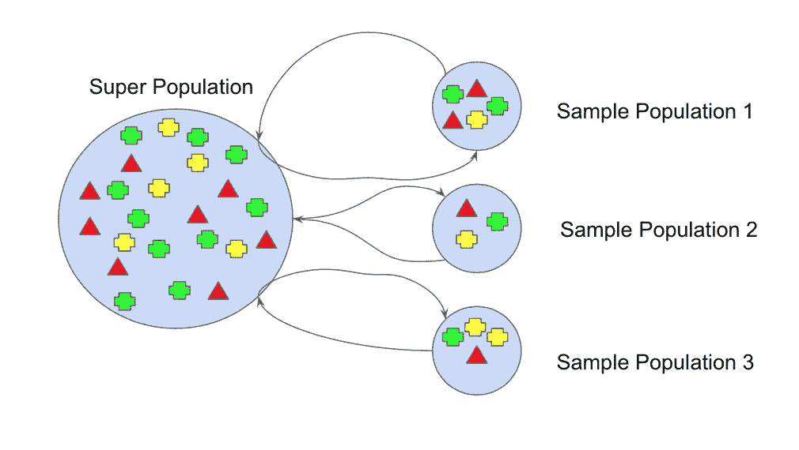

# 集成学习——用 Python 打包

> 原文：<https://medium.com/mlearning-ai/ensemble-learning-bagging-with-python-59bd7732fd01?source=collection_archive---------0----------------------->

## 关于如何用 scikit-learn 实现打包的指南。


Photo by [Avel Chuklanov](https://unsplash.com/@chuklanov?utm_source=medium&utm_medium=referral) on [Unsplash](https://unsplash.com?utm_source=medium&utm_medium=referral)

集成学习通过组合几个模型来帮助提高机器学习模型的性能。与单一模型相比，这种方法提供了更好的预测性能。在这篇文章中，我将讨论以下主题。

*   什么是装袋？
*   使用 scikit-learn 构建模型
*   决策树与装袋

在开始之前，我们创建与数据科学、人工智能、机器学习和深度学习相关的内容。请不要忘记关注我们的 YouTube 频道。

让我们开始吧！

# 什么是装袋？

Bagging 是一种使用引导技术的集成学习技术。打包也称为引导聚合。所以你可能会问什么是自举？Bootstrapping 是一种统计过程，它通过替换采样数据来创建多个数据集。



[Bootstraping Technique](https://www.kaggle.com/code/prashant111/bagging-vs-boosting)

假设你有一个数据集。不是使用相同的训练数据集，而是从初始训练数据集中提取引导样本。对于每个 bootstrap 样本，您需要拟合一个基本估计量。这种技术可以用来减少基本估计量的方差。因此，您可以使用 bagging 估计量来克服过度拟合问题。

# 用 Scikit 装袋-学习

现在，我将向您展示如何使用 scikit-learn 和真实数据集实现 bagging 分类器。在加载数据集之前，让我导入熊猫。

```
import pandas as pd
```

为了展示如何实现 bagging 分类器，我将使用乳腺癌威斯康星州数据集。让我们加载数据集。

```
df = pd.read_csv("data.csv")
```

你可以在这里找到这个数据集。让我们看一下数据集的前五行。

```
df.head()
```


该数据集由恶性和良性肿瘤细胞的例子组成。数据集中的第一列显示唯一的 ID 号，第二列显示诊断，假设 M 表示恶性，B 表示良性。其余栏目是我们的特色。让我们来看看数据集的形状。

```
df.shape#Output:
(569, 33)
```

# 数据预处理

让我们从数据集中删除不必要的列。

```
df = df.drop(["Unnamed: 32"], axis=1)
```

现在，让我们创建输入和目标变量。为此，我将使用 iloc 方法。首先，让我将特性转换成一个 numpy 数组。

```
X = df.iloc[:,2:].values
```

之后，我将创建一个目标变量，然后将这个变量转换成一个 numpy 数组。

```
y = df.iloc[:,1].values
```

我们的目标变量有两个类别，M 和 b。让我们用一个标签编码器对目标变量进行编码。

```
from sklearn.preprocessing import LabelEncoder
le = LabelEncoder()
y = le.fit_transform(y)
```

太棒了，我们编码了目标标签。在构建模型之前，让我们将数据集分成训练集和测试集。为此，我将使用 train_test_split 函数。首先，让我导入这个函数。

```
from sklearn.model_selection import train_test_split
```

让我们使用这个函数分割数据集。

```
X_train, X_test, y_train, y_test = train_test_split(
                                       X, y, 
                                       stratify=y, 
                                       random_state=0)
```

酷毙了。我们的数据集已经可以分析了。现在我将使用 bagging 技术用 scikit-learn 分析数据。

# 决策树与装袋

为了构建 bagging 模型，首先，让我从 ensemble 子模块中导入 BaggingClassifier。

```
from sklearn.ensemble import BaggingClassifier
```

我将使用决策树分类器作为基本估计器。让我导入这个类。

```
from sklearn.tree import DecisionTreeClassifier
```

太美了。我们的课准备好了。首先，我将使用 DecisionTreeClassifier 构建模型。之后，我将使用装袋来建立模型。最后，我将比较这些模型。让我们从 DecisionTreeClassifier 类创建一个对象。

```
tree = DecisionTreeClassifier(random_state = 0)
# fitting the model
tree = tree.fit(X_train, y_train)
# Predicting the training set
y_train_pred = tree.predict(X_train)
# Predicting the test set
y_test_pred = tree.predict(X_test)
```

现在，让我们看看模型在训练集和测试集上的性能。为此，我将使用 accuracy_score 函数。让我导入这个函数。

```
from sklearn.metrics import accuracy_score
```

现在，让我们来看看训练集的准确度分数。

```
tree_train = accuracy_score(y_train, y_train_pred)
```

之后，我们来看看测试集的准确率得分。

```
tree_test = accuracy_score(y_test, y_test_pred)
```

太美了。我们计算了准确度分数。现在，让我们打印这些分数。

```
print(f’Decision tree train/test accuracies: {tree_train:.3f}/{tree_test:.3f}’)#Output:
Decision tree train / test accuracies:  1.000 /  0.944
```

给你。树模型在训练集上的得分是 100%。但是树模型在测试集上的得分是 94%。请注意，较低的测试精度表明模型的方差较大。换句话说，在树模型中存在过拟合问题。现在，让我们建立一个装袋模型。为此，让我从 BaggingClassifier 创建一个对象。

```
bag = BaggingClassifier(
          base_estimator=tree,
          n_estimators=100,
          random_state=0)
```

太棒了。我们的目标准备好训练了。让我们使用训练集来拟合 bagging 模型。

```
bag = bag.fit(X_train, y_train)
```

酷毙了。模型已经建立。现在，让我们使用这个模型来预测训练集和测试集。

```
# Predicting the training set
y_train_pred = bag.predict(X_train)
# Predicting the test set
y_test_pred = bag.predict(X_test)
```

现在，让我们看看 bagging 模型在训练和测试集上的性能。为此，我将再次使用 accuracy_score 函数。首先，我们来看看模型在训练集上的准确率得分。

```
bag_train = accuracy_score(y_train, y_train_pred)
```

之后，我们来看看模型在测试集上的准确率得分。

```
bag_test = accuracy_score(y_test, y_test_pred)
```

太美了。我们计算了准确度分数。现在，让我们打印这些分数。

```
print(f’Bagging train/test accuracies: {bag_train:.3f}/{bag_test:.3f}’)#Output
Bagging train/test accuracies:  1.000/ 0.958
```

给你。bagging 模型在训练集上的得分是 100%。但是 bagging 模型在测试集上的得分是 96%。当比较 bagging 模型和 tree 模型时，我可以说 bagging 分类器具有稍好的泛化性能。

# 结论

Bagging 是一种简单而非常强大的集合方法。bagging 背后的想法是将多个模型的结果结合起来，得到一个概括的结果。您可以使用 bagging 来减少模型的方差。但是 bagging 在减少模型偏差方面是无效的。在这里可以找到笔记本[。](https://www.kaggle.com/tirendazacademy/ensemble-learning-bagging)

就是这样。感谢您的阅读。我希望你喜欢它。别忘了在 YouTube 上关注我们👍

[](/geekculture/6-steps-to-become-a-machine-learning-expert-5a1f155f7207) [## 成为机器学习专家的 6 个步骤

### 成为机器学习专家需要知道的一切。

medium.com](/geekculture/6-steps-to-become-a-machine-learning-expert-5a1f155f7207) [](/geekculture/8-best-seaborn-visualizations-20143a4b3b2f) [## 8 个最好的 Seaborn 可视化

### 使用企鹅数据集与 Seaborn 一起动手绘制统计图。

medium.com](/geekculture/8-best-seaborn-visualizations-20143a4b3b2f) 

# 参考

*   [装袋与增压](https://www.kaggle.com/code/prashant111/bagging-vs-boosting)
*   [使用 PyTorch 和 Scikit-Learn 进行机器学习](https://www.packtpub.com/product/machine-learning-with-pytorch-and-scikit-learn/9781801819312)

如果这篇文章有帮助，请点击拍手👏按钮几下，以示支持👇

[](/mlearning-ai/mlearning-ai-submission-suggestions-b51e2b130bfb) [## Mlearning.ai 提交建议

### 如何成为 Mlearning.ai 上的作家

medium.com](/mlearning-ai/mlearning-ai-submission-suggestions-b51e2b130bfb)