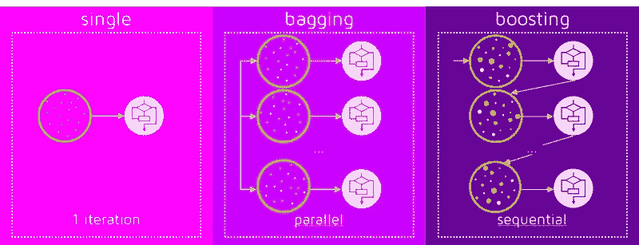

# 机器学习中的集合。

> 原文：<https://medium.com/mlearning-ai/ensembling-in-machine-learning-14e378f30039?source=collection_archive---------2----------------------->

Source: [https://news.stanford.edu/news/2014/september/images/14267-motivation_news.jpg](https://news.stanford.edu/news/2014/september/images/14267-motivation_news.jpg)

## 通过学习 Kaggle 大师用来赢得比赛的技术来获得金牌。

因此，如果你曾经是 kaggle 的表格游乐场系列的一部分，你会注意到通常在顶部的笔记本有一个共同点。他们使用一堆模型，并以这样或那样的方式汇总它们的输出，以获得更准确的分数。我曾经这样做得了 8 级。

这无非就是合奏学习。让我们来看看你如何利用它来获得你自己的金牌。

# 什么是组装？

要知道什么是合奏，首先你需要知道什么是合奏。那是什么呢？

通俗地说，系综是一组被集体而不是单独观看的物品。同样的意思适用于机器学习的上下文，其中项目是单独的模型。

因此，我们基本上训练一堆模型，并聚合它们的输出以形成更好的模型，这就是我们的集成模型。

但是为什么我们在机器学习中需要集成呢？

让我用一种方式来描述它，这将帮助你围绕这个主题建立你的直觉，同时也浏览与集成相关的机器学习术语和不同类型的集成方法。

Photo by [Nicholas Cappello](https://unsplash.com/@bash__profile?utm_source=medium&utm_medium=referral) on [Unsplash](https://unsplash.com?utm_source=medium&utm_medium=referral)

想象你；鲍勃是个投资新手，他想把收入投资到股票市场。在与你的朋友 Alice(她也是投资界的新手)交谈后，你决定投资苹果公司。但是这样可以吗？爱丽丝的意见是你把辛苦赚来的钱投资到一只你根本不了解的股票所需要的全部吗？

当然不是。一个人的意见，不管他多么有经验，都不能作为这样一个决定的基础。

那你是做什么的？

你再给 10 个朋友打电话，每个人都有不同的背景和交易历史。你问他们，“我应该投资什么股票？”。

其中 4 人说是特斯拉，3 人说是谷歌，剩下 3 人说是苹果。现在你有了更多不同群体的意见，可以做出明智的决定。

这是组装的基本要点。将一群学习能力差的人(朋友)结合起来，他们单独可能不会给出如此准确的预测，但结合起来就会成为非常强的学习者，他们的优势可以弥补其他人的劣势，他们可以做出更好、更准确的预测。

# 硬投票

随着故事的发展，我们现在知道我们的朋友认为什么股票最适合我们投资。但假设我们有资金问题，只能投资一只特定的股票。我们选择哪只股票？

答案似乎很明显。特斯拉因为是最大的群体，我们 10 个朋友中有 4 个推荐它。

这无非就是硬票或者多数票。在这种投票策略中，我们基本上选择票数最高的选项(在我们的例子中是特斯拉),然后继续进行。

这是一个非常简单的策略，也在许多真实世界的用例中使用。

但这是最好的吗？

# 软投票

假设 10 个朋友中有 2 个是经验丰富的交易者，有 10 年以上的经验，其中 3 个在过去 3 年里一直在投资，剩下的 5 个是新手。在这种情况下，所有朋友的意见都有同样的分量吗？如果你只能问一群朋友，你会选择谁就很明显了。

但是假设你只考虑一个群体的意见，其他人就会生气。你不想那样，就像他们说的“你的关系网就是你的净资产”。那你是做什么的？

幸运的是，同样的事情也适用于我们的投票策略。这就是所谓的软投票。我们不是选择票数最高的选项，而是。

1.  计算每个朋友选择每只股票的概率。
2.  将概率乘以分配给该朋友的权重。
3.  将每个朋友按股票分组的概率相加。(都是特斯拉的，谷歌的等等)
4.  选择概率最高的一个。

让我们用数学来说明这一点。

假设你朋友的权重是 W1，W2，W3，…..，W10。如果我们认为他们的概率分数是一个浮点数 a，b，c，…..然后，我们可以将软投票算法表示为:

a*W1 + b*W2 + …..+ j*W10

然后我们可以选择概率最大的股票。

例如，你可以给有经验的朋友 1.5 的权重，而给新手 0.8 的权重，从而得出更好的结论。

这样，你所有朋友的意见都会被考虑，那些更有经验的人在你的决策过程中也有更大的发言权。

但是问朋友是投资股市的唯一途径吗？

不。还有很多其他的方法。类似地，也有更多的集合技术可以用于机器学习。

让我们来看看 4 个最受欢迎的。

Source: [https://quantdare.com/wp-content/uploads/2016/04/bb3-800x307.png](https://quantdare.com/wp-content/uploads/2016/04/bb3-800x307.png)

# 助推

可以说是最著名的集合算法。这就是为什么大多数获奖的笔记本电脑都使用这种或那种形式的升压。

现在想象一下，在接受了朋友的建议后，你投资了 10 只股票。最初其中两个成功了，给你带来了利润，而其他 8 个有下降趋势。你会拿了钱就走吗？

不。你用你的新知识和经验把它再投资到股票市场。

你继续这样做，变得越来越好。首先，你的股票中只有 3 只盈利，然后是 5 只，7 只，等等。

这就是助推背后的逻辑。你按顺序训练多个弱学习者，在每次迭代后，新模型试图弥补前一个模型的弱点。这样，在序列的末尾，我们将拥有一个强大的学习器，我们可以用它来做出更准确的预测。

在推进过程中，每一种模式都在前一种模式失败的领域有所改进。这意味着数据通过所有模型传递，并且它们是互连的。

它是这样工作的:

1.  你把数据集放到一个基本模型上。让我们称之为模型 1。
2.  现在，您使用此模型对数据集进行预测并获得误差。
3.  不正确的预测被赋予更高的权重。
4.  该过程继续，并重复步骤 2-3，直到达到最大迭代次数或误差不再减小。

由于它的流行，有许多不同的升压算法，如:

1.  Xgboost。
2.  Adaboost。
3.  LightGBM。
4.  Catboost。

# 制袋材料

与顺序运行的增压不同，装袋是并行运行的。在 bagging 中，模型被并行训练而不相互影响，即它们相互独立，而不是一次又一次地相互校正。

回到这个故事，让我们假设你现在有一些交易经验，想在一只股票上全押。你是做什么的？

你考虑了你从之前的投资中学到的所有利弊，并综合它们得出结论。

这就是装袋背后的直觉。

在 bagging 中，你把一群弱学习者的输出集合起来，得到一个强学习者。但是因为所有的弱学习者都是相同类型的模型，他们将给出相同类型的输出。那你是做什么的？

自举。这是一种创建具有各种观察和特征的数据子集的方法，带有替换。

有趣的事实:这就是 bagging 名字的由来。引导聚合。

它是这样工作的:

1.  您将数据集分成不同的子集，每个子集具有不同的观察值和特征。
2.  您可以在基本模型上独立地训练每个子集。
3.  然后，对所有弱模型进行预测，并使用聚合函数聚合它们以形成最终预测。

# 堆垛

堆叠在某种意义上类似于装袋，它使用并行训练的多个模型。但不同之处在于，它将他们的预测串联起来，并将其输入到另一个模型中，以获得强大的学习者。

让我们假设 Bob 在之前的投资中亏损，并且不希望这种情况再次发生，所以他使用一种投资策略来预测股票价格。他使用一系列不同的策略来预测价格，并将结果串联起来。然后，他将结果输入另一个计算器，得到最终的预测。

这是堆叠。

在堆叠中，我们使用相同的数据集来训练不同类型的多个模型，如 KNN 模型、决策树甚至神经网络。这些模型被称为 0 级。然后，我们使用这些模型进行预测，并将结果连接起来，形成一个新的数据集。这个新数据集还可能包含原始输入要素，以提供额外的上下文。这个新的数据集然后被用作训练元模型(级别 1)的输入，该元模型输出最终的预测。

因此，你基本上是在 0 级使用一堆不同的模型，获取它们的输出，组合它们，并将其作为输入提供给另一个模型。

当基本模型的结果彼此相关性很低时，最好使用叠加。

它是这样工作的:

1.  把数据分成 n 份。(使用 K 倍验证或其他技术)
2.  在 n-1 个部分上训练模型，并对剩余部分进行预测。对所有零件进行此操作，即 n 次。
3.  在整个数据集上训练模型并获得预测。这是你的新数据。
4.  对一堆其他模型也这样做，并连接数据。
5.  使用这些数据作为元模型的输入来获得最终的预测。

如果是回归任务，使用线性回归模型，如果是分类任务，使用逻辑回归模型作为元模型。

通常最好使用更多样、更复杂的模型作为基础模型，这些模型做出不同的假设。而元模型是简单的，提供了对基础模型输出的平滑解释。

# 混合

我将不会进入更多关于混合的细节，因为它和堆叠是一样的。

唯一的关键区别是，不是将数据分成 n 部分并训练模型 n 次。数据被分成两部分:训练集和验证集，预测是在验证集上进行的。这些预测随后被用作新的数据集。

它是这样工作的:

1.  把数据分成两部分。(培训和验证)
2.  在训练集上训练模型，并在验证集上进行预测。
3.  对一堆其他模型也这样做，并连接数据。
4.  使用这些数据作为元模型的输入来获得最终的预测。

集成可能不总是比独立模型给你更好的分数，但它是你机器学习武库中的一个很好的工具。

以上是各种组装技术。让我们希望 Bob 在他的投资事业中取得成功，而你在你的机器学习之旅中也取得成功。

有大量不同的资源可供使用，我建议您使用 scikit-learn 编写代码，并创建一个真实的用例来了解更多信息。

我计划写更多关于不同增强技术以及如何编码它们的博客，请关注更多精彩内容。

这里有一些我觉得有趣的额外资源。

1.  [https://www . analyticsvidhya . com/blog/2018/06/comprehensive-guide-for-ensemble-models/](https://www.analyticsvidhya.com/blog/2018/06/comprehensive-guide-for-ensemble-models/)
2.  [https://machine learning mastery . com/stacking-ensemble-machine-learning-with-python/](https://machinelearningmastery.com/stacking-ensemble-machine-learning-with-python/)
3.  【https://www.ibm.com/cloud/learn/boosting 
4.  [https://www.ibm.com/cloud/learn/bagging](https://www.ibm.com/cloud/learn/bagging)

 [## Mlearning.ai 提交建议

### 如何成为 Mlearning.ai 上的作家

medium.com](/mlearning-ai/mlearning-ai-submission-suggestions-b51e2b130bfb)