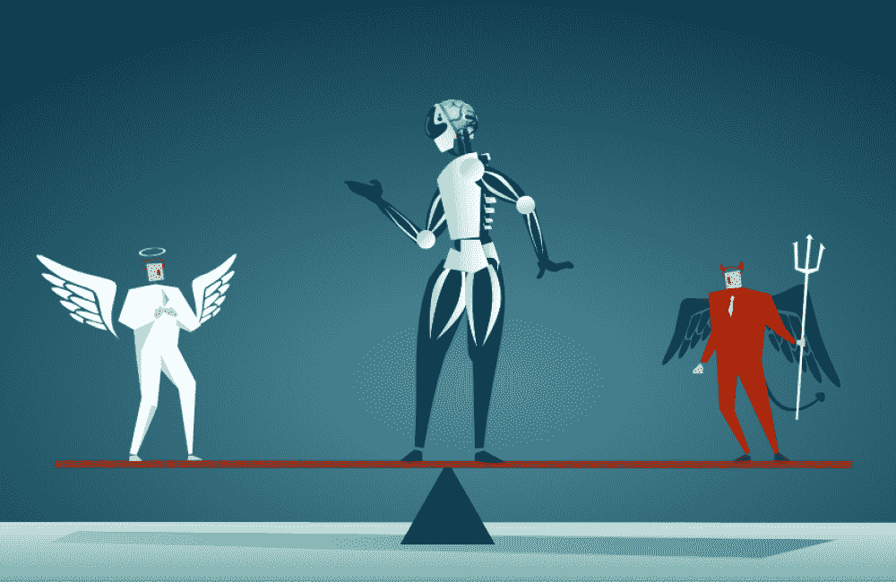

# 伦理人工智能已经严重注定要下地狱。

> 原文：<https://medium.com/mlearning-ai/ethical-ai-has-been-seriously-doomed-to-hell-5d1311c46506?source=collection_archive---------12----------------------->

## 公司印钞的可怕真相。我们在推动伦理人工智能投入使用方面失败了吗？

Source: [Governmentciomedia](https://governmentciomedia.com/next-topic-ai-master-ethics)

人工智能革命被普遍称为工业 4.0，是一个存在了十多年的古老概念。它的用例一如既往地具有扩展性和变革性。这就是为什么大型科技公司会抓住最小的机会…