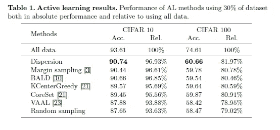
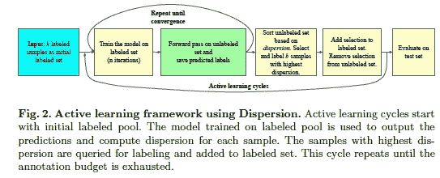
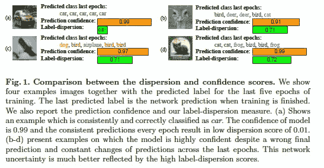
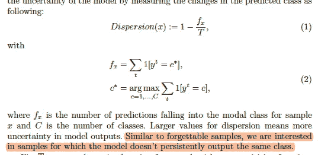
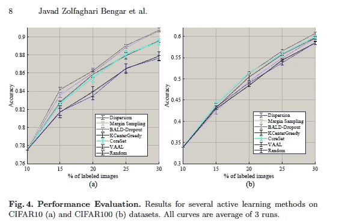

# 评估标签分散。它是评估模型不确定性的最佳度量吗？

> 原文：<https://medium.com/mlearning-ai/evaluating-label-dispersion-is-it-the-best-metric-for-evaluating-model-uncertainty-e4a2b52c7fa1?source=collection_archive---------1----------------------->

## 一个有趣的想法。但是，相比之下，它的表现如何？

如果你关注我的作品有一段时间了，你会看到我涵盖了很多计算机视觉研究。计算机视觉已经看到了传统机器学习技术的一些真正创新的用途，以及大量的投资。而且理由很充分。处理图像是一种昂贵的输入。鉴于计算机视觉在各种有利可图的应用中是多么有用，创造低成本、高性能的学习代理有着巨大的激励。在这些各种各样的创新中，有一个非常有趣的机器学习协议，叫做主动学习。做得好的话，**主动学习会降低培训成本，同时不会影响绩效。**为了最大限度地提高主动学习的性能，我们需要一种可靠的方法来评估模型对特定样本的置信度。“[当深度学习者改变他们的想法:主动学习的学习动力](https://arxiv.org/abs/2107.14707)”的作者提出了一种新的衡量标准。

The Table shows us that Label Dispersion has better performance than other Active Learning Protocols

在这篇文章中，我将介绍主动学习的基本思想，以及为什么你应该关注它。一旦我们对它有了很好的理解，我们将进入标签分散，他们提出的用于评估训练有素的机器学习网络中的不确定性的度量。我们将研究概念，并评估性能。像往常一样，论文的注释版本在最后被链接。浏览一遍，了解我对这篇论文的详细想法，以及他们的方法(超出了我在这里可以进入的范围)。如果这篇文章对你有用，一定要拍手分享给其他人。总是感谢反馈。

# 理解主动学习

This is the process used by the authors.

主动学习的一个很好的定义是，“*主动学习是机器学习的一个特例，在这种情况下，学习算法可以交互式地询问用户(或一些其他信息源)，以用期望的输出来标记新的数据点。*“简而言之，在使用初始标记数据集进行训练后，我们遍历未标记数据集以选择“最佳”样本。这些样本被发送给教师(甚至可以是人)，然后教师标记数据样本并将其添加到标记池中。模型被重新训练。你可能想知道这比半监督学习有什么好处。让一个人注释数据样本是很昂贵的，那么为什么不直接实现 SSL 并使用伪标签呢？

Make sure you like and Subscribe.

答案很简单。虽然每个数据样本的标注成本更高，但是**主动学习使用总样本的一小部分**。这就是秘密。主动学习抵消了通常在计算机视觉研究中看到的对巨大数据池的需求(字面上的 Pb 级数据)。为了更全面地了解这个话题，请观看这个视频。没有必要理解这篇文章的其余部分，但是主动学习绝对是你将来应该知道的事情。

# 那么模型不确定性与主动学习有什么关系呢？

快速回答，大多数主动学习代理选择他们最不确定的样本。逻辑如下。如果你的模型已经对一个样本很有信心，那么对它进行注释并添加到训练库中是没有用的。当注释和添加到我们的列表中时，示例模型不确定是否能最好地工作。因此，准确地评估模型的不确定性是我们创建高性能主动学习学习代理的最佳选择。

# 为什么网络信心不够

上面的图像清楚地解释了我们的问题。通常，神经网络对自己的预测非常自信，即使预测实际上是错误的。这可能导致两个问题:

1.  他们会因为过于自信而错过应该学习的样本。他们会认为自己非常了解一个样本。看看图 d，网络对一个错误的预测有 0.99 的置信度。
2.  类似地，该模型将挑选它具有错误的较低置信度的其他图像。这没有第一种情况那么糟糕，但是让你的学习效率更低。对于较大规模的项目，这可能会增加。

# 标签离差:一种新的度量

既然我们知道了为什么模型置信度本身并不是最好的度量，那么让我们来看看标签离差。对我来说，有几个因素让一个指标变得伟大。一个是性能(很明显)。计算起来也应该相对便宜。最后，指标应该有意义(在逻辑层面上)。

The formula for calculating dispersion.

左边是他们用来计算标签离差的数学公式。符号可能看起来吓人，但这个想法看似简单。我们让我们的模型多次预测图像的标签。如果我们有相同的预测，我们将有一个低标签分散。请看下图 a。由于模型总是预测一辆车，所以离散度很低。如果我们有不同的标签被预测，那么我们的模型是“困惑”的。这意味着更高的值。虽然其他图像(b、c、d)具有相似的预测置信度，但是它们具有显著更高的标签离差值。

Look at it again

这种方法检查了我们 3 个标准中的 2 个。它在直觉层面上是有意义的，并且计算起来相对便宜(使用训练好的模型预测样本总是便宜的)。该表在开始时显示了有希望的结果。让我们看看其他的表现，看看标签分散保持得如何。

在基准测试 CIFAR10 和 CIFAR100 上，我们看到色散在精度方面表现非常好。这是一个非常有希望的迹象，并显示了标签分散作为计算模型不确定性的度量的潜力。这核对了我们在清单上的最终标准。

# 结论

基于论文的结果，标签离差肯定是一个有前途的度量，我们可以在主动学习中使用。我会深入调查的。作为一个新的指标，它需要在更多的环境和基准中进行更多的测试，然后才能得出结论。然而，这是一个非常有前途的指标，所以请保持警惕。未来人们肯定会使用更多。

# 纸

正如所承诺的，这是带注释的论文，你可以阅读以获得更多的见解。

# 向我伸出手

如果这篇文章让你对联系我感兴趣，那么这一部分就是为你准备的。你可以在任何平台上联系我，或者查看我的其他内容。如果你想讨论家教，发短信给我。我帮助人们进行机器学习、人工智能、数学、计算机科学和编码面试。

如果你想支持我的工作，使用我的免费罗宾汉推荐链接。我们都有免费的股票，对你没有风险。所以不使用它只是失去了免费的钱。

查看我在 Medium 上的其他文章。:[https://rb.gy/zn1aiu](https://machine-learning-made-simple.medium.com/)

我的 YouTube:【https://rb.gy/88iwdd 

在 LinkedIn 上联系我。我们来连线:【https://rb.gy/m5ok2y】T4

我的 insta gram:[https://rb.gy/gmvuy9](https://rb.gy/gmvuy9)

我的推特:[https://twitter.com/Machine01776819](https://twitter.com/Machine01776819)

我的子任务:[https://devanshacc.substack.com/](https://devanshacc.substack.com/)

twitch 现场对话:[https://rb.gy/zlhk9y](https://rb.gy/zlhk9y)

获得罗宾汉的免费股票:[https://join.robinhood.com/fnud75](https://join.robinhood.com/fnud75)