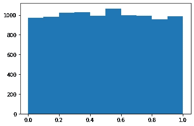
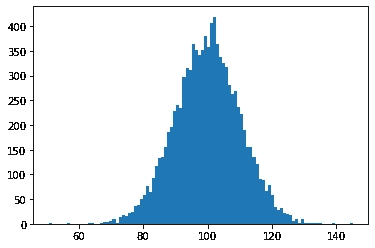
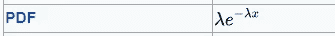
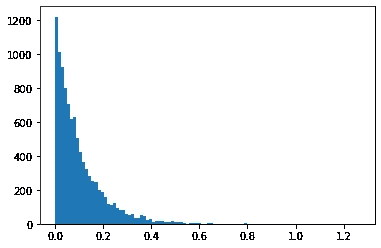
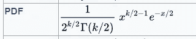
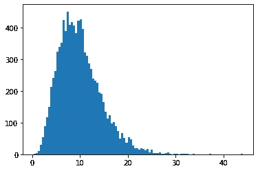

# 有没有想过计算机是如何按照一定的分布生成随机数的？

> 原文：<https://medium.com/mlearning-ai/ever-wondered-how-a-computer-generates-random-numbers-following-a-certain-distribution-b8226dd8da9?source=collection_archive---------6----------------------->


Photo by [Sergi Viladesau](https://unsplash.com/@svi_designs?utm_source=unsplash&utm_medium=referral&utm_content=creditCopyText) on [Unsplash](https://unsplash.com/s/photos/shuffling-cards?utm_source=unsplash&utm_medium=referral&utm_content=creditCopyText)

你有没有想过，计算机是如何按照一定的分布生成随机数的？这是一个合理的问题。它总是暗示科学家我们如何产生随机性。在这篇博客中，我们将探讨这个问题，并讨论计算机使用的算法来生成符合特定概率分布的随机变量。

## 随机数发生器的应用

在我们开始讨论算法之前，最好理解生成随机数的必要性。这里提到的是随机数生成方法(RNG)的几个应用。

1.  蒙特卡罗方法:这种方法用于理解不确定事件的结果。在这种方法中，从一个域的概率分布中随机生成输入是至关重要的。我们需要 RNG 来使用这种方法。
2.  深度学习中的正则化:深度学习模型的正则化的最常见方法是通过使用辍学。Dropout 是一种在训练过程中忽略随机选择的神经元的技术。用于实现退出的随机分布对模型的性能有重要影响，并且使用 RNGs 我们可以选择最佳分布以获得最佳性能。
3.  密码学:例如，在公钥|私钥加密中，当我们需要为用户生成随机的公钥和私钥对时，我们需要 RNG。理解伪随机数发生器的确定性会影响加密方法的安全性是很重要的。

## 按照一定的概率分布生成样本的过程

比方说，我们想要一个来自具有𝐹(𝑥).累积分布函数的分布的 n 个元素的样本我们可以从 U(0.0，1.0)中采样 n 个元素，并使用𝐹−1(𝑈(0.0,1.0，即累积分布函数的逆来从期望的分布中创建样本。这个方法叫做**逆 CDF 方法**。

因此，首先要应用这个方法，我们需要一个函数，它可以从 0.0 和 1.0 之间的均匀分布中生成样本。

**从边界为 0.0 和 1.0 的均匀分布中生成样本**



Histogram of the Sample generated using the below function

我们将使用一个简单的技术从 U(0.0，1.0)生成一个样本。用于生成随机数的函数是(ax+b)mod(10^k)/10^k.，其中 a 和 b 是任意的，k 是我们希望从每次观察中得到的小数位数。最初，提供一个随机种子作为输入，将上述函数应用于该种子，并将其添加到样本列表中。现在，我们再次使用新生成的数字作为上述函数的种子，并生成另一个随机数。这种方法是自回归的，本质上也是确定性的，使得它对于某些应用是不可行的。我们不断地自动回归生成数字，直到我们得到所需数量的元素。您可以在下面的代码中找到上述方法的 Python 函数。

```
def random_generator(n, seed=10):
    '''
    This function will generate random numbers
    between 0.0 and 1.0\. The function uses the 
    seed value to generate a number and feeds the result back
    to the generator as the new seed. The function used to
    generate random numbers is (ax+b)mod(m) 
    '''
    rands = []
    for i in range(n):
        ## a = 16 & b=232
        rn = (16*seed + 232)%(10**9)
        seed = rn
        rands.append(rn/(10**9))
    return rands
```

现在，我们有一个函数，可以生成 0.0 到 1.0 之间的 n 个元素的样本。我们可以应用逆 CDF 方法从几个众所周知的分布中生成样本。

**常态分布**


PDF of Normal Distribution(Wikipedia)

正态分布有两个参数，均值和标准差。我们可以从 scipy 模块得到正态分布的逆 CDF 函数。这将用于生成正态分布样本

```
from scipy.stats import norm### Inverse Cumulative Distribution Function of Norm : norm.ppf()def normal_distribution(n, mean, std):
    '''
    This function returns a sample of n elements 
    following the normal distribution : N(mean, std)
    '''
    base = random_generator(n)
    return [norm.ppf(i, loc=mean, scale=std) for i in base]
```

使用上面的函数，我们可以从一个均值和标准差的样本中生成 n 个观察值。



Histogram of the generated sample Norm(m=100, std=10)

**指数分布**



PDF of exponential distribution(Wikipedia)

指数分布有一个影响分布衰减的参数λ。我们可以从 scipy 模块得到指数分布的逆 CDF。

```
from scipy.stats import expon### Inverse Cumulative Distribution Function of expon: expon.ppf()def exponential_distribution(n, loc, lam):
    '''
    Generates a sample of n elements following
    the distribution Exp(lam)
    '''
    sc = 1/lam ## Controls the rate of decay of the distribution
    base = random_generator(n)
    return [expon.ppf(i, loc=loc, scale=sc) for i in base]
```

使用上述函数，我们将从指数分布中生成一个样本。



Histogram of the generated sample(Exp(lambda=10))

**卡方分布**



PDF of chi-squared distribution(Wikipedia)

卡方分布有一个参数:影响图形形状的自由度。我们可以从 scipy 模块得到卡方分布的逆 CDF。

```
from scipy.stats import chi2
### Inverse CDF of chi-squared: chi2.ppf()def chi2_distribution(n, df):
    '''
    Generates a sample of n elements following
    the distribution chi-squared distribution with degrees freedom
    '''
    base = random_generator(n)
    return [chi2.ppf(i, df=df) for i in base]
```

使用上述函数，我们将从卡方分布中生成一个样本。



Histogram of the generated sample chi2(df=10)

**结论**

最后，我们需要的是一个函数，它可以生成 bouds 0.0 和 1.0 之间的均匀分布样本，以及所需分布的逆累积分布函数，我们可以使用逆 CDF 方法从所需分布生成样本。

感谢您的关注！

GitHub:[https://GitHub . com/Shiva tiya-meduri/Articles/blob/1b 8 c 12 bbfae 7231 FD 75d 225 FBC 61 DD 4 da 64 ee 96 b/prng . py](https://github.com/shivaditya-meduri/Articles/blob/1b8c12bbfae7231fd75d225fbc61dd4da64ee96b/PRNG.py)

[](/mlearning-ai/mlearning-ai-submission-suggestions-b51e2b130bfb) [## Mlearning.ai 提交建议

### 如何成为 Mlearning.ai 上的作家

medium.com](/mlearning-ai/mlearning-ai-submission-suggestions-b51e2b130bfb)