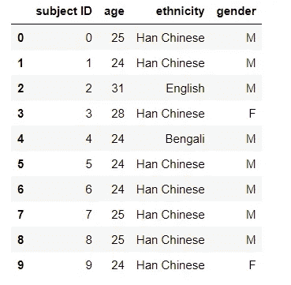
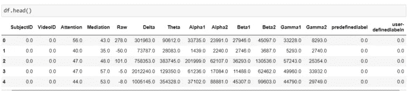
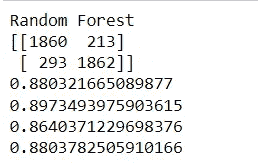
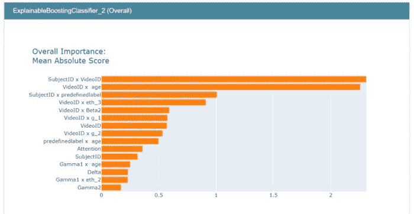
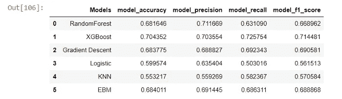

# 可解释的人工智能

> 原文：<https://medium.com/mlearning-ai/explainable-ai-seeing-inside-the-model-in-eeg-brain-waves-data-with-glass-box-3d35d2c6c901?source=collection_archive---------7----------------------->

## 用玻璃盒观察脑电数据中的模型内部

Photo by [Maik Hankemann](https://unsplash.com/@maik_waf?utm_source=unsplash&utm_medium=referral&utm_content=creditCopyText) on [Unsplash](https://unsplash.com/?utm_source=unsplash&utm_medium=referral&utm_content=creditCopyText)

本文由[阿尔帕斯兰·梅斯里](https://medium.com/u/fe99f0a4a612?source=post_page-----3d35d2c6c901--------------------------------)和[乌古尔·齐亚·西弗奇](https://medium.com/u/affd2737694a?source=post_page-----3d35d2c6c901--------------------------------)撰写。

可解释的人工智能对于增加对机器学习模型的控制至关重要。要做到这一点，有一些技术和库。在本文中，在一个实验(EEG 脑波)中，我们将介绍 Python“解释”库和 EBM 模型，以展示可解释的人工智能如何提高研究人员调试模型的能力。

在 EEG 脑波实验中(你可以通过 Kaggle 访问这个[链接](https://www.kaggle.com/datasets/wanghaohan/confused-eeg)的数据。)，通过让受试者观看不同的视频来测量受试者的脑电波。共准备了 20 个视频，每个类别 10 个视频。在简单类别中，选择了简单的代数和几何等不容易混淆的科目。在复杂类别中，选择了学生水平以上的科目，如量子力学。在观看这些视频时，受试者的δ、θ、α1、α2、β1、β2、γ1、γ2 脑电波被测量。在这些测量结束时，可以通过查看脑电波来了解人们是否对经过训练的人工智能模型感到困惑。

如果这种技术可以用于教育部门，教育工作者可以调整他们所教课程的难度和难易程度，这要归功于他们从学生的脑电波中获得的反馈。他们可以自动识别不理解的部分，并在没有学生要求的情况下重复。由于未来几年教学角色将从人类转向人工智能，这类研究预计会增加更多。

在这项研究中，我们试图通过使用 Python“解释”库的玻璃盒模型，从实验中学生的 EEG 脑电波中预测混淆状态。

在大多数人工智能模型中，算法的功能无法从外部观察到。这种情况阻止了使用模型的研究人员了解算法使用了更多的功能。为了克服这一点，它必须使用更简单的算法，如线性回归或黑盒解释器(如特性重要性图、LIME 和 SHAP)来确定特性的重要性。看不到模型的功能可能会导致目标泄漏，如下例所示。

在一些特定行业，如银行业，公司政策限制使用那些不能透明显示人工智能模型使用哪些功能以及使用多少的模型。很明显，未来将在司法机制中使用的 ML 模型也将被要求以可解释的方式设计。解释的权利就是一个例子。

在这项研究中，在不排除第一次试验中的任何特征的情况下，用几种不同的 ML 算法计算准确度。在第二阶段，通过对玻璃盒模型执行相同的操作，检查模型在多大程度上使用了哪个特征。通过分析，可以确定该模型几乎只使用了两个特性。当检查这些特征(学生 ID 和视频 ID)时，已经确定它们导致了目标泄漏。随着这两个特征的去除，模型开始对测试数据进行更准确的预测。

首先，导入必要的库并读取 csv 文件。

名为 demo 的变量的内容如下。它包含关于主题的基本信息。

现在让我们看看 df 变量的前五行。在这个研究中，我们的目标变量是用户定义的 label 列。

我们结合了演示和 df 变量。因为两个表都有一个主题 ID 列，所以在新创建的 df 变量中创建了两个主题 ID 列。我们丢弃了其中一列。我们用平均值填充了关注和调解列中的空数据。

在数据集中，有“种族”和“性别”列，它们的数据存储为字符串。首先，我们将 df 变量复制到 df1 变量。然后我们对 enc_data 变量中的这两列执行 onehotencoder 操作。然后，我们使用 join 函数将这里的数据与 df1 变量中的数据结合起来。在此过程之后，我们删除了 OneHotEncoder 创建的列，并编辑了添加的新列的名称。

可用数据分为训练数据和验证数据两部分。

我们通过调用随机森林模型进行了预测。第一次尝试的结果似乎很高。

这里高分的原因是数据集中的主题和视频 ID 信息没有被删除。单独使用这些特征将产生良好的研究结果，而模型对新输入数据的整体预测能力将很差。我们使用可解释的提升分类器来验证我们的假设，并查看哪些特征对结果的贡献最大。

可以看出，该模型大量使用了主题 ID 和视频 ID 功能。这些列在下一步中被删除了，因为我们想根据脑电波来概括预测。

当比较 6 个不同的模型时，可以看出 EBM 的性能与黑盒模型相似。这样，通过对相同的数据运行 EBM，可以了解 XGBoost 使用哪些功能做出决策，XGBoost 通常表现良好，是数据科学竞赛中的高度首选。

在本研究中，使用玻璃盒进行了检测目标泄漏的示例性研究，并介绍了解释库的可解释增强机器(EBM)模型。

 [## Mlearning.ai 提交建议

### 如何成为 Mlearning.ai 上的作家

medium.com](/mlearning-ai/mlearning-ai-submission-suggestions-b51e2b130bfb)