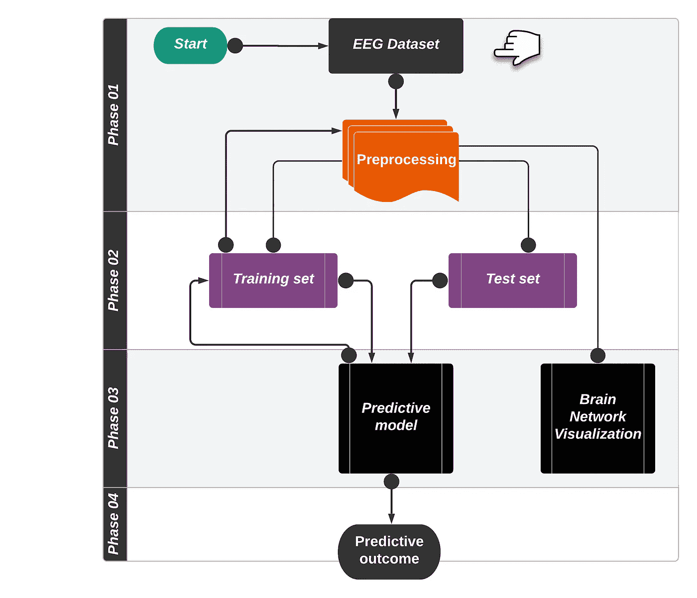

# 探索大脑信号的模式:机器学习的最新进展

> 原文：<https://medium.com/mlearning-ai/exploring-the-patterns-in-brain-signals-state-of-the-art-of-machine-learning-4c0efa3c6f77?source=collection_archive---------2----------------------->

的确，大脑信号非常难以分析，因为这些类型的复杂数据包含大量噪音，提取有意义的见解相当具有挑战性。但随着最先进的机器学习(ML)技术的出现，检查变得更加容易和准确。在本文中，我将讨论如何使用最先进的 ML 来分析大脑信号。

> 看完这篇文章你会学到什么？
> 
> 脑机接口(BCI)
> 
> BCI 在现实世界中的应用
> 
> 在大脑信号分析方面，你需要知道些什么？
> 
> 如何利用机器学习进行脑信号的模式识别？

L 让我们开始吧……

# **脑机接口(BCI)**

你知道神经科学是研究神经系统的科学吗？随着 BCI 的发现，有可能找到这个领域的许多见解，因为它直接连接在人脑和计算机系统之间。这项技术使用了大脑产生的电脉冲。这些脉冲被一个设备放大，并被发送到计算如何管理他们的计算机的软件。现在的问题是，既然人脑是由不导电的组织构成的，那么大脑是如何产生电信号的呢？

如你所知，我们人类的大脑由 10000 亿个微观细胞组成，通常被称为“神经元”，所以一般来说，要数清神经元是相当不可能的！！可以说**【动作电位】**是神经元用来传递电脉冲的。正电荷离子穿过神经膜的流入导致了这一事件。像所有细胞一样，神经元在整个细胞膜中保持不同的离子浓度。

# **BCI 在现实世界中的应用**

BCI 有几个优点，但主要应用如下:

*   失去肌肉控制或瘫痪的人
*   神经肌肉控制能力差的人会出现肌肉抽搐和眼球运动受限。
*   具有良好神经肌肉控制的个体需要肌肉相关的有益技术来完成某些任务。

# **在大脑信号分析领域，你需要了解哪些知识？**

即使 BCI 在现实世界中有潜在的影响，你为什么需要 ML 方法呢？因为评估和解释从这些 BCI 设备收集的数据是一项艰巨的任务，所以人们正在创造软件工具来帮助研究人员。换句话说，ML 可以分析许多类型的复杂数据，这是传统工具所不能做到的；此外，随着 ML 的使用，如今医疗保健重要部门的数据分析变得非常容易。更重要的是，在使用 ML 进行脑信号分析方面，没有一个完整的大纲可以让你从中获得一些基本的想法；然而，以下强调了一些主要要点供考虑:

*   Python 编程
*   根据数据做出决策的能力
*   对脑机接口(BCI)和脑电图(EEG)数据有清晰的理解。
*   神经网络

# **如何利用机器学习对大脑信号进行模式识别？**

先说机器学习(ML)，本世纪热门话题之一[😏](https://madgicx.com/facebook-emojis/)脑信号分析可以通过以下四个重要步骤进行:采集脑信号数据、数据清洗、特征提取、特征选择、分类阶段和脑网络可视化。图 1 示出了脑信号分类和分析的主要步骤。

**Fig.1: Steps of the Brain Pattern Recognition**

> **第一阶段:收集脑信号数据:**
> 
> 数据收集对于基于机器学习的工作非常重要，而决策是通过观察数据做出的，因此，在开始工作之前，有必要收集执行大脑信号分析所需的信息。以下链接可用于收集脑电图(EEG)数据集。脑电图最常见的用途是诊断癫痫，癫痫导致脑电图结果异常。它还可以用于检测睡眠问题、麻醉深度、昏迷、脑病和脑死亡。[https://sccn . ucsd . edu/~ Arno/fam 2 data/public _ available _ EEG _ data . html](https://sccn.ucsd.edu/~arno/fam2data/publicly_available_EEG_data.html)
> 
> **阶段 02:数据预处理**
> 
> 使用带通滤波和贝叶斯去噪等技术，我们必须在这个阶段从 EEG 记录中消除噪声和额外的特征。这一阶段将为处理准备数据，使检测癫痫相关信号更容易，并消除任何可能扭曲最终结果的不良假象。
> 
> **阶段 03:脑电信号图解**
> 
> 决定在哪个表示域中评估信号是至关重要的，以确保在癫痫诊断中使用最佳的 EEG 信号表示。时间、频率和联合时频域是研究人员最常用的表示域。
> 
> **阶段 04:脑电图特征提取**
> 
> 由于计算机只理解二进制数据，因此在应用任何机器学习算法之前，我们需要将我们的数据集转换为机器可读的语言，以便计算机能够准确识别数据。对于脑信号处理来说，从脑电信号中提取特征具有极其重要的意义。就特征提取而言，可以找到几种方法，但以下技术是经常使用的:
> 
> (a)如果测量，(b)图像描述符和图像处理技术
> ，例如形状和纹理描述符和局部二元模式(LBP)描述符，(c)熵特征，(d)纹理特征
> 
> **阶段 05:功能选择**
> 
> 在提取中会有冗余或不必要的特征，因此不是所有的特征都是决定性的。为了确保最终脑信号分析和分类的质量和正确性，这一阶段包括过滤掉最不相关的特征并消除不需要的特征。
> 
> **阶段 06:分类阶段**
> 
> 先前提取和过滤的特征现在准备用于最终的诊断和分类。几个分类器，例如人工神经网络和支持向量机，以及决策树，可以用于该步骤的分类。可以使用交叉验证方法来评估分类器的性能。可以使用留一策略进行验证，该策略产生真实泛化误差的近乎无偏的近似值。
> 
> **阶段 07:大脑网络可视化**
> 
> 可以将相关通道的坐标分配给顶点，以描绘大脑功能网络。此外，诸如应力优化方法和二元应力模型的网络可视化技术可用于显示网络拓扑。

在结论中，虽然最近的技术如 BCI 工作得相当好，但在这方面分析 BCI 数据是相当复杂的，因此机器学习的出现可以发挥重要作用。这篇文章解释了大脑信号分析和分类的通用管道，可能对那些正在考虑开始这一领域工作的人有所帮助。

**参考文献:**

1.  长度 Boubchir、S. Al-Maadeed、A. Bouridane 和 A. A. Chérif。"基于时频图像描述子特征的脑电癫痫发作活动检测和分类."载于:2015 年 IEEE 声学、语音和信号处理国际会议(ICASSP)，第 867–871 页，2015。
2.  长度 Boubchir、S. Al-Maadeed、A. Bouridane 和 A. A. Chérif。“基于时频图像的 LBP 描述符对用于检测癫痫发作活动的 EEG 信号进行分类。”载于:2015 年 IEEE 国际图像处理会议(ICIP)，2015 年，第 3758–3762 页