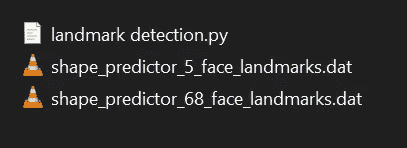

# 人脸标志检测使用 dlib 与源代码-易于实现

> 原文：<https://medium.com/mlearning-ai/face-landmarks-detection-using-dlib-with-source-code-easy-implementation-4118dcfaf40e?source=collection_archive---------3----------------------->

所以在今天的博客中，我们将使用 dlib 库实现面部标志检测项目。我们将执行 68 点和 5 点检测。所以没有任何进一步的原因。

**阅读全文带源代码这里—**[https://machine learning projects . net/face-landmarks-detection-using-dlib/](https://machinelearningprojects.net/face-landmarks-detection-using-dlib/)


# 让我们开始吧…

## 人脸标志检测代码…

```
from imutils import face_utils
import numpy as np
import imutils
import dlib
import cv2

face_detector = dlib.get_frontal_face_detector()
landmark_detector = dlib.shape_predictor('shape_predictor_5_face_landmarks.dat')

cam = cv2.VideoCapture(0)

while True:
    ret,image = cam.read()
    if ret:
        image = imutils.resize(image, width=500)
        gray = cv2.cvtColor(image, cv2.COLOR_BGR2GRAY)

        rects = face_detector(gray, 1)

        for (i, rect) in enumerate(rects):
            landmarks = landmark_detector(gray, rect,)
            landmarks = face_utils.shape_to_np(landmarks)
            (x, y, w, h) = face_utils.rect_to_bb(rect)
            cv2.rectangle(image, (x, y), (x + w, y + h), (0, 255, 0), 2)
            cv2.putText(image, f"Face {i + 1}", (x - 10, y - 10), cv2.FONT_HERSHEY_SIMPLEX, 0.5, (0, 255, 0), 2)
            for (x, y) in landmarks:
                cv2.circle(image, landmarks[-1], 1, (0, 0, 255), -1)
        cv2.imshow('Live feed',image)

    if cv2.waitKey(1)==27:
        break

cam.release()
cv2.destroyAllWindows()

# This was the code for Face Landmarks Detection.
```

*   第 1–5 行—导入所需的库。
*   第 7 行—使用 dlib . get _ frontier _ Face _ Detector()实例化人脸检测器，这是 dlib 中内置的人脸检测函数。
*   第 8 行—使用[***dlib . shape _ predictor(path)***](http://dlib.net/python/index.html#dlib.shape_predictor)实例化地标检测器，其中地标检测文件的路径作为参数传递。
*   使用路径到***' shape _ predictor _ 5 _ face _ landmarks . dat '***进行 5 点检测。
*   使用路径***' shape _ predictor _ 68 _ face _ landmarks . dat '***进行 68 点检测。
*   第 10 行—实例化 VideoCapture 对象以访问网络摄像头。
*   第 13 行—从网络摄像头读取图像。
*   第 14 行—继续，仅当网络摄像头返回任何内容时。
*   第 15 行—调整图像大小。
*   第 16 行—将图像从 BGR 转换为灰度。
*   第 18 行—检测图像中的人脸。它将返回矩形。
*   第 20 行—在检测到的面中横向移动。
*   第 21 行—检测地标。
*   第 22 行—将这些地标转换为 np 数组。
*   第 23 行——将我们的 face_detector 返回的面部矩形转换成边界框坐标。
*   第 24–25 行—画一个矩形，并在检测到的脸部周围的矩形上放置文本。
*   第 26–27 行—画出地标。
*   第 28 行—显示结果。
*   第 30–31 行—如果有人按 ESC 键，破解密码并退出。
*   第 33–34 行—释放网络摄像头并销毁所有打开的窗口。


## 文件夹层次结构…



如果对面部标志检测有任何疑问，请通过电子邮件或 LinkedIn 联系我。

**如需进一步的代码解释和源代码，请访问此处**—[https://machine learning projects . net/face-landmarks-detection-using-dlib/](https://machinelearningprojects.net/face-landmarks-detection-using-dlib/)

这就是我写给这个博客的全部内容，感谢你的阅读，我希望你在阅读完这篇文章后会有所收获，直到下次👋…

***看我以前的帖子:*** [***哈利的隐身衣***](https://machinelearningprojects.net/harrys-invisibility-cloak/)

**查看我的其他** [**机器学习项目**](https://machinelearningprojects.net/machine-learning-projects/)**[**深度学习项目**](https://machinelearningprojects.net/deep-learning-projects/)**[**计算机视觉项目**](https://machinelearningprojects.net/opencv-projects/)**[**NLP 项目**](https://machinelearningprojects.net/nlp-projects/)**[**烧瓶项目**](https://machinelearningprojects.net/flask-projects/) **at**********

****[](/mlearning-ai/mlearning-ai-submission-suggestions-b51e2b130bfb) [## Mlearning.ai 提交建议

### 如何成为 Mlearning.ai 上的作家

medium.com](/mlearning-ai/mlearning-ai-submission-suggestions-b51e2b130bfb)****