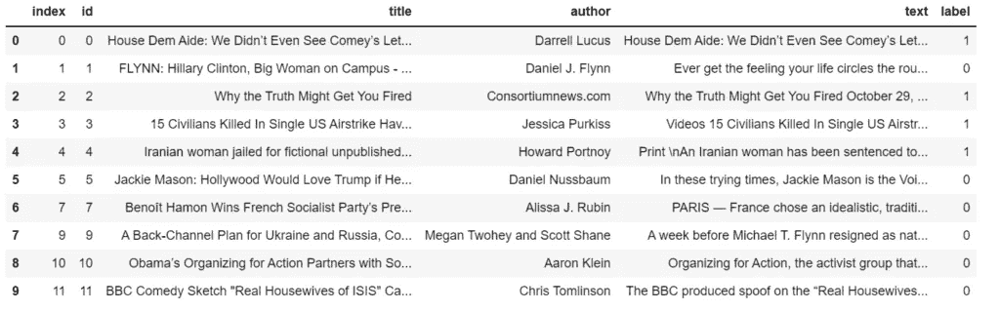
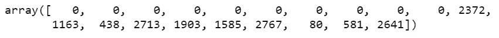
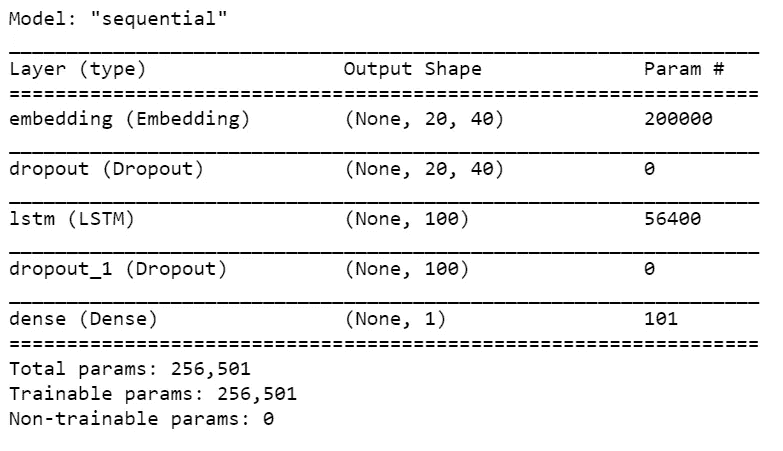
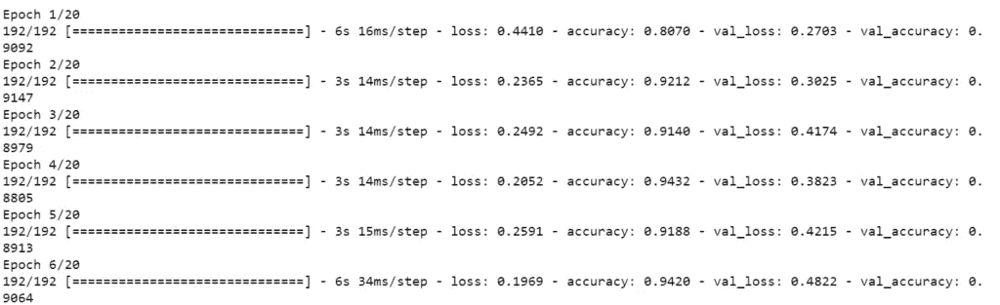
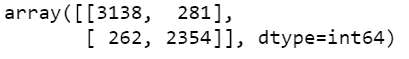
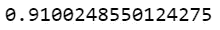

# 使用 LSTM 的假新闻分类器——带源代码

> 原文：<https://medium.com/mlearning-ai/fake-news-classifier-using-lstm-with-source-code-fun-project-4f0845e73c6a?source=collection_archive---------6----------------------->

所以在这个博客中，我们将使用 LSTM 实现一个假新闻分类器。所以没有任何进一步的原因。

**在这里阅读带源代码的全文—**[https://machine learning projects . net/fake-news-classifier-using-lstm/](https://machinelearningprojects.net/fake-news-classifier-using-lstm/)

点击此处查看视频—【https://youtu.be/XcHtSSKE6PI 

# 让我们开始吧…

## 步骤 1-导入假新闻分类器所需的库。

```
import re
import nltk
import numpy as np
import pandas as pd
import tensorflow as tf
from nltk.corpus import stopwords
from nltk.stem.porter import PorterStemmer
from tensorflow.keras.models import Sequential
from sklearn.model_selection import train_test_split
from tensorflow.keras.preprocessing.text import one_hot
from sklearn.metrics import confusion_matrix,accuracy_score
from tensorflow.keras.preprocessing.sequence import pad_sequences
from tensorflow.keras.layers import Embedding,LSTM,Dense,Dropout

nltk.download('stopwords')
```

## 步骤 2 —读取输入数据。

```
df = pd.read_csv('train.csv')
df.dropna(inplace=True)
df.reset_index(inplace=True)
df.head(10)
```



## 步骤 3-创建 X 和 y 数据。

```
X = df['title']
y = df['label']
```

*   对于 X，我们只取标题列。
*   对于 y，我们只取标签列。

## 步骤 4-清理输入数据。

```
ps = PorterStemmer()
corpus = []

for i in range(len(X)):
    text = X[i]
    text = re.sub('[^a-zA-Z]',' ',text)
    text = text.lower()
    text = text.split()
    text = [ps.stem(t) for t in text if t not in stopwords.words('english')]
    corpus.append(' '.join(text))
```

*   在这里，我们遍历 X，然后简单地使用正则表达式来清理我们的数据，并将其存储在语料库列表中。
*   首先，我们只是把所有不是字母表的东西都换成了空格。
*   然后我们把它小写并拆分。
*   然后我们检查单词是否不在停用词中，然后阻止它。
*   只需将这些结果连接起来，用它们造一个句子，并将其添加到语料库列表中。

## 步骤 5 —编码输入数据。

```
vocab_size = 5000
sent_len = 20

one_hot_encoded = [one_hot(x,vocab_size) for x in corpus]
one_hot_encoded = pad_sequences(one_hot_encoded,maxlen=sent_len)
one_hot_encoded[0]
```

*   这里我们使用 [one_hot](https://www.tensorflow.org/api_docs/python/tf/keras/preprocessing/text/one_hot) 将文本数据编码成数字数据。
*   记住这个热点不是 0 和 1。在这种一次性编码中，我们使用散列法给单词分配一个随机数。随机字从 0-vocab_size 的范围中选择。
*   然后我们用 0 填充序列，使每一行长度相同。
*   然后我们简单地检查这两个操作之后，我们的第一个句子是什么样子的。



## 步骤 6 —处理 X 和 y 数据。

```
X = np.array(one_hot_encoded)
y = np.array(y)
X_train, X_test, y_train, y_test = train_test_split(X, y, test_size=0.33, random_state=42)
```

*   将 X 和 y 转换为 NumPy 数组，并使用 [traintestsplit](https://scikit-learn.org/stable/modules/generated/sklearn.model_selection.train_test_split.html) 简单拆分数据。

## 步骤 7 —创建模型。

```
no_of_output_features = 40

model = Sequential()

model.add(Embedding(vocab_size,no_of_output_features,input_length=sent_len))
model.add(Dropout(0.5))
model.add(LSTM(100))
model.add(Dropout(0.5))
model.add(Dense(1))

model.compile(optimizer='adam',loss='binary_crossentropy',metrics=['accuracy'])

model.summary()
```

*   在这里，我们正在创建我们的模型。
*   我们的模型只有 4 层。
*   第一层是嵌入层，它将把我们上面看到的数字数组转换成一个 40 维的向量，后面是一个 [Dropout](https://keras.io/api/layers/regularization_layers/dropout/) 层。
*   然后我们有一个有 100 个节点的 [LSTM](https://keras.io/api/layers/recurrent_layers/lstm/) 层，后面是一个丢弃层。
*   脱落层用于防止过度贴合。



## 步骤 8-训练假新闻分类器模型。

```
model.fit(X_train,y_train,validation_data=(X_test,y_test),batch_size=64,epochs=40)
```



## 步骤 9——检查模型的指标。

```
pred = model.predict_classes(X_test)
confusion_matrix(y_test,pred)
```

*   在这一步，我们只是打印[混淆矩阵](https://scikit-learn.org/stable/modules/generated/sklearn.metrics.confusion_matrix.html)来检查我们模型的性能。



## 步骤 10-检查假新闻分类器模型的准确性。

```
accuracy_score(y_test,pred)
```



如果对这个话题有任何疑问，请通过电子邮件或 LinkedIn 联系我。我已经尽力解释这个代码了。

***探索更多机器学习、深度学习、计算机视觉、NLP、Flask 项目访问我的博客—*** [***机器学习项目***](https://machinelearningprojects.net/)

**如需进一步的代码解释和源代码，请访问此处**—[https://machine learning projects . net/fake-news-classifier-using-lstm/](https://machinelearningprojects.net/fake-news-classifier-using-lstm/)

*所以这就是我写给这个博客的所有内容，感谢你阅读它，我希望你在阅读完这篇文章后会有所收获，直到下一次👋…*

***看我以前的帖子:*** [***奇异值分解***](https://machinelearningprojects.net/singular-value-decomposition/)

[](/mlearning-ai/mlearning-ai-submission-suggestions-b51e2b130bfb) [## Mlearning.ai 提交建议

### 如何成为 Mlearning.ai 上的作家

medium.com](/mlearning-ai/mlearning-ai-submission-suggestions-b51e2b130bfb)