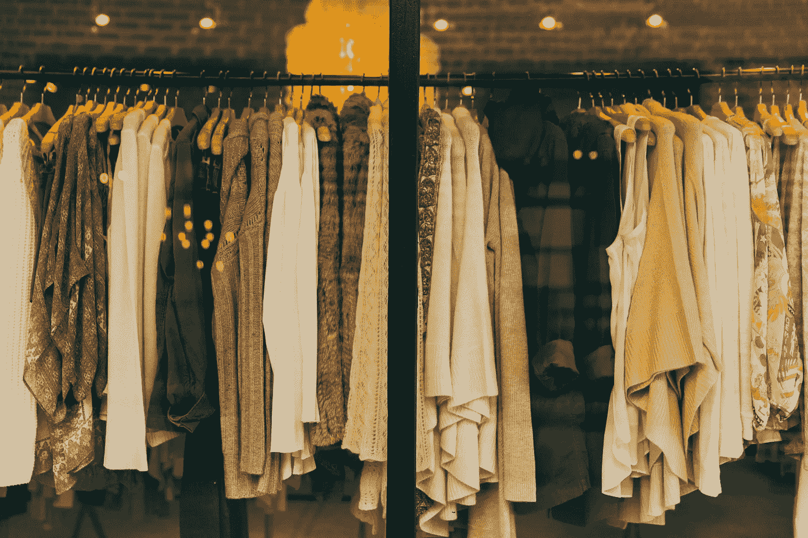

# 基于自然语言处理技术的时尚商品分类和推荐系统

> 原文：<https://medium.com/mlearning-ai/fashion-item-classification-and-recommendation-system-with-nlp-techniques-c1cfd4eecc98?source=collection_archive---------0----------------------->



在这个项目中，我们将使用从多个在线零售网站提取的数据，通过利用**自然语言处理(NLP)** 技术来构建物品属性工具和装备推荐系统。

整个项目将分为两个部分:

1.  产品属性预测
2.  服装推荐

完整代码请参考[https://github . com/Rachel sung/thread together-Fashion-Item-class ification-and-Recommendation-System](https://github.com/rachelsung/ThreadTogether-Fashion-Item-Classification-and-Recommendation-System)

# 第 1 部分:产品属性预测

## **A .数据预处理**

原始数据集包含产品信息，包括品牌、产品名称、描述、品牌类别和产品详细信息。

以下是我们处理原始数据集的步骤:

a.将所有列组合成一个字符串，以便进一步处理。

b.删除停用词:

*   标记我们之前创建的字符串并返回一个列表
*   删除停用词
*   删除“未知”，因为在原始数据集中，有些产品信息是未知的。

```
**def** remove_stopwords(input_data):
    *'''Tokenize string.*
 *Returns a list.'''*

    **import** **pandas** **as** **pd**
    **import** **numpy** **as** **np**
    **import** **os**
    **from** **collections** **import** Counter
    **import** **nltk**
    **import** **warnings**
    warnings.filterwarnings("ignore")

    *# combine all columns - call combin_col() function*
    data2 = combine_col(input_data)

    *# remove_stopwords*
    **from** **nltk.corpus** **import** stopwords
    **import** **nltk**
    **import** **re**

    regex_word_tokenize = nltk.RegexpTokenizer(r"(\w+['-]?[a-zA-Z']*[a-z]|[0-9]+-*[0-9]*)")
    nltk_stopwords = list((set(stopwords.words('english'))))

    nltk_stopwords.append('unknown')

    result2 = []
    **for** line **in** data2['combined_data']:
        filtered_words = []
        **if** isinstance(line, str):
            line = re.sub(r'\d+\+*[\- ]*[\-]*',' ',line)
            **for** word **in** regex_word_tokenize.tokenize(line):
                **if** word.isdigit() == **False**:
                    **if** word.lower() **not** **in** nltk_stopwords:
                        filtered_words.append(word.lower())
            result2.append(" ".join(filtered_words))
        **else**:
            result2.append(np.nan)
    data2['rm_sw'] = result2
    **return** data2
```

*   词汇词条化

```
**def** lemmatize_word(input_data):
    **import** **pandas** **as** **pd**
    **import** **numpy** **as** **np**
    **import** **os**
    **from** **collections** **import** Counter
    **import** **nltk**
    **import** **warnings**
    warnings.filterwarnings("ignore")

    d1 = remove_stopwords(input_data)

    **from** **nltk.stem** **import** WordNetLemmatizer
    **from** **nltk.corpus** **import** stopwords
    nltk_stopwords = list((set(stopwords.words('english'))))
    regex_word_tokenize = nltk.RegexpTokenizer(r"(\w+['-]?[a-zA-Z']*[a-z]|[0-9]+-*[0-9]*)")
    lemmatizer = WordNetLemmatizer()

    result3 = []
    **for** i **in** range(len(d1['rm_sw'])):
        lemmatized = []
        **if** isinstance(d1['rm_sw'].iloc[i],str):
            **for** word **in** regex_word_tokenize.tokenize(d1['rm_sw'].iloc[i]):
                lemmatized.append(lemmatizer.lemmatize(word))
            result3.append(" ".join(lemmatized))
        **else**:
            result3.append(d1['rm_sw'].iloc[i])
    d1['lemmatized'] = result3
    d1['final'] = d1['lemmatized'] + " " + d1['brand']
    d1['final_list'] = d1['final'].str.split()
    **return** d1
```

*   进行一次热编码去重复:对于所有属性化数据(训练数据)，每个属性都进行一次热编码和去重复，这是针对训练模型的。

```
LOL = [] *#LOL List of Lists, to store each of the 5 dataframes***for** cat **in** chosen_cats:
    sub = fulldata[fulldata['attribute_name'] == cat] *#gather "sub" set of rows that contain a category (i.e. selecting all rows that have a 'style' in their attribute name)* x = pd.get_dummies(sub['attribute_value']) *#create one-hot encoding for a given subset of data*    merged = sub.merge(x,how='left',on=sub.index) *#merge the one-hot encoding with the category* LOL.append(merged)*#gather the unique tags for each of the 5 attributes*styles = fulldata[fulldata['attribute_name'] == 'style']['attribute_value'].unique()embels = fulldata[fulldata['attribute_name'] == 'embellishment']['attribute_value'].unique()occasi = fulldata[fulldata['attribute_name'] == 'occasion']['attribute_value'].unique()catego = fulldata[fulldata['attribute_name'] == 'category']['attribute_value'].unique()drycle = fulldata[fulldata['attribute_name'] == 'dry_clean_only']['attribute_value'].unique()
```

## B.单词嵌入

```
**from** **sklearn.feature_extraction.text** **import** TfidfVectorizer

unique_prod_doc = output_data['final'].drop_duplicates(keep = 'first')
corpus = list(unique_prod_doc.values)
vectorizer = TfidfVectorizer()
vectorizer.fit(corpus)
training_tfidf_vectors = vectorizer.transform(list(output_data['final']))
```

## C.模型结构

我们最初构建了 4 种不同的模型，包括:

*   递归神经网络(RNN):使用手套嵌入的递归神经网络模型具有 85.3%的预测准确度。
*   物流回归:预测准确率 83.1%。
*   深度学习神经网络:预测准确率 84.2%。
*   物流和决策树组合:预测准确率为 86.8%。

以下是物流和决策树组合的代码，这是最终选择的模型。

```
*# TFIDF* **from** **sklearn.feature_extraction.text** **import** TfidfVectorizer

unique_prod_doc = output_data['final'].drop_duplicates(keep = 'first')
corpus = list(unique_prod_doc.values)
vectorizer = TfidfVectorizer()
vectorizer.fit(corpus)
training_tfidf_vectors = vectorizer.transform(list(output_data['final']))*# Build model* 
**from** **sklearn** **import** preprocessing, linear_model 
**from** **sklearn.model_selection** **import** train_test_split 
**from** **sklearn.linear_model** **import** LogisticRegression 
**from** **sklearn.tree** **import** DecisionTreeClassifier  
**from** **sklearn.metrics** **import** classification_report, confusion_matrix, roc_curve, roc_auc_score, auc, classification_report to_predict = lemmatize_word(data) to_predict['vectorized_doc'] = list(vectorizer.transform(to_predict['final']).toarray()) to_predict_df = to_predict
```

## D.预言；预测；预告

使用选择的模型预测未预测数据集的 5 个属性(“*干洗*”、“*类别*”、“*修饰*”、“*风格*”、“*场合*”)，并提供 excel 文件作为我们的输出。

# 第 2 部分:服装推荐

在这一部分中，我们的目标是构建一个推荐系统，它可以根据提供的输入(产品 id 或产品描述)提供服装组合。输出将是与输入相关的所有推荐服装。

## A.数据预处理

这些方法与第 1 部分基本相同，因此我们在这一部分不再讨论。

## B.推荐模型构建

我们假设有 2 种输入数据，一种是产品 id，另一种是产品描述。因此，对于每种输入数据，我们将使用不同的方法来获得建议。

a.输入:产品 Id

对于这种输入，我们使用了 **Fuzzy Wuzzy:**

```
def recommend_id(test):
    '''Searches user's inputted product id and returns the recommended outfit. '''

    # List of all product id
    strOptions =list(set(df['product_id'].to_list()))

    # Str2match = user input
    str2Match = test

    # Use fuzzywuzzy's process.extract() to get similarity ratio of the most similar product id to user input
    Ratios = process.extract(str2Match,strOptions)

    # Most similar product id to the user input
    highest = process.extractOne(str2Match,strOptions)

    # Product id of the most smilar
    final_prod=highest[0]

    # Top few of outfit code of the most similar products to user input
    outfit_code=df.loc[df['product_id']==final_prod]['outfit_id'].to_list()

    # Get the top one of the outfit code
    outfit_code=outfit_code[0]

    # Return outfit
    final_result=df[df["outfit_id"] == outfit_code]

    return final_result
```

b.输入:产品描述

对于这种输入，我们使用 **TFIDF**

```
def recommend_description(test):
    '''Searches user's inputted product description and returns the recommended outfit. '''

    test = test.lower()
    data = list(df.new_column)
    d = []
    for words in data:
        words = str(words)
        d.append(words)

    # creating test_model and dictionary
    test_model = [[word for word in clean(words)] for words in d]
    dictionary = corpora.Dictionary(test_model,prune_at=2000000)

    # constructing corpus
    corpus_model= [dictionary.doc2bow(test) for test in test_model]
    tfidf_model = models.TfidfModel(corpus_model)

    # constructing tfidf based on processed corpus
    corpus_tfidf = tfidf_model[corpus_model]

    # creating the bag of words and calculating tfidf
    test_bow = dictionary.doc2bow([word for word in word_tokenize(test)])
    test_tfidf = tfidf_model[test_bow]

    # calculating similarities between test and original data
    index = similarities.MatrixSimilarity(corpus_tfidf)
    sims = pd.DataFrame(index[test_tfidf])
    sims.columns = ["similaritie"]
    sims["information"] = data
    sims = sims[sims["similaritie"] <= 0.98]
    sims = sims.sort_values(by="similaritie", ascending=False).head(1)

    # get the product's id with the highest similarity
    target_product = list(sims["information"])[0]

    # get the outfit id of the target product
    outfitid = list(df[[v == target_product for v in df['new_column'].tolist()]].outfit_id)[0]

    # return all products with the same outfit id
    target = df[df["outfit_id"] == outfitid]

    return target
```

C.为了方便起见，最后一步是将模型组织成一个函数。

```
def get_recommendation(input_str):
    if test[0].isdigit(): 
        result = recommend_id(test)
        result_short = result[['outfit_item_type','product_full_name','product_id']]
    else:
        result = recommend_description(test)
        result_short = result[['outfit_item_type','product_full_name','product_id']]
    for i in result_short.index:
        print(f'\t{result_short.loc[i][0]} : {result_short.loc[i][1]} ({result_short.loc[i][2]})')

def more_rec_details(input_str):
    if input_str.lower().startswith('y'):
        if test[0].isdigit(): 
            result = recommend_id(test)
        else:
            result = recommend_description(test)
        return result[['product_full_name','brand','outfit_item_type','product_id','details','description']]
```

***试试吧，马上获得你的装备推荐！*😄**

```
test = input("Enter your content (product_id or product descriptions/details): \n")
get_recommendation(test)

more_details = input("\n\nDo you want more details on the outfit (y/n): \n")
more_rec_details(more_details)
```