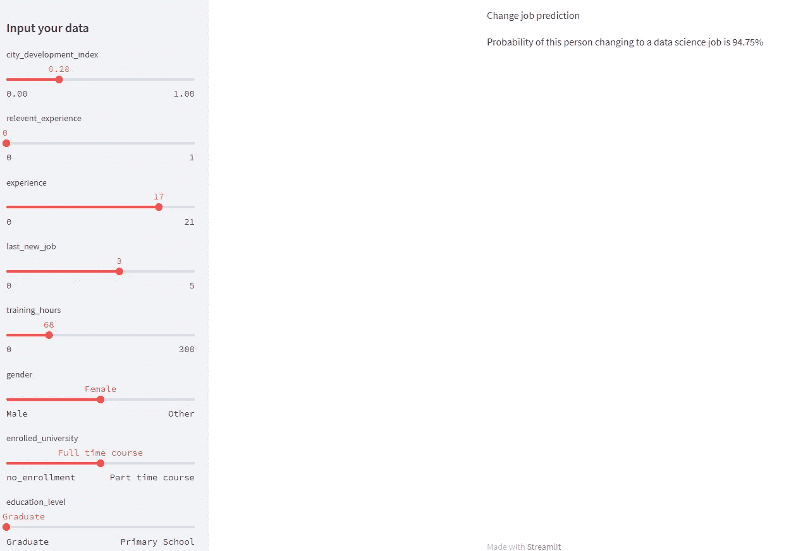
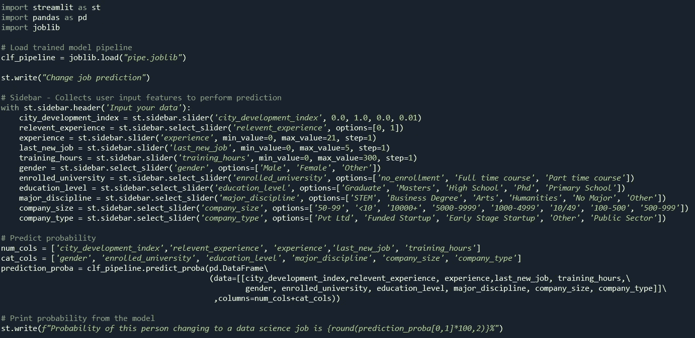
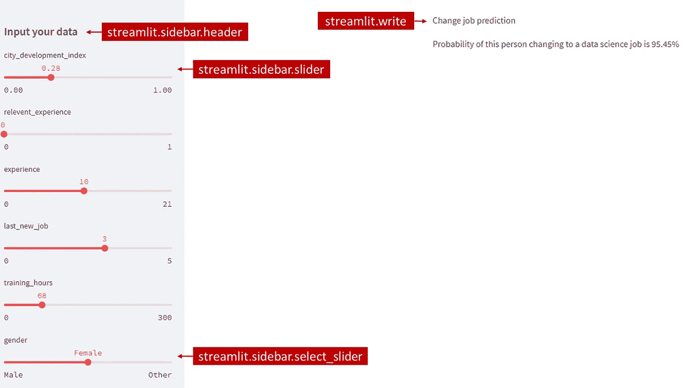
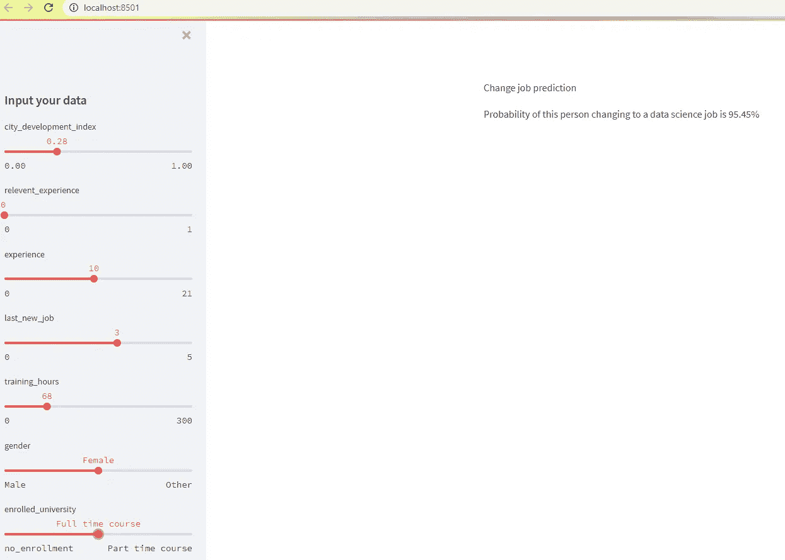

# 快速机器学习模型部署

> 原文：<https://medium.com/mlearning-ai/fast-machine-learning-model-deployment-465973dff40a?source=collection_archive---------9----------------------->


Image by KEHN HERMANO: [https://www.pexels.com/th-th/photo/3881034/](https://www.pexels.com/th-th/photo/3881034/)

# ❓为什么模型部署很重要？

在完成机器学习模型训练后，是时候说明模型如何工作了。您可以将您的代码或模型 pickle 文件发送给其他人运行，但这可能不太方便，尤其是对于您不熟悉编码的客户。等待软件开发人员创建网站/应用程序并连接到模型 API 可能会花费大量时间和精力。

展示您的机器学习模型的最快方法之一是创建一个简单的网站来自行部署您的模型。听起来很麻烦，但是试着读一下这篇文章，你会发现使用 [**Streamlit**](https://docs.streamlit.io/) 并没有那么难。

# 🌎结果

写完这篇文章后，这就是我希望你能做的。

一个**交互式网站**，用户可以在其中输入值，模型的结果将同时显示相应的输入值。



# 💽数据集和模型

在本文中，我使用下一篇文章中的数据集来训练模型。

[](https://yannawut.medium.com/data-analysis-job-change-of-data-scientist-685f3de0a983) [## 数据分析——数据科学家的工作变化

### 哪些因素导致一个人离开现在的工作？让我们用 Power BI 来探索数据。

yannawut.medium.com](https://yannawut.medium.com/data-analysis-job-change-of-data-scientist-685f3de0a983) 

我创建了一个数据管道来训练模型。然后，我将管道保存为 joblib 文件，如下面链接的第 8 步所述。

[](/mlearning-ai/neat-data-preprocessing-with-pipeline-and-columntransformer-2a0468865b6b) [## 使用管道和 ColumnTransformer 进行整洁的数据预处理

### 创建一个管道，您可以在其中输入任何数据，这些数据将在训练机器学习之前进行转换…

medium.com](/mlearning-ai/neat-data-preprocessing-with-pipeline-and-columntransformer-2a0468865b6b) 

不看上面的文章也能看懂这篇文章。当您向模型输入数据时，只要知道这是一项分类任务，就会返回此人转到数据科学工作的概率。

# 📤部署

我将使用 Streamlit 部署模型。

# 1.安装细流

如果使用 Anaconda，打开 Anaconda 提示符(可以使用窗口搜索)。然后，键入下面一行。

```
pip install streamlit
```

测试安装是否有效

```
streamlit hello
```

你可以访问这个网站了解更多细节

# 2.创建新的 Python 文件(。py)

我在与模型 joblib 文件相同的文件夹中创建了一个 web.py 文件(如果您愿意，也可以创建一个 pickle 文件)。

这是 web.py 中的全部代码。



让我们一步一步地检查代码

**1。导入库**

```
import streamlit as st
import pandas as pd
import joblib
```

**2。加载训练好的模型管道**

```
clf_pipeline = joblib.load("pipe.joblib")
```

使用 joblib.load 加载已保存的 joblib 文件，并将其另存为 clf_pipeline。

如果您的 joblib 或 pickle 文件位于另一个文件夹中，请指定该文件的位置。

**3。蒸汽点燃部分**

streamlit 的优势在于，你可以在没有任何 UX/UI 知识的情况下创建一个漂亮(足够)的网站，因为它就像一个块模板。

在这段代码中，我只使用了 4 个 streamlit 命令

*   streamlit.write:在屏幕上打印文本
*   streamlit.sidebar.header:侧栏的标题
*   streamlit.sidebar.slider:数字特性的滑块。输入最小值、最大值、值和步长。
*   streamlit . sidebar . select _ Slider:分类要素的滑块。输入选项列表。

```
st.write("Change job prediction")# Sidebar - Collects user input features to perform prediction
with st.sidebar.header('Input your data'):
    city_development_index = st.sidebar.slider('city_development_index', 0.0, 1.0, 0.0, 0.01)
    relevent_experience = st.sidebar.select_slider('relevent_experience', options=[0, 1])
    experience = st.sidebar.slider('experience', min_value=0, max_value=21, step=1)  
    last_new_job = st.sidebar.slider('last_new_job', min_value=0, max_value=5, step=1)
    training_hours = st.sidebar.slider('training_hours', min_value=0, max_value=300, step=1)
    gender = st.sidebar.select_slider('gender', options=['Male', 'Female', 'Other'])
    enrolled_university = st.sidebar.select_slider('enrolled_university', options=['no_enrollment', 'Full time course', 'Part time course'])
    education_level = st.sidebar.select_slider('education_level', options=['Graduate', 'Masters', 'High School', 'Phd', 'Primary School'])
    major_discipline = st.sidebar.select_slider('major_discipline', options=['STEM', 'Business Degree', 'Arts', 'Humanities', 'No Major', 'Other'])
    company_size = st.sidebar.select_slider('company_size', options=['50-99', '<10', '10000+', '5000-9999', '1000-4999', '10/49', '100-500', '500-999'])
    company_type = st.sidebar.select_slider('company_type', options=['Pvt Ltd', 'Funded Startup', 'Early Stage Startup', 'Other', 'Public Sector'])
```

**注意:**这是简化的代码，便于理解 Streamlit。可以进行许多调整来增强用户体验。

这段代码的结果将是这样的。(阅读步骤 3 中的“如何跑步”)



用户可以通过改变侧边栏上的滑块向模型输入值。然后，输入的值将保存在变量中，以输入到模型中。

**4。预测**

我的管道的输入数据的格式是 dataframe，因此用户输入在输入到模型之前将被转换为 dataframe。

```
num_cols = ['city_development_index','relevent_experience', 'experience','last_new_job', 'training_hours']
cat_cols = ['gender', 'enrolled_university', 'education_level', 'major_discipline', 'company_size', 'company_type']prediction_proba = clf_pipeline.predict_proba(pd.DataFrame\
                   (data=[[city_development_index,\     
                           relevent_experience, experience,\
                           last_new_job, training_hours,\
                           gender, enrolled_university,\     
                           education_level, major_discipline,\   
                           company_size, company_type]]\                                                    
                    ,columns=num_cols+cat_cols))
```

clf_pipeline.predict_proba 用于预测此人转到数据科学工作的概率。

**5。打印预测结果**

打印从步骤 4 获得的概率

```
st.write(f"Probability of this person changing to a data science job is {round(prediction_proba[0,1]*100,2)}%")
```

# 3.运行细流

表演时间到了！！

打开 Anaconda 提示符，键入每个命令，然后按 Enter 键。

CD***your _ folder _ location***

streamlit ***运行您的 _ 文件名***

```
cd C:\Project\Job_Change_of_Data Scientists
streamlit run web.py
```

你会看到 2 个网站网址:
本地网址只能从你的电脑打开。
其他设备可以访问网络 URL。

```
Local URL: [http://localhost:8501](http://localhost:8501)
Network URL: [http://192.168.1.104:8501](http://192.168.1.104:8501)
```

浏览器将自动打开您的 Streamlit 网站。如果没有，可以自己输入网址。



改变侧边栏上的值时，概率也会改变。

搞定了。！！

注意:如果您的型号需要长时间运行，它会在右上角显示一个运行图标。你必须等到程序运行完毕才能看到结果。

# 结论

为了快速显示机器学习模型结果，您可以使用 Streamlit 创建一个演示网站，用户可以在其中输入值并观察模型的预测。

[](/mlearning-ai/mlearning-ai-submission-suggestions-b51e2b130bfb) [## Mlearning.ai 提交建议

### 如何成为 Mlearning.ai 上的作家

medium.com](/mlearning-ai/mlearning-ai-submission-suggestions-b51e2b130bfb)