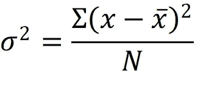
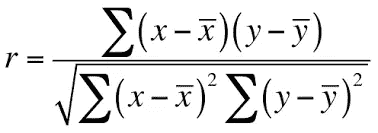
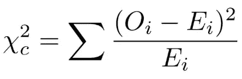
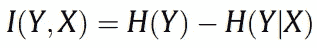

# 特征选择方法

> 原文：<https://medium.com/mlearning-ai/feature-selection-methods-af6335acd823?source=collection_archive---------0----------------------->

Photo by [Georg Regauer](https://unsplash.com/@jiffystyler?utm_source=medium&utm_medium=referral) on [Unsplash](https://unsplash.com?utm_source=medium&utm_medium=referral)

特征也称为变量，是表示数据的属性。当我们处理数据，尤其是具有高维度或许多特征的表格数据时，我们应该执行特征选择。这类似于在准备一顿饭时选择最好的配料。这将有助于防止一些问题，如过度拟合，维数灾难，减少计算需求，并提高我们的模型的性能。有时使用它可能会令人困惑。

特征选择的目标是从输入中选择变量的子集，这些变量可以有效地表示输入数据，同时限制噪声或不相关变量的影响，同时提供良好的预测结果。如果我们继续用这些不相关的变量来利用我们的模型，我们的模型将具有较差的泛化能力。应该注意的是，特征选择不应该与诸如主成分分析(PCA)之类的其他降维技术相比较。

这个故事会经过三种方式进行特征选择: ***滤镜******包装器*****和 ***嵌入*** 。过滤技术被用作对特征进行分级的预处理，高等级的特征被选择并应用于算法。该算法的性能被用作包装器技术中的特征选择标准。**

# **过滤器**

**该方法使用变量排序技术作为变量选择的主要标准，并应用阈值来消除低于阈值的变量。高等级特征包含有用的数据信息。而如果一个特征有条件地独立于类别标签，则该特征可以被认为是不相关的。它基本上断言，如果一个特征是有用的，它可以独立于输入数据，但不独立于类标签，即，对类标签没有影响的特征可以被消除。换句话说，内部特征相关性在确定独特特征时是至关重要的。**

**在这个故事中，我们将看看五种不同的特征选择过滤方法，它们是**相关性**、**方差阈值**、**卡方**和**互信息**。**

## **相关和方差阈值**

**删除恒定要素是选择要素的最简单方法。这意味着我们可以删除具有常量值的特性。换句话说，我们将移除方差值为零的要素。然而，我们并不总是有一个真正的零方差值。这应该如何处理？在这种情况下，我们可以采用方差阈值。**

**在方差阈值中，当方差值达到指定水平时，我们将移除常数特征。我们将获取更多要丢弃的特征，而不是如前一段所示将方差值设置为零，因为我们将上述阈值设置为零。**

****

**Variance**

**这段代码允许我们执行方差阈值。请记住，在从 *constant_feat* 中移除特征之前，我们可能会“玩”阈值。**

**过滤方法中的另一种方法是计算相关性。在这种情况下将使用皮尔逊相关。这种相关性将介于-1 和 1 之间，分别表示负相关和正相关的特征。如果相关性为 0，我们的特征没有相关性，或者只是相关变量的噪声。**

**需要注意的是，我们要排除与因变量*有 *0* 相关性的*自变量*，以及与其他自变量*有 *1* 或 *-1* 相关性的*和*自变量*。*但是，我们可能会更改这些-1 或 1 值以满足我们的需求。**

****

**Pearson Correlation**

**下面是利用皮尔逊相关性进行特征选择的代码。请记住，我们可以试验给定函数的阈值。**

## **卡方检验**

**卡方检验可用于执行特征选择。这个分数应该被用来评估分类变量，因此它对 ML 分类问题是有用的。该分数可用于从 X 中选择具有测试卡方统计的最高值的特征，并且必须仅包括相对于类别的非负特征，例如布尔或频率。**

**因为卡方检验检查随机变量之间的依赖程度，所以使用该函数“剔除”最有可能独立于类别并因此与分类无关的特征。卡方统计常用于评估分类数据之间的相关性。**

****

**Chi-square**

**我们可以使用 scikit-learn 对我们的特性进行卡方测试，如下面的代码所示。值得注意的是，我们获得了两个数组:卡方值和 p 值。p 值越低，我们的特征对答案的依赖程度越高，可以用于模型训练，反之亦然。**

## **交互信息**

**两个随机变量之间的互信息是一个衡量变量相关性的非负数。当两个随机变量独立时，它等于零，而更高的值表明更大的依赖性。换句话说，互逆信息量化了在给定一个随机变量的情况下，可以从另一个随机变量获得多少信息。**

****

**Mutual Information**

**如下面的代码所示，我们可以使用交互信息来选择特性。应该注意的是，我们希望保留互信息结果中的高价值特征，以馈入 ML 算法。**

# **包装材料**

**包装器方法使用算法作为黑盒并使用算法的性能作为目标函数来评估变量子集。为了选择最大化目标函数的特征子集，可以利用各种搜索策略。然而，随着特征数量的增加，搜索将呈指数增长。对于更大的数据集，穷举搜索方法可能会变得计算密集型。这个故事将讲述顺序选择算法。**

**从一个空的/完整的集合开始，顺序选择算法将添加/删除特征，直到达到最大的目标函数。为了加速选择，选择一个稳定增加目标函数的标准，直到用最少的特征获得最大值。**

**我们可以使用下面的代码进行顺序选择。值得注意的是，我们可以控制这些超参数。在这个例子中，我们使用 *forward=True* ，这意味着我们从一个空的特性列表开始，然后开始添加它们。**

# **植入的**

**虽然包装器技术需要大量的计算时间来重新分类不同的子集，但是嵌入方法努力消除这种情况。这种方法将特征选择作为训练过程中的一个步骤。简而言之，嵌入式技术将使用 ML 算法选择特征。**

**随机森林分类器给出的嵌入技术如下所示。另一个例子是使用从回归模型(如回归)获得的系数。**

**我们使用的模型决定了我们获得的所有数字。因此，对于不同的算法，我们可能会获得不同的数字。数字越大，这些特性对我们的模型越重要。**

*****参考资料:***
[*http://romisatriawahono . net/lecture/RM/survey/machine % 20 learning/Chandrashekar % 20-% 20 feature % 20 selection % 20 methods % 20-% 202014 . pdf*](http://romisatriawahono.net/lecture/rm/survey/machine%20learning/Chandrashekar%20-%20Feature%20Selection%20Methods%20-%202014.pdf)**

**[*https://journals.plos.org/plosone/article/file?id = 10.1371/journal . pone . 0087357&type = printable*](https://journals.plos.org/plosone/article/file?id=10.1371/journal.pone.0087357&type=printable)**

***感谢阅读*😄**

** [## Mlearning.ai 提交建议

### 如何成为 Mlearning.ai 上的作家

medium.com](/mlearning-ai/mlearning-ai-submission-suggestions-b51e2b130bfb)**