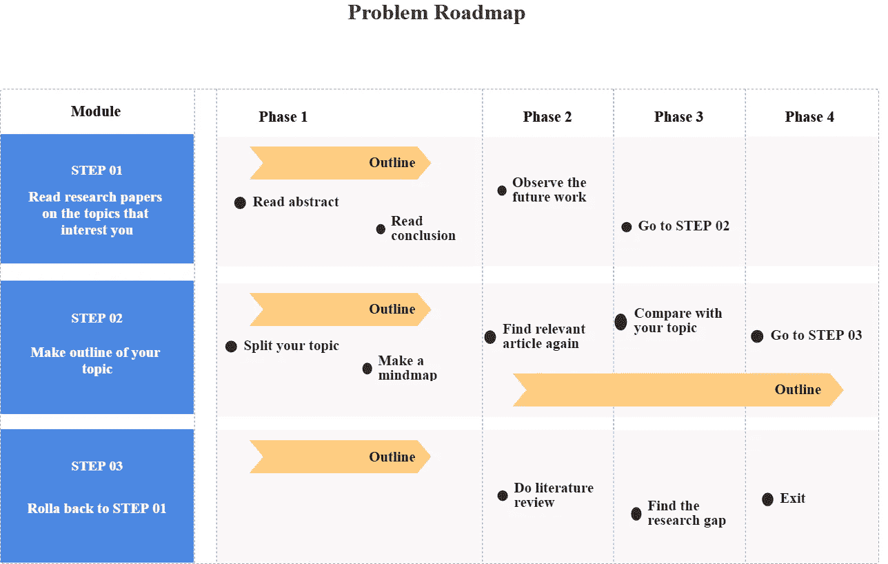
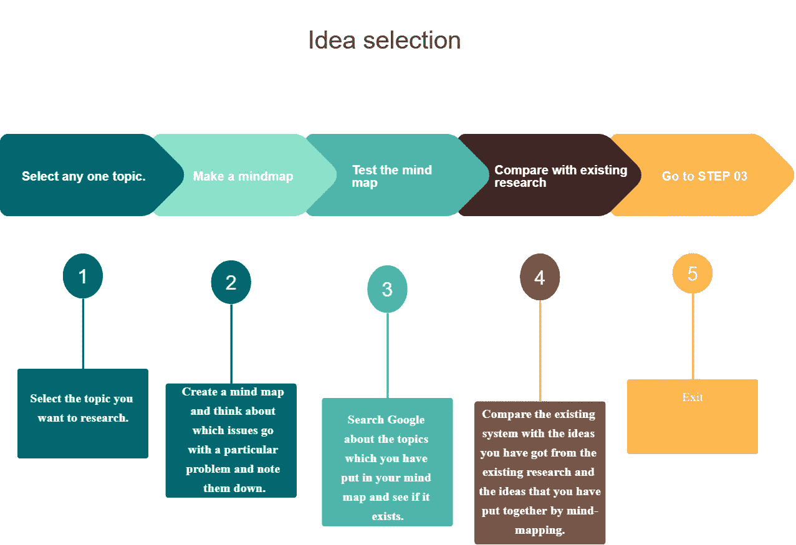
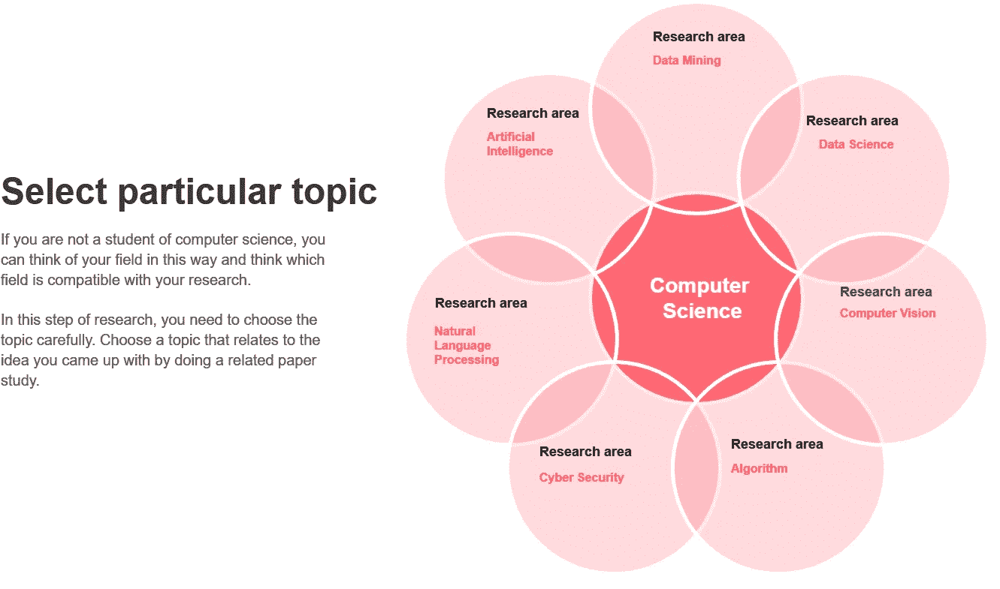

# 用三种有效的方法找出研究思路:循序渐进的指导

> 原文：<https://medium.com/mlearning-ai/find-out-research-ideas-in-three-effective-ways-step-by-step-instruction-41cc4e30be1c?source=collection_archive---------1----------------------->

[https://unsplash.com/](https://unsplash.com/)

有时可以看到，许多人在选择一个研究想法时经常会因为缺乏正确的指导方针而陷入困境，比如如何或从哪里得到这个想法。我看到孟加拉国的大多数本科生都面临着这些困难，这也是我在研究之初遇到的问题。然而，有时研究生在选择研究思路时会出现问题。

这就是我所写的来说明产生研究想法的三种有效方法。在这篇文章中，你将知道如何有效地选择研究思路。

> **虽然每个人的脚步不尽相同，但有些关键的步骤也许对被此困住的有志之士更为有益。**

# 开始前的一些重要事情。

**，**首先，你必须跳出框框去思考，才能进行研究，因为研究是一种组织良好的方式，专注于可应用和可实现的问题。其次，你必须确保对你想研究的课题有足够的了解。第三，**问问你自己你是否是自主的，因为有时你不得不回过头来好好思考或完成你的实验，这在开始的时候是很重要的。**

**Fig.1: Roadmap of selecting a research idea**

# 第一步:阅读你感兴趣的主题的研究论文

如果你擅长你的研究领域，但你在选择研究思路时进退两难，在这种情况下，你将不得不阅读属于你的研究主题的相关文章。

每当你努力阅读论文时，你不需要阅读整个科学手稿，因为主要观点可以在摘要和结论部分找到，这将使你对研究有一个整体的想法，以说明他们使用的方法。图 1 显示了选择研究想法的路线图。

**接下来，**你将不得不去阅读未来工作部分，它有时会包含在结论中，给你一个关于研究论文的基本概念。

> 好了，这是选择研究想法的第一步。现在转到**步骤 02。**

[https://unsplash.com/](https://unsplash.com/)

# 第二步:为你的主题写一个提纲

我希望你明白在你的领域里已经做了什么样的研究。现在您需要从基本域中选择任何特定的主题。这里应该提到，当你完成这些，然后你需要创建一个大纲。**图 2** 显示了创意选择的轮廓。

如果你有足够的热情去了解更多关于研究大纲的内容，那就看看我以前的文章《如何写科学论文:初学者基本指导》，这是你的:[**https://medium . com/@ eliashossain 9111/How-to-write-a-scientific-research-paper-Fundamental-instruction-for-beginner-e 86074761018**](/@eliashossain9111/how-to-write-a-scientific-research-paper-fundamental-instruction-for-beginner-e86074761018)

**Fig.2: STEP 02 diagram about figure out the ideas**

> **选择任意一个主题→制作思维导图→测试思维导图→与现有研究对比→进入步骤 03**

## **选择任意一个话题**

在仔细阅读摘要之后，结论希望你已经理解了已经完成的研究类型的基本概念。然而，如果你是一名计算机科学学生，你需要考虑你的研究领域可能是什么。让我们看看图 3 下面的图像

**Fig. 3: Research domain**

## **制作思维导图**

思维导图将帮助你有效地创造想法。按照你对这一步研究的想法来排列要点。在这里以点的形式结合你通过研究你的主题得到的想法。

## **测试思维导图**

每当你有了思维导图，你都需要再次检查相关的研究，看看它是否适用和可行。如果你想出了一个不可能实现的想法，这可能会成为一个问题。

## 将你的主题特征与现有的研究进行比较

你的研究有什么特点？我的意思是，你把你认为独特的课题和现有的研究进行对比，就能发现你的研究的差距。通过这种方式的比较，你可以得到这个想法。或者你可以做一个假设来帮助你理解这个想法。如果你对假设没有概念，继续跟随这个链接，实现基本的想法。给你:[**https://medium . com/@ eliashossain 9111/turn-your-innovation-into-research-8534 e 290474 a**](/@eliashossain9111/turn-your-innovation-into-research-8534e290474a?fbclid=IwAR1tKEKd7DXtzPIuqn7aZ7N5oeC_rFHdrziaQ-DkF75seibEVEeTAQWyA4Q)

# **步骤 03:回滚到步骤 01**

> **做文献综述→找出研究差距→解决差距**

你还记得你在第 01 步做了什么吗？在这一步，复习一些与你所选主题相关的文献。这里需要注意的是，复习文献的时候，不需要写特征。换句话说，你需要观察相关研究论文中有哪些空白，你可以通过保留现有论文的特征来解决这些空白。

**总之，**如果你对自己将要从事的工作感到困惑，那么这项研究就不会完整。你可以通过与现有系统的对比找到研究思路。另一方面，你可以通过查阅文献，寻找研究空白，来选取思路。这篇文章向你展示了一些指导方针，可以帮助你找到一个有效的研究思路。

如果你想要 PDF 格式的这篇文章，请点击下面的链接。

 [## 在三个有效的 ways.pdf 中找出研究思路

### 编辑描述

drive.google.com](https://drive.google.com/file/d/1JlcQQnuEvCa6Ed4iMeqRZJhRvDTlRaAw/view?usp=sharing) 

如果我写的有什么错误，请原谅我。

**万事如意。保持冷静，不要放弃。**

请关注我:

【领英:[https://www.linkedin.com/in/elias-hossain-b70678160/](https://www.linkedin.com/in/elias-hossain-b70678160/)

**研究门:**[https://www.researchgate.net/profile/Elias_Hossain7](https://www.researchgate.net/profile/Elias_Hossain7)