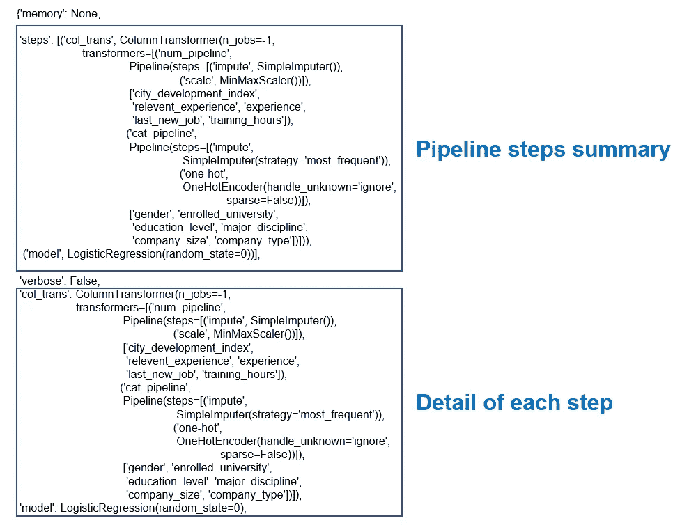
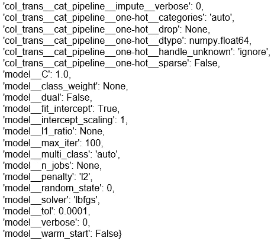
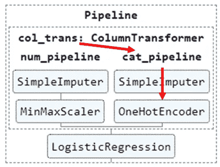
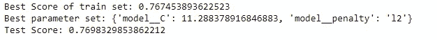
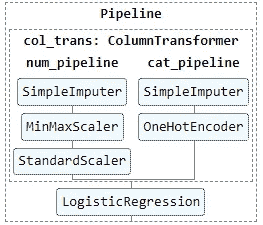
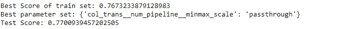
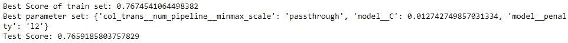
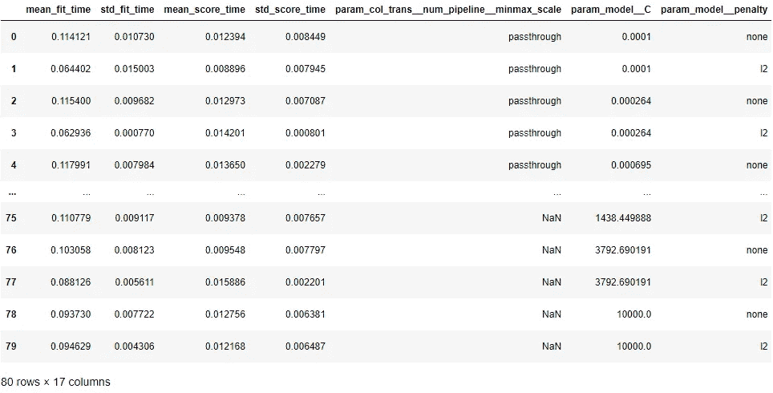

# 使用管道找到最佳的数据准备方法和模型

> 原文：<https://medium.com/mlearning-ai/find-the-best-data-preparation-method-and-model-using-a-pipeline-9677f68c35e9?source=collection_archive---------2----------------------->


Source: [https://unsplash.com/photos/xNdPWGJ6UCQ?utm_source=unsplash&utm_medium=referral&utm_content=creditShareLink](https://unsplash.com/photos/xNdPWGJ6UCQ?utm_source=unsplash&utm_medium=referral&utm_content=creditShareLink)

在上一篇文章中，我写了机器学习模型训练管道的简单实现，它可以使您的代码更加整洁。你可以通过下面的链接阅读。

[](https://yannawut.medium.com/neat-data-preprocessing-with-pipeline-and-columntransformer-2a0468865b6b) [## 使用管道和 ColumnTransformer 进行整洁的数据预处理

### 创建一个管道，您可以在其中输入任何数据，这些数据将在训练机器学习之前进行转换…

yannawut.medium.com](https://yannawut.medium.com/neat-data-preprocessing-with-pipeline-and-columntransformer-2a0468865b6b) 

管道不仅使您的代码更整洁，它还可以帮助超参数调优和数据准备过程。

# 📔本文内容

*   找出可变的管线参数
*   寻找最佳超参数集:在网格搜索中添加管道
*   找到最佳的数据准备方法:跳过管道中的一个步骤
*   找到最佳超参数集和最佳数据准备方法

# 🛣️管道

参考上一篇文章，这是管道。

```
# sets of columns to be transformed in different waysnum_cols = ['city_development_index','relevent_experience', 'experience','last_new_job', 'training_hours']
cat_cols = ['gender', 'enrolled_university', 'education_level', 'major_discipline', 'company_size', 'company_type']# Create pipelines for numerical and categorical featuresfrom sklearn.impute import SimpleImputer
from sklearn.preprocessing import OneHotEncoder, MinMaxScaler
from sklearn.pipeline import Pipelinenum_pipeline = Pipeline(steps=[
    ('impute', SimpleImputer(strategy='mean')),
    ('scale',MinMaxScaler())
])cat_pipeline = Pipeline(steps=[
    ('impute', SimpleImputer(strategy='most_frequent')),
    ('one-hot',OneHotEncoder(handle_unknown='ignore', sparse=False))
])# Create ColumnTransformer to apply pipeline for each column typefrom sklearn.compose import ColumnTransformercol_trans = ColumnTransformer(transformers=[
    ('num_pipeline',num_pipeline,num_cols),
    ('cat_pipeline',cat_pipeline,cat_cols)
    ],
    remainder='drop',
    n_jobs=-1)# Add a model to a final pipeline, clf_pipelinefrom sklearn.linear_model import LogisticRegressionclf = LogisticRegression(random_state=0)clf_pipeline = Pipeline(steps=[
    ('col_trans', col_trans),
    ('model', clf)
])
```


在此管道中，clf_pipeline(最终管道)包含 col_trans (ColumnTransformer)和一个逻辑回归模型。

在 col_tran 中，有 num_pipeline 和 cat_pipeline。这些管道将分别转换数字特征和分类特征。

# 🔍找出可变的管线参数

首先，我们来看看可以调整的参数列表。
**语法:**管道 _ 名称.获取 _ 参数()

```
clf_pipeline.get_params()
```

结果可能会很长。深呼吸，继续读下去。

第一部分只是关于管道的步骤。



第一部分下面是我们感兴趣的，我们可以调整的参数列表。



格式为 **step1_step2_…_parameter** 。

例如**col _ trans**_**cat _ pipeline**_**one-hot**_**sparse**表示 one-hot 步骤的参数稀疏。



您可以使用 set_param 直接更改参数。

```
clf_pipeline.set_params(model_C = 10)
```

# ➕寻找最佳超参数集:添加网格搜索管道

网格搜索是一种用于执行超参数调整的方法，可以找到产生最高模型精度的最佳参数集。

**1。设置调谐参数及其范围。**

创建调整参数(超参数)字典

{ '调整参数':'可能值'，… }

在这个例子中，我想找到一个逻辑回归模型的最佳惩罚类型和 C。

```
grid_params = {'model__penalty' : ['none', 'l2'],
               'model__C' : np.logspace(-4, 4, 20)}
```

**2。将管道添加到网格搜索中**

**语法:** GridSearchCV(模型，调优参数，…)

我们的管道有一个模型步骤作为最后一步，所以我们可以将管道直接输入到 GridSearchCV 函数中。

```
from sklearn.model_selection import GridSearchCVgs = GridSearchCV(clf_pipeline, grid_params, cv=5, scoring='accuracy')
gs.fit(X_train, y_train)print("Best Score of train set: "+str(gs.best_score_))
print("Best parameter set: "+str(gs.best_params_))
print("Test Score: "+str(gs.score(X_test,y_test)))
```



Result of Grid Search

设置网格搜索后，您可以用数据拟合网格搜索并查看结果。

*   。拟合:拟合模型并尝试调整参数字典中的所有参数集
*   。best_score_:所有参数集的最高精确度
*   。best_params_:产生最佳分数的一组参数
*   。score(X_test，y_test):用测试集尝试最佳模型时的分数。

你可以在文档[中阅读更多关于 GridSearchCV 的内容。](https://scikit-learn.org/stable/modules/generated/sklearn.model_selection.GridSearchCV.html)

# ⏩找到最佳的数据准备方法:跳过管道中的一个步骤

如果没有管道，找到最佳的数据准备方法可能会很困难，因为您必须为许多数据转换案例创建如此多的变量。

通过管道，我们可以在管道中创建数据转换步骤，并执行网格搜索来找到最佳步骤。网格搜索将选择跳过哪个步骤，并比较每个案例的结果。

**稍微调整一下当前管线**

我想知道在 MinMaxScaler 和 StandardScaler 之间，哪种缩放方法最适合我的数据。

我在 num_pipeline 中添加了一个 step StandardScaler。其余没有变化。

```
from sklearn.preprocessing import StandardScalernum_pipeline2 = Pipeline(steps=[
    ('impute', SimpleImputer(strategy='mean')),
    ('minmax_scale', MinMaxScaler()),
    ('std_scale', StandardScaler()),
])col_trans2 = ColumnTransformer(transformers=[
    ('num_pipeline',num_pipeline2,num_cols),
    ('cat_pipeline',cat_pipeline,cat_cols)
    ],
    remainder='drop',
    n_jobs=-1)clf_pipeline2 = Pipeline(steps=[
    ('col_trans', col_trans2),
    ('model', clf)
])
```



**网格搜索**

在网格搜索参数中，指定要跳过的步骤，并将它们的值设置为**通过**。

由于 MinMaxScaler 和 StandardScaler 不应该同时执行，所以我将使用**字典列表**作为网格搜索参数。

[{案例 1}，{案例 2}]

如果使用字典列表，网格搜索将执行情况 1 中每个参数的组合，直到完成。然后，它将执行情况 2 中每个参数的组合。所以不存在 MinMaxScaler 和 StandardScaler 一起使用的情况。

```
grid_step_params = [{'col_trans__num_pipeline__minmax_scale': ['passthrough']},
                    {'col_trans__num_pipeline__std_scale': ['passthrough']}]
```

执行网格搜索并打印结果(像普通网格搜索一样)。

```
gs2 = GridSearchCV(clf_pipeline2, grid_step_params, scoring='accuracy')
gs2.fit(X_train, y_train)print("Best Score of train set: "+str(gs2.best_score_))
print("Best parameter set: "+str(gs2.best_params_))
print("Test Score: "+str(gs2.score(X_test,y_test)))
```



最好的情况是 minmax_scale : 'passthrough '，因此 StandardScaler 是此数据的最佳缩放方法。

# 💥找到最佳超参数集和最佳数据准备方法

通过将调整参数添加到数据准备方法的每种情况的字典中，可以找到最佳的超参数集和最佳的数据准备方法。

```
grid_params = {'model__penalty' : ['none', 'l2'],
               'model__C' : np.logspace(-4, 4, 20)}grid_step_params = [{**{'col_trans__num_pipeline__minmax_scale': ['passthrough']}, **grid_params},
                    {**{'col_trans__num_pipeline__std_scale': ['passthrough']}, **grid_params}]
```

grid_params 将被添加到情况 1(跳过 MinMaxScaler)和情况 2(跳过 StandardScalerand)中。

您可以使用下面的语法合并字典。
merge_dict = {**dict_1，**dict_2}

执行网格搜索并打印结果(像普通网格搜索一样)。

```
gs3 = GridSearchCV(clf_pipeline2, grid_step_params2, scoring='accuracy')
gs3.fit(X_train, y_train)print("Best Score of train set: "+str(gs3.best_score_))
print("Best parameter set: "+str(gs3.best_params_))
print("Test Score: "+str(gs3.score(X_test,y_test)))
```



您可以使用找到最佳参数集。best_params_。由于 minmax_scale : 'passthrough '，所以 StandardScaler 是此数据的最佳缩放方法。

所有网格搜索案例都可以使用。cv _ 结果 _

```
pd.DataFrame(gs3.cv_results_)
```



这个例子有 80 个案例。你需要考虑每种情况的运行时间和精确度，因为有时我们可能会选择精确度可接受的最快模型，而不是精确度最高的模型。

# 结论

流水线可以简化超参数调整和数据准备过程。通过使用带有网格搜索的管道，您可以定义网格搜索参数来探索所有可用的案例并找到最佳案例。

# 下一步是什么？

寻找最佳的机器学习模型需要一个自定义的转换函数，我将在下一篇文章中写。再见。

[](/mlearning-ai/mlearning-ai-submission-suggestions-b51e2b130bfb) [## Mlearning.ai 提交建议

### 如何成为 Mlearning.ai 上的作家

medium.com](/mlearning-ai/mlearning-ai-submission-suggestions-b51e2b130bfb)