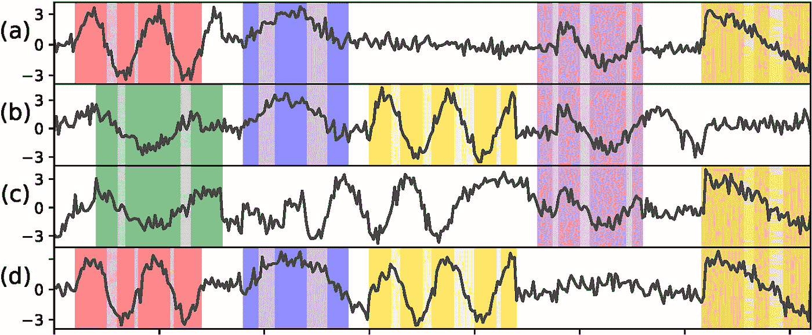
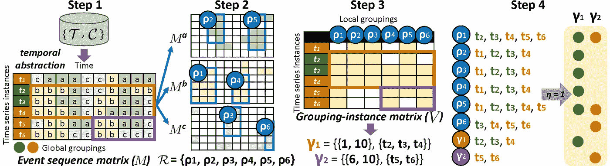

# 查找时间序列的本地分组

> 原文：<https://medium.com/mlearning-ai/finding-local-groupings-of-time-series-970cd87bdd26?source=collection_archive---------0----------------------->

本文是在 ECML PKDD 2022 会议上提交的一篇论文的简短摘要，该会议是由 H & M AI Research 和斯德哥尔摩大学合作发起的。如果您对此感兴趣并希望阅读全文以及所有公式和数学形式，[在此处](https://2022.ecmlpkdd.org/wp-content/uploads/2022/09/sub_1106.pdf)是指向会议记录中的文章的链接。

## 介绍

在零售[1]或投资组合管理[2]等几个应用领域中，发现时间序列分组是相关的，在这些应用领域中，会收集和监控多个时间序列实例。这些分组包括在一段时间内(例如，就同时相似的值或趋势而言)具有高相似性的时间序列集合。通常，分组并不跨越整个时间序列(全局分组)，而是跨越更短的时间段，从而定义本地分组。此外，时间序列的一个子集可能会持续在更长的时间内被分组在连续的本地分组中，可能会被短的时间间隔分开，因此形成本地分组的关联，如图 1 所示。请注意，本地分组和关联具有不同的长度和成员实例。

Figure 1: Four time series with six associations denoted by different colors. Each association *contains several local groupings separated by short time gaps denoted by darker/lighter colors.*

根据应用和时间序列测量的数量，如果我们考虑与零售相关的应用，分组和关联可能有不同的含义，例如在一年中的特定时间，在特定商店群中呈现相似销售模式的产品。

## 方法学

*Z-Grouping* 算法是一个四步算法，首先检测分组中时间跨度和时间序列数最大的局部分组，然后检测关联中公共局部分组和时间序列数最大的关联。

Figure 2: An illustration of the four steps of the Z-Grouping algorithm.

图 2 中显示的四个步骤将在下面简要描述:

*   ***步骤 1 -事件序列矩阵生成*** 通过应用类似 SAX 的时间抽象函数，将采集时间序列转换为事件序列矩阵[3]。事件序列对噪声或异常值不太敏感，对微小波动不敏感，有利于随着时间形成模式。图 3 中的步骤 1 生成一个包含三种事件类型的矩阵 *{a，b，c}* 。
*   ***步骤 2 -局部分组生成*** 寻找局部分组，用于将半几何平铺[4]应用于每个事件标签(通道)。粗略地说，半几何平铺最大化局部分组中时间序列的长度和数量，同时允许最大的不纯率，即不属于所选事件标签的时隙。图 3 中的步骤 2 产生了六个局部高纯度候选物，每个候选物中允许最大 25%的杂质。
*   **步骤 3 -关联生成**寻找最大化公共本地分组和时间序列成员数量的关联，同时保持原始时间序列之间的成对距离低于预定义的阈值。图 3 中的步骤 3 找到了聚合步骤 2 中找到的六个局部分组的两个关联，即范围为*【1，10】*且包含 *{t2，t3，t4}* 的 *γ1* ，以及范围为*【6，10】*且包含 *{t5，t6}* 的 *γ2* 。
*   **步骤 4 -验证**通过将所获得的局部分组和关联与相同时间序列集合 T 上的一组全局分组进行比较来验证它们，所述时间序列集合 T 通过时间序列聚类获得或者由领域专家提供。目标是评估全局分组与局部分组的相关程度，以及局部分组如何帮助我们评估这些全局分组的相似性。为此，根据属于每个全球分组的每个局部分组/关联中的时间序列的比例，计算一个有效性分数(详见本文)。

## 实验和结果

我们首先在 syntethic 数据集上测试 Z 分组，以提供广泛的参数调查，然后我们在来自不同领域(时尚零售、股票市场和 COVID 流行病)的三个真实世界数据集和 128 个 UCR 数据集[5]上对其进行基准测试，排除了至少一个算法无法找到任何有效分组的情况(17 种情况)和数据集长度短于最小窗口大小参数的情况(6 种情况)。据我们所知，没有其他算法能够解决由 *Z 分组*解决的相同问题，因此我们对类似的算法进行了基准测试，即半几何平铺[4]、具有固定时间范围的 k-均值、具有灵活时间范围的 k-均值和 k-最近邻。

我们的实验表明，Z 分组可以获得比其竞争对手更低的错误率，同时成功地检索到没有时间范围大小限制的局部分组，这在使用传统方法时是不可行的。

对于实验协议和 benckmark 算法的详细描述，请参考原始论文，准确的描述对于博客帖子来说太冗长了:)

本文的代码包括合成数据生成器和一些数据集，可在网上公开获得[6]。

## 参考

[1]蒋，杨，刘，杨，王，h，尚，j，丁，s .IJPR 56(5)，1773-1788(2018)。

[2]黄，张春峰:基于遗传算法和支持向量回归的混合选股模型.应用软件计算 12(2)，807–818(2012)。

[3]林，j .，e .，魏，l .，Lonardi，s .:体验萨克斯:时间序列的一种新颖的符号表征。DMKD 15(2)，107–144(2007)。

[4] Henelius，a .，Karlsson，I .，Papapetrou，p .，Ukkonen，a .，Puolamä ki，k .:事件序列的半几何镶嵌。在:ECML-PKDD。第 329-344 页。斯普林格(2016)。

[5]Dau，H.A .、Bagnall，a .、Kamgar，k .、Yeh c . c . m .、Zhu，y .、Gharghabi，s .、Ratanamahatana，C.A .、e .:UCR 时间序列档案。JAS 6(6)，1293 1305 (2019)。

[6]Z-分组库，**

** [## Mlearning.ai 提交建议

### 如何成为 Mlearning.ai 上的作家

medium.com](/mlearning-ai/mlearning-ai-submission-suggestions-b51e2b130bfb)**