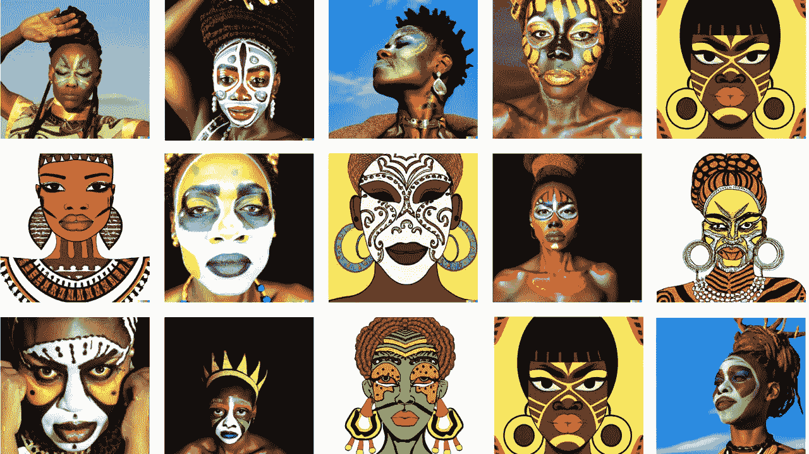

# 在单个图像上微调人工智能艺术模型

> 原文：<https://medium.com/mlearning-ai/fine-tuning-ai-art-models-on-a-single-image-2a437903a823?source=collection_archive---------1----------------------->

## [自由代码或三步法](https://open.substack.com/pub/mlearning/p/tune-your-private-ai-art-generator?r=z7zu8&utm_campaign=post&utm_medium=web)

## [扩散模型](https://open.substack.com/pub/mlearning/p/how-does-a-diffusion-model-work?r=z7zu8&utm_campaign=post&utm_medium=web)用文本修改图像的简单方法

Finetuning is All You Need

人工智能艺术发电机工作很好。当你想达到一个非常明确的效果时，问题就出现了。第一个解决方案是[提示工程](https://open.substack.com/pub/evartology/p/reverse-prompting?r=9hp4d&utm_campaign=post&utm_medium=web)。第二种，也是我在本文中讨论的，是微调。