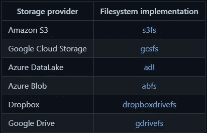
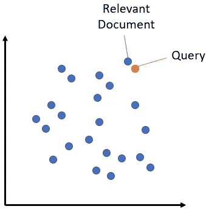

# 忘记复杂的传统方法来处理 NLP 数据集，HuggingFace 数据集库是您的救星！第二部分

> 原文：<https://medium.com/mlearning-ai/forget-complex-traditional-approaches-to-handle-nlp-datasets-huggingface-dataset-library-is-your-fe5de16d88c8?source=collection_archive---------2----------------------->

# 作者

**纳巴伦·巴鲁阿**

[Git](https://github.com/nabarunbaruaAIML)/[LinkedIn](https://www.linkedin.com/in/nabarun-barua-aiml-engineer/)/[towards data science](/@nabarun.barua)

阿尔琼·库姆巴克拉

[Git](https://github.com/arjunKumbakkara)/[LinkedIn](https://www.linkedin.com/in/arjunkumbakkara/)/[towards data science](/@arjunkumbakkara)

这是前一部分的延续，如果你想看我们的[早些时候公布的文件](/mlearning-ai/forget-complex-traditional-approaches-to-handle-nlp-datasets-huggingface-dataset-library-is-your-1f975ce5689f)，这里我们将讨论一些更高级的东西。

在本文档中，我们将重点关注:

*   合并数据集
*   缓存数据集
*   和云存储
*   如何创建文献检索系统

# 合并数据集

有些情况下，数据科学家可能需要将多个数据集合并成一个数据集。有两种方法可以合并数据集:

## **串联**

在这种情况下，如果轴为零，我们可以合并具有相同列数和共享相同列类型的不同数据集。

如果轴是一个，那么我们可以连接两个数据集，如果数据集中的行数相同。

让我们看一个例子(取自 huggingface.co 的例子)

```
from datasets import concatenate_datasets, load_dataset  
bookcorpus = load_dataset("bookcorpus", split="train")     
wiki = load_dataset("wikipedia", "20200501.en", split="train")     wiki = wiki.remove_columns("title")  # only keep the text      assert bookcorpus.features.type == wiki.features.type     bert_dataset = concatenate_datasets([bookcorpus, wiki])
```

## 交错数据集

在这里，我们可以将几个数据集合并在一起，从每个数据集中选择另一个例子来创建新数据集。这就是所谓的交错。

这可用于常规数据集和流数据集中

在下面的例子中，我们针对流数据集(同样可以针对常规数据集)进行操作，并在可选的例子中给出概率。如果给定了概率，则最终数据集是基于相同的概率形成的。(huggingface.co 的例子)

```
from datasets import interleave_datasets
from itertools import islice
en_dataset = load_dataset('oscar', "unshuffled_deduplicated_en", split='train', streaming=True)
fr_dataset = load_dataset('oscar', "unshuffled_deduplicated_fr", split='train', streaming=True)multilingual_dataset_with_oversampling = interleave_datasets([en_dataset, fr_dataset], probabilities=[0.8, 0.2], seed=42)
```

最终数据集的大约 80%由 en_dataset 构成，20%由 fr_dataset 构成。

# 缓存数据集

下载数据集时，处理脚本和数据存储在本地计算机上。缓存允许🤗数据集，以避免每次使用时重新下载或处理整个数据集。

## 缓存目录

我们可以改变当前目录的默认缓存目录，即`~/.cache/huggingface/datasets`。只需设置环境变量。

```
$ export HF_DATASETS_CACHE=”/path/to/another/directory”
```

类似地，我们可以通过在不同的关键字中传递参数 *cache_dir* 来做同样的事情，如 load_dataset、load_metric &等。

例子

```
from datasets import concatenate_datasets, load_datasetbookcorpus = load_dataset("bookcorpus", split="train")
wiki = load_dataset("wikipedia", "20200501.en", split="train",cache_dir="/path/to/another/directory")
```

## 下载模式

一旦数据集被下载，它就会被缓存，因此当我们加载数据集时，它不是从源下载，而是从缓存加载。

现在，如果数据集中有任何变化，并且如果我们想要从源加载数据集未改变的数据集，那么我们需要使用参数`download_mode`。

例子

```
from datasets import concatenate_datasets, load_datasetbookcorpus = load_dataset("bookcorpus", split="train")
wiki = load_dataset("wikipedia", "20200501.en", split="train",download_mode='force_redownload')
```

## 清理缓存文件

如果需要清理缓存文件，我们可以通过执行以下命令来完成

```
# Below function just clears the cache of Dataset
ds.cleanup_cache_files()
```

## 启用或禁用缓存

可能会出现我们不想缓存的情况。在这种情况下，我们可以在本地或全局禁用缓存。

**本地:**如果我们在本地使用一个缓存文件，它将自动重新加载您之前应用到数据集的任何转换。我们可以在`datasets.Dataset.map()`中使用参数`load_from_cache=False`禁用缓存。

示例:

```
updated_dataset = small_dataset.map(tokenizer_function, load_from_cache=False)
```

在上面的例子中，🤗数据集将对整个数据集再次执行函数`tokenizer_function`,而不是从先前的状态加载数据集。

**全局:**如果我们想要全局禁用缓存，那么需要使用`datasets.set_caching_enabled()`为全局禁用缓存设置以下参数:

```
from datasets import set_caching_enabled
set_caching_enabled(False)
```

当您禁用缓存时，🤗对数据集应用变换时，数据集将不再重新加载缓存文件。您在数据集上应用任何转换都需要重新应用。

# 云存储

Huggingface 数据集可以存储到流行的云存储中。Hugginface 数据集具有内置功能来满足这一需求。

它支持的云列表以及需要安装的文件系统，以便在加载数据集时直接使用(表格取自 Huggingface.co):



Cloud Table

在这里，我们将尝试展示如何使用 s3fs 将数据集加载和保存到 S3 存储桶。对于其他云，请参见文档。尽管可以类似地使用其他云文件系统实现。

首先安装数据集的 S3 依赖项。

```
pip install datasets[s3]
```

**加载数据集:**现在，通过输入您的 aws_access_key_id 和 aws_secret_access_key，从私有 S3 存储桶访问数据集

```
import datasets
s3 = datasets.filesystems.S3FileSystem(key=aws_access_key_id, secret=aws_secret_access_key)# load encoded_dataset to from s3 bucket
dataset = load_from_disk('s3://a-public-datasets/imdb/train',fs=s3)
```

**保存数据集:**处理完数据集后，您可以使用`datasets.Dataset.save_to_disk()`将其保存到 S3:

```
import datasets
s3 = datasets.filesystems.S3FileSystem(key=aws_access_key_id, secret=aws_secret_access_key)# saves encoded_dataset to your s3 bucket
encoded_dataset.save_to_disk('s3://my-private-datasets/imdb/train', fs=s3)
```

# 如何创建文献检索系统

文档检索系统是用于问答系统等自然语言处理任务的数据集的一个具体例子。本文档将向您展示如何为您的数据集构建索引搜索，从而允许您从数据集中搜索项目。

## 脸书人工智能相似性搜索

数据集有一种机制，我们可以基于嵌入在数据集上进行相似性搜索，这里首先将长段落转换成单个 a 嵌入，该嵌入稍后可以用作检索系统。在将段落转化为嵌入之后，我们将问题转化为嵌入。现在有了数据集的 FAISS 索引机制，我们可以比较这两个嵌入，从数据集中得到最相似的段落。



Credits: [https://huggingface.co](https://huggingface.co/)

为了做到这一点，我们有一个这样的模型命名为 DPR(密集段落检索)。取自 Huggingface 数据集文档的示例。请随意使用任何其他模型，如句子变形金刚等。

**第一步:**加载上下文编码器模型&分词器。

```
from transformers import DPRContextEncoder, DPRContextEncoderTokenizer
import torch
torch.set_grad_enabled(False)
ctx_encoder = DPRContextEncoder.from_pretrained("facebook/dpr-ctx_encoder-single-nq-base")
ctx_tokenizer = DPRContextEncoderTokenizer.from_pretrained("facebook/dpr-ctx_encoder-single-nq-base")
```

**步骤 2:** 加载数据集并获得嵌入

正如我们前面提到的，我们希望将每个条目表示为一个向量。

```
from datasets import load_dataset
ds = load_dataset('crime_and_punish', split='train[:100]')
ds_with_embeddings = ds.map(lambda example: {'embeddings': ctx_encoder(**ctx_tokenizer(example["line"], return_tensors="pt"))[0][0].numpy()})
```

**第三步:**向 FAISS 搜索索引添加嵌入。

现在使用 FAISS 进行有效的相似性搜索，我们将使用`datasets.Dataset.add_faiss_index()`创建索引

```
ds_with_embeddings.add_faiss_index(column='embeddings')
```

**步骤 4:** 使用 FAISS 搜索索引进行搜索查询

现在，您可以使用嵌入索引查询您的数据集。加载 DPR 问题编码器，用`datasets.Dataset.get_nearest_examples()`搜索问题

```
from transformers import DPRQuestionEncoder, DPRQuestionEncoderTokenizer
q_encoder = DPRQuestionEncoder.from_pretrained("facebook/dpr-question_encoder-single-nq-base")
q_tokenizer = DPRQuestionEncoderTokenizer.from_pretrained("facebook/dpr-question_encoder-single-nq-base")question = "Is it serious ?"
question_embedding = q_encoder(**q_tokenizer(question, return_tensors="pt"))[0][0].numpy()
scores, retrieved_examples = ds_with_embeddings.get_nearest_examples('embeddings', question_embedding, k=10)
retrieved_examples["line"][0]
```

**第五步:**保存 FAISS 指标

我们可以用`datasets.Dataset.save_faiss_index()`把索引保存在磁盘上

```
ds_with_embeddings.save_faiss_index('embeddings', 'my_index.faiss')
```

**步骤 6:** 加载 FAISS 指数

现在可以从磁盘加载索引了`datasets.Dataset.load_faiss_index()`

```
ds = load_dataset('crime_and_punish', split='train[:100]')
ds.load_faiss_index('embeddings', 'my_index.faiss')
```

## 弹性搜索

与 FAISS 不同，ElasticSearch 基于搜索上下文中的精确匹配来检索文档。

更多信息请参见[安装&配置指南](https://www.elastic.co/guide/en/elasticsearch/reference/current/setup.html)

弹性搜索与 FAISS 搜索非常相似。示例取自标准 Huggingface 数据集文档。

**步骤 1:** 加载数据集

```
from datasets import load_dataset
squad = load_dataset('squad', split='validation')
```

**步骤 2:** 向数据集添加弹性搜索

```
squad.add_elasticsearch_index("context", host="localhost", port="9200", es_index_name="hf_squad_val_context")
```

**第三步:**执行查询搜索

```
query = "machine"
scores, retrieved_examples = squad.get_nearest_examples("context", query, k=10)
retrieved_examples["title"][0]
```

**步骤 4:** 如果提供了姓名，则加载弹性搜索索引

```
from datasets import load_dataset
squad = load_dataset('squad', split='validation')
squad.load_elasticsearch_index("context", host="localhost", port="9200", es_index_name="hf_squad_val_context")
query = "machine"
scores, retrieved_examples = squad.get_nearest_examples("context", query, k=10)
```

正如所承诺的，我们在这里扩展了之前的[使用 HugginFace 数据集库的一站式指南](/mlearning-ai/forget-complex-traditional-approaches-to-handle-nlp-datasets-huggingface-dataset-library-is-your-1f975ce5689f)

如果你喜欢这个博客，请表达你的爱，给我们一个大拇指，给我们加星，如果不喜欢，请在评论区给我们一个反馈。希望你会在图书馆玩得开心！

为了合作，帮助和一起学习-

加入我们的不和谐服务器:[https://discord.gg/Z7Kx96CYGJ](https://discord.gg/Z7Kx96CYGJ)

一路平安！

[](/mlearning-ai/mlearning-ai-submission-suggestions-b51e2b130bfb) [## Mlearning.ai 提交建议

### 如何成为 Mlearning.ai 上的作家

medium.com](/mlearning-ai/mlearning-ai-submission-suggestions-b51e2b130bfb) 

🔵 [**成为作家**](/mlearning-ai/mlearning-ai-submission-suggestions-b51e2b130bfb)