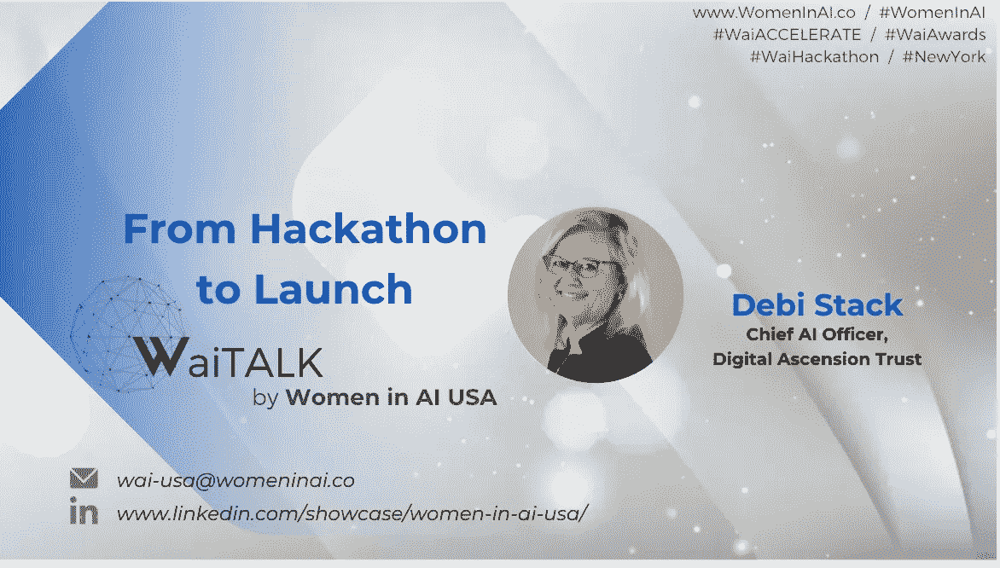

# 从黑客马拉松到发布:

> 原文：<https://medium.com/mlearning-ai/from-hackathon-to-launch-ee98646eed39?source=collection_archive---------3----------------------->

## 与艾维普·彼得·斯塔克先生商榷

在过去的一年里，通过与人工智能领域的[女性](https://www.womeninai.co/)和数据领域的[女性](https://www.womenindata.org/)的合作，我非常荣幸地组织和主持了人工智能和数据科学领域的各种女性活动。不要脸的外挂——如果你是学生、职业过渡者、经验丰富的专业人士、教授、爱好者、导师或者只是一个好奇的人，就去看看这两个组织吧。

在我的 LinkedIn galavanting 中，我遇到了我认为会对这些活动和会谈做出真正贡献的人，我与他们进行了探索电话，以了解他们对在数据和人工智能世界中分享什么充满热情(总是接受建议！).我是一个幸运的人，有机会听到充满激情、发人深省的人们的声音，这些人正在改变他们想看到的世界，从内到外改变世界。

当我开始与彼得交谈时，我可以看到她对人工智能可以为我们带来什么的动力和启发，我知道我们会有一场精彩的现场讨论。她已经在该领域工作了几十年，并继续参与人工智能社区，为人工智能的新企业和应用注入活力，并提供指导和建议。彼得在 3 月 17 日的 AI WaiTalk 上代表我们的女性发表了题为“从黑客马拉松到发布”的演讲，但如果你错过了也没关系:下面是我们演讲的转录，如果你喜欢这个演讲，请随时关注我们即将到来的[聊天、节目和活动](https://www.linkedin.com/showcase/women-in-ai-usa/)！

# 告诉我们关于你自己和你的各种冒险，彼得！

我作为第一批女性人工智能顾问之一从 IBM 退休，并领导 IT 设计和开发团队，向全球通信、媒体和技术客户提供沃森人工智能愿景、战略和原型。在与高通的合作中，我的 IBM 团队详细介绍了沃森人工智能与亚马逊 Alexa 和谷歌 Home 集成的参考架构。我与 EDS 和惠普的前同事共同撰写了《下一代智能城市》一书。作为数字提升的创始人，我将继续履行我在 IBM 接受的使命；“拯救美国退伍军人的生命”

作为梦想坦克(Dream Tank)的董事会成员，501c3 的使命是动员 10 亿青年解决联合国“可持续发展目标”(SDGs)，我赞助了一个由退伍军人和孩子们参加的黑客马拉松，他们开始为 SDG3(精神)健康和福利设计一个名为“重新发现快乐”的游戏。如今，梦想坦克的青年们正在开发一款线上线下全球通用的“金票”游戏，名为“孤岛 17”来解决 SDGs。

# 哇哦。多好的遗产啊。鉴于你对人工智能的观点的广度和深度，人工智能今天让我们看到了五年前没有的东西，你如何在你的业务中利用这种增长？

五年前，在沃森赢得 Jeopardy 后，IBM 率先将 AI 商业化。这是构思和客户体验设计的激动人心的阶段。IBM 收购了精品广告公司 Resource Amarati，它的第一个客户是苹果。我的招聘副总裁曾在 EDS、戴尔和现在的 IBM 与我共事。她让我加入是因为我在上下文计算和客户体验方面的经验。我被选为人工智能的首批 12 名全球商业顾问之一。我召集了设计师、工程师、博士和 MBA，在奥兰多环球影城设计了一个认知主题公园。在 DirecTV，我出售了 Watson Explorer for Data Science 的第一个实例，以支持美国电话电报公司客户的单一视图。我们不得不配置更多的虚拟服务器，以便在他们的 CRM 中上传数 Pb 的数据。2016 年 AI 的一切都是第一。

当我们在大型计算机上构建价值 5000 万美元的沃森实例时，亚马逊向消费者发布了价值 50 美元的 Alexa。昨天，我去我妈妈的新退休之家看望她，我爸爸给她带了一个装有 Alexa 的亚马逊 Fire 平板电脑。她说“Alexa，演奏雷·查尔斯”然后她听了蓝莓山。“亚历克莎，记下来。那是 1982 年 4 月 26 日，我 40 岁生日，爷爷带我去了夏威夷。”她的曾孙 Ian 正在为她训练 Alexa，她告诉他“我不想学任何新东西”，所以 Ian 说他会教 Alexa 如何理解祖母，而不是相反，因为她有资历。看到我们的想法变成现实真的很令人兴奋。事情是这样的:跨越所有行业和技术的所有竞争对手的一代技术专家实现了 iPhone、Alexa、Oculus Quest、比特币和 5G。我们有大量的数据，大量的代码，在客户体验方面有很大的改进。

真相:我们缺少的是真相。人工智能可以成为天空中最伟大的测谎仪。昨天，我被一辆 Mac 卡车追尾了。他让我靠边停车，然后开走了，这是肇事逃逸。警方正在检查犯罪摄像头，但他们说这种情况经常发生，不仅是司机，卡车公司也在撒谎，即使有视频和 GPS。一名女子最近死于肇事逃逸，司机报告他的车被劫，但犯罪摄像头从现场跟踪他到他弃车的地方。

2011 年，我咨询了美国电话电报公司(AT&T)业务移动部门的 CMO·史蒂夫·麦克高(Steve McGaw)。我建议将信任作为他们的北极星战略。当时，银行和电信公司是最受信任的组织。电信公司拥有我们的个人数据的时间比脸书、亚马逊和谷歌要长得多。信任是现在所有组织的共同关键词。我们如何从炒作中辨别真相？有很多炒作。

我重视训练算法的多样性，正如我在 HBR 读到的那样，即使是算法也需要一个管理者。将多代人、性别、种族和生物区域结合起来训练 AI 很重要。作为一名智慧守护者或睿智的长者，就像奇普·康利之于 BNB，我们这一代人拥有足够的数据来进行我们自己的大脑学习模式匹配。所有的技术都是建立在先前代码基础上的进化。例如，我的架构师和技术团队为 iPhone 奠定了基础。我们开发了具有所有协议转换的 IMS，以便在多运营商、设备、服务器、网关之间进行翻译……但是正如《诗句》的丹·梅普斯告诉我的，即使蒂姆·伯纳斯·李也不是亿万富翁。我们如何更公平地分配股权？

2018 年，我被一位 32 岁的埃森哲合伙人写了一篇文章，因为我拒绝告诉考克斯通信公司“区块链不会扩展”，我知道区块链会扩展，因为我已经工作了 5 代电信技术。我知道瓶颈在哪里，我和 Arvind Krishna 一起会见了一个关于区块链的客户，他现在是 IBM 的首席执行官。现在，世界上的每家银行都是区块链，比特币的价格是 62000 美元，我想我们知道结果如何了。

然后，我被 Digital Raign 邀请去 Esalen 研究所参加人工智能意识静修。开发人员和神经科学家表示，我们可能不会在人工智能中创造意识，但它将会出现。因此，我们意识到，练习正念、冥想并学会更有意识非常重要，因为每天当我们与手机互动时，我们都在塑造人工智能，作为技术人员，这是对我们子孙后代未来的巨大责任。我想帮助年轻人塑造人工智能中可能出现的意识，这就是我休假 3 年的原因。现在我正在探索下一波，看看我想在哪里潜水。我跟随海豚的方式，总是赶上下一个浪潮。我的职业生涯是从一种新兴的未来技术到下一种技术的弧线，最近我一直在与 AR 和 XR 合作音乐、文化和节日，因为我认为这是智能城市的起点。

# 是什么让你相信创业是你的道路？

我必须对此一笑置之，因为当我还是一个十几岁的母亲时，我为我的父亲工作，我不想成为一名企业家，直到我爱上了一个梦想是开公司的人。我们开了两家公司，一起抚养了两个继子，但他已经是历史了，让我说一句——女士们，在你们开始任何值得信赖的爱情/商业关系之前，先找个律师吧！

# 你希望在你创业的时候有人告诉你什么是创业？

除了找个律师，找个理财顾问，远离债务！即使你不到 30 岁，也要做好 5 年后退休的准备。

# 你对想成为人工智能领域创始人的女性有什么建议？

形成一个生态系统，在一个平台上合作，包括最好的 UX 设计师，不要相信炒作。只要建造它，当其他人还在谈论它的时候，他们就会到来。

# 我们在人工智能领域有一个女性加速器项目，10 月份还有一个颁奖典礼。较小的创业公司如何才能最好地利用他们的人工智能战略？

给投资者的建议是:在区块链组建一个分布式会计组织，建立信任和透明度，允许创始人满足自己的基本需求，并对项目投资进行投票。为未来公平而做的公益工作是不公平的。资助 100 个创业公司中的 2 个是低效的。失败没有价值，这是不对的。成功有更多的价值。女人是合作者。我希望看到 98%的人一起成功，而不是在竞争中。事实上，我们正在与人工智能进行冷战。这是我们的登月计划。我们没有时间去拯救我们的星球和我们的人民了。唯一的竞争是灭绝，唯一阻碍有才华的年轻企业家的是资金，所以让我们资助他们吧！

# 你希望更多人了解 AI 的什么？

这不再是火箭科学了。我们已经到了设计和配置与数学和编码同样重要的地步。每个人都有受教育和工作的机会。全球人工智能系统必须在当地进行培训，具有不同的信仰、伦理、经验、方言和传统。我希望每个社区都将建立一个未来的创新区，我们将跨越数字鸿沟，不仅在互联网接入方面，而且在我们的年轻人接受创新的接入方面，让世界变得更加美好。Furness 博士在空军开发了虚拟现实飞行模拟器，他告诉我，在化学和物理等科目中，虚拟现实的保留率从 20%增加到 80%。AI 使个性化学习成为可能。

# Covid 对您作为领导者和首席执行官的角色有何影响？

我认为世界停止转动，所以我们可以好好看看周围。我从象牙塔下来，看到了疯狂的麦克斯的雷电圆屋顶。时间到了。技术准备好了。妇女获得资本是瓶颈。解决联合国可持续发展目标是蓝图。我们有最好的人才，最好的技术，最好的蓝图。我们走吧！

# 这一刻最让你激动的是什么？

WAI 黑客马拉松是最令人兴奋的！“从黑客马拉松到发布”正是现在所需要的。就像我们在梦想坦克里说的，要有远大的梦想！！！