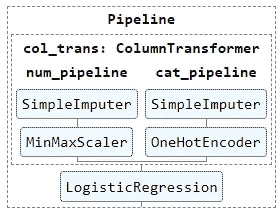
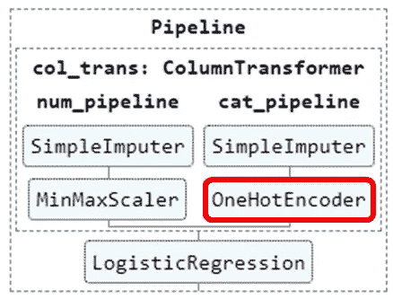
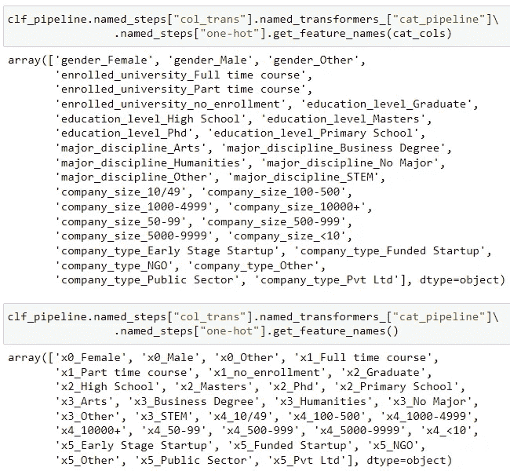
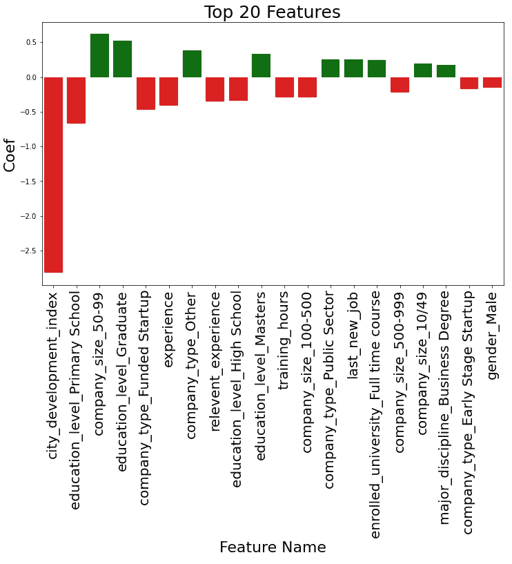

# 拟合机器学习管道后获取列名

> 原文：<https://medium.com/mlearning-ai/get-column-name-after-fitting-the-machine-learning-pipeline-145a2a8051cc?source=collection_archive---------1----------------------->


Picture by [Henry & Co.](https://www.pexels.com/th-th/@hngstrm?utm_content=attributionCopyText&utm_medium=referral&utm_source=pexels) from [Pexels](https://www.pexels.com/th-th/photo/2420294/?utm_content=attributionCopyText&utm_medium=referral&utm_source=pexels)

在上一篇文章中，我写了机器学习模型训练管道的简单实现，它可以使您的代码更加整洁。你可以通过下面的链接阅读。

[](https://yannawut.medium.com/neat-data-preprocessing-with-pipeline-and-columntransformer-2a0468865b6b) [## 使用管道和 ColumnTransformer 进行整洁的数据预处理

### 创建一个管道，您可以在其中输入任何数据，这些数据将在训练机器学习之前进行转换…

yannawut.medium.com](https://yannawut.medium.com/neat-data-preprocessing-with-pipeline-and-columntransformer-2a0468865b6b) 

实现管道时的问题是，管道返回没有列标题的数组，因此很难解释模型并改进模型。

在本文中，我将分享我的解决方案，并展示一个模型系数的示例图表。

# 📔**本文内容**

1.  称之为管道中的一步
2.  获取列名
3.  绘制特征系数

# 🛣️管道

参考上一篇文章，这是管道。

```
# sets of columns to be transformed in different waysnum_cols = ['city_development_index','relevent_experience', 'experience','last_new_job', 'training_hours']
cat_cols = ['gender', 'enrolled_university', 'education_level', 'major_discipline', 'company_size', 'company_type']# Create pipelines for numerical and categorical featuresfrom sklearn.impute import SimpleImputer
from sklearn.preprocessing import OneHotEncoder, MinMaxScaler
from sklearn.pipeline import Pipelinenum_pipeline = Pipeline(steps=[
    ('impute', SimpleImputer(strategy='mean')),
    ('scale',MinMaxScaler())
])cat_pipeline = Pipeline(steps=[
    ('impute', SimpleImputer(strategy='most_frequent')),
    ('one-hot',OneHotEncoder(handle_unknown='ignore', sparse=False))
])# Create ColumnTransformer to apply pipeline for each column typefrom sklearn.compose import ColumnTransformercol_trans = ColumnTransformer(transformers=[
    ('num_pipeline',num_pipeline,num_cols),
    ('cat_pipeline',cat_pipeline,cat_cols)
    ],
    remainder='drop',
    n_jobs=-1)# Add a model to a final pipeline, clf_pipelinefrom sklearn.linear_model import LogisticRegressionclf = LogisticRegression(random_state=0)clf_pipeline = Pipeline(steps=[
    ('col_trans', col_trans),
    ('model', clf)
])
```



在此管道中，clf_pipeline(最终管道)包含 col_trans (ColumnTransformer)和一个逻辑回归模型。

在 col_tran 中，有 num_pipeline 和 cat_pipeline。这些管道将分别转换数字特征和分类特征。

# 🌲 1.称之为管道中的一步

调用管道中的一个步骤可能很棘手。这就像你一步一步地爬树。

从你应该记住的两个属性开始:

**named_steps** :调用管道中的一个步骤

**named_transformers_** :调用 ColumnTransformer 中的一步

如果您不知道 pipeline 和 ColumnTransformer 之间的区别，请花 5 分钟时间回顾我以前的文章(上面的链接)。

**例子**

我想访问名为**‘one-hot’**的 OneHotEncoder，以使用函数 get_feature_names 并在执行 OneHotEncoder 后获取功能名称



这是代码。

```
clf_pipeline.named_steps[“col_trans”].named_transformers_[“cat_pipeline”].named_steps[“one-hot”].get_feature_names(cat_cols)
```

**代码解释:**

*   从 clf_pipeline(最终的管道)开始
*   。name_steps 将调用“cal_trans ”,这是一个列转换器
*   。name_transformer_ 将调用“cat_pipeline ”,它是“col_trans”内部的管道
*   第二个。named_steps 将调用所需的“one-hot”步骤。
*   。get_feature_names 类似于直接从 OneHotEncoder 中调用该函数

# 🤏 2.获取列名

管道实现的困难任务是获取列名，因为管道将返回没有列标题的数组。

解决方案是跟踪管道和列转换器流程。

P **ipeline** :逐步转换数据，作为 steps 参数中的输入。 **ColumnTransformer** :并行转换数据，并按顺序连接结果，作为 transformers 参数中的输入。

大多数数据转换函数不改变列名(或列数)。因此，您只需关注几个改变列数的函数，如 OneHotEncoder。

```
# numerical columns not change, categorical columns change from one-hot encodernew_cat_cols = clf_pipeline.named_steps["col_trans"]\
.named_transformers_["cat_pipeline"]\               .named_steps["one-hot"].get_feature_names(cat_cols)# concatenate categorical columns with numerical columns to get all columns
all_cols = np.concatenate([num_cols, new_cat_cols])
```

**代码解释:**

*   使用 get_feature_names 获取新的分类列。(数字列不会改变。)
*   get_feature_names 函数内部的(cat_cols)会以“列名 _ 类别值”的格式返回列名。
    如果没有自变量 cat_cols，它将返回该列的索引。



Compare get_feature_name with and without argument

*   由于 col_trans(一个 ColumnTransformer)在 cat_pipeline 之前执行步骤 num_pipeline，所以管道的结果将是分类列之前的数字列。所有列都是通过连接 num_col 和 new_cat_col 获得的。

**注意:** \只是将代码继续到新的一行。

# 📊 3.绘制特征系数

这个管道中的模型是逻辑回归，因此我们可以通过查看每个特性/列的系数来快速了解特性的重要性。

可以通过转到步骤“模型”并调用属性 coef_

```
coefs = clf_pipeline.named_steps["model"].coef_.flatten()
coef = pd.DataFrame(zip(all_cols, coefs), columns=["feature", "coef"])
coef["abs_coef"] = coef["coef"].apply(lambda x: abs(x))
coef["colors"] = coef["coef"].apply(lambda x: "green" if x > 0 else "red")
coef = coef.sort_values("abs_coef", ascending=False)
```

**代码解释:**

*   访问“模型”步骤以获取系数 _
*   将 array coefs 更改为 dataframe coef，以便可以添加更多列。
*   添加列“abs_coef ”,它是系数的绝对值
*   添加列“颜色”,当 coef 为正时返回绿色，如果 coef 为负时返回红色。
*   按 abs_coef 列对数据帧进行排序，这样最重要的特性就在数据帧的顶部。

使用 seaborn 库的柱状图绘制系数。数据是数据帧的核心。

```
# Plot coef
import matplotlib.pyplot as plt
import seaborn as sns%matplotlib inlinefig, ax = plt.subplots(1, 1, figsize=(12, 7))
sns.barplot(x="feature",
            y="coef",
            data=coef.head(20),
           palette=coef.head(20)["colors"])
ax.set_xticklabels(ax.get_xticklabels(), rotation=90, fontsize=20)
ax.set_title("Top 20 Features", fontsize=25)
ax.set_ylabel("Coef", fontsize=22)
ax.set_xlabel("Feature Name", fontsize=22)
```



# 结论

您可以通过使用 name_steps 和 name_transformer_ 爬上管道树来获得管道之后的列名。然后，您可以使用 get_feature_names 跟踪已更改的列名。之后，您可以找到模型系数并绘制图表来可视化特征重要性。

如果您有更好的方法来获得管道转换后的列名，请在评论中留下您的想法。

[](/mlearning-ai/mlearning-ai-submission-suggestions-b51e2b130bfb) [## Mlearning.ai 提交建议

### 如何成为 Mlearning.ai 上的作家

medium.com](/mlearning-ai/mlearning-ai-submission-suggestions-b51e2b130bfb)