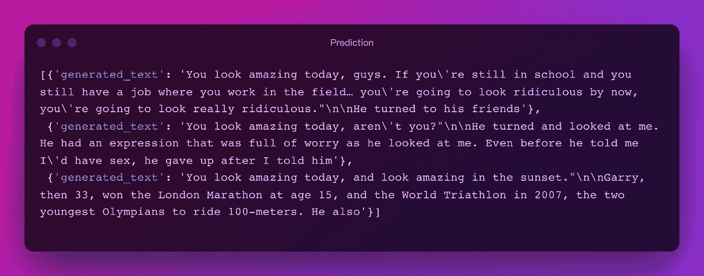
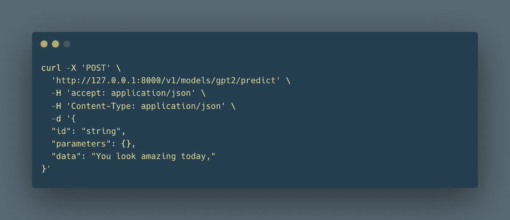
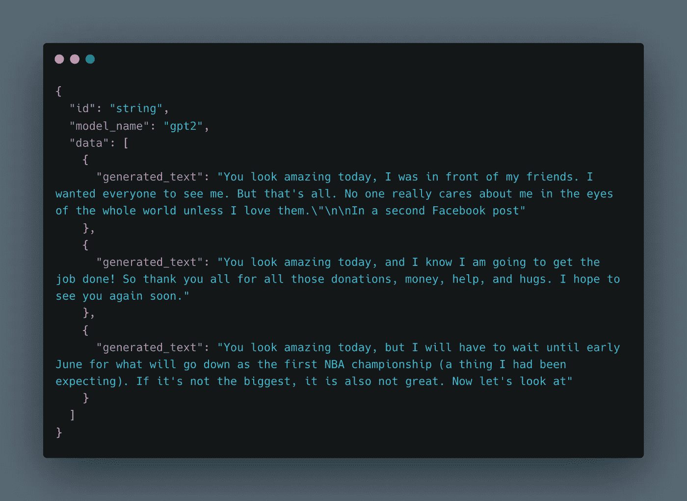
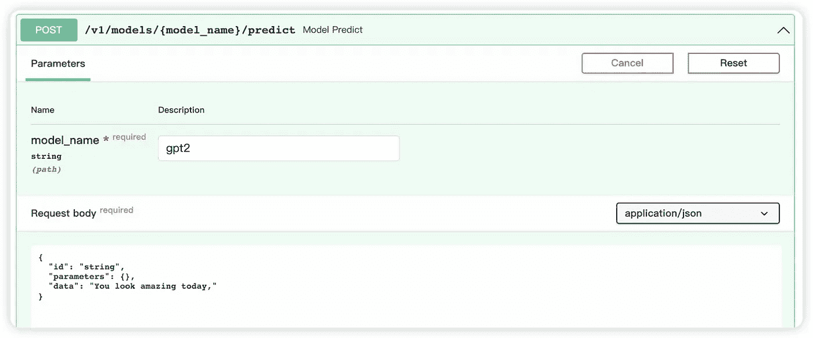
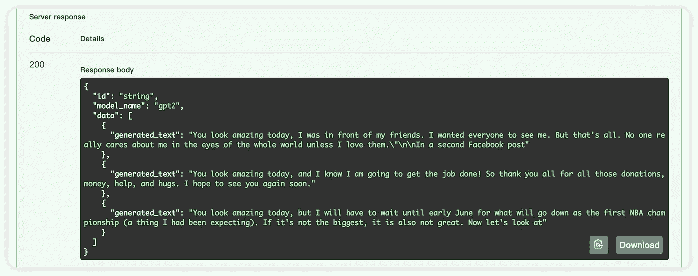

# GPT2 —文本生成转换器:如何使用 HuggingFace 和 Pinferencia

> 原文：<https://medium.com/mlearning-ai/gpt2-text-generation-transformer-how-to-use-how-to-serve-1cad1476bc2a?source=collection_archive---------2----------------------->

什么是文本生成？输入一些文本，模型会预测后面的文本会是什么。

听起来很有趣。不自己试模型怎么会有意思？

GPT2 是 HuggingFace 上下载量最多的机型之一。

[**拥抱脸**](https://huggingface.co/) 只需几行就能轻松使用预训练模型。

[**Pinferencia**](https://github.com/underneathall/pinferencia) 只需三条额外的线就能轻松为模特服务。

# 如何使用

该模型将自动下载。


就是这样！

让我们稍微尝试一下:

```
predict("You look amazing today,")
```

结果是:



让我们来看看第一个结果。

> 伙计们，你们今天看起来棒极了。如果你还在学校，你还有一份在田间工作的工作…你现在会看起来很可笑，你会看起来真的很可笑。"
> 
> 他转向他的朋友

🤣这就是我们要找的东西！如果你再次运行预测，它每次都会给出不同的结果。

# 如何部署

使用 [Pinferencia](https://github.com/underneathall/pinferencia) ，只需再添加三行代码，您的模型就可以上线了！

没听说过 [Pinferencia](https://github.com/underneathall/pinferencia) ？现在还不晚。去它的 [GitHub](https://github.com/underneathall/pinferencia) 看看吧。别忘了给它一颗星。

## 安装 Pinferencia

```
pip install "pinferencia[uvicorn]"
```

## 服务

只需在我们之前的代码中添加三行代码，并将其保存为`app.py`。

现在去终端跑。

```
uvicorn app:service --reload
```

**您的服务已上线！**进入 [http://127.0.0.1:8000](http://127.0.0.1:8000/) 查看 API。

# 测试服务

卷曲



结果:



或者只使用在 [http://127.0.0.1:](http://127.0.0.1:) 提供的交互式 UI



如果你喜欢 https://github.com/underneathall/pinferencia 的 T21，别忘了给它一颗星。

[](/mlearning-ai/mlearning-ai-submission-suggestions-b51e2b130bfb) [## Mlearning.ai 提交建议

### 如何成为 Mlearning.ai 上的作家

medium.com](/mlearning-ai/mlearning-ai-submission-suggestions-b51e2b130bfb)