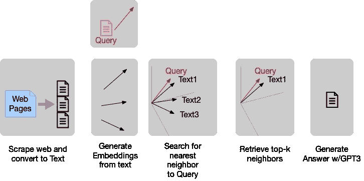

# GPT3 洗碗？不，用它来查询你的洗碗机维修手册

> 原文：<https://medium.com/mlearning-ai/gpt3-does-dishes-no-use-it-to-query-your-dishwasher-repair-manual-39af99e017a0?source=collection_archive---------4----------------------->

StableDiffusion prompt: elegant robot near a dishwasher washes dishes with dextrous arms very watchful of carrying dishes not breaking anything

哦，我现在引起你的注意了吗？我们的任务是淘汰短语 [RTFM](https://en.wikipedia.org/wiki/RTFM) ，创造新的东西；QTM(查询手册)。

## 对于不耐烦的人…

用 OpenAP 钥匙武装自己，然后去我的 [GitHub repo](https://github.com/aurotripathy/query-your-dish-washer-repair-man) 玩笔记本。你应该可以复制我的结果。

(1) Scrape the documents you want to query, (2) Build embeddings for each chunk of text, (3) Retrieve relevant text with a nearest-neighbor search, (4) Hand it to GPT’s prompt-completion engine to generate an answer.

## 对病人来说…

通过四个简单的步骤(如上所示)，你可以用 GPT3 建立一个可查询的洗碗机维修手册。这些步骤适用于查询任何文本。

## 1.刮掉一本洗碗机维修手册，然后创建一大段文字。

我给你一个[先手](https://github.com/aurotripathy/query-your-dish-washer-repair-man/blob/main/scraper.py)通过刮这个洗碗机修理[手册](https://www.appliancerepair.net/dishwasher-repair-1.html)；如果你从一个网站开始，你必须理解文档的布局，并使用像 [Beautiful Soup](https://www.crummy.com/software/BeautifulSoup/bs4/doc/) 这样的 [DOM](https://www.w3schools.com/js/js_htmldom.asp) 解析器(我在我的例子中使用了它)。有很多方法可以为 DOM 换肤，最终结果将是一个包含四列`”title”, ”heading”, ”content”, ”tokens”`的 CSV 文件。前两列用作检索内容的索引。我们从`content` 列中生成嵌入。`tokens`列是块中单词总数的计数；小块可以和周围的句子组合在一起。

## 2.从文本块中构建嵌入

将整个文本转换成嵌入内容是通过`[SentenceTransformer](https://www.sbert.net/index.html)`库完成的，该库提供了一种基于 BERT 的模型选择。我学到的诀窍是挑一个[不对称型号](https://www.sbert.net/examples/applications/semantic-search/README.html#symmetric-vs-asymmetric-semantic-search)；它们适用于短查询(和相对较长的文本)。

## 3.根据您的查询检索“相关”文本

每个嵌入(无论是查询还是文本块)本质上都是 n=768 维空间中的一个向量。基于 BERT，它能熟练地捕捉上下文。查询向量和任何块向量之间的相似性的度量是它们之间的余弦。在查询和每个文本块之间应用余弦度量之后，我们按照相似性的降序对它们进行排序。

注意，您可以使用 OpenAI 的 Curie 模型，`text-search-curie-query-001` (此处显示为)来生成嵌入；我选择不要(省了我几块钱)。

## 4.GPT3 根据检索到的文本生成事实答案

完成基于查询的提示是 GPT3 的亮点(而 GPT2 作为一个小得多的模型，是不合格的)。托管 GPT3 是一项艰巨的任务，所以我们依赖 OpenAI 的 API(Cohere 的 API 是另一个候选，但是我没有任何经验)。

建立上下文的提示需要以 GPT3 可以使用它来完成“上下文”的方式来构建。

## 结束…

现在对这些回应感到惊讶。

另一个是简短但有用的

## 参考

[使用嵌入回答问题](https://github.com/openai/openai-cookbook/blob/main/examples/Question_answering_using_embeddings.ipynb)

[句子变压器文档](https://gist.github.com/aurotripathy/3a3c0244f0a9cb4c8794e553470bc95f)

## 谢谢

👏为这个故事鼓掌，跟我来👉

 [## Mlearning.ai 提交建议

### 如何成为 Mlearning.ai 上的作家

medium.com](/mlearning-ai/mlearning-ai-submission-suggestions-b51e2b130bfb)