# 用于分类的梯度推进

> 原文：<https://medium.com/mlearning-ai/gradient-boosting-for-classification-f9a93381e37c?source=collection_archive---------3----------------------->

## Python 中梯度增强的解释和实现


Photo by [Andrew Moca](https://unsplash.com/@mocaandrew?utm_source=unsplash&utm_medium=referral&utm_content=creditCopyText) on [Unsplash](https://unsplash.com/s/photos/together?utm_source=unsplash&utm_medium=referral&utm_content=creditCopyText)

这篇博文是第二篇关于渐变提升的博文。第一章是关于回归问题；

[](/mlearning-ai/gradient-boosting-for-regression-from-scratch-bba968c16c57) [## 从零开始回归的梯度推进

### Python 中梯度增强的解释和实现

medium.com](/mlearning-ai/gradient-boosting-for-regression-from-scratch-bba968c16c57) 

我们将使用下面显示的虚拟数据集；

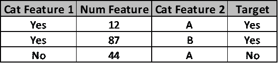

在同一个回归中，我们有一个由 n 个观测值和目标要素组成的数据集，以及一个损失函数。

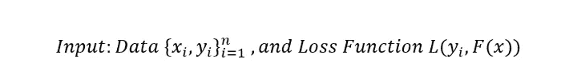

对于损失函数，我们需要像在逻辑回归中一样计算对数(可能性)。

[](https://python.plainenglish.io/logistic-regression-from-scratch-7b707662c8b9) [## 从零开始的逻辑回归

### 解释和实施

python .平原英语. io](https://python.plainenglish.io/logistic-regression-from-scratch-7b707662c8b9) 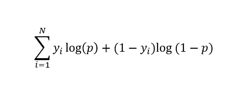

log(likelihood of an observed data given the prediction)

*p* 为预测概率， *yi* 为每次观测的目标值。在逻辑回归中，我们的目标是最大化对数(可能性)值。因为这个值越高，我们的预测就越好。如果我们要使用对数(可能性)作为损失函数，较小的值应该更合适。为此，我们将整个函数乘以-1。

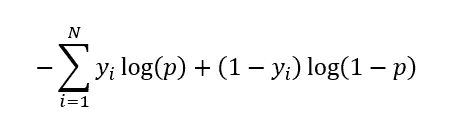

所以，让我们简化上面的等式:

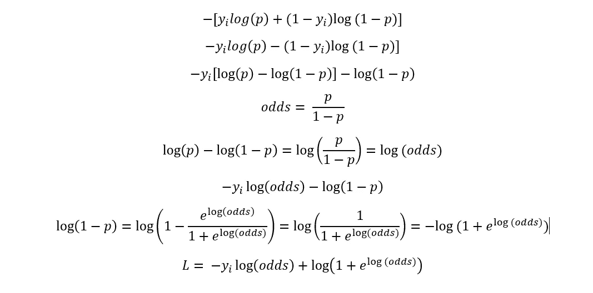

我们得到了一个基于赔率的简化损失函数；损失函数的导数是:

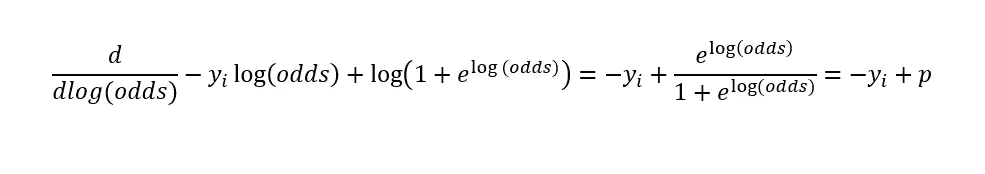

我们可以在推导中同时使用 odds 和 p。

**第一步:**用一片叶子初始化模型。

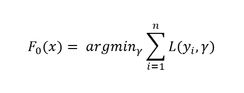

所以，我们将使用损失函数来寻找最佳的初始预测值；

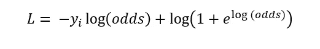

Loss

对损失函数求导；p= 0.67，第一个初始值= 0.69

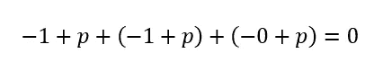

**第二步:**对于 m=1 到 M:开始循环

**答:**计算伪残差，损失函数的导数

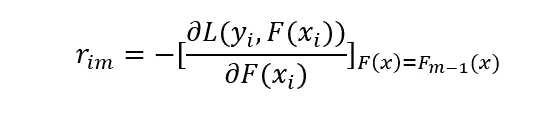

r =(易— 0.67)

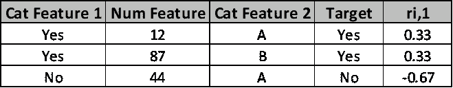

**B:** 将回归树拟合到每个特征，以预测残差并创建末端区域 Rjm，标记叶子。

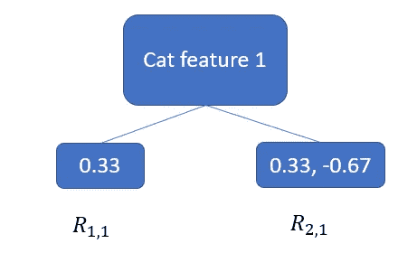

**C:** 计算新树的输出值。

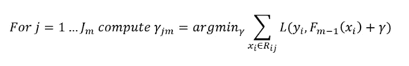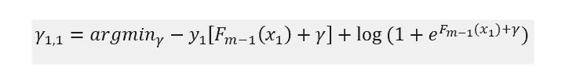

很难计算上述函数对γ的导数。相反，我们将使用二阶泰勒多项式与[的近似。](https://en.wikipedia.org/wiki/Taylor_series#:~:text=Taylor%20polynomials%20are%20approximations%20of,the%20use%20of%20such%20approximations.)

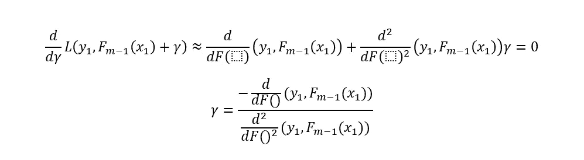

在应用了一些微积分之后；

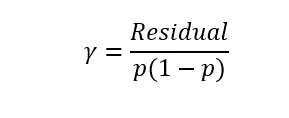

让我们为每个叶子和残差解这个方程；

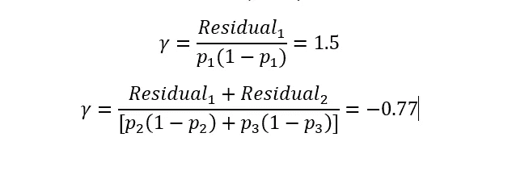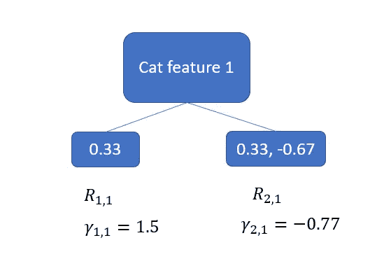

**D:** 对每个样本进行新的预测；(学习率=0.8)

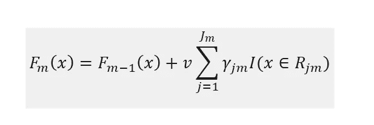

第一个样本:0.69 + 0.8 * 1.5 = 1.89 是新的对数(赔率)

第二个样本:0.69 + 0.8 * -0.77 = 0.07

第三个样本:0.69 + 0.8 * -0.77 = 0.07

现在我们完成了 for 循环的第一轮。我们将通过将 m 设置为 2 来重新开始。

**第三步:**输出 Fm(x)

## Python Sklearn 代码

```
Accuracy score (training): 0.873
Accuracy score (validation): 0.780
Confusion Matrix:
[[145  16]
 [ 43  64]]
Classification Report
              precision    recall  f1-score   support

           0       0.77      0.90      0.83       161
           1       0.80      0.60      0.68       107

    accuracy                           0.78       268
   macro avg       0.79      0.75      0.76       268
weighted avg       0.78      0.78      0.77       268
```

感谢阅读。如果您有任何问题或意见，请随时写信给我！

## 阅读更多内容…

[](https://python.plainenglish.io/decision-tree-parameters-explanations-tuning-a2b0749976e5) [## 决策树参数解释

### Sklearn 的决策树参数解释

python .平原英语. io](https://python.plainenglish.io/decision-tree-parameters-explanations-tuning-a2b0749976e5) [](/mlearning-ai/gradient-boosting-for-regression-from-scratch-bba968c16c57) [## 从零开始回归的梯度推进

### Python 中梯度增强的解释和实现

medium.com](/mlearning-ai/gradient-boosting-for-regression-from-scratch-bba968c16c57) [](/mlearning-ai/adaboost-from-scratch-f8979d961948) [## 从头开始

### AdaBoost 算法的解释和实现

medium.com](/mlearning-ai/adaboost-from-scratch-f8979d961948) [](/@okanyenigun/scala-7-spark-introduction-e6bb908a8d1b) [## Scala #7: Spark:简介

### Apache Spark 简介

medium.com](/@okanyenigun/scala-7-spark-introduction-e6bb908a8d1b) 

## 参考

[](/mlearning-ai/mlearning-ai-submission-suggestions-b51e2b130bfb) [## Mlearning.ai 提交建议

### 如何成为 Mlearning.ai 上的作家

medium.com](/mlearning-ai/mlearning-ai-submission-suggestions-b51e2b130bfb)