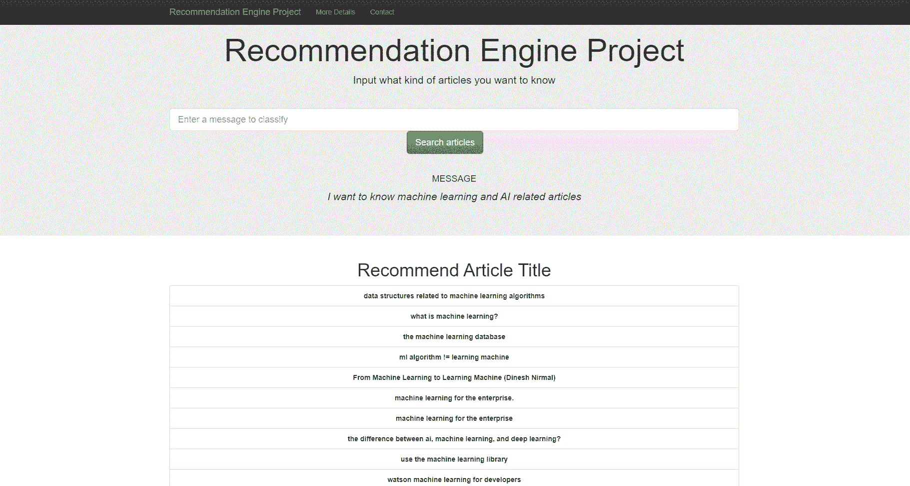

# 面向初学者的推荐引擎开发和部署指南

> 原文：<https://medium.com/mlearning-ai/guide-for-recommendation-engine-development-and-deployment-for-beginners-179f4950741c?source=collection_archive---------5----------------------->

source: [ActiveState](https://www.activestate.com/blog/how-to-build-a-recommendation-engine-in-python/)

很多互联网公司的盈利能力取决于一个推荐系统有多好。好的推荐系统可以帮助用户找到自己感兴趣的东西(产品、内容)，提高用户粘性，增加用户转化率和点击率，为用户创建专属的用户档案，为用户提供个性化的服务。推荐引擎的常见用例包括 Amazon.com、网飞、facebook 和 Linkedinetc 等，它们都为自己的业务提供了巨大的利润。这个博客将介绍推荐引擎的基础知识，并提供如何开发和部署你自己的推荐引擎的指南。一个 IBM 案例研究被用来演示一个端到端的简化推荐引擎开发和部署。代码的细节可以在[这里](https://github.com/xujiang1993/IBM_recommendation_engine)找到，部署的网络应用可以在[这里](https://recommendation-engine-xu.herokuapp.com/)找到。

# 推荐类型

三种基本类型的推荐被广泛使用，包括基于知识的推荐、基于协同过滤的推荐和基于内容的推荐。

## 基于知识的推荐

基于知识的推荐经常使用过滤器来实现，并且在奢侈品中非常普遍。您在购买汽车或房屋等物品时可能会看到的过滤器就是基于知识的推荐的例子。在基于知识的推荐中，用户提供关于他们想要返回的推荐类型的信息。通常，基于排名的算法与基于知识的推荐一起提供，以引起用户对特定类别中最受欢迎的项目的注意。然而，基于知识的推荐不是个性化的，因此在许多商业使用案例中，公司会使用其他推荐来增加客户体验。

## 基于协同过滤的推荐

协同过滤主要基于用户之间的相似性。这样你就可以找到曾经相似的用户，然后根据这些相似的用户推荐新电影。与基于知识的推荐相比，协同过滤更加个性化。然而，由于代码启动问题，协同过滤通常需要与其他推荐引擎配合使用，如基于内容的推荐。

## 基于内容的推荐

与基于知识的推荐不同，基于内容的推荐主要利用自然语言处理从相应的描述中提取关键特征，然后比较文本相似度，找到最相似的推荐。与前两个推荐不同，基于内容的推荐利用了推荐项目本身的性质，而不是外部连接。

# 相似性/距离度量

相似性/距离度量是推荐系统的核心组成部分。不同的相似度/距离可能导致完全不同的推荐结果。与相异度不同，相似度越接近 0，距离通常取 0 到可能无穷大之间的值。越接近 0 的度量意味着两个向量彼此越相似。常见的相似性度量包括皮尔逊相关系数、斯皮尔曼相关系数、肯德尔τ、欧氏距离和曼哈顿距离等。

# 推荐引擎指示

虽然准确性可以用来识别推荐是否正确地做出预测，但是准确性并不是业务和客户体验的最佳指标。Anna Beth 介绍了在评估推荐引擎的有效性时需要考虑的四个指标，包括相关性、新颖性、偶然性和多样性。这个博客不会扩展这个讨论，但是如果你感兴趣，我推荐你看安娜的博客[这里](https://gab41.lab41.org/recommender-systems-its-not-all-about-the-accuracy-562c7dceeaff)。

# 案例研究:IBM Watson Studio 平台

上面几节已经介绍了推荐系统的一些基础知识。这一部分将展示我的迷你项目推荐引擎，我也部署在 Heroku 引擎。这个项目的细节和代码可以在[这里](https://github.com/xujiang1993/IBM_recommendation_engine)找到。这个项目使用 IBM Watson Studio 平台数据来开发推荐系统。本项目构建了四种类型的推荐，包括基于排名的推荐、基于用户-用户的协同过滤、基于内容的推荐和矩阵分解。本节将使用基于内容的推荐作为示例。基于内容的推荐引擎的开发步骤是:

*   数据加载和预处理:这一步是从各种数据源加载数据，然后建立一个 NLP 数据管道，将文本数据转换成随时可用的特征向量。
*   建立一个获取项目名称的函数:推荐系统的数据通常包括项目 id 和项目名称。数据的大小通常是巨大的，所以它需要一个函数可以帮助将 id 转换为推荐的项目名称。
*   相似性计算和排序:推荐中最重要的一步是计算相似性。该项目使用客户输入和训练数据集的点积来计算相似性。
*   做推荐:最后一步是做推荐。在这一步，通常需要一个阈值——有时最相似的推荐并不意味着它们是相似的。此外，在此步骤中，还需要定义建议的数量。

下面是我部署的网页的屏幕截图

# 结论

推荐引擎对于当前的互联网业务至关重要。这篇博客介绍了基础知识，并展示了推荐系统开发和部署的案例研究。希望这能帮助你建立自己的推荐引擎。最后，如果你能点击**鼓掌**来支持我的博客，我会非常感激，我会继续围绕数据科学或一些热点领域制作更多有趣的内容。

 [## Mlearning.ai 提交建议

### 如何成为 Mlearning.ai 上的作家

medium.com](/mlearning-ai/mlearning-ai-submission-suggestions-b51e2b130bfb)