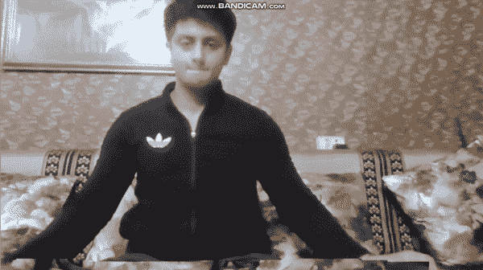
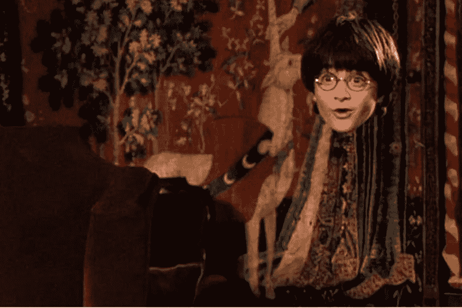

# 哈利的隐身衣——不到 50 行代码——带源代码

> 原文：<https://medium.com/mlearning-ai/harrys-invisibility-cloak-less-than-50-lines-of-code-with-source-code-easiest-explanation-772a8176b46f?source=collection_archive---------13----------------------->

伙计们，最期待的博客之一来了。今天我们要用不到 50 行代码编写哈利的隐身衣，看完结果你会大吃一惊的。是啊是啊，我知道你不能控制自己的情绪🙂

**点击此处阅读带源代码的整篇文章—**[https://machine learning projects . net/harrys-invisibility-斗篷/](https://machinelearningprojects.net/harrys-invisibility-cloak/)



# 让我们开始吧…



## 哈利隐形衣的代码…

```
import cv2
import numpy as np
import time

cap = cv2.VideoCapture(0)

for i in range(30):
    ret,background = cap.read()

background = np.flip(background,axis=1)

while(1):
    ret, frame = cap.read()

    img = np.flip(frame,axis=1)
    hsv = cv2.cvtColor(img, cv2.COLOR_BGR2HSV)
    blurred = cv2.GaussianBlur(hsv, (35, 35),0)

    lower = np.array([2,170,0])
    upper = np.array([28,255,255])
    mask = cv2.inRange(hsv,lower,upper)

    mask = cv2.erode(mask,np.ones((7,7),np.uint8))
    mask = cv2.dilate(mask,np.ones((19,19),np.uint8))

    img[np.where(mask==255)] = background[np.where(mask==255)]

    cv2.imshow('MAGIC',img)

    if cv2.waitKey(1) == 27:
        break

cv2.destroyAllWindows()
cap.release()

# This was the code for Harry's Invisibility Cloak
```

*   第 1–3 行—导入所需的库。
*   第 5 行—实例化 [VideoCapture()](https://docs.opencv.org/3.4/d8/dfe/classcv_1_1VideoCapture.html) 对象，以便稍后访问网络摄像头。
*   第 7- 8 行—最初记录背景。我们一直循环到第 30 帧，第 30 帧作为背景图像。记住当你记录背景时你不需要在相框里，也不要在记录背景后改变你的笔记本电脑/相机的位置。
*   第 10 行——简单地水平翻转背景图像。
*   **让我们运行循环…**
*   第 13 行——使用我们上面制作的 [VideoCapture()](https://docs.opencv.org/3.4/d8/dfe/classcv_1_1VideoCapture.html) 对象读取当前帧。
*   第 15 行—翻转图像。
*   第 16 行——将图像转换到 HSV 颜色空间，因为我们将在后面的步骤中从中取出蒙版，为了蒙版的目的，HSV 效果最好。
*   第 17 行-高斯模糊图像以减少高斯噪声。
*   第 19–20 行—指定您将使用斗篷的颜色范围。我用了一件橙色的斗篷。这些是橙色的 HSV 范围上限和下限。
*   第 21 行——从图像中创建蒙版。这意味着当我们在框架中显示斗篷时，它将只标记该区域为白色，其他区域为黑色。
*   第 23–24 行——侵蚀和扩张蒙版以增强其效果。
*   第 26 行— **【最重要的一行】**在蒙版中有白色区域的地方(有斗篷的地方)用我们上面记录的背景图像的像素替换那些像素。通过这种方式，它创造了一种隐形效果。当所有的斗篷都出现时，它会在那些地方显示背景，看起来你是隐形的。
*   第 28 行——简单地显示我们的图像。
*   第 30–31 行—如果有人按 ESC 键，破解密码。
*   第 33–34 行—释放网络摄像头并销毁所有打开的窗口。

## 最终结果…


如果对哈利的隐形衣有任何疑问，请通过电子邮件或 LinkedIn 联系我。

**如需进一步的代码解释和源代码，请访问此处**—[https://machine learning projects . net/harrys-invisibility-斗篷/](https://machinelearningprojects.net/harrys-invisibility-cloak/)

*这就是我写给这个博客的全部内容，感谢你的阅读，我希望你在阅读完这篇文章后，能有所收获，直到下一次👋…*

***看我之前的帖子:*** [***如何在 OPENCV 中检测形状***](https://machinelearningprojects.net/how-to-detect-shapes-in-opencv/)

**查看我的其他** [**机器学习项目**](https://machinelearningprojects.net/machine-learning-projects/)**[**深度学习项目**](https://machinelearningprojects.net/deep-learning-projects/)**[**计算机视觉项目**](https://machinelearningprojects.net/opencv-projects/)**[**NLP 项目**](https://machinelearningprojects.net/nlp-projects/)**[**烧瓶项目**](https://machinelearningprojects.net/flask-projects/) **at**********

****[](/mlearning-ai/mlearning-ai-submission-suggestions-b51e2b130bfb) [## Mlearning.ai 提交建议

### 如何成为 Mlearning.ai 上的作家

medium.com](/mlearning-ai/mlearning-ai-submission-suggestions-b51e2b130bfb)****