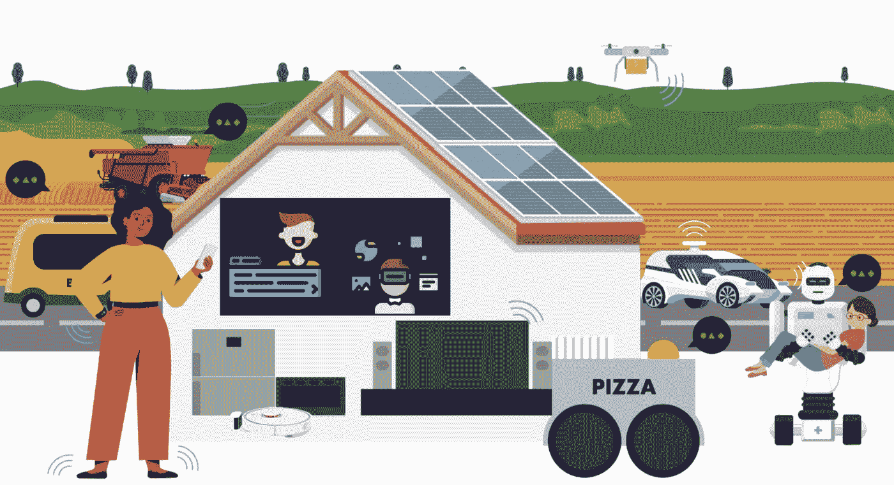
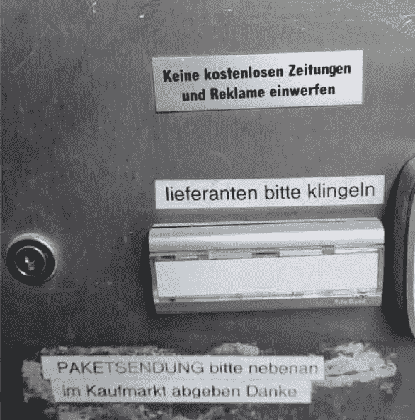
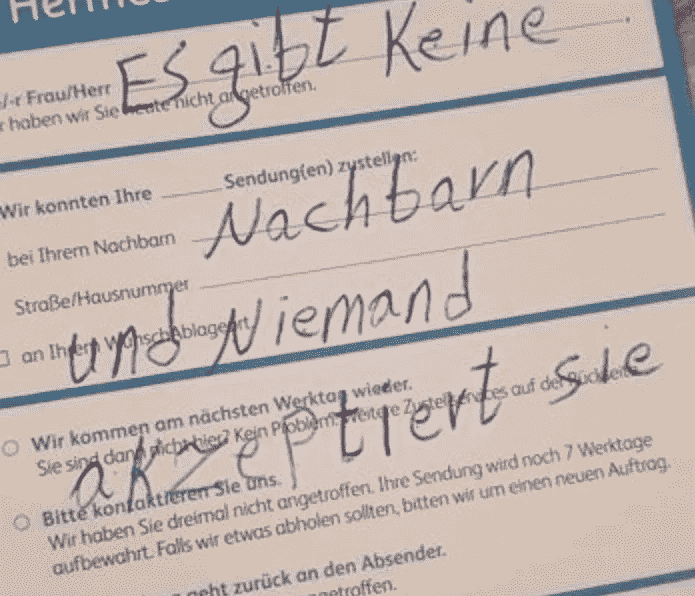
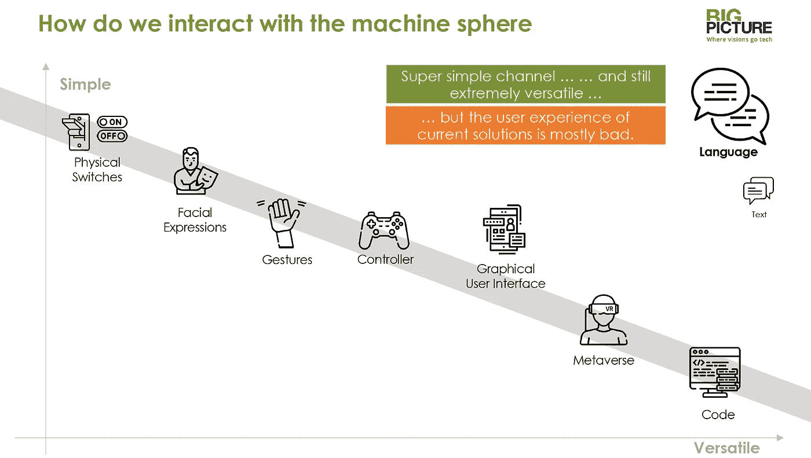
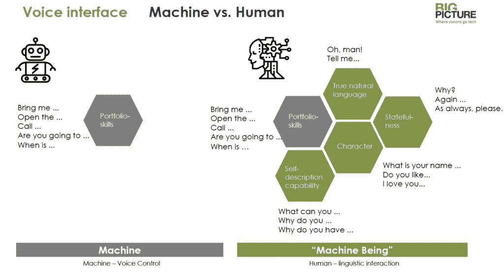
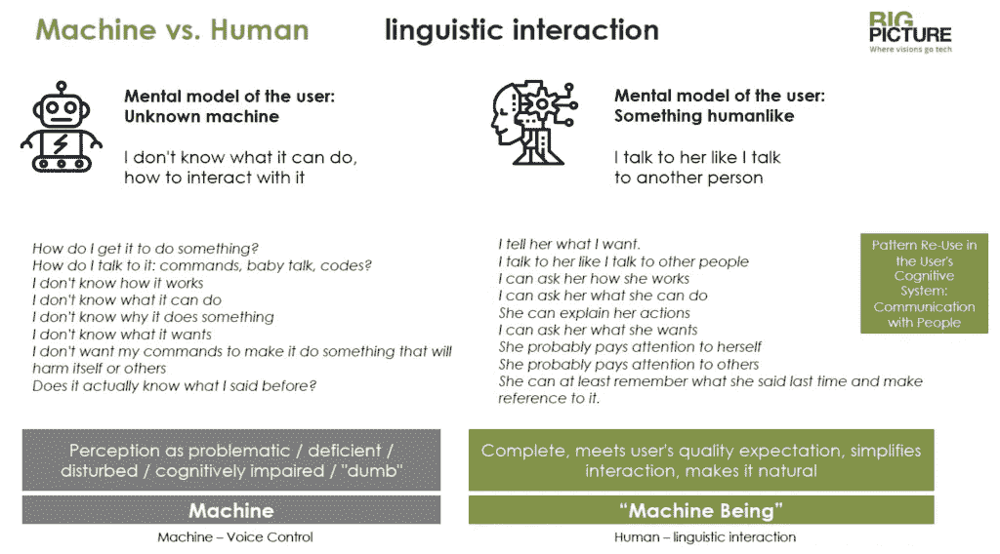
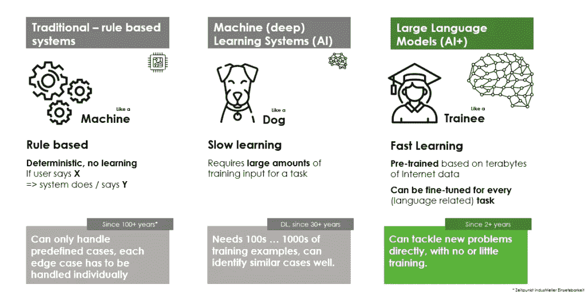
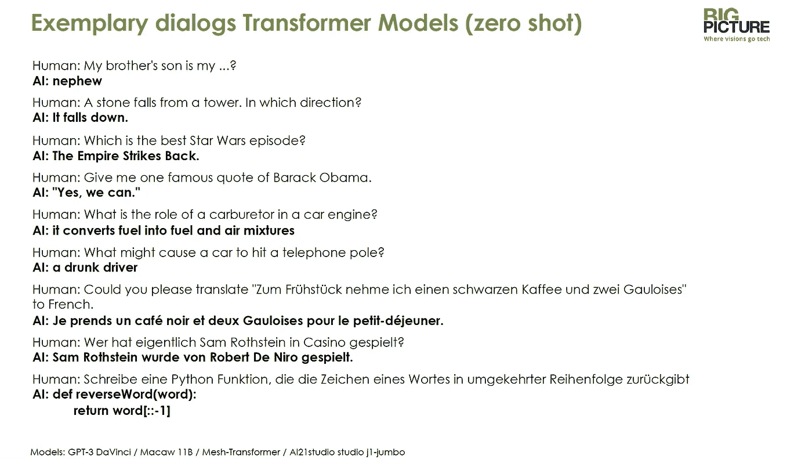
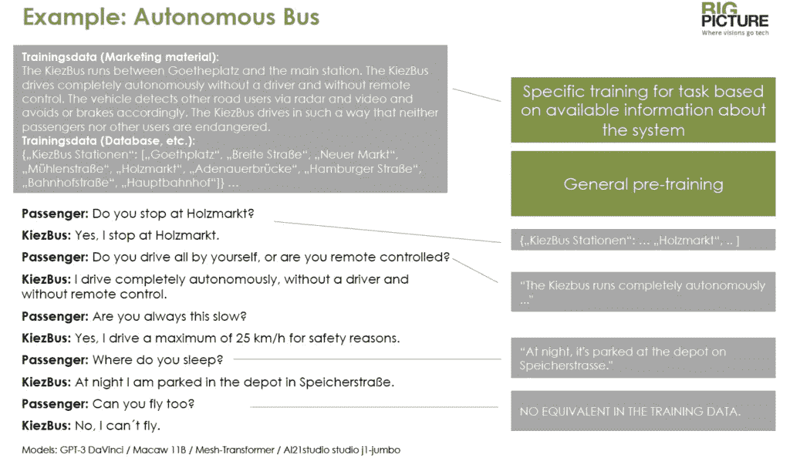
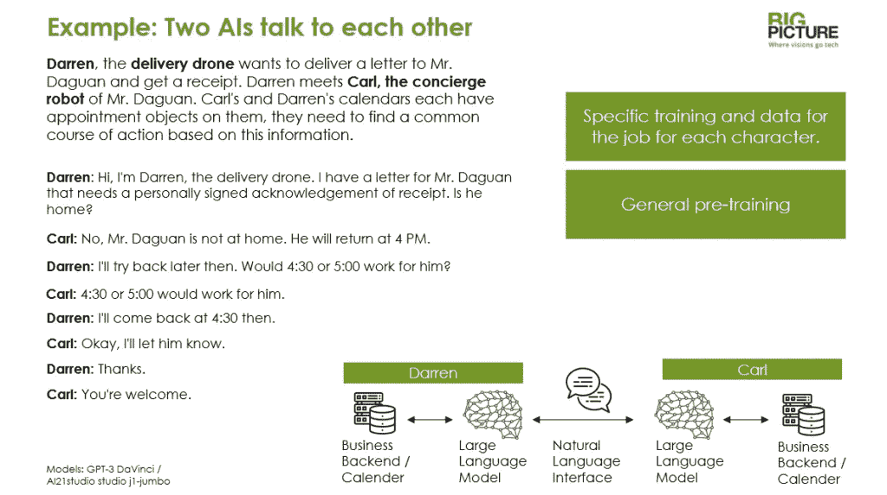

# 来自另一边的你好:机器如何学会更好地交流

> 原文：<https://medium.com/mlearning-ai/hello-from-the-other-side-how-machines-learn-to-communicate-better-39ad1f74a1c4?source=collection_archive---------3----------------------->

这篇文章基于我在德国威尔道航空航天中心(ZLR)举行的第五届自主系统国际年会上所做的报告。

我们的世界充斥着复杂的机器。并与这些设备交流:我们已经可以与我们的手机、电脑、智能音箱、手表和汽车对话。显然，在未来，新的自主和复杂的机器将围绕着我们:从送货无人机到智能可穿戴设备，清洁机器人，老人护理助理和葡萄酒建议机器人到监控机器人——与机器的接触正在增加。

What has to go where now exactly?

**我们如何与机器球体互动？**

问题是:我们如何控制这些设备？我们如何与他们互动？我们如何与他们交流？送货无人机知道在售货亭放下包裹吗？它会像人类包裹运送者一样写纸条贴在公寓门上吗？

Translation German/ English: “There are no neighbors and nobody accepts them.” Will a delivery drone ever deliver and communicate with this much passion?

许多自主系统——例如无人驾驶的穿越柏林-泰格尔的公共汽车或披萨外卖无人机——目前仍然有一名人类服务员在出现问题时进行干预。当乘客问:公共汽车也在总站停靠吗？或者当有人要求无人机为人行道上的双人婴儿车腾出空间时，她可以做出反应。

就目前和概念验证而言，这样的护送是很棒的。然而，从长远来看，设备需要能够自我解释。如果复杂的设备不能与环境互动，我们就不能让它们到处行驶。

**这样的用户界面会是什么样子？**

How do we interact with machines?

如果我们看看机器最重要的接触点，我们会发现，随着交互范围的扩大，控制方法的简单性降低，通信变得更加困难:我可以通过一个简单的开关来打开和关闭设备，但仅此而已。我不能触发复杂的动作，比如“开车带我去汉堡”的请求情绪检测、手势、控制器、元宇宙或编程等控制功能允许不断增加的交互范围。然而，这些技能在临时用户的技能列表中越来越少。

相比之下，我们在语言的使用中看到了一个甜蜜点:它确实可以用来触发许多交互，例如，我可以购买一件物品，指定一个目标，指定一项服务需求。同时，对于大多数人来说，这种交流方式非常容易和自然。

那么为什么语音控制还没有真正流行起来呢？

很简单，许多语音界面在质量方面不够好，用户体验很糟糕。到目前为止，在市场领先的系统中，对口语的理解已经相当不错了。但是机器仍然很难识别用户真正想要的是什么。当涉及到意图和上下文时，它们通常仍然是不切实际的。通过语言控制一个实体经常感觉像盲目地操作一个图形用户界面:我不知道这个对象有什么能力，我通常不得不艰难地学习:我经常被告知它不理解我。

Voice interface machine vs. person

原因很简单:第一个商业语音应用程序被设计得像一个图形用户界面:系统精确地执行服务或产品组合中指定的任务。与此同时，供应商已经转向更广泛地设计他们的语音助手:机器可以更普遍地处理。在互动中，我可以引用对话中已经出现的语句。机器也能够包含上下文，例如，对话历史。

结果呢？同时，当我告诉 Alexa 我爱她时，她可以给我一个答案。我的宝马会讲笑话。Siri 会合理地回应:“你好吗？”或者“终于，打烊了！”工具也可以解释他们是谁，他们能做什么。因此，语音助手正在从语音机器人进化为机器生物。

Machine vs. person spoken interaction

**我们为什么要把机器塑造成类似人类的人？**

当机器理解自然语言，并能够超越其直接的组合技能进行对话时，交流中的不确定性就会大大降低:对于对方来说，机器现在不再是一个未知的东西，而是一个熟悉类别的标本:我可以像对人类一样对它说话。

我不再想如何让设备做一些事情。我不需要用婴儿语或任何代码。如果我想知道这台机器能做什么，我只要问就行了。我也不用担心会有什么不好的事情发生。因为现在有了基本的共识:我的对话伙伴是一种人，对话的一般规则适用。

微软中国(Microsoft China)的子公司 Xiaoice 实现了一个语音系统，该系统可以处理订购火车票等任务，但也可以与用户自由谈论度假目的地、爱情、音乐偏好或个人情绪。作为一个化身，这个系统被赋予了一个年轻女孩的角色。在中国、日本和印度尼西亚，这一系统已经推广到目前为止，这是这个文化区域的人类——无论男性还是女性——交流最自由的一群人。我可以开始和这个化身说话。这就是实际发生的情况:很多人和它聊上几个小时。它拥有超过 4000 万用户，目前用于个人设备，预计未来将用于家用电器和移动设备。该系统基于大型语言模型。

这些大型语言模型是什么？

From rule-based to Large Language Models

基于规则的系统目前是大多数应用程序和基于语音的系统的标准。它们的工作原理是:如果用户说 X，系统会回应 y。这意味着机器只能执行精确预定义的任务。对于语音系统来说，这种方法是有问题的，因为有数万亿种可能的话语。这种系统只能在服务和通信组合受到严格限制的情况下工作。机器也不能学习。

另一方面，经典的机器学习系统可以比作一只狗。他们确实在学习，但是很慢。我必须向软件提供大量的输入和输出，以便为一个案例训练它。像狗一样，我不能命令它“躺下”相反，我必须和一只狗练习一百次，直到它成功。

大型语言模型(LLM)则不同。这里，该系统已经用几兆字节的互联网文本进行了预训练。在此基础上，该模型已经能够说出自然语言，并回答事实和逻辑问题。我在和一个读过维基百科的人对话。完完全全。和所有语言。通过特定的训练，我可以为特定的任务调整模型。

与刚离开学校的受训者相比，这个系统也许是最好的。受训者可以读和写，他可以得出结论，知道物理定律。

因此，模型可以回答简单的知识和逻辑问题，无需额外的培训。他们知道的比任何人都多。

大型语言模型在英语中效果最好。这是因为 LLM 从互联网上获取数据，而网上的大部分资料都是英文的。我们说德语的人也制作了大量维基百科的内容，LLM 们用它们作为培训材料。这就是为什么对于一些系统来说，第二好的语言是德语。

基于这些知识，我可以毫无困难地教受训者更多的技能:他将能够在第一次尝试中学习新的任务。并且也将能够处理边缘情况。

在这里，我介绍了一个自动驾驶巴士的具体培训。

基于预训练，我向系统输入特定的训练数据，例如营销和通信材料以及关于站点或交通时间的数据库内容。

基于此，机器人能够回答本材料中涉及的许多问题。

该系统还能够翻译培训材料，以便以第一人称回答。它从邻里公交的角度回答问题。因此，它能够进行角色扮演。

系统无法回答“你睡在哪里？”很容易，因为答案不在培训材料中。它必须匹配问题，并将其传输到它所知道的内容中(……晚上它是关闭的……)。并且做得很好。

“你会飞吗？”是培训材料中没有回答的问题。这里，系统将其关于它是公共汽车的知识与关于公共汽车的一般能力的知识(来自预训练)相匹配(例如，公共汽车在地面上运行而不是在空中运行)。并且因此能够正确地回答问题。

Two AIs talk to each other

在我的最后一个例子中，我们继续思考更远的未来。我们为两个自治系统配备了语音功能，并让它们协同工作:

送货无人机“达伦”(Darren)想要投递一封带有投递确认的信件，礼宾机器人管理信件收件人的日历。两台机器现在必须根据它们的日历条目找到一个时间段。两台机器的语言系统都经过了专门的训练，因此两个 LLM 实例现在可以相互通信。

谈判速度不是很快，但是机器能够就双方都满意的约会达成一致。

通过用一个大的语言模型连接两台机器，它们不再需要为彼此指定一个接口。每台机器都可以将其功能转换成语音，并将另一台机器的输入转换回自己系统的业务数据。

两个聪明的人可能用一半的时间就能完成这项任务。但是对于两台没有定义接口的机器来说，结果是非常显著的。

有趣的事实:如果我不停止机器(通过脚本)，他们甚至在达到目标后继续对话，他们只是继续谈论其他事情或再次讨论约会。

接下来会发生什么？

我担心的是:如果我们未来要在公共和私人领域为世界配备越来越多的自治系统，那么我们应该确保这些新实体丰富我们的日常生活。作为可以理解的，令人愉快的，令人兴奋的对话者。而不是让我们的生活变得更加困难、疲惫或危险。

*非常感谢 CURPAS 组织者 Uwe Meinberg 教授和 Christina Eisenberg 博士的精彩活动和邀请！*

*非常感谢 Max Heintze、Kirsten Küppers 和 Hoa Le-van lesson 对演示和文本的启发和支持。*

 [## Mlearning.ai 提交建议

### 如何成为 Mlearning.ai 上的作家

medium.com](/mlearning-ai/mlearning-ai-submission-suggestions-b51e2b130bfb)