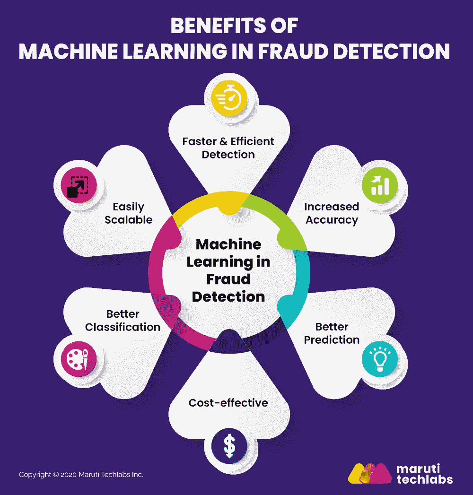

# 机器学习是否有利于检测欺诈？

> 原文：<https://medium.com/mlearning-ai/how-beneficial-is-detecting-fraud-using-machine-learning-b00089d84930?source=collection_archive---------2----------------------->

随着技术的不断现代化，金融业多年来经历了巨大的转变。最显著的变化是我们现在如何看待支付交易。近年来，数字支付业务发展迅猛。随着在线和数字支付的日益普及，越来越多的公司寻求简化数字支付，使其更加用户友好和以客户为中心。

这种转变为潜在的欺诈事件打开了数字平台。银行业和商业在管理欺诈方面经历了一段困难时期。欺诈者磨练他们的技能来发现漏洞，对易受影响的个人进行网络钓鱼，并发明新的方法来勒索他们的钱。因此，公司投入更多资金来管理漏洞，并封堵数字支付系统中的漏洞。

然而，旨在充分保护其支付系统的企业面临的主要问题是获得出色的解决方案，既能降低支付风险，又能改善客户体验。

让我们看看为什么使用机器学习的欺诈检测是避免数字攻击的最佳方法，以及它如何帮助企业验证他们的支付系统。

# 什么是机器学习？

人工智能(AI)是由计算机根据其加载和理解信息的能力描绘的交互式动态响应。人工智能允许机器模仿人类。

机器学习本质上被认为是人工智能的一个子集，它涉及从给定的数据中进行学习，以执行特定的任务。在机器学习中，计算机根据提供的数据创建训练数据，这有助于进行预测。

当信息被添加到计算机中时，数据集得到改善，算法的能力得到增强，这可能在许多方面有所帮助，包括销售预测和个性化。使用机器学习进行欺诈检测可以实现更快的响应和高效的交易。

# 使用机器学习进行欺诈检测的优势

通过在原始数据中加入认知计算技术，我们可以预测大量交易中的欺诈行为。因此，使用机器学习的银行欺诈检测利用了保护我们的客户免受可疑活动影响的算法。

机器学习在检测和阻止欺诈活动方面的一些优势如下:

1.  **更快速有效的欺诈检测**

使用机器学习算法的欺诈检测可以识别用户与应用程序和网站的交互模式。如果用户偏离了他们通常的应用程序活动，系统可以立即检测出来。

一个人在你的网站上花费的金额突然增加可能是一件怪事。在这种情况下，在继续之前需要得到用户的同意。因此，机器学习可以实时检测这种异常，降低风险，确保交易的安全性。

**2。提高精确度**

使用[机器学习服务](https://marutitech.com/machine-learning-services/?utm_source=medium&utm_medium=content_promotion&utm_campaign=How_Beneficial_is_Detecting_Fraud_Using_ML)的欺诈检测有助于减少分析师的整体手动工作量，并提高整体工作产出。它通过为分析师提供数据和见解，减少他们花费在手动分析上的时间，使他们能够更快、更准确地进行分析。

创建具有足够数据量的训练模型可以帮助欺诈检测机器学习算法区分真实客户和欺诈客户。该模型可以根据以前的数据跟踪支付方法和客户记录的合法性，以确定尝试的交易是否是欺诈性的。

**3。使用大型数据集的预测**

因为 ML 模型可以找出许多动作之间的变化和相似之处，所以机器学习模型会随着收集更多数据而改进。一旦系统知道哪些交易是合法的，哪些是欺诈性的，它们就可以对这些交易进行分类，并识别出属于哪一类的交易。点击此处了解正确的[预测性维护机器学习技术](https://marutitech.com/predictive-maintenance-machine-learning-techniques/?utm_source=medium&utm_medium=content_promotion&utm_campaign=How_Beneficial_is_Detecting_Fraud_Using_ML)。

**4。具有成本效益的技术**

将欺诈检测[机器学习融入财务](https://marutitech.com/ai-and-ml-in-finance/?utm_source=medium&utm_medium=content_promotion&utm_campaign=How_Beneficial_is_Detecting_Fraud_Using_ML)和运营，让你的团队负担更轻，效率更高。这些算法可以在几毫秒内检查大量数据集，并为改进决策提供实时数据。

另一方面，核心员工可以监控和调整欺诈检测机器学习算法，以更好地匹配最终用户的需求。

# 机器学习系统如何进行欺诈检测

理解机器学习中欺诈检测算法的工作的基本结构解释如下:

*   **加载数据:**数据首先被送入模型。模型的准确性取决于用于训练它的数据量；使用的数据越多，模型的性能就越好。你需要向你的模型中输入越来越多的数据，以检测与一家公司相关的诈骗。这将训练您的模型准确地检测出您公司特有的欺诈行为。
*   **特征提取:**基本上是从一个事务处理过程中涉及的每一个线程中提取信息。例如，进行交易的地点、客户身份、支付方式以及交易使用的网络。
*   **算法训练:**一旦你构建了一个欺诈检测机器学习算法，你需要通过向它提供客户数据来训练它，以便它可以学习区分“欺诈”和“真实”交易。
*   **模型创建:**一旦你在一个特定的数据集上训练了你的欺诈检测算法，你将拥有一个可以检测你公司中“欺诈”和“非欺诈”交易的模型。使用机器学习算法进行欺诈检测的好处是，当暴露于更多数据时，它会随着时间的推移而改进。

# 包扎

人工检查和审查远不如使用机器学习算法的欺诈检测可靠。机器学习系统是有效的、可扩展的，并且能够实时处理大量数据。

在马鲁蒂技术实验室，我们的专业人员提供快速决策、更高的生产率、业务流程自动化和更快的异常识别——所有这些都使用先进的[机器学习服务](https://marutitech.com/machine-learning-services/?utm_source=medium&utm_medium=content_promotion&utm_campaign=How_Beneficial_is_Detecting_Fraud_Using_ML)。联系我们[此处](https://marutitech.com/contact-us/?utm_source=medium&utm_medium=content_promotion&utm_campaign=How_Beneficial_is_Detecting_Fraud_Using_ML)了解更多关于使用机器学习进行银行欺诈检测的信息，以及使用机器学习保护您的数字支付流程的步骤。

点击阅读全文[。](https://marutitech.com/machine-learning-fraud-detection/)

 [## Mlearning.ai 提交建议

### 如何成为 Mlearning.ai 上的作家

medium.com](/mlearning-ai/mlearning-ai-submission-suggestions-b51e2b130bfb)