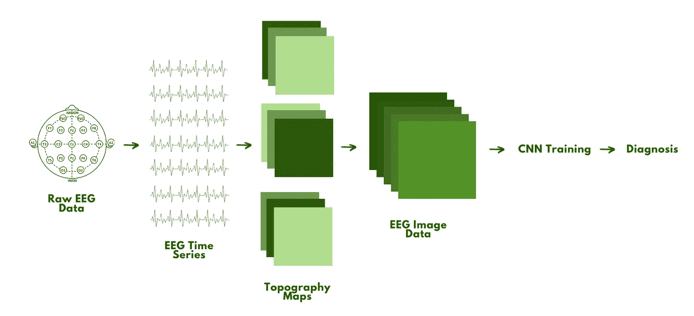
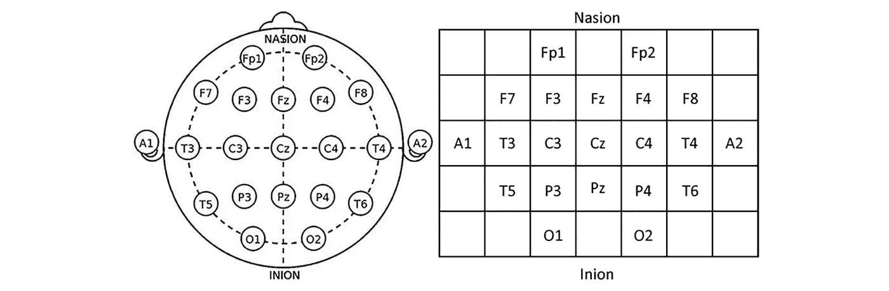
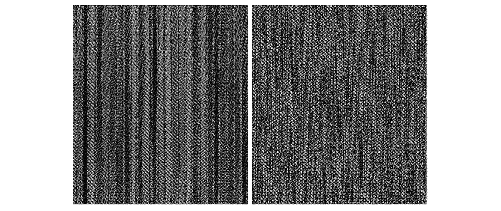

# 大脑数据如何成为抑郁症的生物标志物🧠

> 原文：<https://medium.com/mlearning-ai/how-brain-data-can-become-a-biomarker-for-depression-bfa72cfa16c0?source=collection_archive---------9----------------------->

Photo by [Pietro Jeng](https://unsplash.com/@pietrozj?utm_source=medium&utm_medium=referral) on [Unsplash](https://unsplash.com?utm_source=medium&utm_medium=referral)

## 使用细胞神经网络分析脑电图数据以准确诊断抑郁症。

没有任何明确的量化方法来诊断许多精神健康障碍。因此，抑郁症的误诊实际上比许多人想象的要普遍得多。事实上，一项研究表明，65.9%的重度抑郁症(MDD)被误诊。

**超过一半的诊断是不正确的。**

如果有明确的诊断方法，这些人可能会被给予不必要的药物治疗、不适当的治疗以及更多本来可以避免的情况。

许多具有高诊断准确性的疾病已经建立了生物标志物(如血压、遗传检测和心率)，可以清楚地表明一个人是否患有特定疾病。

由于抑郁症是心理上的，找到一个生物标志物似乎是毫无疑问的。但是，我们实际上可以直接从大脑中获取数据。

大脑生物标记。

# 悲伤并不是 MDD 的全部。

每个人都有难过的时候，在大多数情况下，我们可以振作起来。对于重度抑郁症患者(MDD)来说，这并不简单。

长期不明原因的悲伤**可能是重度抑郁症的一个指标。它影响一个人的感觉、思考、行为，并导致许多精神和身体问题。**

这是一种超越悲伤的真正的失调。MDD 控制了一个人的思想，并把他们困在一个似乎无法摆脱的痛苦深渊中。

这件事**看起来**不可能脱身，其实不然。虽然药物不能完全治愈 MDD，但是早点接受治疗会有很大帮助。并且这只有在更早接收到准确诊断的情况下才有可能。

> 早期识别和治疗至关重要，因为未经治疗的抑郁症持续时间与更糟糕的结果相关。
> 
> - [性质](https://www.nature.com/articles/s41398-019-0460-3)

目前，诊断基本上只是看起来像一个症状清单和查看家族史。这可能就是为什么这么多人使用在线随机测试进行自我诊断——很难准确地指出这种疾病，因为血液测试或其他典型的实验室测试并没有真正的帮助。

好吧，如果这是一种神经障碍，难道不应该有某种方法来绘制某人大脑中正在发生的事情，看看事情是否看起来很黑暗吗？

是的，有:在 CNN 的帮助下，个人的脑电图图像数据实际上可以作为诊断 MDD 的生物标志物。

# 收集大脑(脑电图)数据

认为精神疾病不是真的或者人们只是在“戏剧化情绪”的观点很容易被证明是错误的,[用真正的科学来解释其原因。](https://justmind.org/the-science-of-depression/)

抑郁症患者和非抑郁症患者之间最普遍的神经差异是突触中受体的浓度和神经递质释放的数量。对于患有 MDD 的人来说，它们都比 T4 低得多。

现在我们有了某种数量上的差异，神经成像工具可以对其进行生物标记。当通过脑机接口(BCIs)领域用于深度学习(DL)应用时，EEG(脑电图)已被证明是最理想的**工具，因为它具有**非侵入性和准确性**。**

这种诊断方法已经应用于包括阿尔茨海默氏症和帕金森氏症在内的许多其他疾病，并被证明是有效的——尽管症状也更容易识别。

让我们**分解**这个技术含量很高的诊断过程。🔨

## 收集数据——采集和处理

你知道你有时在新闻中看到的那些耳机吗，有人用他们的大脑控制机器人手臂？嗯，那是脑电图(不是🥚).

EEG 有几个关键的结构方面:神经头戴式耳机、电极和网格矩阵。

Mesh Matrix. [(Source)](https://sci-hub.yncjkj.com/10.1177/1550059420916634)

脑电波将从这些电极中的每一个被记录下来，然后被放大，这样它们看起来就像我们习惯看到的弯弯曲曲的线(这样数据就可以被计算机处理)。

EEG time series. [(Source)](https://www.emotiv.com/eeg-guide/)

## 映射它

下一步是**获取这个时间序列，并将其转换成我们需要从中导出 MDD 模式的灰度格式。🔍**

1.  EEG 信号的几何形状(角度、间距、长度)代表不同的大脑区域。
2.  这些**与正确的电极位置**相匹配。
3.  电极测量值被**转换成 2D 图像数据**(灰度图像)。
4.  该数据然后被**存储为地形图**，该地形图表示在一个时间片上特定频带的活动。
5.  对每个重要的频带重复这一过程。
6.  最后，这些图被输入到一个卷积神经网络(CNN)中，并产生一个代表原始 EEG 数据样本的灰度图像**。**

Raw EEG data for someone without (left) and with (right) MDD. [(Source)](https://sci-hub.yncjkj.com/10.1177/1550059420916634)

**TL；大卫:我们将弯曲的线条与它们的电极匹配，制作地形图，然后 CNN 为这些数据生成灰度图像。**

# 解释灰度图像

DL 提供了关注原始数据的**结构**的另一种视角，而不是使用数据模式被清楚地展示的经过处理的生物标记。

## 但首先，一个关于 DL 的速成课程。

深度学习是机器学习的子集，机器学习是人工智能的子集。

它模仿人类积累某些类型知识的方式，因此，它的主要应用是收集、分析和解释大量数据。

完美的考虑灰度图像上的每一个像素，*不是吗？*

传统机器学习中的自动化通常保持不变:以线性方式。另一方面，深度学习是一个越来越复杂和抽象的层次。层次结构中的每个新级别都是一个新层。

更简单地说，想象你的第一个单词是“鸟”你可能通过识别飞行、羽毛和喙等特征，通过观察父母反复指出外面的一只鸟，或者*爱探险的朵拉*在你猜到它在哪里后给你一个击掌，从而了解了什么是鸟。通过这个，你概念化了什么是鸟。

不知不觉地，你发展了一个越来越复杂的层次结构，从“东西”是否一直在飞，到甚至识别不同的颜色来特别挑出一只蓝色的松鸦。🐦

这几乎正是深度学习所做的。层级中的每个算法对其输入(鸟、狗、枕头等的图像)应用非线性变换。)并使用它所学习的来生成统计模型作为输出。算法将继续学习，并通过迭代运行，直到输出的图形是准确的(DL 图形看起来像数据集的图形)。

**TL；DR:深度学习有一个越来越复杂的层次，这些层次有助于建立一个最终模型，然后可以验证和训练它的准确性。**

## 具体是哪种算法？

对于这种应用，理想的算法是卷积神经网络(CNN ),因为它们可以将**图像**作为输入，识别图像上的重要方面/模式，并区分彼此。

基本上，它非常适合图像分类，这是我们分析灰度图像数据所需要的。

让我们来看看一个适合这个应用的特定 CNN 结构**。**

## ResNet-50

ResNet-50 框架是一个深度网络(50 层)，作为**分类回归语义分割**的特征提取架构(给图像中的每个像素分配一个标签，并对其进行分类)。

它工作得很好，因为[残差网络](https://towardsdatascience.com/residual-blocks-building-blocks-of-resnet-fd90ca15d6ec)通常在对抗**梯度消失问题**和减少更深层中的误差方面具有优势。这是通过身份映射来完成的，因为更多的层被添加到较浅的模型中，而其他层是从该模型中复制的。因此，较深模型中的训练误差被限制在较浅的部分。

对于这个用例，Q(x)被认为是映射，由几个堆叠层组成，x 表示这些层的**第一个输入集**。得到的残差函数是 **R(x) = Q(x) - x.**

在普通网络中，这个问题持续存在，因为**身份连接导致关于图像原始状态的信息**丢失。下一层的输入将不再包含精确的原始数据，而是被 [ReLU 函数改变。](https://machinelearningmastery.com/rectified-linear-activation-function-for-deep-learning-neural-networks/)

总的来说，ResNet-50 承诺更快的培训，提高学习率和更多。

> **旁注:**
> ·梯度本质上是一种导数，在这种情况下，是一种有限差分。
> 
> 存在其他 ResNet 结构(102、152…等。)然而，当数据易于辨别时，50 层效果最佳，如果您回头看灰度图像，确实如此。

接下来的步骤将包括训练、测试和验证数据。技术实现相对简单；然而，它的准确性和执行速度还没有跟上。

但是我们能到达那里。

# 准确的 MDD 诊断可以拯救生命

想象一下，有人被诊断患有抑郁症，即使他们没有。他们可能会意外过量服用并不需要的药物。

现在，想象一下某个抑郁症患者没有被正确诊断。他们的抑郁症可能会恶化到无法恢复的程度。

但是你不必真的去想象它，因为它是一个**现实**。

事实上，多达 30-50%被诊断患有抑郁症的女性被误诊。这种情况和诊断延误会导致不必要的死亡。

为了防止这种情况，一种更明确的诊断抑郁症的方法是至关重要的，在这种方法中，医生不能无意中注入偏见或忽略患者的病史。

**主观性不够好。CNN 和 EEG 数据会保证客观性。**

**— —**

# 让我们保持联系💬

我正致力于应用这个概念，所以期待我的下一篇文章，我将复制一个 CNN 来分类脑电图图像数据，用于 MDD 诊断。

如果你想得到通知或加入我的总部，[订阅我的时事通讯](https://www.subscribepage.com/harsehajsheadquarters)，在那里我谈论关键的课程、发布机会、知识炸弹、进展更新和心理健康！或者，在[推特](https://twitter.com/harsehajd) / [媒体上关注我。](https://harsehaj.medium.com/)

我迫不及待地想让你知道即将发生的事情！📑

## 进一步阅读和来源

*   [https://www . mayo clinic . org/diseases-conditions/depression/symptoms-causes/syc-20356007](https://www.mayoclinic.org/diseases-conditions/depression/symptoms-causes/syc-20356007)
*   [https://www.nature.com/articles/s41398-019-0460-3](https://www.nature.com/articles/s41398-019-0460-3)
*   [https://justmind.org/the-science-of-depression/](https://justmind.org/the-science-of-depression/)
*   [https://sci-hub.yncjkj.com/10.1177/1550059420916634](https://sci-hub.yncjkj.com/10.1177/1550059420916634)

> 如果你或你认识的人正在与抑郁症或精神疾病作斗争，你并不孤单，不必默默忍受。我的 [DMs](https://twitter.com/harsehajd) 永远是开放的，我会永远倾听。此外，[这里的](https://checkpointorg.com/global/)是一些也提供支持和资源的链接。
> 
> 毫不犹豫地寻求帮助，我支持你。*💛*

 [## Mlearning.ai 提交建议

### 如何成为 Mlearning.ai 上的作家

medium.com](/mlearning-ai/mlearning-ai-submission-suggestions-b51e2b130bfb)