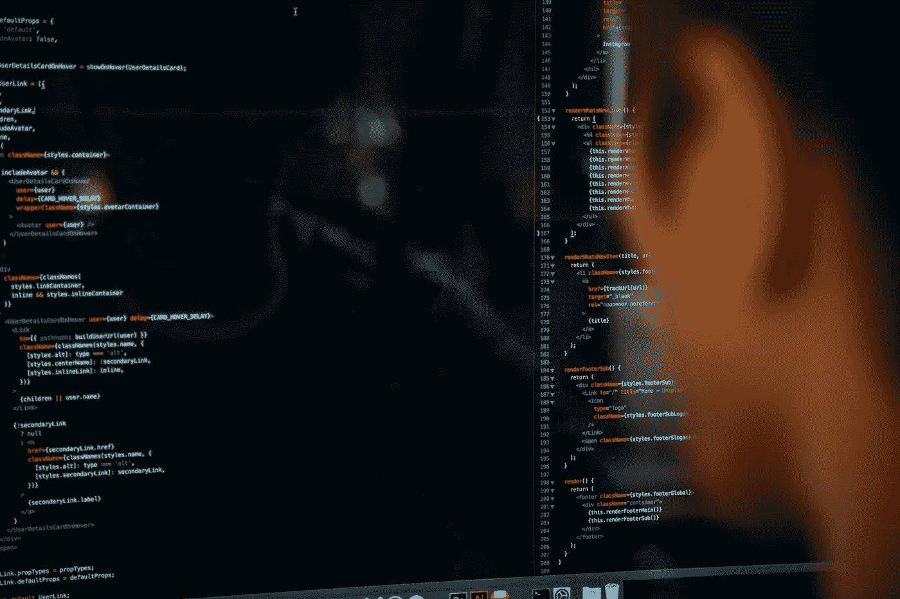

# 我如何在 2021 年提高我的计算机视觉技能

> 原文：<https://medium.com/mlearning-ai/how-i-improved-my-computer-vision-skills-in-2021-1f38698ab96?source=collection_archive---------1----------------------->

Photo by [Charles Deluvio](https://unsplash.com/@charlesdeluvio?utm_source=unsplash&utm_medium=referral&utm_content=creditCopyText) on [Unsplash](https://unsplash.com/s/photos/machine-learning?utm_source=unsplash&utm_medium=referral&utm_content=creditCopyText)

我休了一年的假，从未发表过一篇关于计算机视觉的文章。事实是…

回想起来，我在这里发表的最后一篇文章是 2020 年 12 月 12 日，好家伙，那是很久以前的事了。事实是，我在我的游戏项目和无数其他事情之间挣扎，比如工程研究、竞赛和项目、实习和自学计算机的时间…