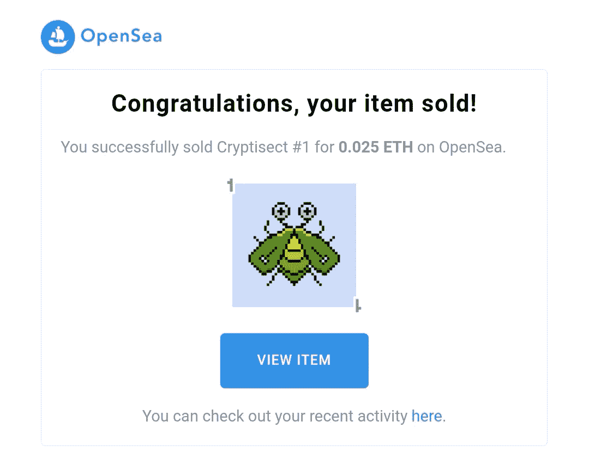
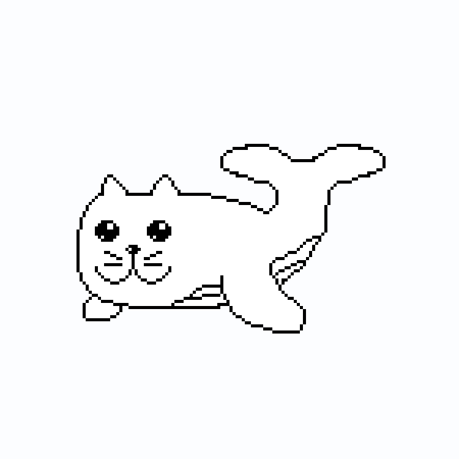
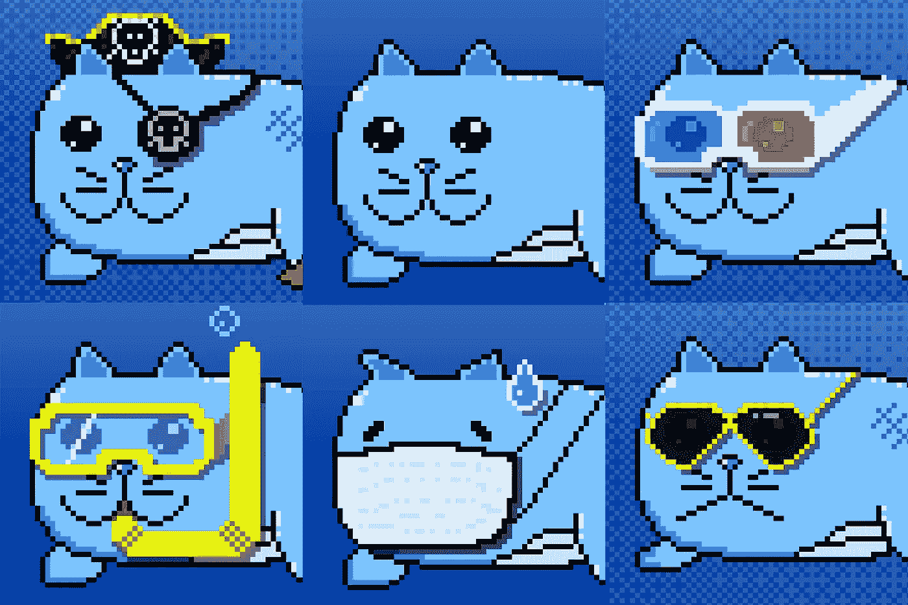

# 我是如何卖出我的第一件 NFT 收藏品的

> 原文：<https://medium.com/mlearning-ai/how-i-sold-my-first-collectible-nft-33da90388ebe?source=collection_archive---------0----------------------->

## 讲述我在 NFT 世界的旅程的开始

本月早些时候，我醒来时收到了一封令人兴奋的电子邮件，来自当时 NFT 互联网上最大的市场 OpenSea。**“恭喜你，你的物品卖出了！”我的新爱好已经有 12 天了，我欣喜若狂。**

虽然我对网上销售创意内容并不陌生，但销售 NFT 是一种全新的体验。

我记录了第一幅 NFT 作品出售前的所有步骤。请继续阅读，了解更多信息。

My first [Cryptisect](https://opensea.io/assets/cryptisects), a collectible NFT, was sold to a collector [BobAmorMusic](https://twitter.com/BobAmorMusic). Many thanks to him. Photo by author.

## NFTs 简介

如果你正在读这篇文章，很可能你已经对 NFT 有所了解。如果你像我一样倾向于了解更多关于 NFT 的知识，那么你很可能已经听说过“Beeple”这个名字。

数字艺术拍卖平台 [Nifty Gateway](https://niftygateway.com/) 上，化名为 [Beeple](https://twitter.com/beeple) 的数字艺术家迈克·温克尔曼(Mike Winkelmann)的数字艺术品 [CROSSROAD](https://niftygateway.com/itemdetail/secondary/0x12f28e2106ce8fd8464885b80ea865e98b465149/100010001) 以 660 万美元的价格售出。拍卖发生在 2 月 25 日，在“每一天:第一个 5000 天”的前几天，Beeple 的另一件作品在世界知名的艺术拍卖行佳士得拍卖，价格在一小时内飙升至 180 万美元。这件作品最终以超过 6900 万美元的价格售出。

毕普以不可替代代币的形式出售他的数字艺术作品。**本质上，一个 NFT 是一个** [**区块链**](https://en.wikipedia.org/wiki/Blockchain) 上的一个数据单位，一个分散的数字分类账，可以记录上面的每一笔交易。因为区块链上的 NFT 是唯一的，不可互换的(不可替代)，我们可以用区块链技术验证 NFT 的所有权。因为 NFT 本质上是一大块数据，所以各种格式的数字文件都可以制作成 NFT，包括视频、文本、音频、图像和 3D 模型文件。

NFT 概念催生了一种新的数字经济，在这种经济中，可以买卖“数字信息”的所有权。而且，根据皮普尔拍卖公司的说法，在这种经济中有很多钱可以赚。因此，毫不奇怪，自 2 月份以来，全球范围内对搜索词“ **nft** ”的在线兴趣急剧上升。

The worldwide interest in the search term ‘**nft’** over time, as a result of Google Trends. The interest rose drastically since February 2021, around the same time as Beeple’s “CROSSROAD” auction on Nifty Gateway. Photo: GoogleTrends.

## 跳入 NFTs 的世界

每当我在网上读到或看到一些关于 Beeple 拍卖的东西时，我对 NFTs 的好奇心就越来越强烈。作为一个多年来一直在创作创意数字内容(主要是数码照片)的人，我决定在 3 月下旬跳入 NFTs 的世界，不可否认也受到了 [FOMO](https://en.wikipedia.org/wiki/Fear_of_missing_out#:~:text=Fear%20of%20missing%20out%20(FOMO,with%20what%20others%20are%20doing.) 的打击。

当一项新技术提供了一个将我的爱好作为追求的机会，一个挣更多钱的机会，我自然会欣然接受。

## 选择市场

互联网上有许多 NFT 市场。就我的看法来说，我决定用 [OpenSea](https://opensea.io/) 有很多原因。这是目前 NFT 最大的市场。它提供了一个用户友好的网站设计和一次性入门费(汽油费)。

OpenSea 还允许你[创建你自己的“收藏，](https://openseahelp.zendesk.com/hc/en-us/articles/1500003024261-How-do-I-create-a-new-collection-)”，这基本上是 OpenSea 中一个较小的市场。您可以将可收集的 NFT 添加到您的收藏中，在此过程中以 NFT 的形式创建您自己的加密货币。你也可以确定你的收藏中的每一个 NFT 转售的佣金。这意味着你可以从市场上的每一次转售中获得佣金。

为了保持这篇文章的简洁，我在这里不讨论[如何在 OpenSea](https://www.youtube.com/watch?v=zZvHfB3NC8w&t=1352s) 上开户。如果你选择走我的路，在 OpenSee 上开一个账户，你将在[以太坊区块链](https://en.wikipedia.org/wiki/Ethereum)上创建 NFTs，而 [**煤气费**](https://openseahelp.zendesk.com/hc/en-us/articles/360061699514-Who-pays-the-gas-fees-) 也是另一个值得研究的话题，但我也不会在这里讨论。

## 创建可收集的 NFT

要卖掉一个 NFT，你需要一个 NFT。从 NFT 获利和从任何有经济价值的实物获利是一样的。你可以从其他艺术家那里购买一幅 NFT 作品，然后以更高的价格转售，或者你可以创建自己的 NFT 并出售。

我选择在数字收藏品中创建我自己的 NFT 有两个原因。第一，我喜欢收藏品。我喜欢收集实物，如稀有邮票、用过的胶卷盒和书籍。第二，随着时间的推移，可收藏的物品往往更有价值，尤其是那些流通中数量有限的物品。我最初的计划是创建一套可收藏的 NFT，在完整的收藏中有 100 件。

创作什么，应该遵循什么风格？

我喜欢复古像素风格的图形。尽管这种风格因 80 年代过时的电子游戏而流行，但它已成为当今流行文化的标志。而且，从朋克及其变体的成功来看，复古像素艺术风格很可能在 NFT 世界拥有光明的未来。我决定采用这种风格。

我开始设计数字收藏品，我设计了一个策略，它只包含 3 条规则:

*   它们必须是独一无二的，并且与任何已建立的品牌或人物无关，以避免将来出现任何潜在的法律问题。
*   它们必须传达一些美学价值，至少在我满意的水平上，以视觉和叙事的方式。
*   要创造资本价值，它们必须**超级稀有！**每套将包含 100 个独特的项目，它。

无论我多么希望钱包里有一个朋克，我都不喜欢他们的审美风格。所以，我没有创造朋克的变体，而是想出了一些不同的东西。

我想出了 [***隐形门***](https://opensea.io/assets/cryptisects) 和 [***像素鲸鱼***](https://opensea.io/assets/pixel-whalecat) 的想法，我的像素艺术收藏 NFTs 项目的最初两个项目分别具有独特的手绘像素艺术收藏项目，分别代表丰富多彩的*昆虫状生物*和可爱的*鲸鱼*，’。

用于创建像素艺术的专门软件例如有 [Aseprite](https://www.aseprite.org/) 和 [Pyxel Eidt](https://pyxeledit.com/) 。它们不是免费软件，但是非常便宜。一些像素艺术家对 [Adobe Photoshop](https://www.adobe.com/sea/products/photoshop.html?sdid=Z662FWNM&mv=search&ef_id=CjwKCAjwmv-DBhAMEiwA7xYrd8nad7mQg2Hnacml9FRbtWWZQIK0GMOZ8QRRBxFk6etcHsKZHoum-BoCO5oQAvD_BwE:G:s&s_kwcid=AL!3085!3!400414931235!e!!g!!adobe%20photoshop&gclid=CjwKCAjwmv-DBhAMEiwA7xYrd8nad7mQg2Hnacml9FRbtWWZQIK0GMOZ8QRRBxFk6etcHsKZHoum-BoCO5oQAvD_BwE) 驾轻就熟，这也是一个创建这种像素艺术的流行软件。他们都能够创建动画。

> **“神秘教派”是一个像素艺术风格的收藏 NFTs 项目，有 100 个独特的手绘想象昆虫样生物。它们是精心制作的，色彩鲜艳，非常罕见。这一套只有 100 个，每个只要 0.025 ETH。**

**上面的短文描述了在 OpenSea 的项目页面上看到的 Cryptisects 项目。如前所述，隐教派是虚构的生物。因此，我可以让每件作品都独一无二。而且，因为它们是想象出来的，设计的极限只是我的想象。**

****

**A sample set of the colorful ‘[Level 3 Cryptisects](https://opensea.io/assets/0x495f947276749ce646f68ac8c248420045cb7b5e/93377245398694788675436739359217858716301163710735047433741043084314948927489).’ Illustration by [P. Kane](https://twitter.com/pkx8326).**

**从逻辑上讲，每一个神秘教派都是独一无二的，所以每一个都和另一个一样“超级罕见”。然而，作为一个项目的噱头，我决定根据他们的“感知稀有度”将他们分为不同的级别。这 5 个 1 级秘密教派是最先出现(发现)的前 5 个，依此类推。**

**[**像素点**](https://opensea.io/assets/pixel-whalecat)**

> **“像素鲸鱼”是一个可收藏的 NFTs 项目，有 100 个独特的像素艺术风格的“鲸鱼”设计。每一只鲸鱼都是手工绘制、精心制作和制作的。领养你自己的今天，给他一个甜蜜的家！每只鲸鱼的领养费只有 0.039 ETH。**

**即使在我写这篇文章时 Cryptisect 项目仍然是一个正在进行的工作，我觉得我已经收集了足够的经验来并行启动另一个项目。**

**当我试图在我的第一个项目中看到可以添加或改进的内容时，我想到了 Pixel WhaleCat 的想法。这个时候，我已经在 OpenSea 上看到了无数可爱的像素艺术人物。这正是我的神秘教派所缺乏的——个性。我也许能在一个神秘的章节中加入精彩的细节，但它总是缺少一个能与人类观众，我的潜在收藏者相关的“角色”。**

**我喜欢猫，很多人都喜欢。我觉得一个和猫有关的角色会是个好主意。NFT 世界已经有很多猫了。例如，标志性的是传说中的[年猫](https://en.wikipedia.org/wiki/Nyan_Cat)和[隐猫](https://www.cryptokitties.co/)。再说一次，我的一定是不同的东西。**

**我想把一只猫和一些其他动物混合在一起，我想到了一个似乎可行的角色——一只长着可爱的猫脸和一对蠕动的猫耳朵的鲸鱼——鲸鱼。加密货币圈的俚语“[鲸](https://www.investopedia.com/terms/b/bitcoin-whale.asp)”也指持有市场上流通的特定代币相当大比例的投资者。鲸鱼既可爱又富有！**

****

**A [pixelated doodle-style WhaleCat](https://opensea.io/assets/0x495f947276749ce646f68ac8c248420045cb7b5e/93377245398694788675436739359217858716301163710735047433741043116200786132993), animated. Animation by [pixel_whale](https://twitter.com/pixel_whale).**

**像素鲸的概念也适用于收藏品，因为也可以有想象中那么多的鲸。**

****

**[WhaleCats NFT collectibles](https://opensea.io/assets/pixel-whalecat) with different accessories and facial expressions. Photo by [PixelWhaleCat](https://twitter.com/pixel_whale).**

## **给你的作品定价**

**我不是一个公认的艺术家，所以这对我来说是一个困难的话题。我决定探索市场，观察属于同一类别、具有相似复杂性和稀有性的收藏品的价格。然后我为每一套中的每一件都设定了一个固定的价格。随着时间的推移，我会让市场来决定它们的价值。**

## **营销您的项目(免费)**

**虽然有许多社交媒体渠道来展示你的项目，但 Twitter 是你最好的朋友！加密货币世界的人们在 Twitter 上生活。**

**我试图尽可能多地跟踪关于 NFT 的线索和报道。一些收藏者允许内容创建者在他们发起的帖子的评论部分“推销”(广告)他们的项目。找到尽可能多的这种线程，让世界知道你在创造什么。在带有你作品链接的帖子中发表评论，合适的收藏者最终会与你的作品“匹配”。**

**话虽如此，你还是得花些时间在 Twitter 上浏览新闻。这样做的好处是，你有机会与同行艺术家、收藏家建立关系，并在这个过程中增加你的观众。一个可能的警告是，有些人总是假装成收藏家，让你跟着他们，同时允许你兜售你的作品。除了你可能会浪费一些时间之外，这并没有什么坏处。然而，如果你往好的方面想，你的工作肯定会得到更多的曝光。**

## ****出售您的作品！****

**你创作，你把你的作品挂牌出售，它就会被出售。**

**从我在市场上相对较少的作品来看，我足够幸运，BobAmorMusic 找到了我的第一个神秘教派 T3。然而，如前所述，这花了一个多星期，并没有经过许多先令。**

**我有机会向我的第一位收藏家介绍一些东西，从他的角度来看，一位收藏家在下列情况下会购买 NFT:**

*   **他认为购买这件作品是一项很好的(投机)投资。**
*   **他喜欢那块(显然！)**
*   **他想支持新兴艺术家和项目。**
*   **他买让他笑的作品(这可能是最重要的原因！)**

**像 T4 这样的收藏家和投资者对 NFT 社区的生态系统非常重要。艺术家和创作者需要像他一样的投资者和收藏家提供的支持和曝光。有时候，一个艺术家也可以成为一个收藏家，并支持其他艺术家。**

## **结论**

**NFT 是当今加密货币世界中一个令人兴奋的新领域。当然，在这个领域可以赚很多钱，但它本质上是销售你的数字创意内容的另一个在线渠道。**

**像我这样的数字艺术家和创意内容创作者在这个领域找到了很好的应用，不仅是在分发作品方面，也在表达和管理版权方面。**

**我进入这个空间是希望赚更多的钱。然而，对我来说最重要的经历变成了与社区的互动和创作过程中的快乐。**

**出售可收藏的 NFT 仍然远未成为我可持续的收入来源，但它确实有成为的潜力。**

**即使我不是一个公认的艺术家。当人们欣赏我的作品时，我总是很兴奋地学习。多亏了他们，我才能继续创作。**

> **艺术作品就是艺术。它不是“美丽”的作品，也不是“平庸”的作品。它的存在是为了让人欣赏和收藏。
> —作者**

**在这里找到更多关于神秘的鲸鱼和鲸鱼收藏的信息:[https://linktr.ee/pkx8326](https://linktr.ee/pkx8326)**

** [## Mlearning.ai 提交建议

### 如何成为 Mlearning.ai 上的作家

medium.com](/mlearning-ai/mlearning-ai-submission-suggestions-b51e2b130bfb) 

🔵 [**成为 ML 写手**](/mlearning-ai/mlearning-ai-submission-suggestions-b51e2b130bfb)**