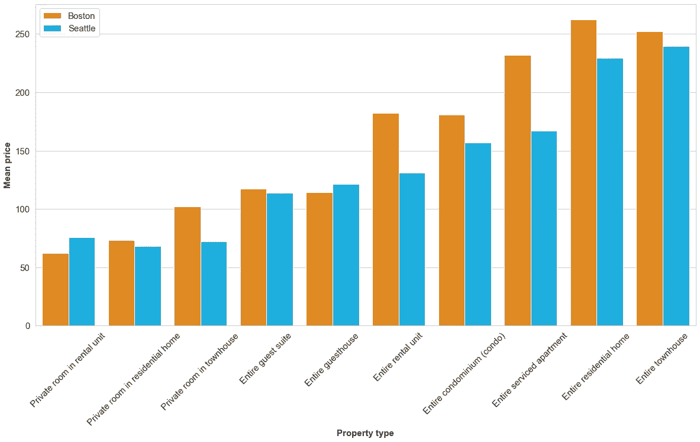
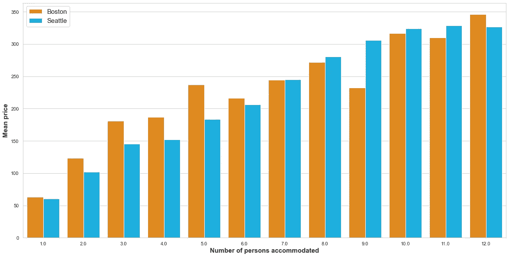
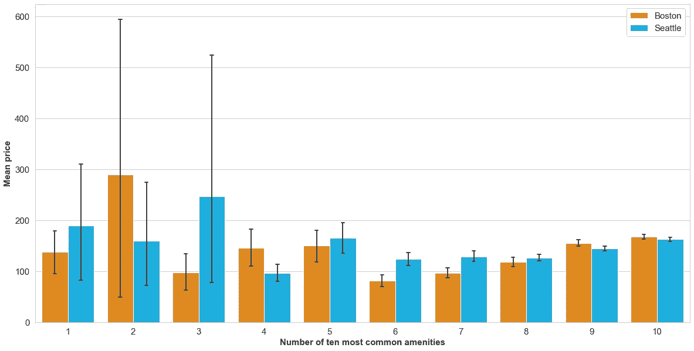

# 你在 Airbnb 上的房产值多少钱？

> 原文：<https://medium.com/mlearning-ai/how-much-is-your-property-worth-on-airbnb-542bc285dfa?source=collection_archive---------12----------------------->

从 2021 年开始，使用波士顿和西雅图的位置数据研究 Airbnb 房产的价格。

**简介**

我相信你听说过 Airbnb，也许你已经想过将你的房产发布到这个平台是否值得。然而，一个人想在你家住一晚的花费可能因人而异:有些人喜欢更简约的家具，有些人会选择最高档的房子。对一个人来说，一套小公寓就够了，其他人则喜欢更大的公寓。

因此，我想用一种数据驱动的方法来回答“你在 Airbnb 上的房产值多少钱？”。

底层数据来自 Airbnb 内部的[。我使用了两个数据集，其中包含 2021 年波士顿和西雅图的数据。数据集提供了许多信息，包括酒店容纳的人数、床位数、邻居、酒店的便利设施等等。](http://insideairbnb.com/get-the-data.html)

利用这些信息，我发现了一些问题，如果很多人不确定应该以什么价格在 Airbnb 上上传他们的位置，他们可能会感兴趣。让我们开始吧！

## 1 房产类型如何影响房源价格？

数据集中有一列提供有关属性类型的信息。例如，在出租单元、整个阁楼或整个联排别墅中有私人房间。事实上，还有更多类型的财产——我甚至看到了一个帐篷。

在下面的柱状图中，我们可以看到各个物业类型的平均价格。

通过查看图表，我们看到，对于“租赁单元中的私人房间”类型的位置，平均价格约为每晚 60-70 美元。如果我们在 Airbnb 上列出整个客房，我们预计平均价格在每晚 125-135 美元左右。整个联排别墅甚至每晚 235-250 美元。

我们还注意到波士顿和西雅图的房价不同，波士顿的房价平均比西雅图的房价高。通过比较不同类型的房产，你可能会对其价格范围有第一感觉。

## 2 如果我的财产更大，我可以要求更多的钱吗？

接下来，我们将检查业主是否可以要求更多的钱，如果他或她的位置更大。由于数据集中没有平方英尺大小的信息，我们使用两列将“大”转化为实际数据:容纳的人数和床位数。

Figure 2: Mean price by number of persons accommodated

在这种情况下，似乎很明显:一个地方容纳的人越多，它的平均价格就越高。从一个人每晚 60 美元到 12 个人每晚 330 美元不等。有趣的是，在波士顿，一至七人的住所，八至十二人的住所，西雅图的平均价格似乎更高。

Figure 3: Mean price by number of beds

根据床位数量显示平均价格的图表支持了之前对图表的观察。通过将这些信息与对房产类型的了解结合起来，你认为你可以在 Airbnb 上发布你的位置，价格是多少？

## 我应该给我的客人提供吹风机吗？

好吧，你问吹风机和 Airbnb 位置的价格有什么关系是对的。本文的最后一部分指的是数据集的“便利设施”列。此栏包含关于酒店设施(如 Wifi、电视或吹风机)的信息。

在这一节中，我们将分析所有房产中十种最常见的便利设施中的一种或多种的存在与否是否会对一个位置的价格产生重大影响。十种最常见的便利设施是:

1.  烟雾报警器
2.  无线局域网（wireless fidelity 的缩写）
3.  必需品(毛巾或肥皂等基本物品)
4.  一氧化碳报警器
5.  厨房
6.  衣架
7.  吹风机
8.  加热
9.  熨斗
10.  如果主人允许长期停留

下图显示了拥有一定数量的这十种最常见的便利设施的位置的平均价格(例如,“4”组中的酒店拥有这十种便利设施中的四种)。

Figure 4: Mean price by number of ten most common amenities

也许你想知道那些黑条是关于什么的。它们被称为“误差线”,表示数据在相应组中的波动程度。我在这张图表中包括了这些，因为它们给了我们一些有用的信息。我们看到，对于只有一到五个最常见设施的位置，这些误差线非常高。因此，我认为只有少数几个属性属于这些类别。我的假设是，一些主人忘记列出便利设施，但客人能够通过查看图片来判断酒店是否有这些设施。

由于数据波动很大，我认为我们应该把重点放在有 6 到 10 个最常见的娱乐设施的地方，以做出实质性的陈述。在这里，我们可以看到一个明显的趋势:拥有更多这些设施的地点平均价格也更高。10 个酒店中有 6 个酒店拥有所有最常见的便利设施，两者之间的差异大约是每晚 80 美元。

## 结论

在本文中，我们调查了一些数据分析活动的结果，以找出哪些因素影响了西雅图和波士顿 Airbnb 上的房产价格。我们能够收集到三种见解:

1.  **房产的价格很大程度上受其类型**的影响(例如，它是一个私人房间还是一整栋房子)。当然，这也是我们可以凭直觉知道的，但我认为观察不同类型的房产之间的平均价格差异仍然很有趣。
2.  我们还看到**房产的大小对价格有很大的影响**。同样，没有什么让我们吃惊的，但是用一些数据来支持这种直觉假设总是好的。
3.  最后，我们知道了最常见的便利设施(如 Wifi)的存在与否是如何影响房产价格的。在这里，我们能够确定**值得拥有包括**在内的十种最常见的便利设施。拥有所有这些设施的房产比只有六个设施的房产平均要贵 80 美元。

当然，还有很多因素会影响 Airbnb 房产的价格。我想在这个分析中，我们只是触及了人们可以从这些数据集中获得的洞察力的表面。然而，这篇文章可能会给你一些如何回答这个问题的初步想法:

> 你在 Airbnb 上的房产值多少钱？

要查看构建这个分析的代码，只需看看我的 [Github 简介](https://github.com/lbm2001/udacity_data_science_airbnb_project)。知识库包括这篇文章的图表、更多的分析，甚至还有一个预测 Airbnb 位置价格的模型。

 [## Mlearning.ai 提交建议

### 如何成为 Mlearning.ai 上的作家

medium.com](/mlearning-ai/mlearning-ai-submission-suggestions-b51e2b130bfb) 

🟠在 MLearning.ai 成为 [**作家**](/mlearning-ai/mlearning-ai-submission-suggestions-b51e2b130bfb)