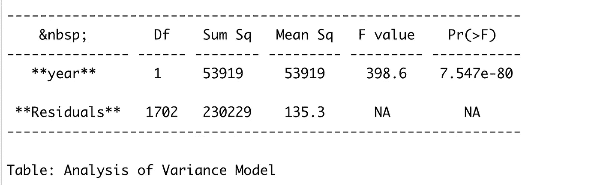
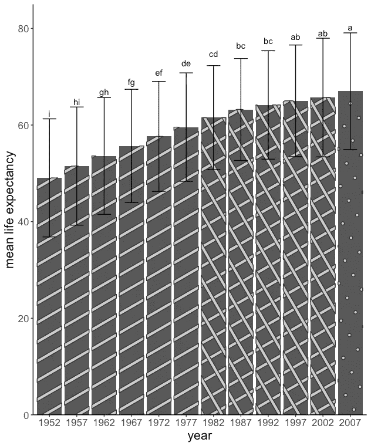

# 如何在 R 中的 geom_bar 图中添加 LSD 字母？

> 原文：<https://medium.com/mlearning-ai/how-to-add-lsd-letters-in-geom-bar-plot-in-r-d839196506ed?source=collection_archive---------1----------------------->

如果你在做实验设计或假设检验，你通过 ANOVA(方差分析)发现对你的反应变量有显著的处理效果。现在，您需要进行事后均值比较，以查看各治疗之间的显著均值差异。您的结果输出有一堆字母和组。如果你和我一样，出于出版的目的，对将那些字母添加到情节(条形图)感到困惑，这篇文章可以帮助你。

> 我将教你如何使用 R 包将 error_bar 和 LSD 字母添加到你的条形图中。(最大限度地减少可能出现的错误)
> 
> **我会教你如何在 facet_wrap 或多个子情节选项中做同样的事情。**

注意:我将为此使用“gapminder”数据集。

我们将使用 gapminder 数据进行方差分析，以了解这些年来预期寿命的变化。年份会影响预期寿命吗？我们进行了方差分析，发现年份对预期寿命有显著影响，这是可以解释的；随着时间的推移，医学的进步大大提高了人们的预期寿命。

代码是这样工作的:

```
library(gapminder) #to load the gapminder data
library(agricolae) #to run teh posthoc lsd test
library(ggplot2) #for visualization
library(dplyr) #for data wrangling# install.packages(“remotes”)
#just to give a good lock to the bar plotremotes::install_github(“coolbutuseless/ggpattern”) library(ggpattern) #however this library (ggpattern) has few limitation, we will discuss later#our model
model_1 <- aov(lifeExp ~ year, data = gapminder)
summary(model_1) #summary of our model as below#lsd test 
lsd_test <- LSD.test(model_1, trt = “year”, console = T, group = T)
lsd_test_df <- as.data.frame(lsd_test$groups)#plotting (before plotting I connected the lsd dataset with the gapminder dataset summarised for mean and sd, I suggest to join the dataset correctly and then add the groups to the plot to avoid errors)gapminder %>% group_by(year) %>% 
 summarise(Mean = mean(lifeExp), SD = sd(lifeExp)) %>%
 left_join(lsd_test_df, by = c(“Mean” = “lifeExp”)) %>%
 ggplot(aes(factor(year), Mean)) + 
 geom_bar_pattern(stat = “identity”, aes(pattern = year)) +
 geom_errorbar(aes(ymin = Mean — SD, ymax = Mean + SD), width = 0.5) +
 geom_text(aes(label = groups), vjust= -9.9) + 
 theme_classic() +
 labs(x = “year”, y = “mean life expectancy”, fill = “year”) +
 scale_y_continuous(expand = c(0, 0),
 limits = c(0,85)) +
 theme(legend.position = “none”, 
 text = element_text(size = 16))
```

方差分析表汇总:

[](/mlearning-ai/mlearning-ai-submission-suggestions-b51e2b130bfb) [## Mlearning.ai 提交建议

### 如何成为 Mlearning.ai 上的作家

medium.com](/mlearning-ai/mlearning-ai-submission-suggestions-b51e2b130bfb) 

🟠在 MLearning.ai 成为[作家](/mlearning-ai/mlearning-ai-submission-suggestions-b51e2b130bfb)