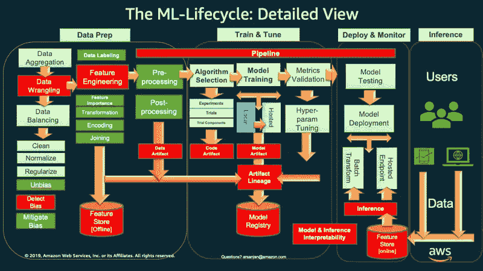
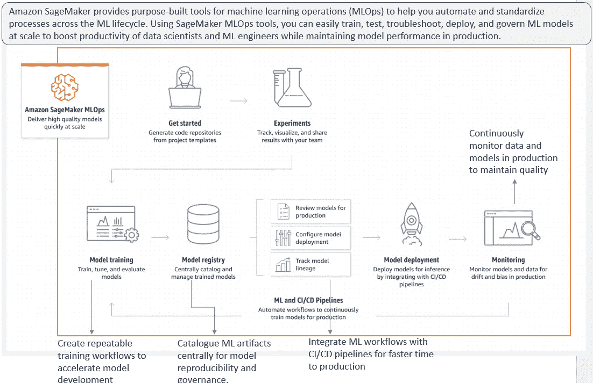
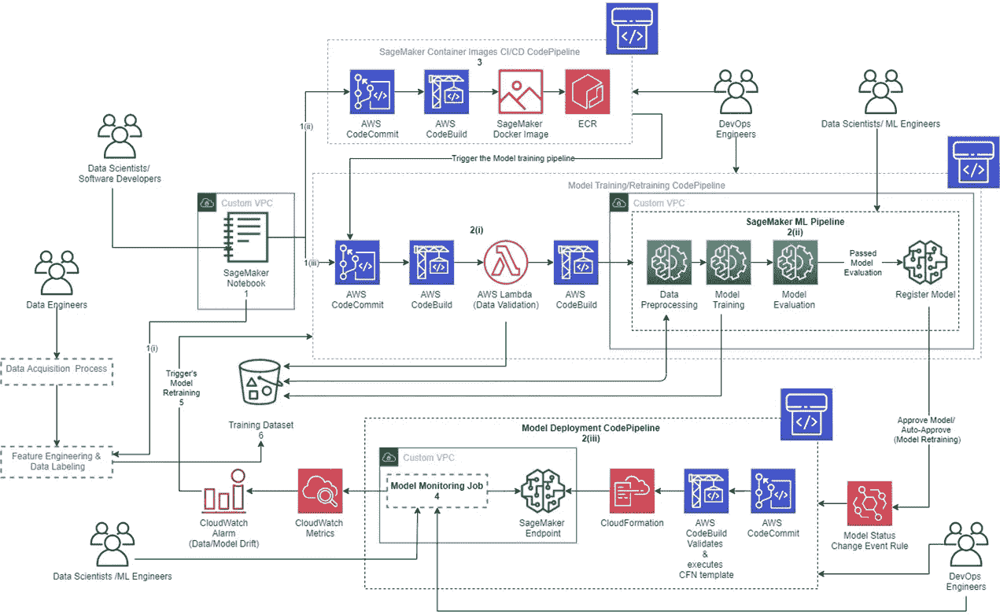
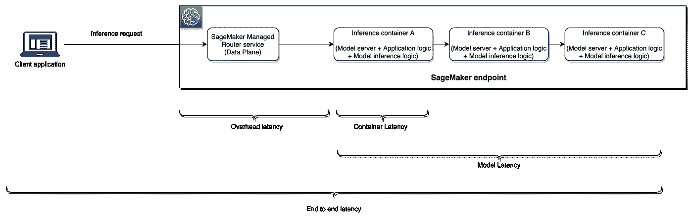
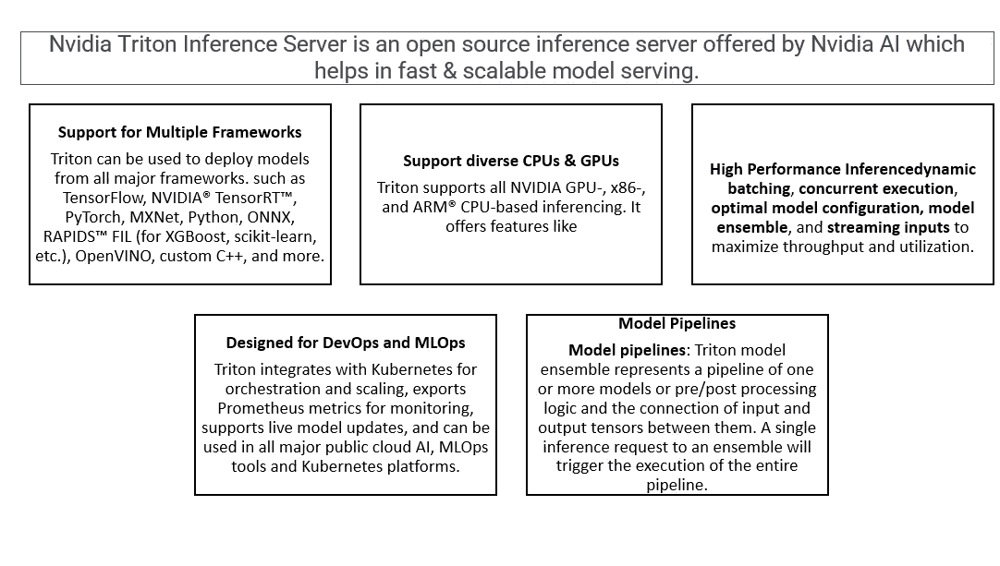
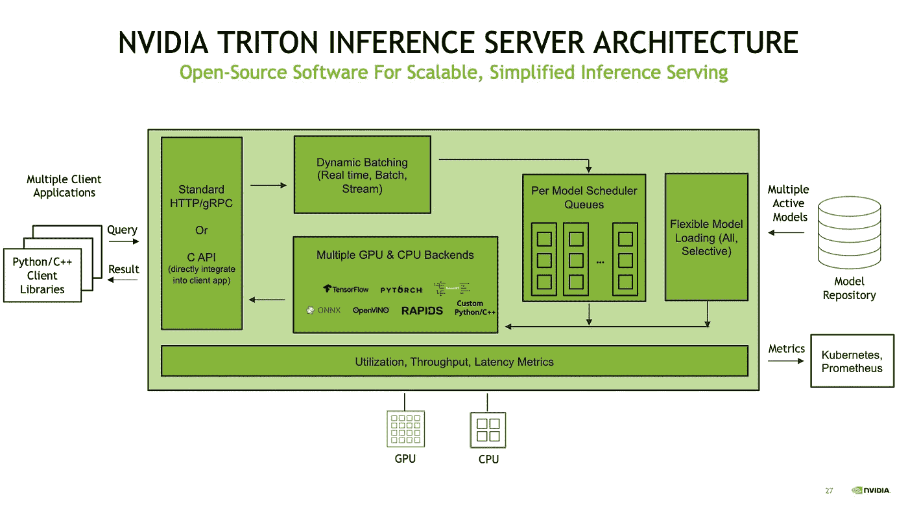

# 如何构建服务于 AWS Sagemaker & Nvidia Triton 推理服务器的高性能模型

> 原文：<https://medium.com/mlearning-ai/how-to-build-high-performance-model-serving-with-aws-sagemaker-nvidia-triton-inference-server-8e2001ae5e8?source=collection_archive---------2----------------------->

# 介绍

机器学习已经成为 IT 系统数字化和现代化不可或缺的一部分。我们正在将越来越多的机器学习任务从 POC 转移到生产中。企业正在采用 ML 预测/建议来解决影响人类生活和商业投资回报率的各种关键问题。

因此，我们必须将重点放在能够与组织的 IT 系统轻松集成的 ML 系统的设计上。DevOps 机器学习实践(称为 MLOps)允许数据科学团队创建这样的编排。

在接下来的几节中，我们将介绍 MLOps 的概念，参考 AWS Sagemaker 平台中端到端 MLOps 管道的架构，并最终在 Sagemaker 中部署一个用于模型服务的 Nvidia Triton 推理服务器。

注意:要了解机器学习平台 AWS Sagemaker，请查看我的另一篇博客:在 AWS Sagemaker 中构建 ML 模型。

注意:要了解 AWS Sagemaker，一个先进的机器学习平台，请查看我的另一个博客:[在 AWS Sagemaker 中构建 ML 模型](https://www.analyticsvidhya.com/blog/2022/02/building-ml-model-in-aws-sagemaker/)

# 什么是 MLOps

MLOps 代表机器学习操作。MLops 的核心功能是在生产中运行 ML 系统&管理 ML 代码、数据、ML 工件、跟踪和监控模型性能、数据治理、数据漂移、偏差和其他日常操作。

下图显示了 MLOps 实践。

[https://aws.amazon.com/blogs/machine-learning/architect-and-build-the-full-machine-learning-lifecycle-with-amazon-sagemaker/](https://aws.amazon.com/blogs/machine-learning/architect-and-build-the-full-machine-learning-lifecycle-with-amazon-sagemaker/)

# 为什么选择 AWS Sagemaker

构建 MLOps 解决方案非常复杂，它需要 MLOps 工具、基础架构、流程编排技术和生产后维护方面的知识。这耗费了数据科学团队大量的时间，从而延迟了模型实验和开发周期。基于云的 ML 平台是托管服务，有助于数据科学团队专注于数据分析、模型开发和优化，以便及时为最终用户带来最佳价值。

[https://aws.amazon.com/sagemaker/mlops/](https://aws.amazon.com/sagemaker/mlops/) and Author’s own addition

AWS Sagemaker 是一个端到端的机器学习平台，它提供了在生产中部署模型所需的所有服务。

# AWS Sagemaker MLOps 参考架构

参考架构展示了如何在 AWS 服务上实现流程编排，MLOps 工具最终为终端用户实施了端到端解决方案。

**Sagemaker 端点是模型服务模块的核心服务，将模型结果带到现实世界。**

[https://aws.amazon.com/blogs/apn/taming-machine-learning-on-aws-with-mlops-a-reference-architecture/](https://aws.amazon.com/blogs/apn/taming-machine-learning-on-aws-with-mlops-a-reference-architecture/)

# 什么是模特服务

模型预测或推理服务是机器学习管道的重要部分。模型在验证和优化后部署在推理服务器上。我们可以使用部署的模型来预测使用 API 服务或 Kubernetes 集群的未知数据集。

模型结果对业务 ROI 有直接影响，因此这对于设计符合业务需求的推理服务解决方案是很重要的。

模型结果作为推理服务器提供给外部用户。

在许多情况下，该模型进行实时预测，数百万人点击 API 来获得预测或建议，例如电子商务网站、OTT 平台等。人们不会等待建议，因此性能是关键指标。

Sagemaker 型号服务选项

**萨格马克推论-**

1.实时端点

2.批量转换

3.无服务器推理

4.异步推理

5.英伟达 Triton 推论(Nividia AI 产品)

Sagemaker 实时端点是满足高性能、低延迟模型服务需求的最佳解决方案。但是，为了实现服务 SLA，需要监控一些重要的性能指标。

下图显示了适用于 Sagemaker 实时端点性能的一些关键指标。

[https://aws.amazon.com/blogs/machine-learning/achieve-hyperscale-performance-for-model-serving-using-nvidia-triton-inference-server-on-amazon-sagemaker/](https://aws.amazon.com/blogs/machine-learning/achieve-hyperscale-performance-for-model-serving-using-nvidia-triton-inference-server-on-amazon-sagemaker/)

# 为什么选择 Nvidia Triton 推理服务器

托管机器学习(ML)模型对于企业来说可能具有关键的挑战性性能 SLA。使用案例类似于医疗保健中的推荐引擎、欺诈发现和任务关键型应用的预测，电子商务网站需要一种具有高吞吐量的服务容量模型，在这种情况下，毫秒级数据足以维持巨大的实时流量。

需要满足严格的延迟和性能 SLA，并且需要大规模部署该模型，以便在一毫秒内处理数百万个请求。

通常，我们构建基于 DAG(有向无环图)的工作流来消费请求并服务于端到端 ML 流水线。随着复杂性的增加，ML 架构使用复杂的模型、大量的数据、多个来源和各种 mlops 工具，这导致了高响应时间和差的用户体验。

通过在同一个实例中托管多个模型，我们可以缩短响应时间并满足总体吞吐量 SLA。

降低业务逻辑的复杂性，并将所有模型和应用程序逻辑封装在同一个实例的同一个或多个容器中(为各种流程提供隔离)也有助于减少延迟。

但是，推理服务器中的应用程序逻辑、模型优化、计算、存储和网络等基础设施以及使用推理请求的底层 web 服务器都会影响整体延迟。

Nvidia Triton 推理服务器是一种开源技术，为生产级机器学习模型提供高吞吐量和低延迟的推理解决方案。托管机器学习(ML)模型对于企业来说可能具有关键的挑战性性能 SLA。类似于医疗保健、电子商务网站中的推荐引擎、欺诈检测和任务关键型应用预测的使用案例。这些应用程序需要一个高吞吐量、低延迟的模型服务 API，这需要毫秒级的时间。

我们建立基于 DAG(有向无环图)的工作流，为端到端的 ML 管道服务。随着复杂性的增加，ML 架构使用复杂的模型、大量的数据、多个来源和 mlops 工具，这导致了高响应时间和差的用户体验。

通过在同一个实例中托管多个模型，我们可以缩短响应时间并满足总体吞吐量 SLA。

降低业务逻辑的复杂性，并将所有模型和应用程序逻辑封装在位于同一实例的同一个或多个容器中。这项技术为正在运行的进程提供了隔离，也有助于减少延迟。

但是，推理服务器中的应用程序逻辑、模型优化、计算、存储和网络等基础设施以及使用推理请求的底层 web 服务器都会影响整体延迟。

Nvidia Triton 推理服务器是一种开源技术，为生产级机器学习模型提供高吞吐量和低延迟的推理解决方案。

Author’s own image. Text Ref : [https://developer.nvidia.com/nvidia-triton-inference-server](https://developer.nvidia.com/nvidia-triton-inference-server) and content : [https://developer.nvidia.com/nvidia-triton-inference-server](https://developer.nvidia.com/nvidia-triton-inference-server)

# 解决方案概述

该解决方案将重点关注使用 Nvidia Triton 推理服务器容器的 Sagemaker 实时模型部署。我们不打算讨论如何在 Sagmaker 中构建和训练模型，这可以在我的另一个博客中参考，如引言中所述。

我们将使用 Sagemaker 推理在 Nvidia Triton 服务器上部署一个 PyTorch 预训练 RESNET50 模型。

RESNET50 模型将使用 PyTorch docker-container 从 torchvision 下载。

设置环境& IAM 角色，Sagemaker 将使用该角色访问来自 S3 的 Triton ECR 图像和模型工件。

该解决方案运行在 sagemaker 笔记本 GPU 类型的实例。

Nvidia Triton 参考架构如下所示，以帮助您了解该解决方案的组件。

[https://d2908q01vomqb2.cloudfront.net/f1f836cb4ea6efb2a0b1b99f41ad8b103eff4b59/2021/11/05/ML-6284-image001.png](https://d2908q01vomqb2.cloudfront.net/f1f836cb4ea6efb2a0b1b99f41ad8b103eff4b59/2021/11/05/ML-6284-image001.png)

# 设置环境

我们将安装所需的包，如 boto3、sagemaker、nvidia-pyindex 和 tritonclient，以构建环境。之后，帐户 id 将被映射，我们将设置容器图像。

我们还将设置 Sagemaker 运行时和执行角色。

！pip install-qU pip AWS CLI boto 3 sagemaker
！pip 安装 nvidia-pyindex
！pip 安装 tritonclient[http]

从 sagemaker 导入 boto3，json，sagemaker，time
导入 get _ execution _ role
sm _ client = bot O3 . client(service _ name = " sage maker ")
runtime _ sm _ client = bot O3 . client(" sage maker-runtime ")
sage maker _ session = sage maker。Session(boto_session=boto3。会话())
角色=获取 _ 执行 _ 角色()

account_id_map = {
'美国-东-1': '785573368785 '，
'美国-东-2': '007439368137 '，
'美国-西-1': '710691900526 '，
'美国-西-2': '301217895009 '，
'欧盟-西-1 ':' 802834088

区域= boto3。会话()。region_name
如果区域不在 account _ id _ map . keys():
raise("不支持的区域")

为 triton ECR 图像设置图像 uri

base = " Amazon AWS . com . cn " if region . starts with(" cn-")else " Amazon AWS . com "
triton _ image _ uri = " { account _ id } . . dkr . ECR . { region }。{ base }/sagemaker-triton server:21.08-py3 "。格式(
account _ id = account _ id _ map[region]，region=region，base=base
)

我们需要实用程序方法来准备请求负载。

将 numpy 作为 np 从 PIL 导入 Image
S3 _ client = boto 3 . client(' S3 ')
S3 _ client . download _ file(
" sage maker-sample-files "，
" datasets/Image/pets/shiba _ inu _ dog . jpg "，
"shiba_inu_dog.jpg"
)

在 Triton 服务器上设置用于推理的样本图像

def get _ sample _ image():
image _ path = "。/shiba _ inu _ dog . jpg "
img = image . open(image _ path)。convert(" RGB ")
img = img . resize((224，224))
img = (np.array(img)。astype(NP . float 32)/255)—NP . array(
[0.485，0.456，0.406]，dtype=np.float32
)。reshape(1，1，3)
img = img / np.array([0.229，0.224，0.225]，dtype=np.float32)。reshape(1，1，3)
img = np.transpose(img，(2，0，1))
return img.tolist()

导入 triton 客户端包，该包将为有效负载构建实用程序方法。我们还将推理请求转换为二进制格式，以提高推理服务的性能。

将 tritonclient.http 导入为 http client
def _ get _ sample _ image _ binary(input _ name，output _ name):
inputs =[]
outputs =[]
inputs . append(http client。InferInput(input_name，[1，3，224，224]，" FP32 ")
input _ data = NP . array(get _ sample _ image()，dtype = NP . float 32)
input _ data = NP . expand _ dims(input _ data，axis=0)
inputs[0]。set_data_from_numpy(input_data，binary _ data = True)
outputs . append(http client。inferequestedoutput(output _ name，binary _ data = True))
request _ body，header_length = httpclient。推理 serverclient . generate _ request _ body(
inputs，outputs = outputs
)
return request _ body，header _ length
def get _ sample _ image _ binary _ pt():
return _ get _ sample _ image _ binary(" INPUT _ _ 0 "，" OUTPUT _ _ 0 ")
def get _ sample _ image _ binary _ TRT():
return _ get _ sample _ image _ binary(" INPUT "，" OUTPUT ")

docker 运行 generate_models.sh 脚本，该脚本将从 torchvision 下载 pytorch resnet50 模型，并部署在 sagemaker 上的 triton 推理服务器上。

！docker run—GPU = all—RM-it \

-v ` pwd `/ workspace:/workspace nvcr.io/nvidia/pytorch:21.08-py3 \

/bin/bash 生成 _ 模型. sh

来自 AWS 帐户的作者自己的图像

来自 AWS 帐户的作者自己的图像

我们在这篇博客中使用了预先训练好的模型来简化解决方案。一旦模型被下载，它将在下面的目录结构下可用。

我在 Sagemaker 笔记本实例— Jupyterlab 中运行了这个模型。屏幕截图如下所示。

作者图片取自自己的 AWS 账户

# 在 S3 进行模型打包和上传

在本节中，我们将使用 sagemaker_session.upload_data()函数将下载的预训练模型上传到 S3 桶中。

该模型将被部署在 sagemaker 端点中，用于模型服务。

该模型与从 torchvision 容器下载的所有工件打包在一起。它们使用 tar.gz 压缩并保存在“triton-serve-pt/resnet/1/”目录中。压缩包被设置为使用下面的代码模拟 uri 路径。

！mkdir-p triton-serve-pt/resnet/1/
！mv-f workspace/model . pt triton-serve-pt/resnet/1/
！tar-C triton-serve-pt/-czf model.tar.gz resnet
model _ uri = sage maker _ session . upload _ data(path = " model . tar . gz "，key _ prefix = " triton-serve-pt ")
print(model _ uri)

打印将显示-> S3://sagemaker-us-east-1–999999999/triton-serve-pt/model . tar . gz

# 正在创建 Sagemaker 端点

现在，我们创建一个端点配置。我们将指定端点使用的实例类型和实例数量。我们用的是 gpu 类型“g4dn.4xlarge”。

该模型由 datetime 进行版本控制。

“sage maker _ TRITON _ DEFAULT _ MODEL _ NAME”是设置为= resnet 的环境变量。请注意，这必须与 s3 中上传的文件夹名称相匹配。

我们还可以设置 sage maker _ TRITON _ BUFFER _ MANAGER _ THREAD _ COUNT &

SAGEMAKER_TRITON_THREAD_COUNT 优化线程计数。

下面的代码将实现这些步骤。

sm _ MODEL _ NAME = " TRITON-resnet-pt-"+time . strftime(" % Y-% M-% d-% H-% M-% S "，time . gmtime())
container = {
" Image ":TRITON _ Image _ uri，
"ModelDataUrl": model_uri，
" Environment ":{ " sage maker _ TRITON _ DEFAULT _ MODEL _ NAME ":" resnet " }，
}
create _ MODEL _ response = sm _ client . create _ MODEL(

Endpoint _ Config _ name = " triton-resnet-pt-"+time . strftime(" % Y-% M-% d-% H-% M-% S "，time . gmtime())
create _ Endpoint _ Config _ response = sm _ client . create _ Endpoint _ Config(
Endpoint Config name = Endpoint _ Config _ name，
production variants =[
{
" instance type ":" ml . g4dn . 4x large "，
"InitialVariantWeight": 1，【T11

输出:

端点配置 Arn:Arn:AWS:sage maker:us-east-1:9999999:endpoint-Config/triton-resnet-pt-2022–08–01–15–12–24

现在我们将使用上面的端点配置创建 sagemaker emdpoint。等到端点处于服务状态。

Endpoint _ name = " triton-resnet-pt-"+time . strftime(" % Y-% M-% d-% H-% M-% S "，time . gmtime())
create _ Endpoint _ response = sm _ client . create _ Endpoint(
Endpoint name = Endpoint _ name，Endpoint configname = Endpoint _ config _ name
)
print(" Endpoint Arn:"+create _ Endpoint _ response[" Endpoint Arn "])

输出->端点 Arn:Arn:AWS:sage maker:us-east-1:9999999:Endpoint/triton-resnet-pt-2022–08–01–15–12–32

检查端点的状态

resp = sm _ client . describe _ endpoint(endpoint name = endpoint _ name)
Status = resp[" endpoint Status "]
print(" Status:"+Status)
while Status = = " Creating ":
time . sleep(60)
resp = sm _ client . describe _ endpoint(endpoint name = endpoint _ name)
Status = resp[" endpoint Status "]
print(" Status:"+Status)
print(" Arn:" "

输出->

状态:创建

状态:创建

状态:创建

状态:创建

状态:创建

状态:创建

状态:运行中

arn:arn:AWS:sage maker:us-east-1:999999:endpoint/triton-resnet-pt-2022–08–01–15–12–32

状态:运行中

作者图片来自她自己的 AWS 账户

一旦端点进入“服务中”状态，我们将运行推理。

作者图片来自她自己的 AWS 账户

作者图片来自她自己的 AWS 账户

调用端点和推理运行

接下来，我们将调用端点来预测并使用之前加载的示例图像运行推理。

我们将定义有效载荷输入，定义 invoke_endpoint 函数。

payload = {
" inputs ":[
{
" name ":" INPUT _ _ 0 "，
"shape": [1，3，224，224]，
"datatype": "FP32 "，
"data": get_sample_image()，
}
]
}

response = runtime _ sm _ client . invoke _ 端点(

EndpointName=endpoint_name，content type = " application/octet-stream "，Body = JSON . dumps(payload)
)
print(JSON . loads(response[" Body "]。阅读()。解码(" utf8 ")))

request_body，header _ length = get _ sample _ image _ binary _ pt()
response = runtime _ sm _ client . invoke _ endpoint(
endpoint name = endpoint _ name，
content type = " application/vnd . sage maker-triton . binary+JSON；json-header-size={} "。格式(
header_length
)，
Body=request_body，
)

header _ length _ prefix = " application/vnd . sage maker-triton . binary+JSON；json-header-size= "

header _ length _ str = response[" content type "][len(header _ length _ prefix):]

阅读回复正文

result = httpclient。推理服务器客户端. parse_response_body(
响应["Body"])。read()，header _ length = int(header _ length _ str)
)
OUTPUT 0 _ data = result . as _ numpy(" OUTPUT _ _ 0 ")
print(OUTPUT 0 _ data)

# 结论

Sagemaker 通过提供完全托管的 ML 平台，帮助所有行业的数据科学团队轻松构建、培训和部署机器学习和深度学习模型，并快速从实验转向生产。

在本文中，我们检查了如何将 Triton 推理服务器与 Sagemaker 集成。

*   借助 Sagemaker 和 Nvidia Triton 推理服务器(容器集成)，我们可以在多个框架(Pytorch、Tensorflow、ONNX 等)上使用高性能的 GPU 和 CPU，通过单一推理服务解决方案进一步简化 ML 部署。
*   然而，Triton 并不是所有推理需求的最佳解决方案。
*   我们必须了解问题陈述、技术前景以及最终用户对基准当前和目标性能 SLA 的期望。
*   在将任何推理工作负载托管到 Nvidia Triton 推理服务器或设计新的 Triton 推理解决方案之前，成本效益分析和 ROI 计算非常重要。

# 清理 AWS 资源

一旦项目完成，清理端点、任何正在运行的作业、停止所有笔记本实例。

你可以使用下面的代码来清理资源。我们也可以使用 AWS 管理控制台来清理。

sm _ client . delete _ model(model name = sm _ model _ name)
sm _ client . delete _ endpoint _ config(endpoint configname = endpoint _ config _ name)
sm _ client . delete _ endpoint(endpoint name = endpoint _ name)

# 参考:

[https://github . com/AWS/Amazon-sage maker-examples/tree/435506384 DC 397 daf 8307 F5 FB 74 AC 97 ade 386 DCD/sage maker-triton/resnet 50](https://github.com/aws/amazon-sagemaker-examples/tree/435506384dc397daf8307f5fb74ac97ade386dcd/sagemaker-triton/resnet50)

[https://github . com/AWS/Amazon-sage maker-examples/tree/435506384 DC 397 daf 8307 F5 FB 74 AC 97 ade 386 DCD/sage maker-triton/resnet 50](https://github.com/aws/amazon-sagemaker-examples/tree/435506384dc397daf8307f5fb74ac97ade386dcd/sagemaker-triton/resnet50)

 [## 亚马逊-sage maker-examples/sage maker-triton/resnet 50 at 435506384 DC 397 daf 8307 f 5 FB 74 AC 97 ade 386 DCD…

### 例子📓展示如何使用🧠亚马逊建立、训练和部署机器学习模型的 Jupyter 笔记本电脑…

github.com](https://github.com/aws/amazon-sagemaker-examples/tree/435506384dc397daf8307f5fb74ac97ade386dcd/sagemaker-triton/resnet50)  [## Mlearning.ai 提交建议

### 如何成为 Mlearning.ai 上的作家

medium.com](/mlearning-ai/mlearning-ai-submission-suggestions-b51e2b130bfb)