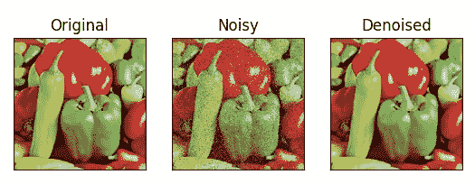
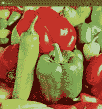
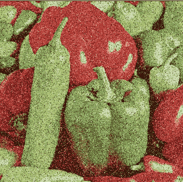

# 如何使用 OpenCV 在 Python 中使用中值模糊对图像去噪

> 原文：<https://medium.com/mlearning-ai/how-to-denoise-an-image-using-median-blur-in-python-using-opencv-easy-project-50c2de13ac33?source=collection_archive---------2----------------------->

在这个博客中，我们将会看到不亚于魔法的东西。看完《中值模糊的力量》你会惊叹不已。因此，没有任何进一步的原因，让我们深入研究。

**点击此处阅读带源代码的整篇文章—**【https://machinelearningprojects.net/median-blur/ 



# 让我们开始吧…

## 步骤 1 —导入所有必需的包。

```
import cv2
import matplotlib.pyplot as plt
import numpy as np
import random
```

## 第二步——阅读我们的图像。

```
img = cv2.imread('test.tiff')
img = cv2.cvtColor(img, cv2.COLOR_BGR2RGB)
```



## 步骤 3-创建黑色图像。

```
noisy = np.zeros(img.shape, np.uint8)
```

*   在这里，我们刚刚初始化了一个与原始图像尺寸相同的黑色图像。
*   我们将从中创造出我们嘈杂的形象。

## 步骤 4——实际创建噪声图像。

```
p = 0.2

#traversing throughout the image pixels
for i in range(img.shape[0]): #rows
    for j in range(img.shape[1]): #cols
        r = random.random()
        if r < p / 2:
            noisy[i][j] = [0, 0, 0] #black noise
        elif r < p:
            noisy[i][j] = [255, 255, 255] #white noise
        else:
            noisy[i][j] = img[i][j] #original image pixel
```

*   在第一行中，我们刚刚将随机变量 p/probability 设置为 0.2。
*   然后我们将开始遍历图像像素。
*   然后我们将使用 random.random()取一个随机值 r，并检查它是否小于 p/2，然后添加一个黑/胡椒噪声(0，0，0)。
*   否则，如果随机 r 值大于 p/2 且小于 p，则添加白色/盐噪声。
*   否则，将原始图像中的像素放在那里。
*   98%的情况下是 else(原始图像的像素)。



## 第五步——应用[中值模糊](https://machinelearningprojects.net/how-to-perform-blurrings-in-opencv/)对图像去噪。

**语法** : *cv2.medianBlur(src，dst，ksize)*

```
# median blur
denoised = cv2.medianBlur(noisy, 5)
```

***注:*** *在我的博客* [*上阅读更多关于中值模糊的内容。*](https://machinelearningprojects.net/how-to-perform-blurrings-in-opencv/)

## 第 6 步——可视化结果。

```
output = [img, noisy, denoised]

titles = ['Original', 'Noisy', 'Denoised']

for i in range(3):
    plt.subplot(1, 3, i + 1)
    plt.imshow(output[i])
    plt.title(titles[i])
    plt.xticks([])
    plt.yticks([])
plt.show()
```


***注:*** 你可以在这里阅读更多关于中值模糊[的内容。](https://docs.opencv.org/3.4/d4/d13/tutorial_py_filtering.html)

如果对模糊中值有任何疑问，请通过电子邮件或 LinkedIn 联系我。

**如需进一步的代码解释和源代码，请访问此处**—[https://machinelearningprojects.net/median-blur/](https://machinelearningprojects.net/median-blur/)

这就是我写给这个博客的所有内容，感谢你的阅读，我希望你在阅读完这篇文章后，能有所收获，直到下次👋…

***看我之前的帖子:*** [***如何使用 OPENCV***](https://machinelearningprojects.net/detect-contours/) 在 PYTHON 中检测图像中的轮廓

**查看我的其他** [**机器学习项目**](https://machinelearningprojects.net/machine-learning-projects/)**[**深度学习项目**](https://machinelearningprojects.net/deep-learning-projects/)**[**计算机视觉项目**](https://machinelearningprojects.net/opencv-projects/)**[**NLP 项目**](https://machinelearningprojects.net/nlp-projects/)**[**烧瓶项目**](https://machinelearningprojects.net/flask-projects/) **at**********

****[](/mlearning-ai/mlearning-ai-submission-suggestions-b51e2b130bfb) [## Mlearning.ai 提交建议

### 如何成为 Mlearning.ai 上的作家

medium.com](/mlearning-ai/mlearning-ai-submission-suggestions-b51e2b130bfb) 

🔵 [**成为作家**](/mlearning-ai/mlearning-ai-submission-suggestions-b51e2b130bfb)****