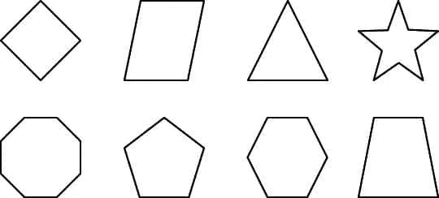
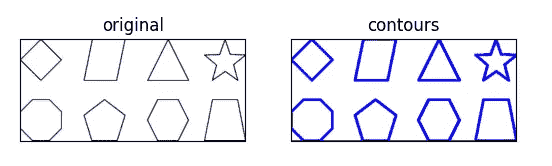

# 如何使用 OpenCV 在 Python 中检测图像中的轮廓

> 原文：<https://medium.com/mlearning-ai/how-to-detect-contours-in-an-image-in-python-using-opencv-3c245cb1d4d?source=collection_archive---------4----------------------->

在今天的博客中，我们将看到如何使用 cv2 模块检测图像中的轮廓。谈论轮廓绘制当我们的用例涉及地质地形图像或研究天气图等时，它是一个非常有用的操作。

**点击此处阅读带源代码的整篇文章—**【https://machinelearningprojects.net/detect-contours/ 


# 让我们开始吧…

## 步骤 1 —导入所需的包。

```
**import** cv2
**import** matplotlib.pyplot **as** plt
```

## 第二步——让我们来阅读图片。

```
img = cv2.imread(‘contours.png’)
img = cv2.cvtColor(img,cv2.COLOR_BGR2RGB)
```

在这里，我们正在读取图像，只是把它从 BGR 转换成 RGB。



## 第 3 步-将其转换为灰度阈值。

```
gray = cv2.cvtColor(img.copy(),cv2.COLOR_BGR2GRAY)
```

你可能会想，当它已经是灰色的时候，为什么我们还要把它转换成灰度。答案是，它看起来可能是灰色的，但它仍然有 3 个通道(R，G，B)，正如我们所知，灰度图像只有一个通道，这就是为什么我们需要将其转换为灰度。

## 步骤 4-对图像进行阈值处理以检测轮廓。

```
ret, thresh = cv2.threshold(gray, 125, 255, 0)
```

为了找到轮廓，我们必须对图像进行阈值处理，以便将其完全转换为二值图像。

## 步骤 5-让我们检测轮廓…

**语法** : *cv2.findContours(src，contour_retrieval，contours_approximation)*

轮廓，层次= cv2.findContours(thresh，cv2。RETR 树，cv2。CHAIN_APPROX_SIMPLE)

***注:*** 你可以在这里阅读更多关于层级[的内容。](https://docs.opencv.org/master/d9/d8b/tutorial_py_contours_hierarchy.html)

## 第六步——让我们在原始图像上画出这些轮廓。

```
copy_img = img.copy()
cv2.drawContours(copy_img,contours,-1,(0,0,255),2)
```

*   我们将使用 img.copy()制作原始图像的副本，在副本图像上绘制轮廓，以便保留原始图像。
*   为了绘制轮廓，我们使用 cv2.drawContours()方法。第一个参数表示图像源，第二个参数表示应该作为 Python 列表传递的轮廓，第三个参数用作轮廓的索引，其他参数用于颜色厚度。

## 第 7 步——最后，让我们绘制结果图。

```
titles = ['original','contours']
imgs = [img, copy_img]
for i in range (2):
    plt.subplot(1,2,i+1)
    plt.xticks([])
    plt.yticks([])
    plt.title(titles[i])
    plt.imshow(imgs[i])
plt.show()
```



***注:*** 这里蓝色描绘的是轮廓。

如果对如何检测轮廓有任何疑问，请通过电子邮件或 LinkedIn 联系我。

**如需进一步的代码解释和源代码，请访问这里**——[https://machinelearningprojects.net/detect-contours/](https://machinelearningprojects.net/detect-contours/)

这就是我写给这个博客的全部内容，感谢你的阅读，我希望你在阅读完这篇文章后会有所收获，直到下次👋…

***读我的* *上一篇:*** [***如何使用 OPENCV***](https://machinelearningprojects.net/plot-color-channels-histogram/) 在 PYTHON 中绘制图像的颜色通道直方图

**查看我的其他** [**机器学习项目**](https://machinelearningprojects.net/machine-learning-projects/)**[**深度学习项目**](https://machinelearningprojects.net/deep-learning-projects/)**[**计算机视觉项目**](https://machinelearningprojects.net/opencv-projects/)**[**NLP 项目**](https://machinelearningprojects.net/nlp-projects/)**[**烧瓶项目**](https://machinelearningprojects.net/flask-projects/) **在**********

****[](/mlearning-ai/mlearning-ai-submission-suggestions-b51e2b130bfb) [## Mlearning.ai 提交建议

### 如何成为 Mlearning.ai 上的作家

medium.com](/mlearning-ai/mlearning-ai-submission-suggestions-b51e2b130bfb)****