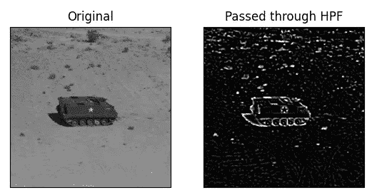
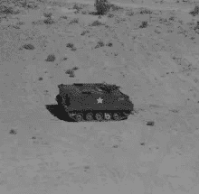
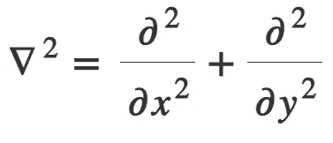

# 如何使用 OpenCV 在 Python 中使用拉普拉斯二阶导数检测边缘

> 原文：<https://medium.com/mlearning-ai/how-to-detect-edges-using-laplacian-2nd-order-derivative-in-python-using-opencv-easy-project-e6e9cfde42e8?source=collection_archive---------6----------------------->

在今天的 OpenCV 系列博客中，我们将为图像实现拉普拉斯高通滤波器或拉普拉斯二阶导数，这是一种非常有用的图像处理，主要用于国防领域(导弹或坦克)，以跟踪敌人的坦克和卡车并摧毁它们。

**在这里阅读带源代码的整篇文章—**[https://machine learning projects . net/laplacian-2nd-order-derivative/](https://machinelearningprojects.net/laplacian-2nd-order-derivative/)



# 让我们开始吧…

## 步骤 1-导入拉普拉斯二阶导数所需的库。

```
**import** cv2
**import** matplotlib.pyplot **as** plt
```

## 第二步——阅读图片。

```
img = cv2.imread(‘4.tiff’)
img = cv2.cvtColor(img, cv2.COLOR_BGR2RGB)
```



*   读取后，我们将图像从 BGR 转换为 RGB，因为我们知道 cv2 自动读取 BGR 格式的图像，而图像最初是 RGB 格式的。
*   这就是为什么我们需要把它转换回来。

## 第三步——让我们模糊图像以消除噪声。

```
img = cv2.GaussianBlur(img,(13,13),0)
```

*   这里我们使用高斯模糊来去除图像中的高斯噪声。
*   我们这样做是因为拉普拉斯算子是二阶导数运算，它对噪声非常敏感。

## 步骤 4-将图像通过拉普拉斯二阶导数。

**语法** : *cv2。拉普拉斯算子(src，ddepth[，ksize[，scale[，delta[，border type]]])*

```
edges = cv2.Laplacian(img, -1, ksize=5, scale=1,delta=0,borderType=cv2.BORDER_DEFAULT)
```

*   拉普拉斯函数通过将使用 Sobel 算子计算的 x 和 y 的二阶导数相加来计算源图像的拉普拉斯算子。
*   与基于局部最大值或最小值检测边缘的一阶滤波器不同，拉普拉斯算子在**过零点**检测边缘，即导数的值从负变为正，反之亦然。
*   记住，Sobel X 和 Sobel Y 分别是 X 和 Y 方向的一阶导数，另一方面，拉普拉斯算子是 X 和 Y 方向的二阶导数之和。



## 第五步——让我们画出结果。

```
output = [img, edges]
titles = ['Original', 'Passed through HPF']

for i in range(2):
    plt.subplot(1, 2, i + 1)
    plt.imshow(output[i], cmap='gray')
    plt.title(titles[i])
    plt.xticks([])
    plt.yticks([])
plt.show()
```


***注***——*你可以在这里* *阅读更多布特拉普拉斯算子* [*。*](https://docs.opencv.org/3.4/d5/db5/tutorial_laplace_operator.html)

如果对拉普拉斯二阶导数有任何疑问，请通过电子邮件或 LinkedIn 联系我。

**如需进一步的代码解释和源代码，请访问此处**—[https://machine learning projects . net/laplacian-2nd-order-derivative/](https://machinelearningprojects.net/laplacian-2nd-order-derivative/)

这就是我写给这个博客的所有内容，感谢你的阅读，我希望你在阅读完这篇文章后，能有所收获，直到下次👋…

***阅读我之前的帖子:*** [***如何使用 OPENCV***](https://machinelearningprojects.net/histogram-of-a-grayscale-image/) 在 PYTHON 中以 2 种方式绘制灰度图像的直方图

**查看我的其他** [**机器学习项目**](https://machinelearningprojects.net/machine-learning-projects/)**[**深度学习项目**](https://machinelearningprojects.net/deep-learning-projects/)**[**计算机视觉项目**](https://machinelearningprojects.net/opencv-projects/)**[**NLP 项目**](https://machinelearningprojects.net/nlp-projects/)**[**烧瓶项目**](https://machinelearningprojects.net/flask-projects/) **at**********

****[](/mlearning-ai/mlearning-ai-submission-suggestions-b51e2b130bfb) [## Mlearning.ai 提交建议

### 如何成为 Mlearning.ai 上的作家

medium.com](/mlearning-ai/mlearning-ai-submission-suggestions-b51e2b130bfb)****