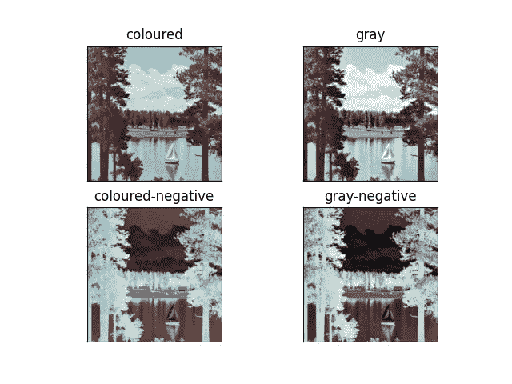
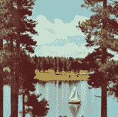

# 如何使用 OpenCV 在 Python 中生成负像——有趣的项目

> 原文：<https://medium.com/mlearning-ai/how-to-generate-a-negative-image-in-python-using-opencv-interesting-project-439da0c19544?source=collection_archive---------0----------------------->

所以，在今天这个 OpenCV 系列的博客中，我们要生成一个负面形象。谈到底片，这是一种非常怀旧的感觉，因为现在我们不习惯看到底片，但在大约 10-15 年前，首先，底片产生了，然后是原始图像。

**点击此处阅读带源代码的整篇文章—**【https://machinelearningprojects.net/negative-image/ 



# 让我们开始吧…

## 步骤 1-导入库。

```
import cv2
import matplotlib.pyplot as plt
```

## 第二步——让我们阅读图片。

```
imgpath = ‘test.tiff’
img = cv2.imread(imgpath)
```



## 步骤 3-将图像转换为 RGB

```
img = cv2.cvtColor(img, cv2.COLOR_BGR2RGB)
```

*   这里我们只是将图像从 BGR 转换为**RGB，因为 cv2 默认读取 BGR 格式的图像。**
*   这就是为什么我们需要将其转换回 RGB 格式。

## 第四步——让我们也读取灰度图像。

```
gray = cv2.imread(imgpath, 0)
```

我们还在灰度模式下读取图像，以生成其负片。

## 第五步——让我们生成负像。

# 求负的算法:

*   获取每个像素的红绿蓝值。
*   从 255 中减去每个颜色值，并将它们保存为新的颜色值。
*   从修改后的颜色创建新的像素值。
*   为像素设置新值。

```
colored_negative = abs(255-img)
gray_negative = abs(255-gray)
```

*   对于彩色图像，我们将从所有 3 个通道(RGB)的所有值中减去 255，并取其绝对值(正值)。
*   对于灰度图像，我们只有一个通道，我们也将从这些像素值中减去 255(灰度图像中像素值范围为 0-255 ),并取绝对值。
*   我们可以把负像看作是与原像完全相反的图像，如果我们把原像和负像都加起来，我们就会得到一个纯白的图像。

## 第六步——让我们画出结果。

```
imgs = [img, gray, colored_negative, gray_negative]
title = ['coloured', 'gray', 'coloured-negative', 'gray-negative']

plt.subplot(2, 2, 1)
plt.title(title[0])
plt.imshow(imgs[0])
plt.xticks([])
plt.yticks([])

plt.subplot(2, 2, 2)
plt.title(title[1])
plt.imshow(imgs[1], cmap='gray')
plt.xticks([])
plt.yticks([])

plt.subplot(2, 2, 3)
plt.title(title[2])
plt.imshow(imgs[2])
plt.xticks([])
plt.yticks([])

plt.subplot(2, 2, 4)
plt.title(title[3])
plt.imshow(imgs[3], cmap='gray')
plt.xticks([])
plt.yticks([])

plt.show()
```


***注*** —阅读更多关于[负片](https://en.wikipedia.org/wiki/Negative_(photography))的图片。

如果对这个话题有任何疑问，请通过电子邮件或 LinkedIn 联系我。

**如需进一步的代码解释和源代码，请访问此处**—[https://machinelearningprojects.net/negative-image/](https://machinelearningprojects.net/negative-image/)

*所以这就是我写给这个博客的所有内容，感谢你阅读它，我希望你在阅读完这篇文章后会有所收获，直到下一次👋…*

***看我以前的帖子:*** [***如何在 PYTHON 中使用拉普拉斯二阶导数检测边缘使用 OPENCV***](https://machinelearningprojects.net/laplacian-2nd-order-derivative/)

**查看我的其他** [**机器学习项目**](https://machinelearningprojects.net/machine-learning-projects/)**[**深度学习项目**](https://machinelearningprojects.net/deep-learning-projects/)**[**计算机视觉项目**](https://machinelearningprojects.net/opencv-projects/)**[**NLP 项目**](https://machinelearningprojects.net/nlp-projects/)**[**烧瓶项目**](https://machinelearningprojects.net/flask-projects/) **at**********

****[](/mlearning-ai/mlearning-ai-submission-suggestions-b51e2b130bfb) [## Mlearning.ai 提交建议

### 如何成为 Mlearning.ai 上的作家

medium.com](/mlearning-ai/mlearning-ai-submission-suggestions-b51e2b130bfb)****