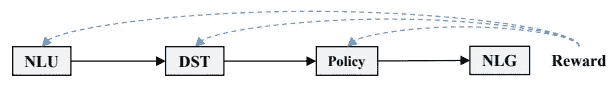
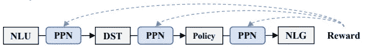
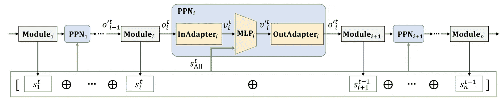
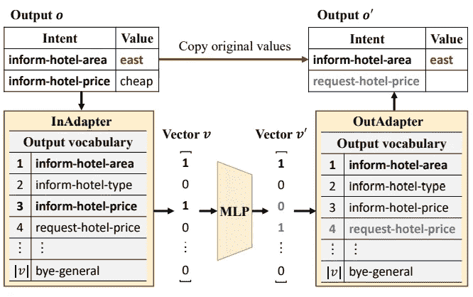
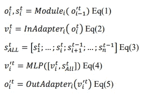
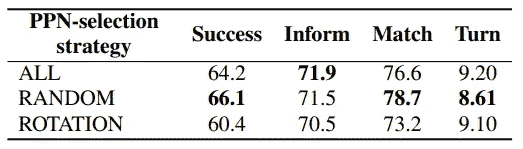
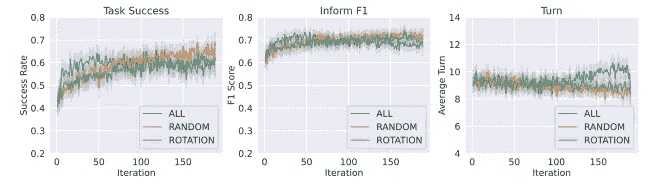
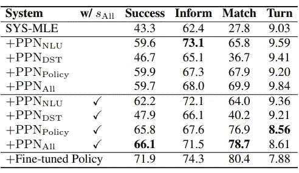
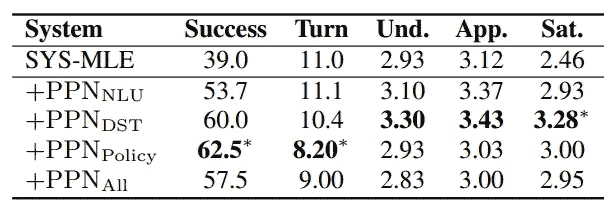
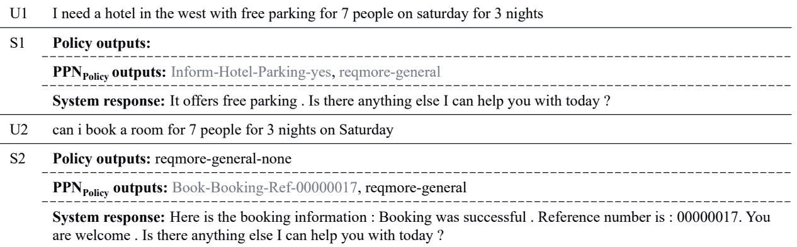

# PPN(后处理网络)如何优化管道对话系统？

> 原文：<https://medium.com/mlearning-ai/how-to-optimize-pipeline-dialogue-systems-by-ppn-post-processing-networks-a5ef94811358?source=collection_archive---------7----------------------->

## 这是人类创造智慧的目的地。近年来，随着人工智能的发展，我们取得了巨大的进步，特别是在强化学习方面。TODSs(面向任务的对话系统)越来越受到工业界的重视，以节省金钱和时间。TODSs 执行由用户用自然语言定义的目标。大多数情况下，我们使用包含各种模块的管道方法。本文阐述了一种优化整个管道系统的方法。

首先，对我来说这似乎是件大事，也许对你也是。所以，我们来看看是不是太复杂了？！

[source](https://giphy.com/gifs/hyperxgaming-hyperx-timthetatman-tatman-army-xuDHx1Ja40K10VhgiP)

> 首先，让我给你一个 TODSs 的概述:

# 概述:面向任务的对话系统(TODS)

TODS 分为两组:

1.  基于神经的端到端系统
2.  管道系统

## 管道系统

模块:

1.  **NLU(自然语言理解)**
2.  **DST(对话状态跟踪)**
3.  **政策**
4.  **NLG(自然语言生成)**

在这个系统中，**入口**和**出口**对人类来说是**清晰的**(这有利于**解释**)。由于对模块顺序处理**，我们可以在**优化**中看到导致**困难**的错误。因此，**较差**导致**对话**。**

## **基于神经的端到端系统**

**在**对比**与*管路系统*中:**

*   ****更容易**优化→ **降低**错误→ **提高**性能**

**听起来不错，不是吗？？嗯，问题是训练要求有**大量**数量**数量**的**标注数据**。而且， ***降低了*** 对**解释**的能力，是 ***比*** **更具有挑战性**对**修改**或**扩展**。**

****问题:****

**自定义方法的架构:**

****

****Figure1\.** Conventional Method. Modules are fine-tuned using RL. [[source](https://arxiv.org/abs/2207.12185)]**

**这些**方法**就是**威武**；然而，**他们并不总是适用**。*为什么？*原因是有**次**的**模块**可以**只**被**实现**与**规则**或 ***不能**的***** 访问**模块内部** ( *Web API 等**中的**。*)。**

****解决方案**:**

**研究人员开发了一种优化整个管道系统的方法。核心关注点是输出固定模块，如 NLU、DST 和 Policy，并提出了它们之间的 PPN(后处理网络)。**

****

****Figure2\.** The developed method in this article. Each PPN that post processes output of each module is optimized using RL. [[source](https://arxiv.org/abs/2207.12185)]**

*   **您可以比较图 1 和图 2，找出建议的方法与随意的方法之间的区别。**

****问题**)它是如何工作的？**

****回答** ) **PNN****

****解释**)通过将 **PPN** 置位，我们校正所有模块的输出。*这个整顿的怎么样？* **附加**和**删除** **信息**为**所必需**到**简化**到**的连接进一步模块**。**

**这些**PPN 利用**所有模块的**状态使**后处理适合**。我们**通过 **RL** 优化了我们 **PPNs** 的**后处理**；因此，**系统提高了**对话**的**性能。******

> 所以现在，我们清楚地知道为什么我们需要这样做，以及如何去做。从现在开始，我们将深入研究细节。我们走吧。

[[source](https://giphy.com/gifs/abcnetwork-the-goldbergs-thegoldbergs-thegoldbergsabc-lUuNl5aXQyV8HS8dpn)]

# PNN 有用吗？

是的，它工作正常。但在意识到它是否有效之前，让我们看看它是如何工作的。

**Figure 3.** The overall architecture. We can see **PPNs** are located **between** all **Modules**, and each PPN contains three parts, including **InAdapter**, **MLP,** and, **OutAdapter**. [[source](https://arxiv.org/abs/2207.12185)]

嗯，每个 PPN 都是由两个流( ***O*** 和 ***S*** )养活的；第一个是针对不适应，后者绕过不适应 MLP。*挺复杂的哈？*

让我们更详细地看看 PPN:

**Figure 4.** PPN in detail. [[source](https://arxiv.org/abs/2207.12185)]

在图 4 中。我们可以看到，InAdapter 将输出 *o* (前一个模块的输出(在此图中，是 **NLU** )转换为向量 *v，*)，然后 MLP 将向量 *v* 转换为另一个向量 *v`* (您可以看到一些数字无法编码，所以它们将复制到 *v`* )

从等式的角度来看，我们有:

我们需要这些方程来理解 PPNs 中发生的事情。

在这个架构中，我们在 InAdapter 和 OutAdapter 之间的算子)中使用 **RL(强化学习)****优化**我们的**MLPs**；**如何**？由**用户**。

**问)** *我们在实现 InAdapter 和 OutAdapter* 时需要什么？

**A)******词汇集*** *的各个模块*。*

***结果)** *我们有一个与* ***可微*** *和* ***不可微*** *事业一致的架构。**

> *仅此而已！！哦，等一下！！还有两件事我应该告诉你:*
> 
> *1.预培训*
> 
> *2.最佳化*

# *预培训*

***问)** *如何？**

***一)** ***模仿学习****

*仅用 RL 进行优化是相当困难的，所以我们将使用**模仿** **学习**，这意味着**首先复制一个**专家**的**方式**。***

*训练 MLPs 的方法是通过执行**多标签任务** ( *输入* :[ *v，S_All* 和*输出* : *v* )。此外，我们正在利用**二进制交叉入口** y 来*更新*MLP 来*减少 *v* 和*v’*之间的差异。**

# *最佳化*

***问)** *如何？**

***A)** ***强化学习(RL)****

*你还记得我们为什么提议 PPN 吗？回答)到**提高**到**的对话性能**。*

***Q)** 现在，我们正在用 **RL** 对**优化**。那么，**算法**呢？*

***A)** ***近端策略优化【PPO】****

***问)** *它是如何工作的？？**

*a)实际上，它是一个基于**梯度的** *RL 算法*，有**三个步骤**:*

****第一步*** 。通过利用 **PPNs** 我们的 ***管道系统*与 ***用户*** 进行通信。***

***定义)*轨迹****

*作为 rᵗ，我们对所有的 PPN 给予相同的重视。*

***定义)**我们重复再重复这个检查，直到完成预定的规模。这个过程被命名为*。**

*****步骤 2*** 。我们在这一步中更新 PPN，并基于一个策略选择为*PPN-选择策略*。这个策略意味着使用一个规则来更新每次迭代的 PPN。**

*****第三步*** 。因此，我们选择了 MLP(步骤 2 ),然后在这一步中选择了更新的 MLP(通过 PPO );这些 MLP 在多个时期更新(通过使用*轨迹采样-步骤 1* )**

**此外，我们有三个 PPN 选择策略:**

1.  ****所有**(在每次迭代中选择)**
2.  ****随机**(随机选择)**
3.  ****旋转**(每次迭代选择一个)**

> **所有描述到此结束。因此，如果你想看看它的表现，继续阅读看看结果。😉**

# **估价**

**四个测量值用于评估模型:**

**1.**转数(转)****

*****定义*** :“一个用户话语及其系统响应形成一个回合。”**

*   **最小的转弯是我们的偏好。**

****2。通知 F1****

*****定义*** :“系统响应用户请求的插槽，无多无少”**

****3。匹配率****

*****定义*** :“系统表达的存在满足用户目标的条件”**

****4。任务成功****

*****定义*** :此测量是**率**和**通知召回**的结果**

*   **除了这四个标准，我们用**人类**评价**人类**。**

# **数据**

****训练)**在所有**实验**中，大约 **10000 次**的数据(相当于 **1000 次对话**)与 **200 次迭代**一起用于**强化学习**用于**训练，**其中**每次迭代**包括大约 **100 次对话****

****测试)对于在训练时成功完成最佳任务的每个系统，使用了大约 1000 个对话。****

# ****结果****

> ******PPN 选择策略的比较******

********

****Table 1\. This table shows the **performance** when we use **PPN training** for **all** our **three strategies.** [[source](https://arxiv.org/abs/2207.12185)]****

********

****Figure 5\. In this figure, we can see the comparison of all strategies with three of our measurements for 150 iterations. [[source](https://arxiv.org/abs/2207.12185)]****

****在图 5 中我们可以看到，对于所有的策略，我们在迭代 50 时得到最好的分数，比随机和旋转迭代 100 次要早。****

> ******车型组合对比******

****提出了 6 种不同模型组合的管道系统。我们可以看到表 2，它比较了这六个系统:****

********

****Table 2\. The comparison of 6 models before/after applying PPN [[source](https://arxiv.org/abs/2207.12185)]****

> ******PPN 的影响力有多大？？******

****我建议您看一下表 3:****

********

****Table 3\. The effect of applying PPN [[source](https://arxiv.org/abs/2207.12185)]****

****有趣的是这个优化也是人类测试的(听起来很有趣！！不是吗？！).其实是由**四十个**亚马逊工人(亚马逊机械土耳其人( **AMT** ))对那些**五大系统**的评价。****

********

****Table 4\. Results of human evaluation [[source](https://arxiv.org/abs/2207.12185)]****

****您可以在图 6 中看到人工评估的过程:****

********

****Figure 6\. two examples of the dialogue between workers and +PPN_policy [[source](https://arxiv.org/abs/2207.12185)]****

> ****我没有说明所有的细节，所以我会在以后的文章中说明(我指的是在提出 PPN 之后对模块及其实现的描述)😅****

****此外，我还写过一些关于强化学习的文章:****

1.  ****[***强化学习简介***](https://rezayazdanfar.medium.com/an-introduction-of-reinforcement-learning-720d19f062df?source=your_stories_page-------------------------------------)****

> *****来源:* [**后处理网络:利用强化学习优化流水线面向任务对话系统的方法**](https://arxiv.org/abs/2207.12185)****

********

****source: [unsplash](https://unsplash.com/photos/zo_vKqctI6E) by Pedro Cunha****

> *****你可以* ***联系*** *我上* ***推特*** [这里](https://twitter.com/reza__yazdanfar) *或者****LinkedIn***[这里](http://www.linkedin.com/in/rezayazdanfar) *。最后，如果你觉得这篇文章有趣又有用，可以* ***关注*** *我上* ***中*** *获取更多来自我的文章。*****

**** [## Mlearning.ai 提交建议

### 如何成为 Mlearning.ai 上的作家

medium.com](/mlearning-ai/mlearning-ai-submission-suggestions-b51e2b130bfb)****