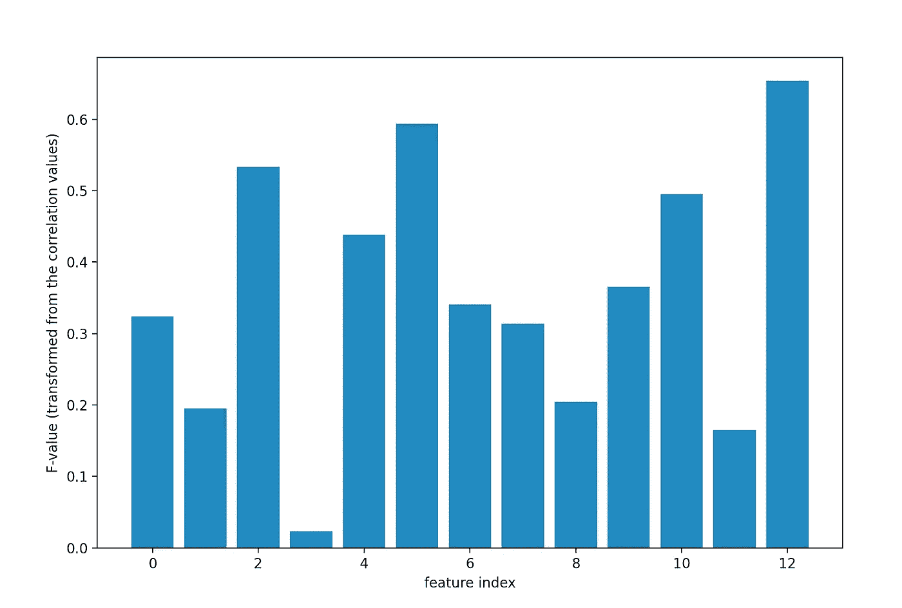

# 如何对回归问题进行特征选择

> 原文：<https://medium.com/mlearning-ai/how-to-perform-feature-selection-for-regression-problems-cc6ea56c6d48?source=collection_archive---------2----------------------->

## 在本文中，我将解释什么是特征选择，以及在用 Python 训练回归模型之前如何进行特征选择。

# 1.介绍

## 什么是特征选择？

> 特征选择是程序…