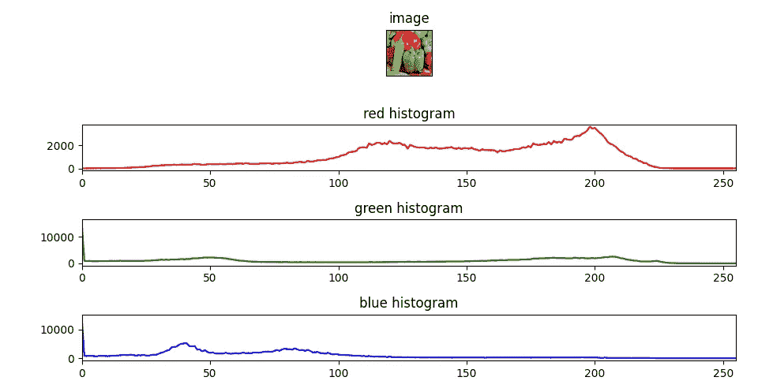
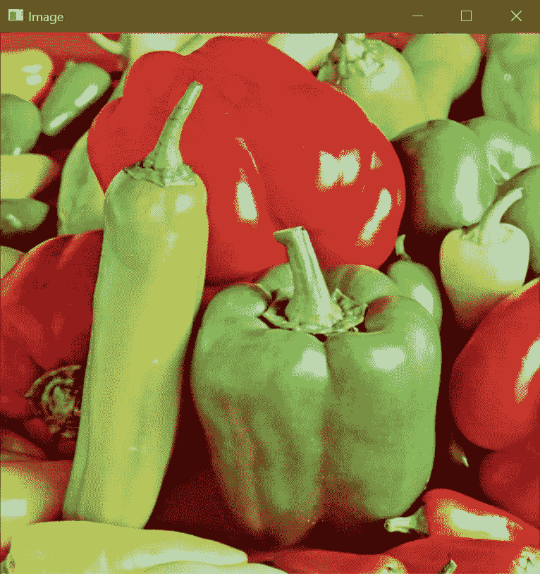

# 如何使用 OpenCV 在 Python 中绘制图像的颜色通道直方图

> 原文：<https://medium.com/mlearning-ai/how-to-plot-color-channels-histogram-of-an-image-in-python-using-opencv-40022032e127?source=collection_archive---------0----------------------->

在这篇非常短的博客中，我们将看到如何使用 OpenCV 在 Python 中绘制一幅图像的所有 3 个颜色通道直方图(红、绿、蓝)。

**在这里阅读带源代码的整篇文章—**[https://machine learning projects . net/plot-color-channels-histogram/](https://machinelearningprojects.net/plot-color-channels-histogram/)



# 让我们开始吧…

## 步骤 1-导入绘制颜色通道直方图所需的包。

```
**import** cv2
**import** matplotlib.pyplot **as** plt
```

## 第二步——让我们阅读并想象图像。

```
imgpath = "test.tiff"
img = cv2.imread(imgpath)

cv2.imshow('Image', img)
cv2.waitKey(0)
```



## 步骤 3-将通道从 BGR 转换为 RGB。

```
img = cv2.cvtColor(img, cv2.COLOR_BGR2RGB)
```

## 第 4 步-最后，让我们得到颜色通道直方图…

**语法:** *cv2.calcHist(images，channels，mask，histSize，ranges[，hist[，accumulate])*

```
red_hist = cv2.calcHist([img], [0], None, [256], [0, 255])
green_hist = cv2.calcHist([img], [1], None, [256], [0, 255])
blue_hist = cv2.calcHist([img], [2], None, [256], [0, 255])
```

*你可以在这里* *阅读更多关于直方图计算的* [*。*](https://docs.opencv.org/3.4/d8/dbc/tutorial_histogram_calculation.html)

## 步骤 5-让我们绘制这些颜色通道直方图。

```
plt.subplot(4, 1, 1)
plt.imshow(img)
plt.title('image')
plt.xticks([])
plt.yticks([])

plt.subplot(4, 1, 2)
plt.plot(red_hist, color='r')
plt.xlim([0, 255])
plt.title('red histogram')

plt.subplot(4, 1, 3)
plt.plot(green_hist, color='g')
plt.xlim([0, 255])
plt.title('green histogram')

plt.subplot(4, 1, 4)
plt.plot(blue_hist, color='b')
plt.xlim([0, 255])
plt.title('blue histogram')

plt.tight_layout()
plt.show()
```

*   我们已经创建了一个 4 行 1 列的画布。
*   在第一行中，我们绘制了使用 xticks()和 yticks()移除了 x 和 y 条的图像。
*   在第二行中，我们绘制了红色通道的直方图。我们将直方图的限制设置为 0–255(这是每个像素可以接受的红色通道值的实际范围)。
*   我们也为绿色和蓝色通道做了类似的事情。
*   在倒数第二行，我们使用 plt.tight_layout()只是为了在图之间提供一些间距。


***注:*** 由此，我们可以推断出图像的主要部分是 ***红色*** 。

如果对颜色通道直方图有任何疑问，请通过电子邮件或 LinkedIn 联系我。

**如需进一步的代码解释和源代码，请访问此处**—[https://machine learning projects . net/plot-color-channels-histogram/](https://machinelearningprojects.net/plot-color-channels-histogram/)

这就是我写给这个博客的全部内容，感谢你的阅读，我希望你在阅读完这篇文章后会有所收获，直到下次👋…

***看我之前的帖子:*** [***如何进行简单模糊、方框模糊、高斯模糊、中值模糊***](https://machinelearningprojects.net/blurrings-in-cv2/)

**查看我的其他** [**机器学习项目**](https://machinelearningprojects.net/machine-learning-projects/)**[**深度学习项目**](https://machinelearningprojects.net/deep-learning-projects/)**[**计算机视觉项目**](https://machinelearningprojects.net/opencv-projects/)**[**NLP 项目**](https://machinelearningprojects.net/nlp-projects/)**[**烧瓶项目**](https://machinelearningprojects.net/flask-projects/) **at**********

****[](/mlearning-ai/mlearning-ai-submission-suggestions-b51e2b130bfb) [## Mlearning.ai 提交建议

### 如何成为 Mlearning.ai 上的作家

medium.com](/mlearning-ai/mlearning-ai-submission-suggestions-b51e2b130bfb)****