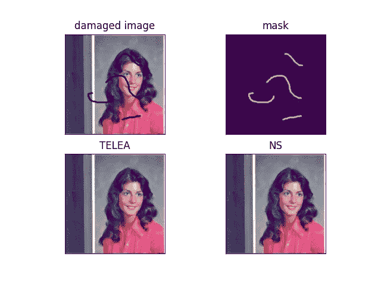
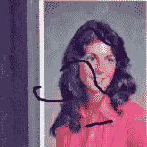
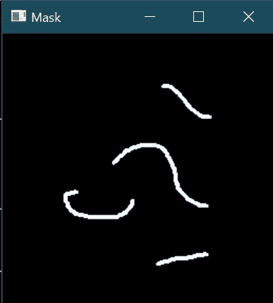

# 如何使用 OpenCV 在 Python 中使用修复方法修复损坏的图像

> 原文：<https://medium.com/mlearning-ai/how-to-repair-damaged-images-using-inpainting-methods-in-python-using-opencv-339982754137?source=collection_archive---------2----------------------->

在今天的博客中，我们将看到如何使用 OpenCV 的修复方法在 Python 中修复损坏的图像。这将是一个非常有趣的项目，所以没有任何进一步的原因，让我们投入进去。

**图像修复**是去除图像上的损坏，如噪声、笔画或文本的过程。它在修复可能有划痕边缘或墨迹的旧照片时特别有用。这些可以通过这种方法以数字方式消除。

**在这里阅读全文并附带源代码—**[https://machine learning projects . net/repair-damaged-images-using-inpainting/](https://machinelearningprojects.net/repair-damaged-images-using-inpainting/)



# 让我们开始吧…

## 步骤 1 —让我们导入库。

```
import cv2
import matplotlib.pyplot as plt
```

## 第二步——读取损坏的图像。

```
damaged_image_path = “Damaged Image.tiff”
damaged_image = cv2.imread(damaged_image_path)
```



## 第三步——阅读面具。

```
mask_path = "Mask.tiff"
mask = cv2.imread(mask_path, 0)
```

*   这里我们在灰度模式下读取我们的蒙版。
*   蒙版基本上是一个二进制图像，其中白色部分描绘了我们的原始图像损坏的像素或位置。



## 步骤 4-将损坏的图像从 BGR 转换成 RGB。

```
damaged_image = cv2.cvtColor(damaged_image, cv2.COLOR_BGR2RGB)
```

这里我们只是将我们的图像从 BGR 转换成 RGB，因为 cv2 自动读取 BGR 格式的图像。

## 第五步——让我们修复受损的图像。

**语法** : *cv2.inpaint(src，inpaintMask，inpaintRadius，flags)*

```
output1 = cv2.inpaint(damaged_image, mask, 1, cv2.INPAINT_TELEA)
output2 = cv2.inpaint(damaged_image, mask, 1, cv2.INPAINT_NS)
```

## 第六步——让我们画出结果。

```
img = [damaged_image, mask, output1, output2]
titles = ['damaged image', 'mask', 'TELEA', 'NS']

for i in range(4):
    plt.subplot(2, 2, i+1)
    plt.xticks([])
    plt.yticks([])
    plt.title(titles[i])
    plt.imshow(img[i])
plt.show()
```


***注—*** *了解更多关于*[*cv2 . inpaint()*](https://docs.opencv.org/4.5.2/df/d3d/tutorial_py_inpainting.html)。

如果对修复受损图像有任何疑问，请通过电子邮件或 LinkedIn 联系我。

**如需进一步的代码解释和源代码，请访问此处**—[https://machine learning projects . net/repair-damaged-images-using-inpainting/](https://machinelearningprojects.net/repair-damaged-images-using-inpainting/)

这就是我写给这个博客的全部内容，感谢你的阅读，我希望你在阅读完这篇文章后和下次阅读前能有所收获👋…

***看我之前的帖子:*** [***如何使用 OPENCV***](https://machinelearningprojects.net/negative-image/) 在 PYTHON 中生成负像

**查看我的其他** [**机器学习项目**](https://machinelearningprojects.net/machine-learning-projects/)**[**深度学习项目**](https://machinelearningprojects.net/deep-learning-projects/)**[**计算机视觉项目**](https://machinelearningprojects.net/opencv-projects/)**[**NLP 项目**](https://machinelearningprojects.net/nlp-projects/)**[**烧瓶项目**](https://machinelearningprojects.net/flask-projects/) **at**********

****[](/mlearning-ai/mlearning-ai-submission-suggestions-b51e2b130bfb) [## Mlearning.ai 提交建议

### 如何成为 Mlearning.ai 上的作家

medium.com](/mlearning-ai/mlearning-ai-submission-suggestions-b51e2b130bfb)****