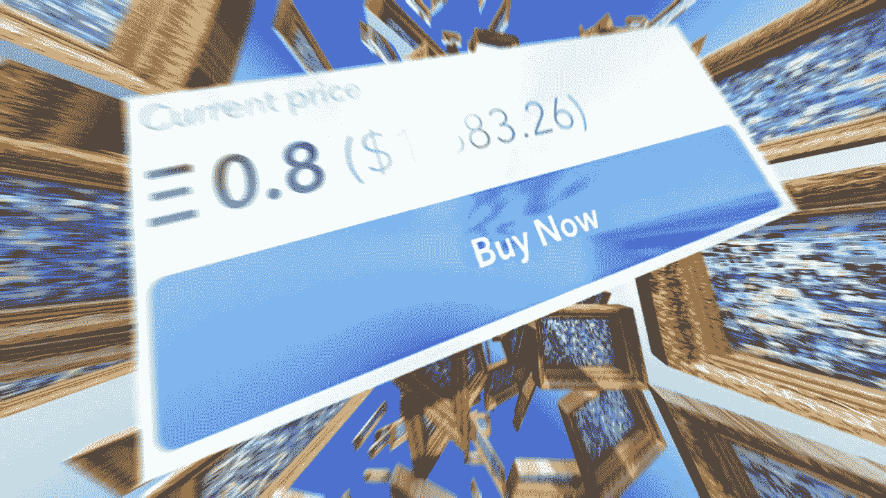

# 如何以 1 美元或更低的价格启动 NFT

> 原文：<https://medium.com/mlearning-ai/how-to-start-nfts-with-1-or-less-11a5a9079e7e?source=collection_archive---------3----------------------->

## 艺术收藏

🔵 [**获取全介质访问权**](https://datasculptor.medium.com/membership)

[https://opensea.io/collection/generated-by-ml-model](https://opensea.io/collection/generated-by-ml-model)

**如何通过 NFTs“变好”**

艺术总是着眼于未来。
艺术市场的一场革命正在我们眼前发生。许多术语和定义正在改变它们的含义，甚至消失:
-March and d ' art
-vern issage
-collection ur d ' art
后一个数字——a**NFT collector**——是…