# Tensorflow 数据管道初学者指南

> 原文：<https://medium.com/mlearning-ai/how-to-use-data-pipelines-with-python-a9b662fadec2?source=collection_archive---------0----------------------->

## 如何使用 Tensorflow 为文本、图像和 numpy 数组数据集构建数据管道？


Photo by [Jeremy Bishop](https://unsplash.com/@jeremybishop?utm_source=medium&utm_medium=referral) on [Unsplash](https://unsplash.com?utm_source=medium&utm_medium=referral)

在构建模型时，将数据转换为适当的格式非常重要。数据分析中最重要的步骤之一是数据预处理。数据预处理占用了数据科学家的大部分时间。自动化数据预处理步骤简化了数据分析。数据管道是从不同来源获取原始数据并将数据移动到目的地进行加载、转换和分析的一系列步骤。

在这篇文章中，我将讨论以下主题

*   为文本数据集构建数据管道
*   为影像数据集构建数据管道
*   为 numpy 数组数据集构建数据管道

请不要忘记订阅[我们的 youtube 频道](https://youtube.com/c/tirendazacademy)，在那里我创建了关于人工智能、数据科学、机器学习和深度学习的内容。

让我们开始吧！

# 文本数据集的数据管道


Photo by [Romain Vignes](https://unsplash.com/@rvignes?utm_source=medium&utm_medium=referral) on [Unsplash](https://unsplash.com?utm_source=medium&utm_medium=referral)

要分析文本数据，您需要正确地组织目录结构。例如，您必须将训练文本组织成阳性和阴性，以进行如下文本分类:

```
main_directory/
....pos 
........pst1.txt 
........pst2.txt 
....neg 
........ngt1.txt 
........ngt2.txt
```

您可以使用 TensorFlow 中的 text_dataset_from_directory 方法为文本数据集创建管道。这个方法将返回一个`[tf.data.Dataset](https://www.tensorflow.org/api_docs/python/tf/data/Dataset)`，它给出了来自子目录 pos 和 neg 的一批文本。让我们想到互联网电影数据库(IMDB)数据集，将电影评论分为正面和负面。该数据集通常用于教授文本分析，由 25，000 条用于训练的高度极性电影评论和 25，000 条用于测试的电影评论组成。

## 下载数据集

首先，我来导入库。

```
import io
import os
import re
import shutil
import string
import tensorflow as tf
```

现在，我将加载 IMDb 数据集。如果你想直接下载，你可以使用 get_file 方法。get_file 方法从一个 URL 下载一个不在缓存中的文件。为此，让我创建一个名为 url 的变量。

```
url = "https://ai.stanford.edu/~amaas/data/sentiment/aclImdb_v1.tar.gz"
```

接下来，让我使用 get_file 方法，如下所示:

```
data = tf.keras.utils.get_file(
          "aclImdb_v1.tar.gz", 
          url,
          untar=True, 
          cache_dir='.', 
          cache_subdir='')
```


因此，数据集被下载，并在当前目录中创建了一个名为 aclImdb 的目录。我将创建一个变量，它代表这个文件路径。

```
data_dir = os.path.join(os.path.dirname(data), 'aclImdb')
```

让我们看看 data_dir 目录中 train_dir 的内部。

```
train_dir = os.path.join(data_dir, 'train')
os.listdir(train_dir)
```

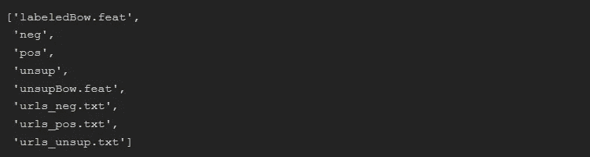

如您所见，有一个名为 unsup 的目录。我不需要 unsup 目录。让我删除这个目录。

```
unused_dir = os.path.join(train_dir, 'unsup')
shutil.rmtree(unused_dir)
```

我要去看看 train_dir。

```
os.listdir(train_dir)
```

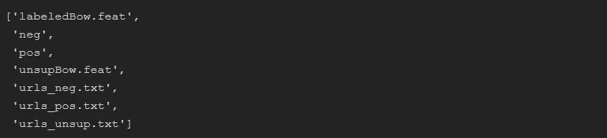

如您所见，unsup 已从数据目录中删除。确保只有目录名被用作标签。让我看看培训目录里的内容。

```
ls aclImdb\train
```

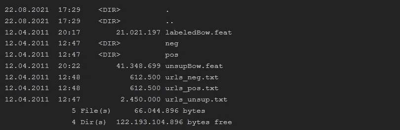

如你所见，有 pos 和 neg 目录。

## 创建数据管道

现在我要创建一个管道。首先，让我创建一个 batch_size 和种子变量:

```
batch_size = 1024
seed = 123
```

批量大小使用在一次训练迭代中使用多少样本。我指定了 seed 参数来以相同的顺序传输文件。现在我将使用 test_dataset_from_directory()方法创建一个数据管道。

```
train_ds = tf.keras.preprocessing.text_dataset_from_directory(    
    'aclImdb/train', 
    batch_size = batch_size, 
    validation_split=0.2, 
    subset='training', 
    seed=seed)
```

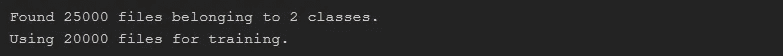

所以我很容易地使用管道创建了训练数据集。为了微调超参数，我将使用一个验证数据集。让我们创建一个验证数据集。

```
val_ds = tf.keras.preprocessing.text_dataset_from_directory( 
        'aclImdb/train', 
        batch_size=batch_size,   
        validation_split=0.2, 
        subset='validation', 
        seed=seed)
```

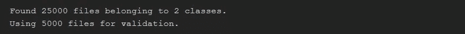

## 探索数据集

现在我将探究这些文件的内容。让我们在第一批中随机选择 5 行并打印出来。

```
import random
idx = random.sample(range(1, batch_size), 5)
for text_batch, label_batch in train_ds.take(1):
    for i in idx:
        print(label_batch[i].numpy(),      
              text_batch.numpy()[i])
```

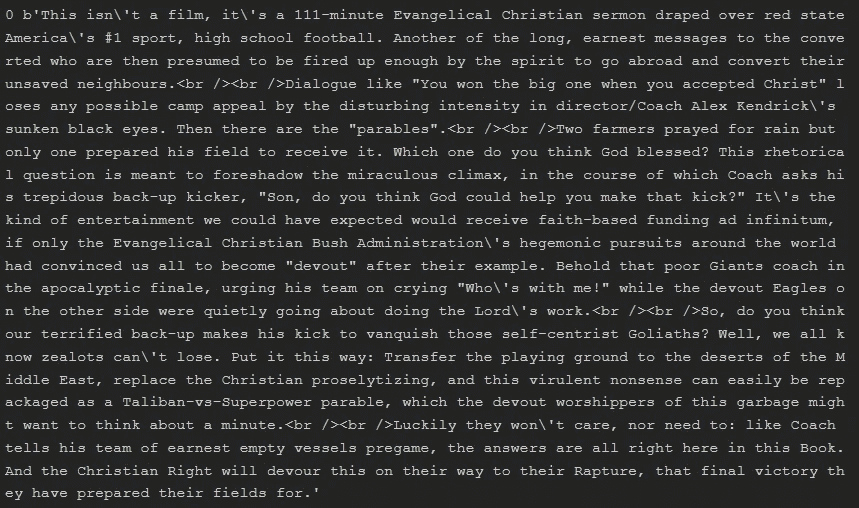

在这一节中，我展示了如何使用管道处理文本数据集。如您所见，使用管道可以轻松完成数据预处理。

# 图像数据集的数据管道


Photo by [virginia lackinger](https://unsplash.com/@nowyouknowgini?utm_source=medium&utm_medium=referral) on [Unsplash](https://unsplash.com?utm_source=medium&utm_medium=referral)

您可以将管道用于图像模型，该模型可以从分布式文件系统中的文件聚合数据，对每个图像应用随机扰动，并将随机选择的图像合并到一个批处理中进行训练。

例如，在同一个文件中有多个图像。该文件包括两列:一列包含所有文件名，另一列包含标签。在这一节中，我将展示如何在同一个文件中处理图像数据集的数据管道。

为了展示如何为图像数据集创建管道，我将使用[花卉数据集](https://data.mendeley.com/datasets/jxmfrvhpyz/1)。我将数据集下载到工作目录中的 flower_photos 文件中。

## 探索数据集

让我导入库，这将在本节中使用。

```
import tensorflow as tf
import tensorflow_hub as hub
import pandas as pd
import numpy as np
import matplotlib.pyplot as plt
```

请注意，数据集有一个标签文件。我将使用熊猫图书馆查看它的内容。

```
traindf=pd.read_csv(
    'flower_photos/all_labels.csv',
    dtype=str)
# Take a look first five fows of the dataset
traindf.head()
```

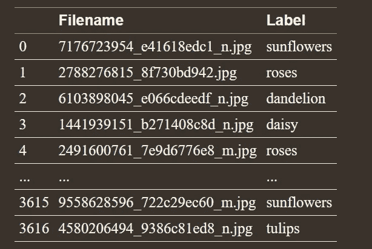

## 创建数据管道

让我们建立一个数据管道，将这些图像输入图像分类模型。为了构建模型，我将使用 TensorFlow Hub 中预先构建的 ResNet 模型。

现在我要创建一些超参数，稍后会用到。请注意，ResNet 模型期望图像的像素尺寸为 224*224，我需要确定批量大小。

```
data_root = 'flower_photos/flowers'
IMAGE_SIZE = (224, 224)
TRAINING_DATA_DIR = str(data_root)
BATCH_SIZE = 32
```

让我们标准化数据集，并为验证数据集保留 20%的图像。让我用一个字典结构。

```
datagen_kwargs = dict(
    rescale=1./255, 
    validation_split=.20)
```

现在让我创建一个新变量，并将 datagen_kwargs 传递到这个变量中。

```
dataflow_kwargs = dict(
    target_size=IMAGE_SIZE,
    batch_size=BATCH_SIZE, 
    interpolation="bilinear")
```

您可以使用 ImageDataGenerator 将这些图像流式传输到培训过程中。为此，我将定义一个生成器，并将 datagen_kwargs 传递给这个生成器。

```
train_datagen =   tf.keras.preprocessing.image.ImageDataGenerator(
**datagen_kwargs)
```

为了创建数据管道，我将使用 flow_from_dataframe 方法。

```
train_generator = train_datagen.flow_from_dataframe(
    dataframe=traindf, 
    directory=data_root, 
    x_col="file_name", 
    y_col="label", 
    subset="training", 
    seed=10, shuffle=True, 
    class_mode="categorical", 
    **dataflow_kwargs)
```

## 检查数据集

让我展示数据集中的图像。

```
image_batch, label_batch = next(iter(train_generator))
fig, axes = plt.subplots(8, 4, figsize=(20, 40))
axes = axes.flatten()
for img, lbl, ax in zip(image_batch, label_batch, axes):
    ax.imshow(img)
    label_ = np.argmax(lbl)
    label = idx_labels[label_]
    ax.set_title(label)
    ax.axis('off')
    plt.show()
```

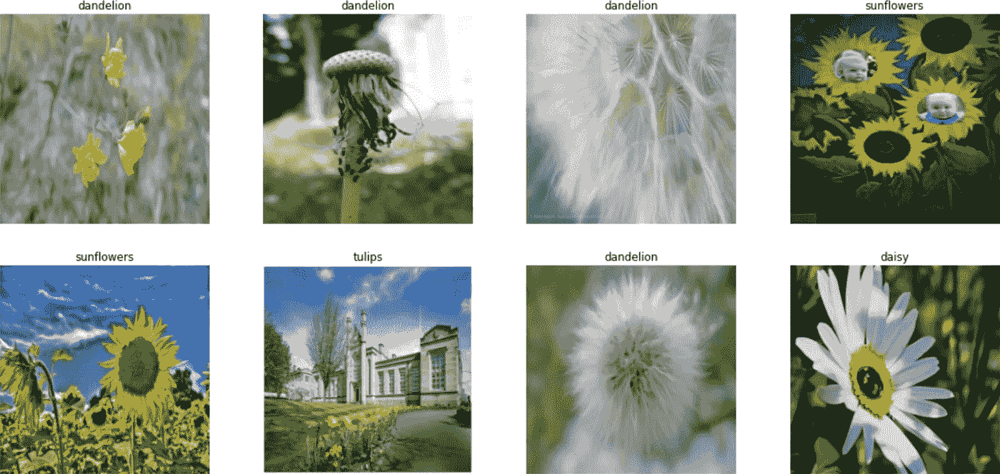

因此，数据接收管道已经可以使用了。让我们训练模型。

## 训练模型

我将使用 ResNet 模型来构建模型。

```
model = tf.keras.Sequential([
    tf.keras.layers.InputLayer(
        input_shape=IMAGE_SIZE + (3,)),
    hub.KerasLayer( 
        "https://tfhub.dev/tensorflow/resnet_50/feature_vector/1", trainable=False),
    tf.keras.layers.Dense(
        5, activation='softmax', 
        name = 'custom_class')])
model.build([None, 224, 224, 3])
```

让我们编译模型。

```
model.compile(
    optimizer=tf.keras.optimizers.SGD(lr=0.005, momentum=0.9),       
    loss=tf.keras.losses.CategoricalCrossentropy(
        from_logits=True, label_smoothing=0.1), 
    metrics=['accuracy'])
```

现在我要训练模型了。

```
steps_per_epoch = train_generator.samples // train_generator.batch_sizevalidation_steps = valid_generator.samples // valid_generator.batch_sizemodel.fit(
    train_generator, 
    epochs=13, 
    steps_per_epoch=steps_per_epoch,   
    validation_data=valid_generator, 
    validation_steps=validation_steps)
```

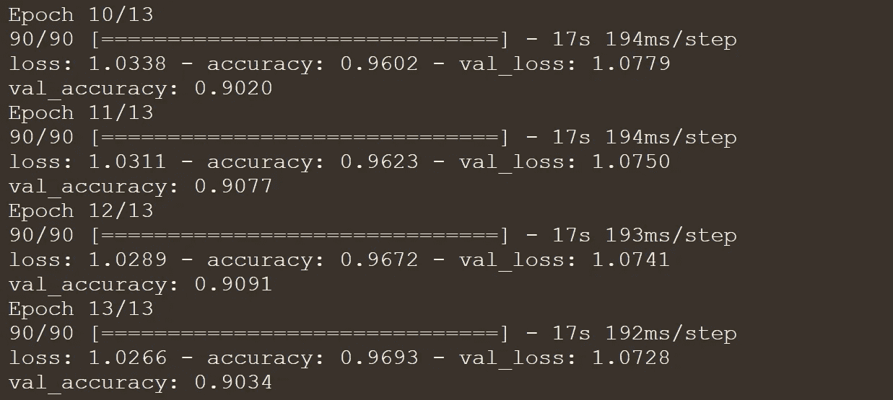

如您所见，训练图像生成器和验证图像生成器被传递到训练过程中。训练精度和验证精度都可以。在本节中，我展示了如何对图像数据集使用数据接收管道。

# NumPy 数组数据集的数据管道

到目前为止，您已经看到了如何将数据管道用于文本和图像数据集。在这一节中，我将展示如何为 NumPy 数组数据集创建数据管道。为此，我将使用 from_tensor_slices 方法。

让我们使用时尚 MNIST 数据集，它由 10 种灰度服装组成。这些图像使用 NumPy 结构表示，而不是典型的图像格式，如 JPEG 或 PNG。你可以用 tf 轻松下载。Keras API。

## 加载数据集

首先，我来导入库。

```
import tensorflow as tf
import numpy as np
import matplotlib.pyplot as plt
```

让我们使用 tf.keras API 中的 load_data 函数加载数据集。

```
fashion_mnist = tf.keras.datasets.fashion_mnist
(train_images, train_labels), (test_images, test_labels) = fashion_mnist.load_data()
```

让我看看数据集的结构。

```
print(type(train_images), type(train_labels))
```

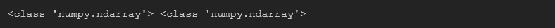

如您所见，数据集的结构是 NumPy 数组。现在，我将使用 shape 属性查看数据集的形状。

```
print(train_images.shape, train_labels.shape)
```

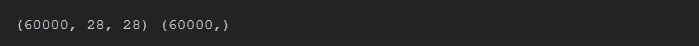

## 探索数据集

为了可视化一个 NumPy 数组，我将使用 matplotlib 库。

```
plt.figure()
plt.imshow(train_images[5])
plt.colorbar()
plt.grid(False)
plt.show()
```

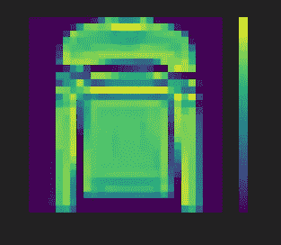

## 预处理数据集

图像由 0 到 255 之间的像素值组成。为了更快地构建模型并获得更好的准确性，我将对像素值进行归一化。

```
train_images = train_images/255
```

我将使用 from_tensor_slices 方法建立一个流管道。

```
train_dataset = tf.data.Dataset.from_tensor_slices(
        (train_images, train_labels))
```

让我将这个数据集分成训练集和验证集。超参数用验证数据集微调，模型用训练数据集建立。

```
SHUFFLE_BUFFER_SIZE = 10000
TRAIN_BATCH_SIZE = 50
VALIDATION_BATCH_SIZE = 10000#Creating the data pipelines
validation_ds = train_dataset.shuffle( SHUFFLE_BUFFER_SIZE).take( VALIDATION_SAMPLE_SIZE).batch(VALIDATION_BATCH_SIZE)train_ds = train_dataset.skip( VALIDATION_BATCH_SIZE).batch( TRAIN_BATCH_SIZE).repeat()
```

## 构建模型

数据集已准备好构建模型。为了训练模型，我将使用序列模型。

```
# Build the model
model = tf.keras.Sequential([
    tf.keras.layers.Flatten(input_shape=(28, 28)),    
    tf.keras.layers.Dense(30, activation='relu'),   
    tf.keras.layers.Dense(10)# Compiling the model
model.compile(
    optimizer=tf.keras.optimizers.RMSprop(),   
    loss=tf.keras.losses.SparseCategoricalCrossentropy( from_logits=True), 
    metrics=['sparse_categorical_accuracy'])#Trainging the model
model.fit(
    train_ds, 
    epochs=13, 
    steps_per_epoch=steps_per_epoch,    
    validation_data=validation_ds,   
    validation_steps=validation_steps)
```

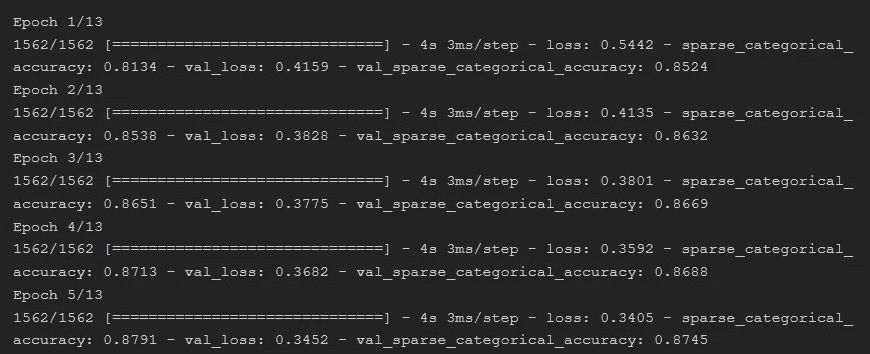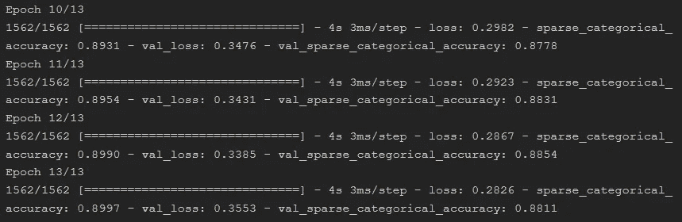

因此 train_ds 和 validation_ds 被传递到训练过程中。在这一节中，我展示了如何使用 from_tensor_slices 为包含 NumPy 数组的数据集创建数据管道。

# 摘要

您可以使用文本、图像和 Numpy 数组数据集的数据管道轻松构建模型。使用数据管道，您可以从存储数据的位置访问数据，转换、缩放数据，然后将数据传递给模型。

在这里可以找到笔记本[。感谢您的阅读。我希望你喜欢它。别忘了关注我们的](https://github.com/TirendazAcademy/DEEP-LEARNING-WITH-TENSORFLOW/blob/main/08-How%20to%20Use%20Data%20Pipelines%20with%20Python.ipynb)[YouTube](https://youtube.com/c/TirendazAcademy)|[GitHub](https://github.com/tirendazacademy)||[|*Twitter*](https://twitter.com/TirendazAcademy)*|[ka ggle](https://www.kaggle.com/tirendazacademy)|*|*[*LinkedIn*](https://www.linkedin.com/in/tirendaz-academy)*👍**

**[](https://levelup.gitconnected.com/7-differences-between-deep-learning-and-machine-learning-b5f2ff0ae00a) [## 深度学习和机器学习的 7 个区别

### 深度学习与机器学习——有什么区别？

levelup.gitconnected.com](https://levelup.gitconnected.com/7-differences-between-deep-learning-and-machine-learning-b5f2ff0ae00a) [](/geekculture/6-steps-to-become-a-machine-learning-expert-5a1f155f7207) [## 成为机器学习专家的 6 个步骤

### 成为机器学习专家需要知道的一切。

medium.com](/geekculture/6-steps-to-become-a-machine-learning-expert-5a1f155f7207) 

# 资源

*   [TensorFlow 2 袖珍参考](https://www.oreilly.com/library/view/tensorflow-2-pocket/9781492089179/)
*   [TensorFlow 教程](https://www.tensorflow.org/tutorials)

如果这篇文章有帮助，请点击拍手👏按钮几下，以示支持👇**