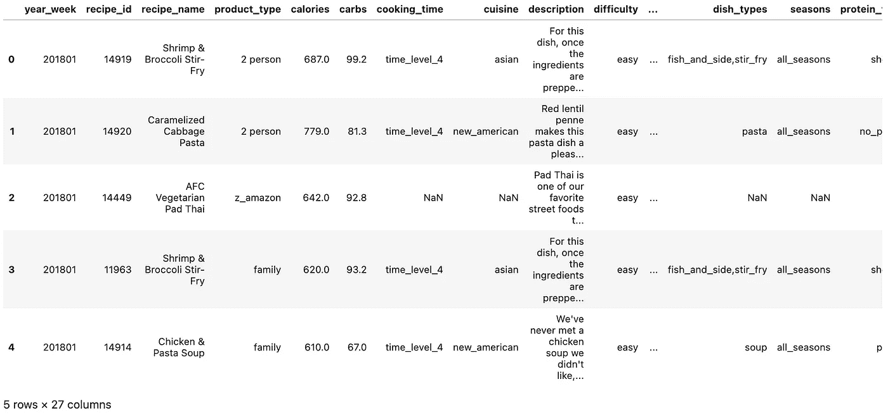
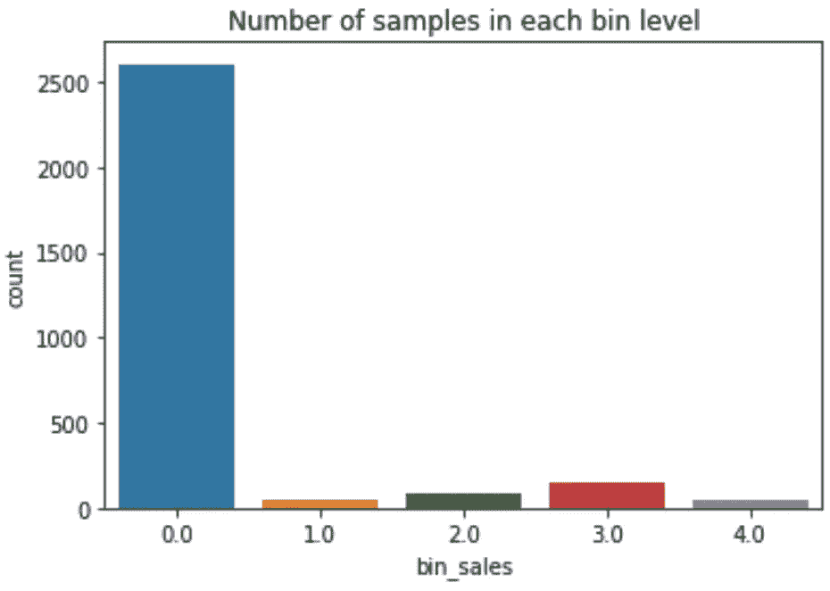
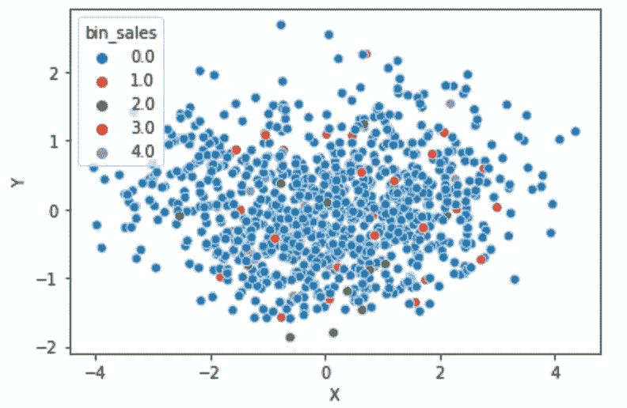

# 如何使用嵌入进行特征提取？

> 原文：<https://medium.com/mlearning-ai/how-to-use-embeddings-for-feature-extraction-4956db52b5f5?source=collection_archive---------3----------------------->

在现实世界的数据集中，我们可以有价格这样的数字特征，也可以有性别这样的分类特征。

通常，分类特征可以通过编码器进行处理，如创建稀疏二进制矩阵的 one-hot 编码器、为每个类别分配标签的 label 编码器，甚至更复杂的方法，如 catboost 编码器，在分类的情况下可以将其视为条件概率，在回归问题的情况下可以将其视为移动平均值。

当我们有一个小的类别集时，这些技术可能非常强大和有用，但是如果我们有一个平均 85 个单词的描述产品的文本呢？

**数据集和问题定义:**

在这种情况下，我们有一个 27 列的数据集，目标是预测每个食谱在未来几周内将产生的销售额。

我们有几个特点，如:

*   **数字**:卡路里、碳水化合物、蛋白质、脂肪等。
*   **分类**:难度，烹饪 _ 时间等。
*   **文本:**描述和配方名称



sample of the dataset

**如何使用嵌入从描述和 recipe_name 中提取信息？**

我们将利用令人难以置信的拥抱脸🤗框架从这些特性中提取信息。

**首先:**我们需要导入模型和标记器:

我们可以尝试不同的模式，你可以在这里查看:[https://huggingface.co/models?pipeline _ tag =特征提取](https://huggingface.co/models?pipeline_tag=feature-extraction)

使用模型的记号赋予器很重要，这样它就能以正确的格式接收数据，而且它们也很有用，因为它们已经为您清理了数据。

每个记号赋予器都有不同的处理数据的方法，因此了解它们是很重要的。

```
from transformers import AutoModel, AutoTokenizermodel_ckpt **=** "distilbert-base-uncased"
tokenizer **=** AutoTokenizer**.**from_pretrained(model_ckpt)
model **=** AutoModel**.**from_pretrained(model_ckpt)
```

**第二:**我们提取与代表整个文本序列的标记 CLS 相关联的隐藏状态，而不是为字符串中的每个标记处理一个 768 数组，我们只需要处理一个数组(768 维因型号而异)。

DistilBert 的 CLS 令牌是第一个，因此我们可以使用下面的代码来访问隐藏状态:

```
df_train_clean['recipe_name'] = df_train_clean['recipe_name'].apply(lambda x: model(**tokenizer(x, return_tensors="pt")).last_hidden_state[:,0,:].detach().numpy()[0])df_train_clean['description'] = df_train_clean['description'].apply(lambda x: model(**tokenizer(x, return_tensors="pt")).last_hidden_state[:,0,:].detach().numpy()[0])
```

**绘制嵌入图**

现在，我们可以使用一些降维技术，如主成分分析或 UMAP 来绘制这些嵌入，并试图了解这些特征是否有一些预测能力。

让我们以 recipe_name 为例。

我们首先从嵌入创建一个数据框:

```
recipe_name_df = helper.get_embeddings_df(df_train_clean, 'recipe_name')
```

然后，我们对这个新数据集应用主成分分析:

```
from sklearn.decomposition import PCApca = PCA(n_components=2)recipe_name_2_components = pd.DataFrame(pca.fit_transform(recipe_name_df), columns = ['X', 'Y'])
```

在我们的例子中，由于我们有一个连续的目标，我们应该在箱中离散它，以便我们可以很容易地绘制它。

```
from sklearn.preprocessing import KBinsDiscretizerbin = KBinsDiscretizer(n_bins=5, encode='ordinal', strategy='uniform')df_train_clean['bin_sales'] = bin.fit_transform(df_train_clean['sales'].values.reshape(-1, 1))sns.countplot(df_train_clean.bin_sales)plt.title("Number of samples in each bin level")plt.show()
```



现在，我们可以创建一个散点图，其中包含两种成分，并基于容器使用不同的颜色。

```
recipe_name_2_components['bin_sales'] = df_train_clean['bin_sales']sns.scatterplot(data=recipe_name_2_components, x='X', y='Y', hue='bin_sales', palette="tab10")plt.show()
```



从上面的图表中不清楚这两个成分的预测能力，可能是因为这个特征对这个问题并不重要！

然而，这里的目标是展示如何处理具有高基数的分类特性，所以让我们在模型中使用这些特性！！

**型号**

```
*# get a 768 column data frame for recipe_name and description*
recipe_name_df **=** helper**.**get_embeddings_df(df_train_clean, 'recipe_name')
description_df **=** helper**.**get_embeddings_df(df_train_clean, 'description')
recipe_name_df_test **=** helper**.**get_embeddings_df(df_test_clean, 'recipe_name')
description_df_test **=** helper**.**get_embeddings_df(df_test_clean, 'description')*# identify the number of components needed based on variance explained*
recipe_name_components, recipe_name_components_test **=** helper**.**apply_PCA(recipe_name_df, recipe_name_df_test, 'recipe_name', variance_explained**=**0.8)
description_components, description_components_test **=** helper**.**apply_PCA(description_df, description_df_test, 'description', variance_explained**=**0.8)*# merge with data frame*
df_train_clean **=** pd**.**merge(df_train_clean, recipe_name_components, left_index**=True**, right_index**=True**, how**=**'left')
df_train_clean **=** pd**.**merge(df_train_clean, description_components, left_index**=True**, right_index**=True**, how**=**'left')
df_test_clean **=** pd**.**merge(df_test_clean, recipe_name_components_test, left_index**=True**, right_index**=True**, how**=**'left')
df_test_clean **=** pd**.**merge(df_test_clean, description_components_test, left_index**=True**, right_index**=True**, how**=**'left')
```

既然我们的训练集和测试集中已经有了所有的特性，我们就可以选择一个模型来预测销售了！😁

可以在这里查看完整代码:[https://github . com/rjguedes 8/feature _ embedding/blob/main/notebooks/feature _ embedding . ipynb](https://github.com/rjguedes8/feature_embedding/blob/main/notebooks/feature_embedding.ipynb)

[](/mlearning-ai/mlearning-ai-submission-suggestions-b51e2b130bfb) [## Mlearning.ai 提交建议

### 如何成为 Mlearning.ai 上的作家

medium.com](/mlearning-ai/mlearning-ai-submission-suggestions-b51e2b130bfb)